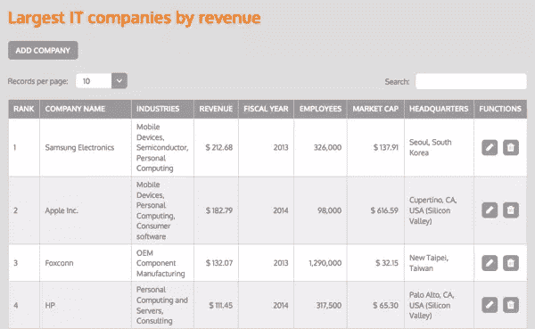
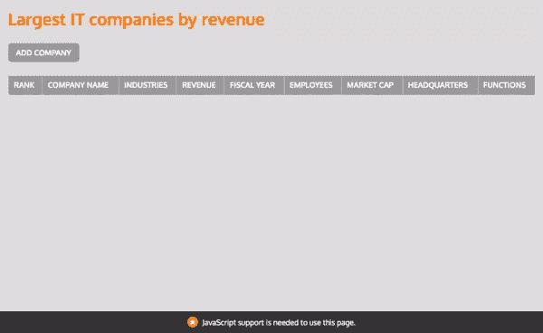
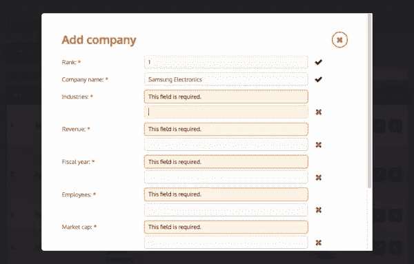
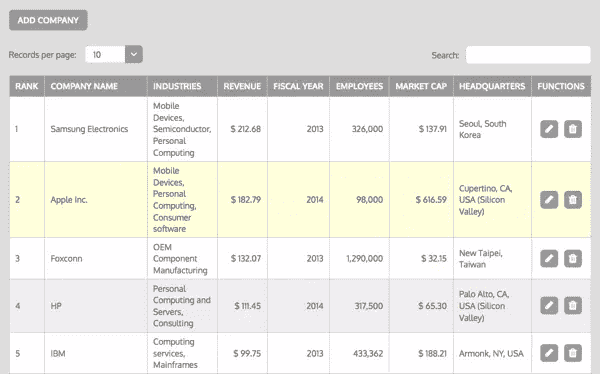
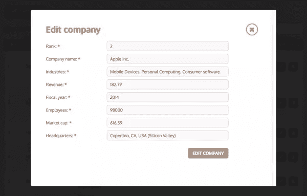
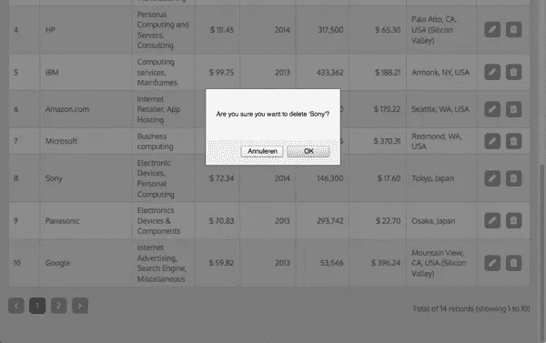

# 使用 jQuery、JSON 和数据表创建 SCRUD 系统

> 原文：<https://www.sitepoint.com/creating-a-scrud-system-using-jquery-json-and-datatables/>

**本文附带的[演示](http://scrud.whirlwind.nl/)于 2016 年 4 月 29 日更新，以解决一个 XSS 漏洞**

每一个非平凡的软件允许操纵数据，一般存储在数据库中。首字母缩写 *SCRUD* 指的是用户需要处理可用数据的基本操作功能:搜索、创建、读取、更新和删除。

在本文中，我们将创建一个 web 应用程序，使用户能够搜索数据库并完全管理其内容。该系统基于 jQuery、JSON、流行的数据表和 jQuery 验证插件。



## 我们会用什么

在这一节中，我将简要介绍我将在本教程中使用的库和插件。

### jQuery 和 Ajax

jQuery 是一个免费的、开源的、跨平台的 JavaScript 库，它简化了客户端的 HTML 脚本。jQuery 使得选择 DOM 元素、执行 DOM 操作和处理事件(比如鼠标点击和键盘输入)变得更加容易。在我看来，jQuery 是创建 Ajax 应用程序的事实上的标准*。*

Ajax 是一种允许异步执行 HTTP 请求的技术。这意味着 web 应用程序可以从 web 服务器检索数据，也可以向 web 服务器发送数据，而无需完全重新加载网页。

在 SitePoint，我们已经多次介绍了 jQuery 和 Ajax。如果您需要更新这些主题，可以看看这些文章:

*   [如何使用 jQuery 的$。ajax()函数](https://www.sitepoint.com/use-jquerys-ajax-function/)
*   [带有 jQuery 的简易 Ajax】](https://www.sitepoint.com/ajax-jquery/)
*   [jQuery 的简写 Ajax 方法介绍](https://www.sitepoint.com/introduction-jquery-shorthand-ajax-methods/)
*   SitePoint 上的 jQuery 文章
*   [jQuery:新手到忍者:新踢法和技巧](https://www.sitepoint.com/store/jquery-novice-to-ninja-new-kicks-and-tricks/)

本教程将向你展示如何创建一个 SCRUD 应用程序，它执行所有的任务，甚至不需要重新加载网页一次。

### JSON

对于应用程序和 web 服务器之间的数据传输，我们将使用 JSON 格式。JSON 数据格式基于属性-值对，这意味着每个属性都有一个值和一个名称来标识它。

### 数据表和 jQuery 验证插件

jQuery 非常适合与插件一起使用，并且它被设计成易于扩展。在本教程中，我们将使用两个插件。第一个叫做[数据表](http://www.datatables.net)。它向普通的 HTML 表格添加了高级交互控件，如分页、搜索功能和列排序。第二个是 [jQuery 验证](http://jqueryvalidation.org/)，它使得验证表单元素变得更加容易。

## 入门指南

对于我们的示例，我们将在同一个文件夹中创建以下文件:

*   `data.php`:将执行数据库任务的 PHP 脚本
*   `index.html`:我们界面的 HTML 文件
*   包含我们的 web 应用程序风格的 CSS 文件
*   `webapp.js`:使用 jQuery 编写的 JavaScript 文件，管理前端动作和事件

你可以从我在 GitHub 上的仓库下载所有的源代码。除此之外，您还需要一个正常运行的 MySQL 数据库。

第一个任务是创建一个名为`index.html`的新 HTML5 文件，它包含:

*   添加按钮
*   一个几乎为空的表(将显示数据库数据)
*   添加/编辑表单
*   无脚本消息
*   消息容器
*   加载消息容器

在 HTML 文件的`head`部分，我们加载了 jQuery 版本 1.11.2。这个文件是从谷歌服务器上下载的。[如这里所说](https://developers.google.com/speed/libraries/):

> Google Hosted Libraries 服务是一个稳定、可靠、高速且全球可用的内容分发网络，适用于许多流行的开源 JavaScript 库。

DataTables 提供了类似的 CDN。我们从他们的网络加载数据表版本 1.10.0，从 CDN 加载 jQuery 验证插件版本 1.13.1。

根据目的，HTML 表格在`tbody`部分没有内容；我们将使用 DataTables jQuery 插件插入表格数据。由于该页面需要 JavaScript 才能工作，我们提供了一个`noscript`标签，以便在用户的浏览器不支持 JavaScript 或 JavaScript 被禁用时通知用户。在这种情况下，会显示一个空表，并且“添加公司”按钮不起作用。

这是消息的外观:



## MySQL 数据库

现在该创建一个 MySQL 数据库来存储示例数据了。数据来自这个维基百科页面，我们有按收入排序的最大 IT 公司的信息。使用以下查询创建表:

```
CREATE TABLE `it_companies` (
  `company_id` int(11) unsigned NOT NULL auto_increment,
  `rank` int(11) unsigned NOT NULL,
  `company_name` varchar(255) NOT NULL,
  `industries` varchar(255) NOT NULL,
  `revenue` float(9,2) NOT NULL,
  `fiscal_year` year(4) NOT NULL,
  `employees` int(11) unsigned NOT NULL,
  `market_cap` float(9,2) NOT NULL,
  `headquarters` varchar(255) NOT NULL,
  PRIMARY KEY  (`company_id`)
) ENGINE=MyISAM DEFAULT CHARSET=utf8;
```

创建数据库表后，我们可以插入示例数据。为了使创建数据库表和导入示例数据更容易，您可以使用一个名为`queries.sql`的 SQL 文件，它是 GitHub 上的[。](https://github.com/sitepoint-editors/SCRUD/blob/master/queries.sql)

## 处理数据库数据的 PHP 脚本

此时，数据库中的数据可用。因此，我们可以设置 PHP 脚本，它将从数据库中检索信息，并使用 JSON 数据格式发送它们。为此，我们需要检索 PHP 脚本已经处理过的数据(将由我们自己的 jQuery 脚本提交)，比如获取所有的公司或更新特定的公司记录。然后，我们连接到数据库并从中获取所需的数据。请确保在`data.php`脚本中输入您自己的登录信息，以便它能够连接到您的 MySQL 数据库:

```
// Database details
$db_server   = 'localhost';
$db_username = '***';
$db_password = '***';
$db_name     = '***';
```

我们使用同一个 PHP 文件来提供脚本正常工作所需的所有数据库信息。使用 URL 中的一个参数，我们让 PHP 脚本知道它需要将哪些数据发送到 web 页面。我们使用相同的模式来插入、更新和删除。

我们使用 PHP `json_encode`函数来转换 JSON 中的数据，以便数据表和我们自己的 jQuery 脚本可以读取和解析它们。我们使用名为“data”的子数组传递数据。在同一个基本数组中还有另外两个字段来传递附加信息:数据库作业是否成功(结果:`success`或`error`)和一条用于调试目的的消息(比如`id missing`)。我们称这个 PHP 页面为`data.php`，并把它和其他文件放在同一个文件夹中。

## 我们自己的 jQuery 脚本

现在我们可以把所有东西放在一起。我们首先创建一个名为`webapp.js`的文件。在这个文件中，我们将放入自己的 jQuery 代码来初始化数据表和 jQuery 验证。此外，我们编写代码来添加、更新和删除数据库记录。

首先，我们初始化 jQuery 数据表插件并配置表设置。之后，还会使用一些设置来调用 jQuery Validator 插件。我在添加/编辑表单中添加了图标，这样用户可以很容易地看到输入字段是否正确填写。jQuery 验证插件查看我们的 HTML 表单代码，并自动找出需要填写的输入字段。这是通过将`required`属性添加到必填字段来实现的。



我们执行 Ajax 请求，使用 JSON 从 web 服务器接收数据，并向 web 服务器发送数据。向用户显示加载消息，但是大多数时候你不会注意到它，因为处理这些任务只需要很少的时间。


如果由于某种原因无法检索或提交数据，就会显示一条错误消息。例如，当无法访问数据库或没有可用的互联网连接时，就会发生这种情况。成功执行请求后，将重新加载 DataTable overview，以便自动显示新公司或公司更新。如果您使用垃圾桶按钮删除一家公司，它将从表格中消失，这要感谢 DataTable overview 的自动更新。

## 实际应用

现在是测试网页的时候了，看看一切是否如预期的那样工作。你需要在线运行这个应用程序，所以把文件上传到你的网络服务器是很重要的(把`data.php`、`index.html`、`layout.css`和`webapp.js`放在同一个文件夹里)。不要忘记正确设置 MySQL 数据库并插入示例数据。

当所有文件和数据库数据都准备就绪后，您可以通过运行`index.html`来启动应用程序。[您也可以点击](http://scrud.whirlwind.nl/)在线查看申请。



使用右上角的搜索字段，您可以搜索 HTML 表格。执行搜索后，将直接显示搜索结果。jQuery DataTables 插件将在您每次在搜索栏中输入字符时进行搜索，因此您会在键入时看到搜索结果。用户还可以选择他希望在每页上看到的记录数。此外，jQuery DataTables 插件可以通过单击列标题来对列进行排序:它将从开始到结束对该列中的数据进行排序，反之亦然。

当您点击“添加公司”时，会显示一个添加新公司的表单。多亏了 jQuery 验证插件，客户端可以对用户的表单输入进行验证。为了简单起见，本文不执行服务器端验证。在现实世界的应用程序中，用户的输入必须在客户端和服务器端进行验证。这样做是为了确保只对数据库执行有效的保存查询。



编辑功能会打开与添加新公司时相同的弹出窗口，但在这种情况下，输入字段会填充特定数据库记录的当前内容。

删除功能包括一个问题对话框，询问用户是否确定要删除所选公司。只有单击“确定”时，才会执行公司删除。



## 结论

jQuery、JSON、数据表和 jQuery 验证插件让您有可能轻松创建 SCRUD 系统。这种系统使你的用户能够以方便用户的方式搜索、创建、阅读、更新和删除数据库记录。用户不必等到每次执行任务时页面都完全刷新。

数据表和 jQuery 验证插件节省了大量开发时间。它们为您提供了开箱即用的功能，如分页、设置每页的结果数、搜索特定术语的内容、对列数据进行排序以及验证用户的输入。当然，您可以自由地使用这个应用程序作为您自己的在线管理面板的起点。

我希望你喜欢这篇文章。请在下面的部分留下您的评论。

## 分享这篇文章