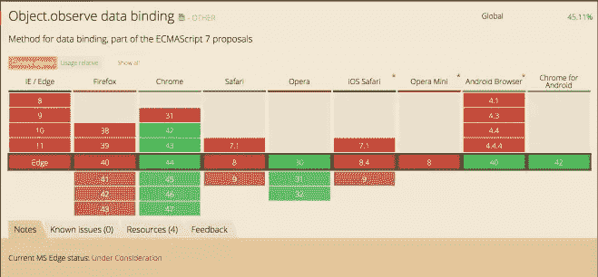

# 在 JavaScript 中试验 Object.observe

> 原文：<https://www.sitepoint.com/experimenting-object-observe-javascript-found-useful/>



本文是微软网站开发系列的一部分。感谢您对使 SitePoint 成为可能的合作伙伴的支持。

我最近构建了一个快速原型，让经典的交互式电影游戏 *Night Trap* 在浏览器中运行。来自 Azure Media Services 的资产流，通过开源 video.js 播放器作为. mp4 播放。我还将所有视频转换为自适应流，现在正在使用 Azure Media Player。阅读我的两篇文章，[解构黑夜陷阱](http://www.davevoyles.com/deconstructing-night-trap)，了解这个过程的概况。

在重建 *Night Trap* 的过程中，我遇到了一个问题，我需要监听一个事件，特别是当用户在某个特定的房间查看摄像机时，视频提要的 URL 发生了变化。例如，我正看着厨房的摄像机，但什么也没发生，在 1:20 的标记字符应该进入房间。我如何告诉视频播放器那个时候 URL 已经改变了，它应该正在播放我刚刚传入的新 URL？

进来的是 Object.observe 来拯救世界。

## 什么是客观观察？

在我寻找可以立即使用的解决方案时，我偶然发现了 MaxArt2501 的这个优秀的 [GitHub repo。在里面，他写了一个聚合填充，允许我现在使用 Object.observe。完美！](https://github.com/MaxArt2501/object-observe/blob/master/doc/index.md)

他的描述很好地概括了这个问题:

> Object.observe 是一个非常好的 EcmaScript 7 特性，已经在 2014 年第一季度登陆了基于 Blink 的浏览器(Chrome 36+，Opera 23+)。 [Node.js](https://nodejs.org/) 在 0.11.x 版本中也提供了它，自从它首次公开发布以来，它就受到了 [io.js](https://iojs.org/) 的支持。
> 简而言之，这是 web 开发人员希望他们在 10-15 年前就拥有的东西之一:它通知应用程序对对象的任何更改，如添加、删除或更新属性，更改其描述符等等。它甚至支持自定义事件。太棒了。
> 
> 问题是大多数浏览器仍然不支持 Object.observe。虽然从技术上来说,*不可能*完美地复制该特性的行为，但是可以做一些有用的事情来保持相同的 API。

如果您不熟悉 polyfills，它们基本上是用 JavaScript 制作的临时补丁，为将来某个时候可能/可能不会在浏览器中实现的功能提供临时解决方案。虽然我们更喜欢将语言的这些特性内置到浏览器中，但我们也必须明白，实现这些东西也是一项工程，还需要对添加的特性进行优先级排序。

如上所述，这是 EcmaScript 7 的一项功能，但目前我们甚至没有在所有浏览器中正确支持 EcmaScript 6 (JavaScript 2015)，所以我不会屏住呼吸等待这一天的到来。

### 奇妙的聚合填料

我发现它非常容易使用，并在几秒钟内运行。我包含了 Bower 包，然后开始观察游戏中保存我的 URL 属性的一个对象，就像这样:

```
 Object.observe(current,
      function (changes){
        if (changes[1]!== undefined) {
          console.log('Changes: ', changes[1].name    );
          console.log('Old Val: ', changes[1].oldValue);
        }
      }
    ); 
```

[viewrawObject.observe](https://gist.github.com/DaveVoyles/2da9666e60ce0863ad9d#file-object-observe) 有爱主持 [GitHub](https://github.com/)

## 它是如何工作的？

我最初考虑自己写点东西，每隔几秒钟就轮询一次改变的属性，但是当我看到 MaxArt 的解决方案并看到它有效时，我就停止了。当我已经有了可以工作的东西的时候，为什么还要费心去运行一系列的测试，浪费时间去重新发明轮子呢？

果然，这个开发人员也在使用轮询。嘿，只要我没有性能问题，我没问题。

## 浏览器支持

我最初担心我会立即限制用户群，这是向项目添加新库时的常见问题，到目前为止，所有代码都是我自己编写的。只要它支持 IE9+，我就乐在其中，果然如此。更好的是，它没有覆盖 Chrome 对该功能的原生实现。

*   Firefox 35-39 稳定版和 37-41 开发版
*   Internet Explorer 11
*   [微软 Edge](https://dev.modern.ie/platform/status/?utm_source=SitePoint&utm_medium=article59&utm_campaign=SitePoint/?filter=f3f0000bf&search=object.observe)
*   Safari 桌面 8
*   Safari iOS 8.2
*   安卓浏览器 4.4
*   Internet Explorer 5、7、8、9、10(作为模拟模式中的 IE11)
*   node.js 0.10.33-40

## 包装它

和往常一样，你可以在我的 GitHub 账户上找到 alpha 版本[的代码。我倾向于每天更新一点，并计划在九月底之前完成一个 5 分钟的演示。如果你已经找到了其他一些非常有用的库，我也很想知道它们。](https://github.com/DaveVoyles/Night-Trap/tree/alpha)

此外，一定要在 Reddit 上查看关于这种方法的[利弊的精彩对话。](https://www.reddit.com/r/javascript/comments/3hzdpa/objectobserve_in_javascript_and_how_i_found_it_to/)

## 更多的 Web 开发实践

这篇文章是微软技术倡导者的 web 开发系列的一部分，内容涉及实用的 JavaScript 学习、开源项目和互操作性最佳实践，包括[微软 Edge](http://blogs.windows.com/msedgedev/2015/05/06/a-break-from-the-past-part-2-saying-goodbye-to-activex-vbscript-attachevent/?WT.mc_id=17917-DEV-sitepoint-footer) 浏览器和新的 [EdgeHTML 渲染引擎](http://blogs.windows.com/msedgedev/2015/02/26/a-break-from-the-past-the-birth-of-microsofts-new-web-rendering-engine/?WT.mc_id=17917-DEV-sitepoint-footer)。

我们鼓励您使用 [dev.modern.IE](http://dev.modern.ie/tools/?utm_source=SitePoint&utm_medium=footer&utm_campaign=SitePoint) 上的免费工具跨浏览器和设备进行测试，包括 Windows 10 的默认浏览器 Microsoft Edge:

*   [扫描你的网站，寻找过时的库、布局问题和可访问性](http://dev.modern.ie/tools/staticscan/?utm_source=SitePoint&utm_medium=footer&utm_campaign=SitePoint)
*   [在 Mac、Linux 和 Windows 上使用虚拟机](http://dev.modern.ie/tools/vms/windows/?utm_source=SitePoint&utm_medium=footer&utm_campaign=SitePoint)
*   [在您自己的设备上远程测试 Microsoft Edge](https://remote.modern.ie/?utm_source=SitePoint&utm_medium=footer&utm_campaign=SitePoint)
*   [GitHub 编码实验室:跨浏览器测试和最佳实践](https://github.com/deltakosh/interoperable-web-development)

来自我们的工程师和布道者的关于 Microsoft Edge 和 Web 平台的深入技术学习:

*   【2015 年微软 Edge 网络峰会(对新浏览器、新支持的网络平台标准以及来自 JavaScript 社区的演讲嘉宾有何期待)
*   哇，我可以在 Mac 电脑上测试 Edge & IE 浏览器& Linux！(来自雷伊·班戈)
*   [在不破坏网络的情况下推进 JavaScript】(来自 Christian Heilmann)](http://channel9.msdn.com/Events/WebPlatformSummit/2015/Advancing-JavaScript-without-breaking-the-web/?WT.mc_id=17917-DEV-sitepoint-footer)
*   使网络正常工作的边缘渲染引擎(Jacob Rossi)
*   [用 WebGL 释放 3D 渲染](https://channel9.msdn.com/Events/WebPlatformSummit/2015/Unleash-3D-rendering-with-WebGL-and-Microsoft-Edge/?WT.mc_id=17917-DEV-sitepoint-footer)(来自大卫·卡图赫，包括[伏龙。JS](http://vorlonjs.com/?WT.mc_id=17917-DEV-sitepoint-footer) 和 [babylonJS](http://babylonjs.com/?WT.mc_id=17917-DEV-sitepoint-footer) 项目)
*   [托管网络应用和网络平台创新](https://channel9.msdn.com/Events/WebPlatformSummit/2015/Hosted-web-apps-and-web-platform-innovations/?WT.mc_id=17917-DEV-sitepoint-footer)(来自律师奶爸和基里尔·赛克谢诺夫，包括[流形。JS](http://manifoldjs.com/?WT.mc_id=17917-DEV-sitepoint-footer) 项目)

更多面向网络平台的免费跨平台工具和资源:

*   [适用于 Linux、MacOS 和 Windows 的 Visual Studio 代码](https://code.visualstudio.com/?WT.mc_id=17917-DEV-sitepoint-footer)
*   [用节点编码。JS](https://www.microsoftvirtualacademy.com/en-US/training-courses/building-apps-with-node-js-jump-start-8422/?WT.mc_id=17917-DEV-sitepoint-footer) 和[在 Azure 上免费试用](https://azure.microsoft.com/en-us/pricing/free-trial/?WT.mc_id=17917-DEV-sitepoint-footer)

## 分享这篇文章