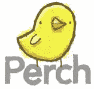
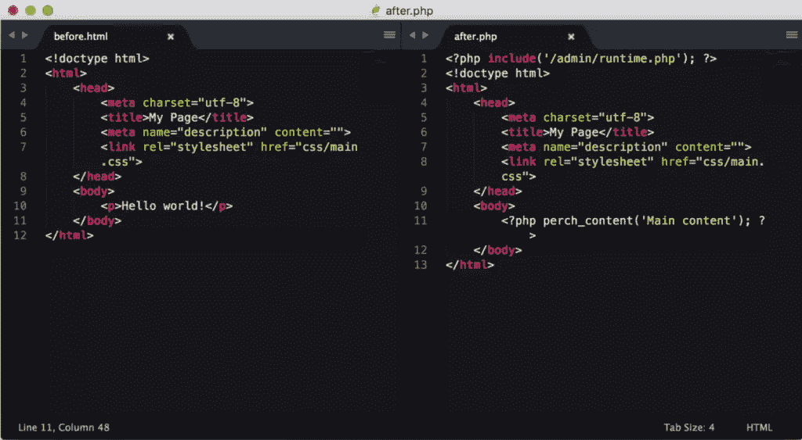

# 使用 Perch CMS 构建快速、可扩展的网站

> 原文：<https://www.sitepoint.com/building-lightning-fast-extensible-websites-with-perch-cms/>



虽然 WordPress 可能拥有最多的用户，但是越来越多的设计者和开发者开始探索替代方案。一种越来越受欢迎的解决方案是[鲈鱼](http://grabaperch.com)。

我在英国的布莱顿经营一个网络工作室，主要处理较小的项目。鲈鱼一直是我们的选择 CMS。现在，随着鲈鱼跑道的引入和鲈鱼店的即将到来，它也适用于更大的项目。

Perch 比开源替代品更贵，Perch Runway 比 Craft 或 ExpressionEngine 便宜不了多少。它的插件更少，而且(还)没有 WordPress 或 Drupal 的社区(尽管它有一个非常活跃和支持的[社区](https://grabaperch.com/support)，包括来自创作者自己的非常有用的支持)。那么，是什么让它如此吸引人呢？

## 易用性

像大多数设计师/开发者一样，多年来我用 WordPress 建立网站。我的工作流程是这样的:

*   下载并设置 WordPress
*   安装[骨骼](http://themble.com/bones/)
*   花接下来的 x 时间逆向工程我的设计，使它在 WordPress 的工作。

听起来熟悉吗？

(Drupal 的过程总是类似的，但是您可以用类似于 [Zen](https://www.drupal.org/project/zen) 的东西来替换骨骼。)

鲈鱼的工作方式不同。主题在 Perch 中是一个陌生的概念。你用 HTML，CSS 和 JS 构建你的模板，就好像它是一个静态的站点。然后添加[栖运行时](https://docs.grabaperch.com/docs/adding-perch/):

```
<?php include('runtime.php');?>
```

然后，您可以用简单的 PHP 标签替换可编辑区域，这样就可以了。所以，在最基本的层面上，这里有一个之前和之后:

[](https://www.sitepoint.com/wp-content/uploads/2015/10/1445315770before_after-1024x563.jpg)

完成这些更改后，您可以为刚刚创建的区域(“主要内容”)分配一个 HTML 模板。在上面的例子中，我们可能只是想要一个预定义的文本块模板。一旦完成，你就输入了你的内容，浏览器中呈现的 HTML 与你的原始 HTML 文件完全相同。没有惊喜标签，类，脚本或元数据。

## 可配置的

尽管上面的例子有点不现实。假设我们的站点有一个图像转盘，我们的 HTML 需要看起来像这样:

```
<ul class="carousel">
    <li>
        
        <h2>My local Beach</h2>
    </li>
    <li>
        
        <h2>My Coffee Maker</h2>
    </li>
    <li>
        
        <h2>My Children</h2>
    </li>
</ul>
```

在 WordPress 中，我们要么追踪并逆向工程一个现有的插件，要么花半个小时构建一个[自定义帖子类型](https://codex.wordpress.org/Post_Types)。在 Drupal 中，我们可能会使用视图。但是鲈鱼的工作方式不同。

在本例中，我们将向页面添加一个区域:

```
<?php perch_content('Carousel'); ?>
```

然后我们制作自己的模板，完全使用我们需要的 HTML，并用易读的 Perch 标签替换可编辑的部分。因此，以最简单的形式，上面的例子会变成:

```
<perch:before>
<ul class="carousel">
</perch:before>
    <li>
        " alt="<perch:content type="text" id="alt" label="Description" />" />
        <h2><perch:content type="text" id="title" label="Image Title" /></h2>
    </li>
<perch:after>
</ul>
</perch:after>
```

一旦我们将相关内容输入到 Perch 中，呈现的 HTML 就和我们原来的完全一样。

动态创建新区域和模板的能力使得构建 HTML 组件变得快速而简单。那些有开发背景的人也可以放心，这些干净的、结构良好的 HTML 文件被镜像到了数据库中——但是后面会有更多的介绍。

## 闪电般的

除非您过去几年一直坐在 Drupal 形状的总线下，否则您会知道性能现在是一件大事。谷歌关心，用户也关心，所以你也应该关心。如果实现一个轮播需要在你选择的 CMS 中安装三个插件或者模块或者其他什么，那将会影响加载时间，并且会影响你的观众(人类和机器人)对你的喜爱程度。

没有鲈鱼的膨胀感。今年早些时候所做的[改变](https://grabaperch.com/blog/archive/progressive-output-flushing)意味着 Perch 比我合作过的任何其他 CMS 都更快地发送这些关键的第一个字节的数据，包括我精心(事后看来很愚蠢)制作的完全定制的数据。

让我们在这上面放一些数字。我们最近为英国的一家科技公司发布了一个网站。主页加载了两个不同的部分(一个用于页眉，一个用于页脚)，它有一个转盘和六个不同的可编辑区域。没有缓存，或任何其他类似的聪明的业务，并且 <abbr title="time to first byte">TTFB</abbr> 大约是 50 毫秒:

[](https://www.sitepoint.com/wp-content/uploads/2015/10/1445315847fast-1024x131.png)

## 可扩张的

老实说，称珀奇为“CMS”有点骗人。内容管理部分很好，但是我不同意的是 T2 系统。Perch 更像是一个*内容管理工具包*。它以一种逻辑结构为你存储数据，然后允许你用它做你喜欢的事情。

就拿上面的例子来说吧。如果我们想更冒险一点，一个简单的文件列表是不够的。假设我们想要我们的图库作为一个 JSON 文件？这很简单，只需从曾经有用的文档中进行一些调整，再加上一个新模板:

```
<perch:before>{</perch:before>
    [
    {"image":"<perch:content type="image" id="image" label="Image" jsonencode="true" />",
    "description":"<perch:content type="text" id="alt" label="Description" jsonencode="true" />",
    "title":<perch:content type="text" id="title" label="Image Title" jsonencode="true" />
    <perch:if exists="perch_item_last">}]<perch:else />}],</perch:if>
<perch:after>}</perch:after>
```

或者，如果我们只想要数组形式的内容呢？或者只想过滤我淘气的孩子的图像？或者获取一个最近的项目？

有了 Perch，所有这些任务都变得超级简单。我们不需要在页面上使用`perch_content()`，我们只需要使用[`perch_content_custom()`](https://docs.grabaperch.com/docs/content/perch-content-custom/)——它有一系列选项，允许我们过滤和操作 Perch 存储的内容。

## 高架跑道

如前所述，Perch 确实在中小型项目中大放异彩。基于文件系统，它不适合非常大的项目。这就是它的兄弟姐妹——鲈鱼跑道的用武之地。

在我看来，Runway 与 Craft 和 ExpressionEngine 等 CMS 并列。它具有高规格的功能，如 Varnish 和 CDN 支持，云存储，收藏(类似于 Craft 中的 expression engine“channels”或“section”)，并且它具有动态路由——一旦你在一个网站上获得了少量页面，这是非常重要的。

回到我使用 ExpressionEngine 的时候，我最终使用了许多第三方插件，这总是感觉很奇怪，让我很紧张。有了 Perch，第一方的附加组件几乎总是够用的；如果没有，自己开发一个栖木应用[真的没有那么令人畏惧](https://docs.grabaperch.com/api/sample-app/)。

对于像我这样从事大小项目的工作室来说，Perch 和 Perch Runway 的结合意味着我们只需要掌握一种工具，不管是什么问题。这就是我的 USP 。正如我不想根据项目的大小来切换代码编辑器一样，出于同样的原因，我也不想切换 CMS。

## 还有一件事…

在这篇文章中，我几乎没有提到 CMS 本身。它结构良好，快速且易于使用。五年来，我想我已经写了一本手册(给一个不应该被允许靠近电脑的客户)。[用最近一个客户的话来说](https://www.sitepoint.com/wp-content/uploads/2015/10/1445315963feedback-1024x323.png)

> CMS 是一个绝对的梦想！我不认为当我第一次看到它时，我给了它或你足够的爱。太不可思议了。

客户喜欢 CMS。开发人员喜欢这种性能。前端用户喜欢它不会影响他们的 HTML。总而言之，鲈鱼很棒。

如果你有任何关于鲈鱼的问题或经验要分享，请在下面发表评论。

## 分享这篇文章