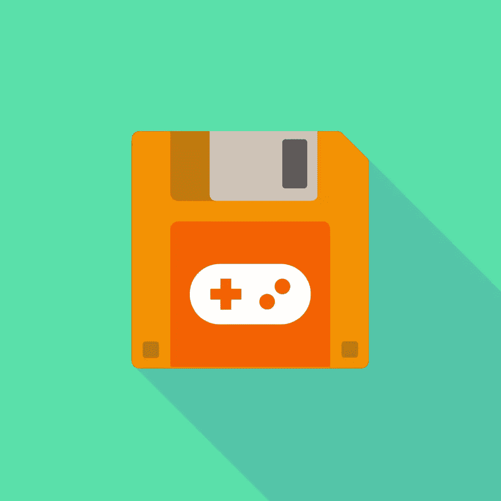
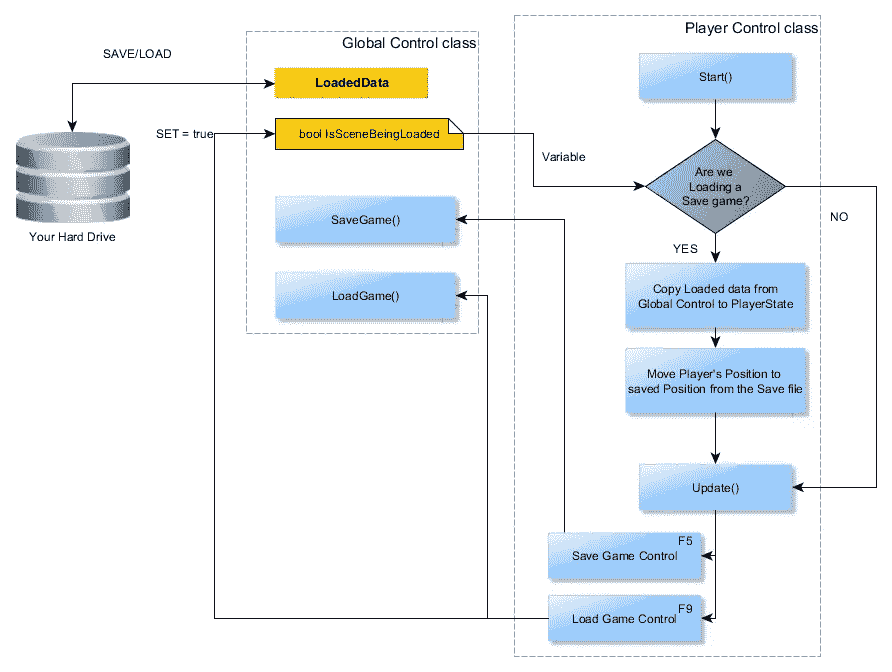

# 在 Unity 中保存和加载玩家游戏数据

> 原文：<https://www.sitepoint.com/saving-and-loading-player-game-data-in-unity/>

在本教程中，我们将学习在我们的游戏中实现保存/加载游戏功能。我们将从保存必要的玩家相关数据开始，比如我们的等级，我们在哪里，以及我们的示例教程统计数据。



如果你需要一个项目来测试，你可以使用在[上一篇文章](https://www.sitepoint.com/saving-data-between-scenes-in-unity/)末尾的那个项目，它处理数据的跨场景保存，它非常适合跟随本教程:

### [计] 下载

[在 Unity 中保存场景间的数据——上一篇](https://www.sitepoint.com/saving-data-between-scenes-in-unity/)
[【GitHub 资源库】](https://github.com/Eudaimonium/SitepointExample_SavingData/tree/57e166c65e0d435db7fbc7d79bab078b829b402e)
[【ZIP 下载】](https://github.com/Eudaimonium/SitepointExample_SavingData/archive/57e166c65e0d435db7fbc7d79bab078b829b402e.zip)

如果你想下载一个完成的项目，链接在本文的末尾。

* * *

## 概念分解

为了将游戏中的数据以一种以后可以理解和加载的格式保存到硬盘上，我们将使用一个称为序列化的. NET/Mono 特性。您可以在以下链接中找到有关序列化理论的更多信息:

*   [MSDN 序列化信息](https://msdn.microsoft.com/en-us/library/72hyey7b%28v=vs.110%29.aspx)
*   [二进制序列化示例](https://msdn.microsoft.com/en-us/library/4abbf6k0%28v=vs.110%29.aspx)

简而言之，“序列化”意味着以原始二进制形式将. NET 对象写入硬盘。这听起来可能有点不直观，但是可以这样想:我们将一个类的*实例保存到硬盘上。*

您可能还记得，在完成上一个示例时，我们将玩家的数据包装到了一个类中。你可能已经能够知道这将走向何方。让我们快速回顾一下逻辑流程:

保存数据:

*   获取一个包含玩家数据的类
*   序列化到硬盘到已知文件

正在加载数据:

*   查找已知的保存文件
*   将内容反序列化为通用的*对象*
*   将*对象*转换成我们的数据类的类型

我们需要拯救什么？

*   所有已经在玩家统计类中跨场景保存的内容
*   保存游戏的场景 ID
*   保存游戏时玩家所在的场景位置

### 准备东西

使用我们前面例子中的项目，我们需要准备一些东西来开始正确地编写这个功能。我们需要考虑以下问题:

*   游戏保存的时候玩家在什么场景？
*   玩家在场景的哪里？
*   我们如何初始化保存过程？
*   我们如何初始化加载过程？
*   我们如何知道我们是否需要重新开始这个级别，或者加载现有的数据？

#### 提议的解决方案:

**场景识别？**在我们玩家的数据包类中加入一个新的整数变量，这样我们就知道玩家在什么场景了。

**场景位置？**不幸的是，我们无法将 Transform 或 Vector3 对象添加到播放器的数据包类中，因为它们不是可序列化的对象。我们需要添加三个新的 *float* 值来表示玩家的 X、Y 和 Z 位置，并在加载数据时将它们应用于玩家的位置向量。

**保存/加载程序**现在保持简单，我们将为保存和加载分配两个热键:F5 和 F9。

**重新开始还是加载？我们需要保存一个布尔值，它告诉我们场景是否已经被加载，或者重新开始。为此，我们需要在场景之间持久的 GlobalObject 类，因为在初始化玩家保存游戏时所在场景的加载过程之前，我们需要加载数据并设置变量。**

### 逻辑

这听起来可能有点混乱，所以让我们把它分解成一个流程图。

这解释了来自 PlayerControl 类的程序流，这是我们今天要处理的主要类。这个类负责玩家的输入:



注意一些奇怪的地方:

*   全局控制现在总是携带一个公共可用的 bool 来声明我们是加载一个场景，还是重新开始。它还带有保存的球员数据的副本。
*   玩家控制类在开始时(场景加载事件)总是检查场景是否从一个保存的游戏中加载，或者重新加载。这告诉我们是否需要复制加载的数据，或者不去管它。

## 密码

让我们一步一步地处理新功能。

### 场景 ID 和位置

首先，我们需要解决上面列出的两个最大的问题:场景 ID 和玩家在场景中的位置。

假设我们有一个保存玩家数据的类，如下所示:

```
public class PlayerStatistics
{
    public float HP;
    public float Ammo;
    public float XP;
}
```

我们需要添加以下内容:

```
[Serializable]
public class PlayerStatistics
{
    public int SceneID;
    public float PositionX, PositionY, PositionZ;

    public float HP;
    public float Ammo;
    public float XP;
}
```

让我们先弄清楚显而易见的事情:我们在类前面有一个自定义的“属性”声明:`[Serializable]`。这告诉引擎这个类中的数据适合以二进制形式写下来，或者“序列化”。

我们还添加了场景 ID 和位置值。

### 序列化功能

现在，让我们编写将序列化和反序列化数据的函数。我们需要进入我们的 GlobalObject(或者你应该有的类似对象):

```
//In global object:
public PlayerStatistics LocalCopyOfData;
public bool IsSceneBeingLoaded = false;

    public void SaveData()
    {
        if (!Directory.Exists("Saves"))
            Directory.CreateDirectory("Saves");

        BinaryFormatter formatter = new BinaryFormatter();
        FileStream saveFile = File.Create("Saves/save.binary");

        LocalCopyOfData = PlayerState.Instance.localPlayerData;

        formatter.Serialize(saveFile, LocalCopyOfData);

        saveFile.Close();
    }

    public void LoadData()
    {
        BinaryFormatter formatter = new BinaryFormatter();
        FileStream saveFile = File.Open("Saves/save.binary", FileMode.Open);

        LocalCopyOfData = (PlayerStatistics)formatter.Deserialize(saveFile);

        saveFile.Close();
    }
```

好了，一下子这么多代码，我们来分解一下。我们先来解释一下保存功能:

***路径检查***

```
if (!Directory.Exists("Saves"))
   Directory.CreateDirectory("Saves");
```

虽然`File.Create`将创建一个新文件，但它不会创建文件应该所在的目录路径。所以如果目录`Saves`不存在，会抛出异常，游戏不会保存。

***二进制格式化程序***

```
BinaryFormatter formatter = new BinaryFormatter();
```

这将需要添加一个新的 Using 命名空间，具体如下:

```
using System.Runtime.Serialization.Formatters.Binary;
```

Pro-tip:在代码中编写“BinaryFormatter ”,不按空格键，按 Enter 或 Tab 键(这将在 MonoDevelop 和 Visual Studio 中启动 Intellisense 完成)，在声明上单击鼠标右键，然后使用 Resolve-> Add Using*namespace*。

***文件***

```
FileStream saveFile = File.Create("Saves/save.binary");
```

这将需要以下名称空间:`using System.IO;`

我们将得到的流对象将在我们设置的路径下创建一个新文件，如果它不存在，就覆盖它。出于示例的目的，我们使用一个非常简单的硬编码相对路径。

**注意**:你也可以使用你想要的文件的任何扩展名，甚至根本不用扩展名。这无关紧要，因为没有操作系统会打开这个文件，也没有任何程序会读取这个文件的格式或需要扩展关联。只有当我们知道文件被序列化的类的源代码时，我们才能读取文件。

***数据***

```
LocalCopyOfData = PlayerState.Instance.localPlayerData;
```

我们需要获取对正在序列化的对象的引用。在我的项目示例中，所有相关的玩家数据都包含在“PlayerStatistics”类的一个实例中，该实例位于 PlayerState 类的 singleton 实例中。

***魔***

```
formatter.Serialize(saveFile, LocalCopyOfData);
```

以上描述了将原始二进制形式的类写入硬盘的全部困难。啊，快乐的。NET/Mono 框架！

您会注意到 Serialize 函数需要两个参数:

*   *流*对象。我们的 FileStream 是 Stream 对象的扩展，所以我们可以使用它。
*   将被序列化的对象。正如您所看到的，我们可以序列化任何东西(只要它带有 Serializable 属性)，因为。NET/Mono 框架是从基本的*对象*类扩展而来的。

***不要忘记这一点！***

```
saveFile.Close();
```

说真的，不要忘记这一点。

如果我们忘记在代码中关闭 Stream 对象，我们将会遇到两个问题中的一个(以先发生的为准):

1.  任何试图访问或删除硬盘上的文件(硬盘可能显示为空，也可能不显示为空)的操作系统都会显示一条错误信息，指出该文件正被另一个程序使用。
2.  试图反序列化一个未关闭的对象将会使程序在反序列化行上停止，而不会出现异常或警告。它会停止发出生命的信号。

请注意，这两种症状实际上都没有给出关于未封闭流的任何有意义的信息。

好了，让我们来看看 *Load* 函数:

***【文件打开】***

```
FileStream saveFile = File.Open("Saves/save.binary", FileMode.Open);
```

我们将使用 Open 函数来获取流对象，而不是使用 Create。不言自明，真的。

***魔差***

```
LocalCopyOfData = (PlayerStatistics)formatter.Deserialize(saveFile);
```

请注意，我们还没有将加载的数据输入到 PlayerState 实例中。

这是因为我们首先需要加载数据来确定玩家在哪个场景，然后我们需要加载那个场景，*然后*馈入加载的数据。

### 控制功能

最后，让我们在某个地方实现我们的保存/加载逻辑。

这个例子的一个好地方是处理玩家输入的类。在示例项目中，这将是我们的 PlayerControl 类。

对于这个例子，我们将把下面的代码直接放在我们的 PlayerControl 类' *Update* 函数中，但是随着开发的进行，我们将需要把它移到播放器实际控制的代码部分(当没有打开菜单时，不播放过场动画，等等):

```
///In Control Update():

        if (Input.GetKey(KeyCode.F5))
        {
            PlayerState.Instance.localPlayerData.SceneID = Application.loadedLevel;
            PlayerState.Instance.localPlayerData.PositionX = transform.position.x;
            PlayerState.Instance.localPlayerData.PositionY = transform.position.y;
            PlayerState.Instance.localPlayerData.PositionZ = transform.position.z;

            GlobalControl.Instance.SaveData();
        }

        if (Input.GetKey(KeyCode.F9))
        {
            GlobalControl.Instance.LoadData();
            GlobalControl.Instance.IsSceneBeingLoaded = true;

            int whichScene = GlobalControl.Instance.LocalCopyOfData.SceneID;

            Application.LoadLevel(whichScene);
        }
```

快速保存功能:

*   将当前场景 ID 保存到当前玩家数据中
*   将当前玩家位置保存到当前玩家数据中
*   调用函数将球员数据保存到保存文件中

现在，快速加载功能有点不同:

首先，我们使用函数将数据加载到 GlobalControl 的“LocalCopyOfData”实例中。之后我们戳一下，看玩家是在哪个场景被救的。

我们设置了一个公共布尔变量，表示场景正在被加载，并初始化 LoadLevel 函数。

你可能会想:“我们甚至没有复制球员位置或球员统计数据，所以…我们为什么要这样做？”

如果您还记得之前的流程图，在 PlayerControl 的 Start 函数中，我们会查询全局控件中的布尔变量，*然后*会复制加载的数据。

这是因为我们不能复制数据，然后加载场景。数据不会被结转。我们也不能首先加载场景，并在同一个函数中复制数据，因为在 *LoadLevel()* 函数之后的任何内容都将被忽略，因为对象和脚本被销毁，新的级别从新的对象开始。

因此，我们使用了一点变通方法——我们使用在两次加载之间持续存在的 GlobalObject 将数据加载到播放器中。

在我们的 PlayerControl *Start()* 函数中，我们需要:

```
///In Control Start()
if (GlobalControl.Instance.IsSceneBeingLoaded)
        {
            PlayerState.Instance.localPlayerData = GlobalControl.Instance.LocalCopyOfData;

            transform.position = new Vector3(
                            GlobalControl.Instance.LocalCopyOfData.PositionX,
                            GlobalControl.Instance.LocalCopyOfData.PositionY,
                            GlobalControl.Instance.LocalCopyOfData.PositionZ + 0.1f);

            GlobalControl.Instance.IsSceneBeingLoaded = false;
        }
```

如你所见，我们首先复制数据，然后将播放器移动到保存的位置。我们也将玩家从保存的位置向上移动一点点，只是为了避免任何物理相关的错误。之后，我们将控制布尔设置为假。

### 搞定了。

你现在可以测试你的游戏内保存和加载。随意改变玩家的统计数据，或者移动到另一个场景，点击 F5 键。你现在可以退出游戏，重启电脑，没关系。

当你重新打开游戏时，(或者只是不耐烦，你可以立即)按 F9 键，并从你停止的地方继续！

如果你想变得有趣，试着写额外的冗余检查，看看保存文件是否存在，或者甚至增加保存文件(这样你总是可以加载一个更早的保存)。

### 下载项目

如果您想看看完成的演示如何工作或看起来如何(或者如果您被困在某个地方需要帮助)，可以从以下位置下载该项目:

*   [Github 库](https://github.com/Eudaimonium/SitepointExample_SavingData/tree/serialization)
*   [带有 Unity 项目的 Zip 文件](https://github.com/Eudaimonium/SitepointExample_SavingData/archive/serialization.zip)

## 结论

我们已经保存并加载了玩家的相关信息，但是游戏世界的其他部分呢？如果我们想拯救的世界里有拾音器呢？还是我们想保持死亡的敌人？

这将在本教程的后续文章中讨论，很快就会出现。在那之前，如果你想做好充分准备，用代码武装到牙齿，那就抬头看看吧。NET/Mono 的*代表*和*事件*。

有问题吗？评论？请把它们留在下面，如果你喜欢这篇文章，不要忘了点击*竖起大拇指*按钮！

## 分享这篇文章