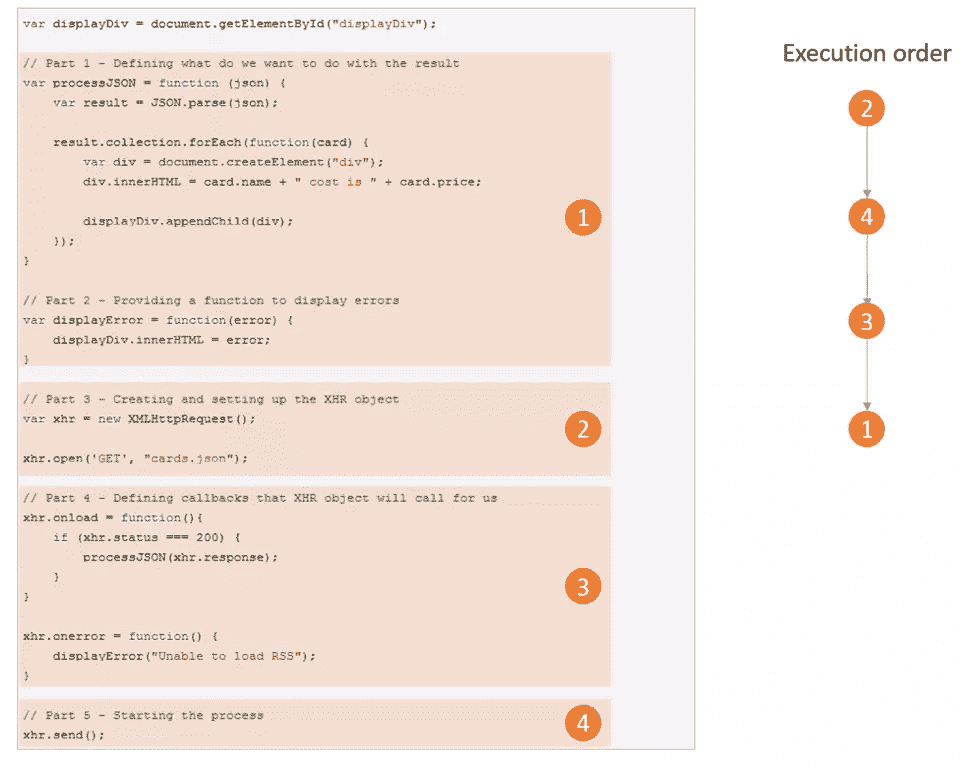
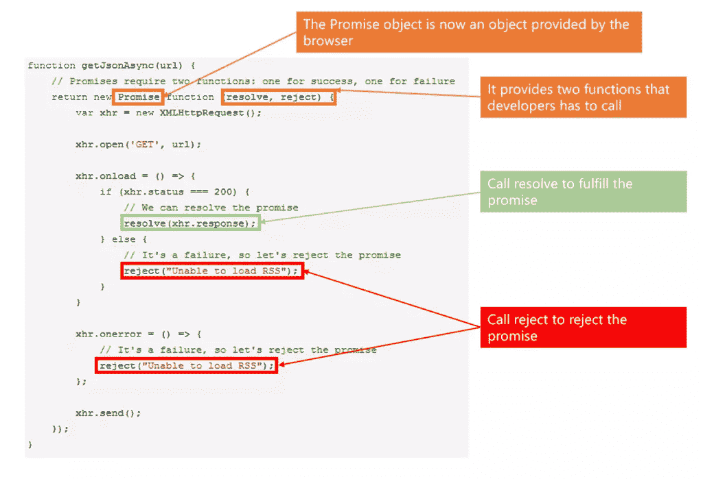
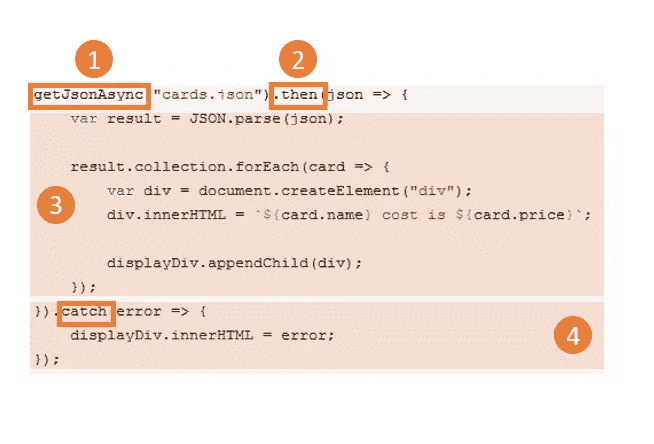
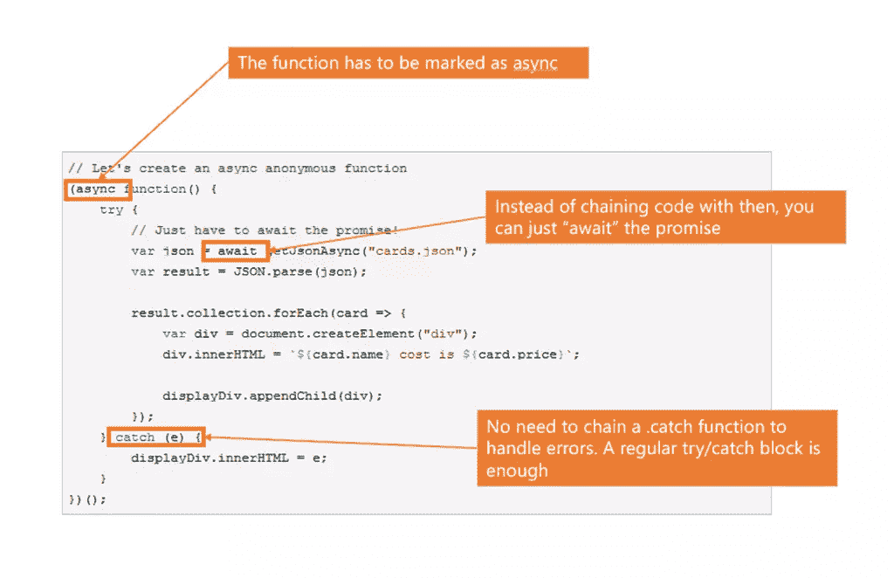

# JavaScript 变成了异步的(这太棒了)

> 原文：<https://www.sitepoint.com/javascript-goes-asynchronous-awesome/>

本文是微软网站开发系列的一部分。感谢您对使 SitePoint 成为可能的合作伙伴的支持。

JavaScript 自早期版本以来已经走过了漫长的道路，多亏了负责 JavaScript 标准化的组织(确切地说是 T2 ECMAScript)所做的一切努力，我们现在有了一种广泛使用的现代语言。

在 **ECMAScript** 中，有一个领域得到了巨大的改进，那就是**异步代码**。如果你是一个新的开发者，你可以在这里了解更多关于[异步编程的知识。幸运的是，我们已经在 Windows 10 的新 Edge 浏览器中包含了这些变化——请查看](https://msdn.microsoft.com/en-us/library/hh191443.aspx?WT.mc_id=16521-DEV-sitepoint-article57)[微软 Edge 变化日志](https://dev.modern.ie/platform/changelog/desktop/10547/?compareWith=10532/?utm_source=SitePoint&utm_medium=article57&utm_campaign=SitePoint)。

在所有这些新功能中，让我们特别关注**实验 Javascript** 功能标志背后的“ES2016 **异步函数**，并浏览一下这些更新，看看 ECMAScript 如何改进您当前的工作流程。

## 第一站:ECMAScript 5–回调城市

ECMAScript 5 (以及之前的版本)都是关于回调的。为了更好地描述这一点，让我们举一个您一天中肯定不止一次使用的简单例子:执行一个 XHR 请求。

```
 var displayDiv = document.getElementById("displayDiv");

// Part 1 - Defining what do we want to do with the result
var processJSON = function (json) {
var result = JSON.parse(json);

    result.collection.forEach(function(card) {
var div = document.createElement("div");
        div.innerHTML = card.name + " cost is " + card.price;

        displayDiv.appendChild(div);
    });
}

// Part 2 - Providing a function to display errors
var displayError = function(error) {
    displayDiv.innerHTML = error;
}

// Part 3 - Creating and setting up the XHR object
var xhr = new XMLHttpRequest();

xhr.open('GET', "cards.json");

// Part 4 - Defining callbacks that XHR object will call for us
xhr.onload = function(){
if (xhr.status === 200) {
        processJSON(xhr.response);
    }
}

xhr.onerror = function() {
    displayError("Unable to load RSS");
}

// Part 5 - Starting the process
xhr.send(); 
```

成熟的 JavaScript 开发人员会注意到这看起来有多熟悉，因为 XHR 回调一直都在使用！这非常简单明了:开发人员创建一个 XHR 请求，然后为指定的 XHR 对象提供回调。

相比之下，回调的复杂性来自执行顺序，由于异步代码的内在特性，执行顺序不是线性的:



当在您自己的回调中使用另一个异步调用时，“[回调 hell](http://callbackhell.com/) ”甚至会更糟。

## 第二站:ECMAScript 6–承诺之城

ECMAScript 6 的势头越来越大，Edge is [以 88%的覆盖率领先](http://kangax.github.io/compat-table/es6/)。

在众多重大改进中， **ECMAScript 6** 规范了*承诺*(原名期货)的用法。

根据[MDN](https://developer.mozilla.org/en-US/docs/Web/JavaScript/Reference/Global_Objects/Promise),*promise*是用于延迟和异步计算的对象。一个*承诺*代表一个还没有完成的操作，但是在未来有望完成。承诺是一种组织异步操作的方式，使得它们看起来是同步的。这正是我们在 XHR 的例子中所需要的。

承诺已经有一段时间了，但好消息是现在你不再需要任何库，因为它们是由浏览器提供的。

让我们稍微更新一下我们的例子，以支持*承诺*，并看看它如何提高我们代码的可读性和可维护性:

```
 var displayDiv = document.getElementById("displayDiv");

// Part 1 - Create a function that returns a promise
function getJsonAsync(url) {
// Promises require two functions: one for success, one for failure
return new Promise(function (resolve, reject) {
var xhr = new XMLHttpRequest();

        xhr.open('GET', url);

        xhr.onload = () => {
if (xhr.status === 200) {
// We can resolve the promise
resolve(xhr.response);
            } else {
// It's a failure, so let's reject the promise
reject("Unable to load RSS");
            }
        }

        xhr.onerror = () => {
// It's a failure, so let's reject the promise
reject("Unable to load RSS");
        };

        xhr.send();
    });
}

// Part 2 - The function returns a promise
// so we can chain with a .then and a .catch
getJsonAsync("cards.json").then(json => {
var result = JSON.parse(json);

    result.collection.forEach(card => {
var div = document.createElement("div");
        div.innerHTML = `${card.name} cost is ${card.price}`;

        displayDiv.appendChild(div);
    });
}).catch(error => {
    displayDiv.innerHTML = error;
}); 
```

你可能已经注意到这里有很多改进。让我们仔细看看。

### 创造承诺

为了“许诺”(抱歉，我是法国人，所以我可以发明新词)旧的 XHR 对象，你需要创建一个*许诺*对象:



### 利用承诺

一旦创建好， *promise* 可以用来以一种更优雅的方式链接异步调用:



所以现在我们有了(从用户的角度来看):

*   得到承诺 **(1)**
*   带有成功代码的链 **(2 和 3)**
*   错误代码为 **(4)** 的链，就像在 try/catch 块中一样

有趣的是，链接*承诺*很容易使用*调用。然后()。然后()*等。

***边节点:**既然 JavaScript 是现代语言，你可能会注意到我也使用了 **ECMAScript 6** 中的[语法糖](https://en.wikipedia.org/wiki/Syntactic_sugar)，比如[模板字符串](http://tc39wiki.calculist.org/es6/template-strings/)或[箭头函数](http://tc39wiki.calculist.org/es6/arrow-functions/)。*

## 终点:ECMAScript 7–异步城市

终于，我们到达了目的地！我们几乎处于[未来](http://kangax.github.io/compat-table/es7/)，但由于 Edge 的快速开发周期，团队能够在最新版本中引入一点带有**异步功能**的 **ECMAScript 7** ！

异步函数是一种语法糖，用于改进编写异步代码的语言级模型。

异步函数建立在 ECMAScript 6 特性之上，如生成器。事实上，生成器可以和承诺一起使用，产生相同的结果，但是需要更多的用户代码。

我们不需要改变生成承诺的函数，因为异步函数直接处理承诺。

我们只需要改变调用函数:

```
 // Let's create an async anonymous function
(async function() {
try {
// Just have to await the promise!
var json = await getJsonAsync("cards.json");
var result = JSON.parse(json);

        result.collection.forEach(card => {
var div = document.createElement("div");
            div.innerHTML = `${card.name} cost is ${card.price}`;

            displayDiv.appendChild(div);
        });
    } catch (e) {
        displayDiv.innerHTML = e;
    }
})(); 
```

这就是奇迹发生的地方。这段代码看起来像一个常规的同步代码，具有完美的线性执行路径:



令人印象深刻，对吧？

好消息是，您甚至可以将异步函数与箭头函数或类方法一起使用。

## 更进一步

如果你想了解我们如何在 Chakra 中实现它的更多细节，请[查看微软 Edge 博客上的官方帖子](http://blogs.windows.com/msedgedev/2015/09/30/asynchronous-code-gets-easier-with-es2016-async-function-support-in-chakra-and-microsoft-edge/?WT.mc_id=16521-DEV-sitepoint-article57)。您还可以使用 [Kangax 的网站](http://kangax.github.io/compat-table/es6/)跟踪各种浏览器实现 **ECMAScript 6** 和 **7** 的进度。

也可以随意查看我们的 [JavaScript 路线图](https://dev.modern.ie/platform/status/javascript/?utm_source=SitePoint&utm_medium=article57&utm_campaign=SitePoint)！请不要犹豫，给我们您的反馈，并使用投票按钮支持您最喜欢的功能:


感谢您的阅读，我们渴望听到您的反馈和想法！

## 更多的 Web 开发实践

这篇文章是微软技术倡导者的 web 开发系列的一部分，内容涉及实用的 JavaScript 学习、开源项目和互操作性最佳实践，包括[微软 Edge](http://blogs.windows.com/msedgedev/2015/05/06/a-break-from-the-past-part-2-saying-goodbye-to-activex-vbscript-attachevent/?WT.mc_id=17917-DEV-sitepoint-footer) 浏览器和新的 [EdgeHTML 渲染引擎](http://blogs.windows.com/msedgedev/2015/02/26/a-break-from-the-past-the-birth-of-microsofts-new-web-rendering-engine/?WT.mc_id=17917-DEV-sitepoint-footer)。

我们鼓励您使用 [dev.modern.IE](http://dev.modern.ie/tools/?utm_source=SitePoint&utm_medium=footer&utm_campaign=SitePoint) 上的免费工具跨浏览器和设备进行测试，包括 Windows 10 的默认浏览器 Microsoft Edge:

*   [扫描你的网站，寻找过时的库、布局问题和可访问性](http://dev.modern.ie/tools/staticscan/?utm_source=SitePoint&utm_medium=footer&utm_campaign=SitePoint)
*   [在 Mac、Linux 和 Windows 上使用虚拟机](http://dev.modern.ie/tools/vms/windows/?utm_source=SitePoint&utm_medium=footer&utm_campaign=SitePoint)
*   [在您自己的设备上远程测试 Microsoft Edge](https://remote.modern.ie/?utm_source=SitePoint&utm_medium=footer&utm_campaign=SitePoint)
*   [GitHub 编码实验室:跨浏览器测试和最佳实践](https://github.com/deltakosh/interoperable-web-development)

来自我们的工程师和布道者的关于 Microsoft Edge 和 Web 平台的深入技术学习:

*   【2015 年微软 Edge 网络峰会(对新浏览器、新支持的网络平台标准以及来自 JavaScript 社区的演讲嘉宾有何期待)
*   哇，我可以在 Mac 电脑上测试 Edge & IE 浏览器& Linux！(来自雷伊·班戈)
*   [在不破坏网络的情况下推进 JavaScript】(来自 Christian Heilmann)](http://channel9.msdn.com/Events/WebPlatformSummit/2015/Advancing-JavaScript-without-breaking-the-web/?WT.mc_id=17917-DEV-sitepoint-footer)
*   使网络正常工作的边缘渲染引擎(Jacob Rossi)
*   [用 WebGL 释放 3D 渲染](https://channel9.msdn.com/Events/WebPlatformSummit/2015/Unleash-3D-rendering-with-WebGL-and-Microsoft-Edge/?WT.mc_id=17917-DEV-sitepoint-footer)(来自大卫·卡图赫，包括[伏龙。JS](http://vorlonjs.com/?WT.mc_id=17917-DEV-sitepoint-footer) 和 [babylonJS](http://babylonjs.com/?WT.mc_id=17917-DEV-sitepoint-footer) 项目)
*   [托管网络应用和网络平台创新](https://channel9.msdn.com/Events/WebPlatformSummit/2015/Hosted-web-apps-and-web-platform-innovations/?WT.mc_id=17917-DEV-sitepoint-footer)(来自律师奶爸和基里尔·赛克谢诺夫，包括[流形。JS](http://manifoldjs.com/?WT.mc_id=17917-DEV-sitepoint-footer) 项目)

更多面向网络平台的免费跨平台工具和资源:

*   [适用于 Linux、MacOS 和 Windows 的 Visual Studio 代码](https://code.visualstudio.com/?WT.mc_id=17917-DEV-sitepoint-footer)
*   [用节点编码。JS](https://www.microsoftvirtualacademy.com/en-US/training-courses/building-apps-with-node-js-jump-start-8422/?WT.mc_id=17917-DEV-sitepoint-footer) 和[在 Azure 上免费试用](https://azure.microsoft.com/en-us/pricing/free-trial/?WT.mc_id=17917-DEV-sitepoint-footer)

## 分享这篇文章