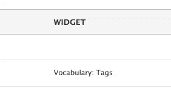
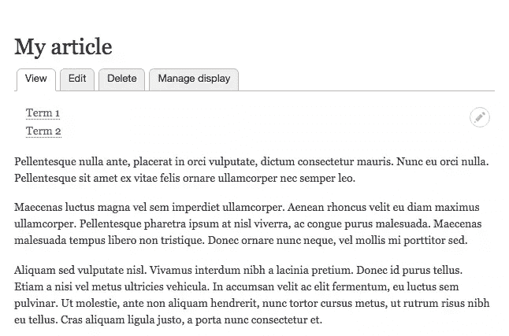

# Drupal 8 中的自定义显示套件字段

> 原文：<https://www.sitepoint.com/custom-display-suite-fields-in-drupal-8/>

毫无疑问， [Display Suite](https://www.drupal.org/project/ds) 是 Drupal 贡献模块历史上最受欢迎的模块之一。它允许创建布局、字段，并公开了我们用来构建 Drupal 站点表示层的各种其他强大工具。


Display Suite (DS)的一个更强大的特性是能够创建定制字段，这些字段可以在 DS 布局中与实际的核心字段值一起显示。在 Drupal 7 中，这是一种非常流行的构建布局和显示动态数据的方式，这种方式与节点(或其他)实体上的任何 Field API 字段的输出没有严格的关系。

Display Suite 已经移植，并且正在为 Drupal 8 进行维护。依赖于另一个叫做[布局插件](https://www.drupal.org/project/layout_plugin)的贡献模块，D8 版本提供了我们在 Drupal 7 中可以得到的很多东西，甚至可能更多。

在本文中，我们将看看如何使用新的 OOP 架构和插件系统在 Drupal 8 中创建我们自己的显示套件字段。为了演示这一点，我们将创建一个仅在文章节点上可用的 DS 字段，该字段可用于显示来自特定词汇表的分类术语列表。我们将使后者可以从 UI 配置，即管理员将能够指定应该列出哪些词汇表的术语。我知道这个例子没什么用，但是它可以让你理解事情是如何工作的。

如果你跟着做，我们写的代码可以在`Demo`模块内的[这个库](https://github.com/upchuk/d8-demo-modules/tree/master/demo)中找到。所以请随意查看。

## Drupal 8 插件

许多以前在 Drupal 7 中使用`_info`钩子声明的功能现在在 Drupal 8 中使用插件声明。要了解更多关于使用插件和创建你自己的插件类型的信息，请务必查看之前 Sitepoint 的文章。

Display Suite 还使用新的插件系统来允许其他模块定义 DS 字段。它公开了一个`DsField`插件类型，允许我们在一个插件类中为这样一个字段编写和维护所有必要的逻辑(加上我们可能注入的任何[服务)。因此，我们不再实现 hook_ds_field_info()并返回每个实体类型的字段信息数组，而是创建一个插件类，在其注释中直接包含数据，在其方法中包含相关逻辑。](http://www.webomelette.com/drupal-8-dependency-injection-service-container-and-all-jazz)

## 词汇术语类

让我们从在自定义模块的`src/plugins/DsField`文件夹中创建名为`VocabularyTerms`的插件类开始，并根据我们的目的对其进行注释:

```
namespace Drupal\demo\Plugin\DsField;

use Drupal\ds\Plugin\DsField\DsFieldBase;

/**
 * Plugin that renders the terms from a chosen taxonomy vocabulary.
 *
 * @DsField(
 *   id = "vocabulary_terms",
 *   title = @Translation("Vocabulary Terms"),
 *   entity_type = "node",
 *   provider = "demo",
 *   ui_limit = {"article|*"}
 * )
 */
class VocabularyTerms extends DsFieldBase {
}
```

这个类本身就包含了我们非常简单的 DsField 插件的所有逻辑。但是这里有一些关于我们目前所拥有的东西的评论:

*   这个注释是不言自明的:它提供了关于插件的元信息。
*   该类扩展了为所有这种类型的插件提供基本功能的`DsFieldBase`。
*   在撰写本文时，`ui_limit`注释刚刚提交给 HEAD，所以它可能在您正在使用的版本中不可用。通过覆盖基类的`isAllowed()`方法并在那里执行逻辑，可以限制内容类型和视图模式上字段的可用性。

## 默认配置

我们希望我们的字段是可配置的:从现有词汇表列表中选择的能力。因此，让我们从为这个配置提供一些缺省值开始，这样，如果用户什么也没有选择，将使用 core 自带的`Tags`词汇表。为此，我们必须实现`defaultConfiguration()`方法:

```
/**
 * {@inheritdoc}
 */
public function defaultConfiguration() { $configuration = array(
    'vocabulary' => 'tags',
  );

  return $configuration;
}
```

因为我们只有一个配置选项，所以我们返回一个数组，其中包含一个由配置名指定的元素。大概就是这样。

## 格式化程序

我们还希望能够从 UI 中指定分类术语列表是否是一系列到术语页面或格式化程序的纯文本链接。我们可以在配置领域中实现这一点，但是让我们使用格式化程序来代替。这非常简单:我们实现`formatters()`方法并返回一个可用格式化程序的数组:

```
/**
 * {@inheritdoc}
 */
public function formatters() {
  return array('linked' => 'Linked', 'unlinked' => 'Unlinked');
}
```


这些将在内容类型的管理显示页面的`Field`标题下的 UI 中可供选择。当我们构建用于显示的实际字段时，我们将能够看到选择。但一会儿会有更多的讨论。

## 配置摘要

如果我们正在使用 UI 定义的设置，我们也建议用一个简单的字符串来描述它。这将打印在内容类型的管理显示页面的`Widget`标题下。



为此，我们需要实现`settingsSummary()`方法并返回所述文本:

```
/**
 * {@inheritdoc}
 */
public function settingsSummary($settings) { $config = $this->getConfiguration(); $no_selection = array('No vocabulary selected.');

  if (isset($config['vocabulary']) && $config['vocabulary']) { $vocabulary = Vocabulary::load($config['vocabulary']);
    return $vocabulary ? array('Vocabulary: ' . $vocabulary->label()) : $no_selection;
  }

  return $no_selection;
}
```

在这里，我们开始更深入地了解与字段一起存储的实际配置，通过调用插件类上的`getConfiguration()`方法可以获得。然后，我们在上面做的是检查词汇表设置是否已经设置好，我们使用`Vocabulary`类根据机器名加载它，并返回需要打印的字符串数组。

既然我们引用了`Vocabulary`类，我们也需要*在顶部使用*它:

```
use Drupal\taxonomy\Entity\Vocabulary;
```

**注意**很重要:为了简洁起见，我在这里静态地使用`Vocabulary`来加载一个实体。强烈建议您使用[依赖注入](https://www.sitepoint.com/building-drupal-8-module-configuration-management-service-container/)来注入相关的存储，并使用它来加载实体。下面你会看到我静态引用的大多数类也是如此。

## 设置表单

现在我们显示了从 UI 中选择的配置，是时候提供允许用户这样做的实际表单了。这将通过单击内容类型的管理显示页面的`Operations`标题下的齿轮来实现。


```
/**
 * {@inheritdoc}
 */
public function settingsForm($form, FormStateInterface $form_state) { $config = $this->getConfiguration(); $names = taxonomy_vocabulary_get_names(); $vocabularies = Vocabulary::loadMultiple($names); $options = array();
  foreach ($vocabularies as $vocabulary) { $options[$vocabulary->id()] = $vocabulary->label();
  } $settings['vocabulary'] = array(
    '#type' => 'select',
    '#title' => t('Vocabulary'),
    '#default_value' => $config['vocabulary'],
    '#options' => $options,
  );

  return $settings;
}
```

像以前一样，我们需要为此实现一个方法。我们在里面做的是加载所有的分类词汇表名称，并准备一组选项用于表单 API 选择列表。后者是这种形式唯一需要的元素。

## 渲染字段

剩下要做的最后一件事是实现负责呈现字段内容的`build()`方法:

```
/**
 * {@inheritdoc}
 */
public function build() { $config = $this->getConfiguration();
  if (!isset($config['vocabulary']) || !$config['vocabulary']) {
    return;
  } $query = \Drupal::entityQuery('taxonomy_term')
    ->condition('vid', $config['vocabulary']); $tids = $query->execute();
  if (!$tids) {
    return;
  } $terms = Term::loadMultiple($tids);
  if (!$terms) {
    return;
   }

  return array(
    '#theme' => 'item_list',
    '#items' => $this->buildTermList($terms),
  );
}
```

那我们在这里做什么？首先，我们从配置中访问选择的词汇表。然后我们运行一个 [EntityQuery](https://www.sitepoint.com/drupal-8-version-entityfieldquery/) 来查找这个词汇表中的所有术语。接下来，我们加载所有这些术语，最后我们返回一个使用`item_list`主题打印术语的渲染数组。

虽然我们在这里不需要它，但在大多数情况下，您需要访问当前正在呈现的节点实体。可在`entity`键下的配置数组中找到。此外，在`build`键下，您拥有正在构建的节点的实际渲染数组。所以请记住这一点，并自己检查配置数组的其他元素以获得更多信息。

在我们看一看实际的`buildTermList()`方法之前，我想再提几件事。首先，为了简洁起见，我们静态地使用了 EntityQuery 服务。在你的项目中，你应该注入它。其次，我们静态地使用了`Term`类来加载分类术语实体。同样，您应该注入它的存储空间并将其用于此目的。最后，我们应该在顶部用`use`导入`Term`类:

```
use Drupal\taxonomy\Entity\Term;
```

现在清楚了，让我们来看看我们自己的`buildTermList()`方法:

```
private function buildTermList(array $terms) { $config = $this->getConfiguration(); $formatter = isset($config['field']['formatter']) && $config['field']['formatter'] ? $config['field']['formatter'] : 'unlinked'; $items = array();
  foreach ($terms as $term) { $items[] = $this->buildTermListItem($term, $formatter);
  }

  return $items;
}
```

该方法负责获取字段格式化程序，遍历术语实体，并构建一个术语信息数组，可以使用`item_list`主题打印该数组。但是，正如您所看到的，单个术语实体和格式化程序被传递给了另一个帮助器方法，以保持整洁:

```
private function buildTermListItem(Term $term, $formatter) {
  if ($formatter === 'linked') { $link_url = Url::fromRoute('entity.taxonomy_term.canonical', array('taxonomy_term' => $term->id()));
    return \Drupal::l($term->label(), $link_url);
  }

  return SafeMarkup::checkPlain($term->label());
}
```

最后，在`buildTermListItem()`方法中，我们或者返回术语的净化标题，或者返回一个链接，这取决于格式化程序。

我们再次看到应该被注入的类，但是它们被静态地使用以节省空间。冒着听起来像破唱片的风险，记住你应该注射这些。现在，我们必须*在顶部使用*它们:

```
use Drupal\Core\Url;
use Drupal\Component\Utility\SafeMarkup;
```

## 结论

这就是我们在 Drupal 8 中自己的 DsField 插件。清除缓存将使该字段在文章内容类型的所有视图模式下可用。



此外，它可以被配置为在多个词汇表中进行选择，然后显示其中的术语。最后，我们甚至可以指定一个格式化程序，以链接或纯文本的形式打印这些术语。

## 分享这篇文章