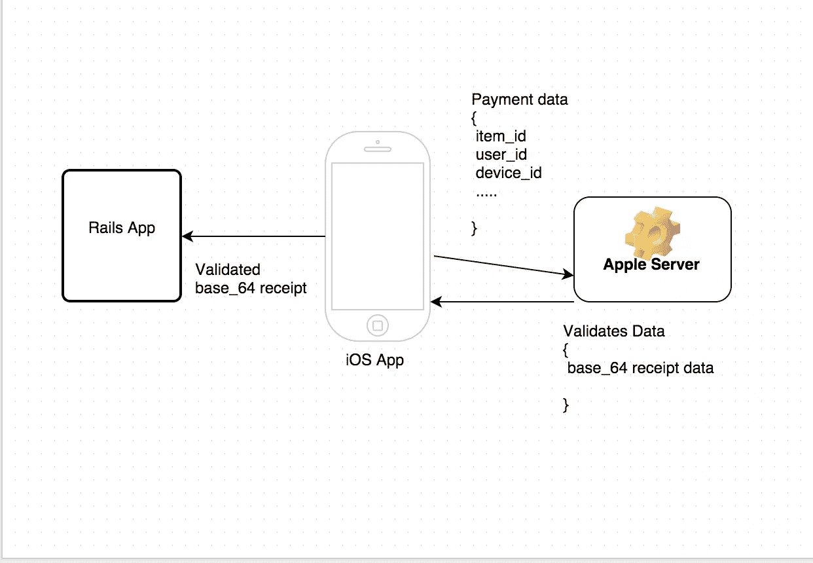

# 在 Rails 中有效处理 iOS 支付

> 原文：<https://www.sitepoint.com/effectively-handle-ios-payments-in-rails/>


仅仅运行一个基于网络的应用程序已经不够了。如果你想在竞争中保持领先，你需要一个移动战略。然而，管理移动支付是开发者最大的噩梦。对于基于网络的应用来说，Stripe 很好地解决了这个问题，但是在移动领域，情况就不同了。

## iOS 上的支付方式

iOS 中的购买可以在应用程序内或预先购买。付款由苹果公司负责，他们从销售额中抽取高达 30%的佣金。就他们而言，他们涵盖了用户数据的安全性，并确保购买的内容在客户的所有设备上都可用。



虽然这表面上听起来很棒，但实际上在现实生活中管理起来很痛苦。你必须确保客户在任何时候都可以访问这些内容。如果你正在运行一个可以在所有设备上运行的订阅，事情就有点棘手了。Apple 不会向您发送任何关于订阅者的信息。苹果通过让开发者的日子更难过，很好的保护了用户的身份。

在这篇文章中，我将帮助你学习如何从你的 Rails 应用程序接受 iOS 支付和订阅，包括常见的陷阱，以及如何与苹果保持良好关系。

## 设置

在我们开始之前，你必须在你的 Apple dashboard 上的“应用内购买”页面中添加你正在销售的所有商品的目录。建议使用与 Rails 应用程序中相同的 ID，这样很容易将购买联系起来。

> ***注*** :本文假设你有一个 iOS 应用，并且对如何整合应用内购买有足够的了解。我将只关注如何从您的 Rails 应用程序中管理它，而不会展示任何 ObjectiveC 代码示例。

我们将使用我在之前关于条带订阅的文章中构建的应用作为基础。它使用 MongoDB 作为数据库，但是这里的例子只需要做一些小的修改就可以使用 ActiveRecord。解决了这个问题，让我们开始吧。

## 在应用购买中

当用户从你的应用程序购买一个项目时，Rails 应用程序会将它发送到苹果的服务器进行处理。一旦完成，苹果会给你发一张确认的收据。在授予此用户访问权限之前，您需要验证此收据。虽然你可以直接从你的应用程序调用苹果的服务器，但不建议这样做。理想的方式是通过你的后端来处理。

让我们构建一个端点来接收这些请求:

```
# routes.rb
# IOS subscription
post '/receipt_validate/'  => 'checkouts#handle_ios_transaction' 
```

在**应用/控制器/检验 _ 控制器**中:

```
# checkouts_controller.rb
def handle_ios_transaction
  item_id = params[:item_id]
  item = Items.find(item_id.to_s)
  if Rails.env == 'development' or Rails.env == 'test' or Rails.env == 'staging'
    apple_receipt_verify_url = "https://sandbox.itunes.apple.com/verifyReceipt"
  else
    #apple_receipt_verify_url = "https://sandbox.itunes.apple.com/verifyReceipt"
    apple_receipt_verify_url = "https://buy.itunes.apple.com/verifyReceipt"
  end
  url = URI.parse(apple_receipt_verify_url)
  http = Net::HTTP.new(url.host, url.port)
  http.use_ssl = true
  http.verify_mode = OpenSSL::SSL::VERIFY_NONE
  valid = false
  json_request = {'receipt-data' => params[:receipt_data] }.to_json
  resp = http.post(url.path, json_request, {'Content-Type' => 'application/x-www-form-urlencoded'})
  resp_body = resp
  json_resp = JSON.parse(resp_body.body)

  if resp.code == '200'
    if json_resp['status'] == 0
      valid = true
      current_IAP_receipt = json_resp['receipt']['in_app'].find {|x| x['product_id'] == item_id}
      respond_to do |format|
        format.json { render json: {message: "purchase successful!"} and return }
      end
    else
      Rails.logger.info("Apple_#{Rails.env} json_resp for verify_itunes #{json_resp['status']}")
      respond_to do |format|
        format.json { render json: {status: "invalid", errorCode: "#{json_resp['status']}"} and return }
      end
    end
  else
    format.json { render json: {status: "invalid", resp: "#{resp.code}"} and return }
  end
end 
```

在**config/environments/development . Rb**中:

```
ITUNES = {:receipt_url => "https://sandbox.itunes.apple.com/verifyReceipt"} 
```

最后，在**config/environments/production . Rb**中:

```
ITUNES = {:receipt_url => "https://buy.itunes.apple.com/verifyReceipt"} 
```

好吧，这是一些冗长的代码。如果你第一眼没看懂，不要担心，我会带你慢慢看。

苹果有两个环境:沙盒和生产。在沙盒环境中，你的账户是免费的。苹果将会生成一个测试收据，并且只能在沙盒环境下工作。我们需要确保在适当的环境下验证收据，否则会导致很多问题。

```
url = URI.parse(apple_receipt_verify_url)
http = Net::HTTP.new(url.host, url.port)
http.use_ssl = true
http.verify_mode = OpenSSL::SSL::VERIFY_NONE
valid = false
json_request = {'receipt-data' =>params[:receipt_data] }.to_json
resp = http.post(url.path, json_request, {'Content-Type' => 'application/x-www-form-urlencoded'})
resp_body = resp
json_resp = JSON.parse(resp_body.body) 
```

然后，我们使用 Ruby 的 HTTP 模块向 Apple 的服务器发送 POST 请求和收据数据。如果支付成功，苹果将回复一个状态码 0。[状态代码](https://developer.apple.com/library/mac/releasenotes/General/ValidateAppStoreReceipt/Chapters/ValidateRemotely.html#//apple_ref/doc/uid/TP40010573-CH104-SW4)的详细列表可在开发者文档中找到。

> ***注*** :收据数据为 base64 编码。

如果收据有效，则将收据数据保存到我们的数据库中，以备将来使用。为 ITunes 收据添加新模型:

```
# models/itunes_receipt.rb
class ItunesReceipt
  include Mongoid::Document
  include Mongoid::Timestamps
  include Mongoid::Paranoia
  include Mongoid::Attributes::Dynamic

  field :original_purchase_date_pst, type: String
  field :purchase_date_ms, type: String
  field :unique_identifier, type: String

  field :original_transaction_id, type: String
  field :bvrs, type: String
  field :transaction_id, type: String
  field :quantity, type: String
  field :unique_vendor_identifier, type: String
  field :item_id, type: String
  field :product_id, type: String
  field :purchase_date, type: String
  field :original_purchase_date, type: String
  field :purchase_date_pst, type: String
  field :bid, type: String
  field :original_purchase_date_ms, type: String
  field :status, type: String
end 
```

将以下内容保存在**app/controllers/check outs _ controller . Rb**中:

```
def save_receipt(receipt_data)
  receipt = Itunesreceipt.new
  receipt.original_purchase_date_pst = receipt_data['original_purchase_date_pst']
  receipt.purchase_date_ms = receipt_data['purchase_date_ms']
  receipt.original_transaction_id = receipt_data['original_transaction_id']
  receipt.transaction_id = receipt_data['transaction_id']
  receipt.quantity = receipt_data['quantity']
  receipt.product_id = receipt_data['product_id']
  receipt.purchase_date = receipt_data['purchase_date']
  receipt.original_purchase_date = receipt_data['original_purchase_date']
  receipt.purchase_date_pst = receipt_data['purchase_date_pst']
  receipt.original_purchase_date_ms = receipt_data['original_purchase_date_ms']
  receipt.save
end 
```

等等，你将如何在我的网站上分享这次购买？如果可用，将用户 id 与验证请求一起传递。这样，我们就可以将购买与用户联系起来。

编辑您的 **checkouts_controller.rb** :

```
# checkouts_controller.rb
def handle_ios_transaction
  user = User.find(params[:user_id])
  #...
  if json_resp['status'] == 0
    valid = true
    current_IAP_receipt = json_resp['receipt']['in_app'].find {|x| x['product_id'] == item_id}
    if user
      current_IAP_receipt.user_id = user.id
      current_IAP_receipt.save
    end
    respond_to do |format|
      format.json { render json: {message: "purchase successful!"} and return }
    end
  #...
end 
```

在`itunes_receipt.rb`中设置关系:

```
class ItunesReceipt
    #....
    belongs_to :user
    #....
end 
```

## 设置订阅

订阅是建立经常性客户群和产生持续现金流的好方法。iOS 有两种类型的订阅:不可续订和自动续订。不可续订的订阅有到期日，如果是可续订的订阅，Apple 会在到期日自动续订合同。

### 不可续订的订阅

要使用不可续订的订阅，请在 **itunes_receipt.rb** 中添加:

```
class ItunesReceipt
  #..........
    field :expiry_date_ms, type: String
  #..........

  def is_expired?
    Time.now.to_i > self.expired_date_ms.to_i
  end
end 
```

不可续订的订阅与应用内购买非常相似。只需将`expiry_date`保存在您的收据模型中，并在每次访问内容时进行验证。

### 可续订的订阅

从表面上看，可更新订阅看起来非常类似于应用内购买，但这有点棘手。订阅一旦结束，苹果自动续订，但是你没有办法知道用户是否取消了。

让我们从建模订阅对象开始:

```
 class IosSubscription
  include Mongoid::Document
  include Mongoid::Timestamps
  include Mongoid::Paranoia
  include Mongoid::Attributes::Dynamic

  #Fields from Apple
  field :original_purchase_date, type: String
  field :original_purchase_date_pst, type: String
  field :original_purchase_date_ms, type: String
  field :product_id, type: String
  field :is_trial_period, type: Boolean
  field :purchase_date, type: String
  field :purchase_date_pst, type: String
  field :purchase_date_ms, type: String
  field :expires_date, type: String
  field :expires_date_ms, type: String
  field :expires_date_pst, type: String
  field :original_transaction_id, type: String
  field :transaction_id, type: String
  field :web_order_line_item_id, type: String
  field :quantity, type: Integer
  field :receipt_data, type: String
  #Flag for production/test receipts
  field :mode, type: String
  field :udid, type: String
  belongs_to :user
end 
```

在您的`checkouts_controller.rb`中，添加:

```
 def verify_subscription_ios
    user_id = params[:user_id]
    @UDID =  params[:udid]
    @user = User.find(user_id) unless user_id.nil?
    @source = "ipad"
    @shared_secret =  ITUNES[:secret]
    @amount = params[:amount]
    @apple_receipt_verify_url = ITUNES[:receipt_url]
    json_resp = validate_receipt(@apple_receipt_verify_url)
    if @resp.code == '200' and  json_resp['status'] == 0
      save_receipt(json_resp)
      else
      respond_to do |format|
        format.json { render json: {status: "invalid", mode: @mode, errorCode: "#{json_resp['status']}"} and return }
      end
    end
  end

private

# Persist the receipt data in  production server
def save_receipt(json_resp)
  @latest_receipt = json_resp['latest_receipt_info'].last
  #Generate the receipt
  create_receipt
  @valid = true
  respond_to do |format|
    format.json { render json: {status: true, message: "purchase successful!", mode: @mode, expires_at: DateTime.parse(@ios_subscription.expires_date_pst).strftime('%m/%d/%Y')} and return }
  end
end

#Create receipt only if needed
def create_receipt
  log "Checking subscription receipt"
  # If the original transaction id is the same as the current transaction id then this is a new record
  @ios_subscription = IosSubscription.find_by(:original_transaction_id => @latest_receipt['original_transaction_id'])
  if @ios_subscription.nil? and @latest_receipt['original_transaction_id'] ==  @latest_receipt['transaction_id']
    new_receipt()
  else
    unless @ios_subscription.nil?
      #Update Existing receipt
      unless @latest_receipt['original_transaction_id'] ==  @latest_receipt['transaction_id']
        log "Updating receipt #{@ios_subscription.id}"
        @ios_subscription.expires_date =  @latest_receipt['expires_date']
        @ios_subscription.expires_date_ms =  @latest_receipt['expires_date_ms']
        @ios_subscription.expires_date_pst =  @latest_receipt['expires_date_pst']
        @ios_subscription.web_order_line_item_id = @latest_receipt['web_order_line_item_id']
        @ios_subscription.transaction_id = @latest_receipt['transaction_id']
        @ios_subscription.save
      end
    end
  end
end

def new_receipt
  @ios_subscription = IosSubscription.new
  @ios_subscription.original_purchase_date = @latest_receipt['original_purchase_date']
  @ios_subscription.original_purchase_date_pst = @latest_receipt['original_purchase_date_pst']
  @ios_subscription.original_purchase_date_ms = @latest_receipt['original_purchase_date_ms']
  @ios_subscription.purchase_date = @latest_receipt['purchase_date']
  @ios_subscription.purchase_date_pst = @latest_receipt['purchase_date_pst']
  @ios_subscription.purchase_date_ms = @latest_receipt['purchase_date_ms']
  @ios_subscription.expires_date =  @latest_receipt['expires_date']
  @ios_subscription.expires_date_ms =  @latest_receipt['expires_date_ms']
  @ios_subscription.expires_date_pst =  @latest_receipt['expires_date_pst']
  @ios_subscription.original_transaction_id = @latest_receipt['original_transaction_id']
  @ios_subscription.transaction_id = @latest_receipt['transaction_id']
  product_id = @latest_receipt['product_id']
  @ios_subscription.product_id = product_id.split("_").first
  @ios_subscription.quantity = @latest_receipt['quantity']
  @ios_subscription.web_order_line_item_id = @latest_receipt['web_order_line_item_id']
  @ios_subscription.udid = @UDID
  @ios_subscription.receipt_data = @receipt_data
  @ios_subscription.mode = @mode
  # Associate ios subscription to the current user
  unless @user.nil?
    @user.ios_subscription = @ios_subscription
    @user.save
  end
  @ios_subscription.save
end 
```

好吧，这和应用内购买很像。我们正在与 Apple 验证收据，如果有效，请保存收据。如果订阅已经存在，那么我们需要相应地更新到期日期。

然而，这导致了许多不必要的网络调用，如果你有一个大的客户群，这将占用你的后端。为了弥补这一点，通常的做法是将到期日期存储在 ios 数据库中，只有在到期日期临近时，才向 Rails 应用程序发送请求。这将提高你的应用程序的响应能力。

### 在生产中处理沙盒收据

当您将应用提交到 app store 时，您会将应用指向生产模式。不幸的是，苹果在沙盒模式下验证应用程序，并将使用沙盒收据来测试你的购买。回执会失败，应用程序可能会被拒绝。您的 API 应该能够处理这种情况。

在你的`checkouts_controller`:

```
 def verify_subscription_ios
  #...
  if @resp.code == '200'
    if json_resp['status'] == 0
      save_receipt(json_resp)
    elsif  json_resp['status'] == 21007
      @mode = "sandbox"
      json_resp = validate_receipt("https://sandbox.itunes.apple.com/verifyReceipt")
      save_receipt(json_resp)
    else
    respond_to do |format|
      format.json { render json: {status: "invalid", mode: @mode, errorCode: "#{json_resp['status']}"} and return }
    end
  end
  #...
end 
```

如果错误代码为`21007`，将模式设置为‘沙盒’,并根据沙盒环境进行验证。

## 其他想法

苹果没有取消订阅的 API。用户必须从应用程序的设置中手动取消它。此外，当用户取消时，你无法知道是谁取消的。更糟糕的是，大多数用户不知道如何从 iOS 设备上取消。在我以前的一个项目中，我们收到了一系列负面评论和大量愤怒的电子邮件，这些邮件来自那些无法解决问题的客户。请务必留下您的支持电子邮件以及如何取消的详细步骤。

此外，你很难向现有客户或评论者提供折扣。如果你在你的网站上运行一个特别的促销活动，它是不可能带到你的 iOS 应用程序中的。

你需要注意这一点，并为你的用户提供一种与你的支持团队互动的方式，以减少与客户的摩擦。

## 包扎

自动续订是产生经常性收入的好方法，但是如果管理不当，它们会让你的生活变得很痛苦。我希望你喜欢这篇文章。欢迎加入我们下面的讨论。

## 分享这篇文章