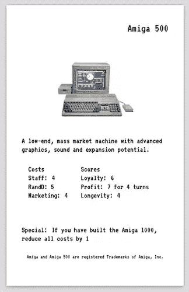
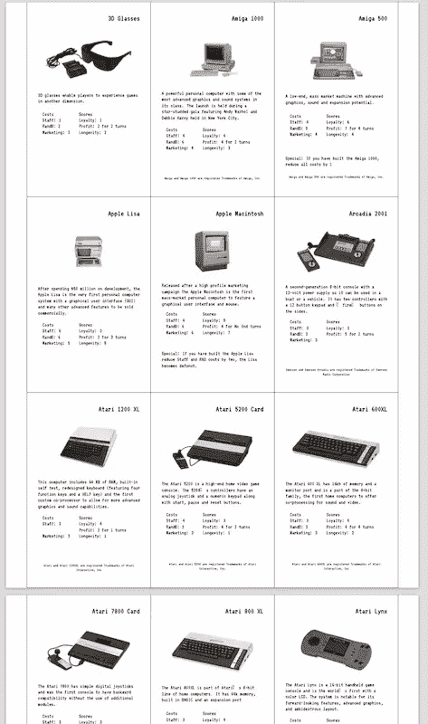

# 使用 Pandoc 和 LaTeX 从 Markdown 创建 pdf

> 原文：<https://www.sitepoint.com/creating-pdfs-from-markdown-with-pandoc-and-latex/>


如果你读过我以前在 SitePoint 或其他地方发表的一些文章，你可能会知道我正在开发一款桌游。在名为[芯片商店](http://chipshopgame.com)的游戏中，你将在 20 世纪 80 年代的美国经营一家电脑公司。

作为项目的一部分，我正试图尽可能地开源整个游戏。在几次失败的开始后，我已经为大多数游戏组件决定了一个基本框架[降价](https://www.sitepoint.com/best-markdown-editors-windows/)——尤其是卡片和手册。

由于游戏的网站使用了 [Jekyll](https://www.sitepoint.com/set-jekyll-blog-5-minutes-poole/) ，游戏的网站是从降价文件中生成的。我打算有游戏的高级预装和打印版本，为了实现这一点，我需要从降价文件生成 pdf。

## 我想要完成的

我理想的工作流程是在生成网站的同时生成 PDF 文件，而不是按照访问者的要求生成文件。这排除了我生成 pdf 的常用选项， [wkhtmltopdf](http://wkhtmltopdf.org/) ，因为它从已经生成的 HTML 生成 PDF。它不是一个选项的另一个原因是，我希望 PDF 卡版本看起来不同于 HTML 页面，而 Jekyll 缺乏任何类型的<q>视图模式</q>功能来实现这一点，而无需诉诸复杂的 CSS 规则。

筹码商店游戏中卡片的[降价模板文件](https://github.com/GregariousMammal/Chip-Shop/tree/master/_cards)包含了大量游戏机制的[降价前置事项字段](http://jekyllrb.com/docs/frontmatter/)。并不是所有的卡都使用。为了打印方便，我需要在 A4 纸上放尽可能多的卡片——在本例中，是一个 3×3 的网格。最终页面将需要双面，但我还没有实现这一点。

## 输入 Pandoc 和 LaTeX

任何寻找从 Markdown 生成 pdf 的解决方案的互联网搜索都会把你引向 Pandoc 的道路。Pandoc 是一个开源的瑞士军刀标记转换工具，支持各种各样的输入和输出标记格式。

要用 Pandoc 生成 pdf，需要 [LaTeX](http://www.latex-project.org/) 。LaTeX 植根于科研社区，是一个文档声明和布局系统。结合 Pandoc 和 LaTeX 允许我们使用变量，从而从一系列降价文件中生成 pdf 并支持降价前端。

尽管 Pandoc 和 LaTeX 很强大，但我找不到任何方法将多个 pdf(卡片)合并到一个页面上，尤其是在使用 Markdown 文件中的变量时。经过大量研究后，我选定了 [PDFJam](http://www2.warwick.ac.uk/fac/sci/statistics/staff/academic-research/firth/software/pdfjam/) ，这是一个满足这一需求的简单命令行工具。

## 安装依赖项

### 降价

你不需要额外的软件来进行降价，除了一个编辑器，而且有很多这样的软件，我建议你阅读一些网站点的帖子来做出选择。

### 吉基尔博士

我将继续在我的游戏示例中使用 Jekyll 来说明构建过程，但如果你不需要网站，它不是 PDF 生成的必要部分。

### Pandoc

在我的 Mac 上，我用[家酿](http://brew.sh/)安装了 Pandoc，但所有操作系统都有[选项。](http://pandoc.org/installing.html)

### 乳液

关于安装 LaTeX 的最佳方式有很多观点，这取决于您需要或打算用它做什么。它的通用工具和库的完整安装可能接近 2GB，但是对于大多数目的来说，最小的安装就足够了。阅读[项目的下载页面](http://latex-project.org/ftp.html)找到最适合你的选项。

对于本教程，我们将使用 xelatex 引擎，因为我使用自定义字体。但是您可以选择提供您需要的特定功能的任何引擎。

### PDFJam

根据您安装 LaTeX 的方式，您可能已经安装了 PDFJam。(通过在终端键入`which pdfjam`进行检查。)如果你还没有，那么在这里找到[关于安装的细节。](http://www2.warwick.ac.uk/fac/sci/statistics/staff/academic-research/firth/software/pdfjam/#install)

## 构建过程

经过一番考虑，我在本地运行的 bash 脚本似乎是目前最好的选择。有更好的方法，但它是有效的，我可以在以后改进这个过程，将其转移到持续集成系统或 g it 挂钩。

[在 GitHub 上查看 bash 脚本](https://github.com/GregariousMammal/Chip-Shop/blob/master/build.sh)。

现在让我们一步一步地看这个脚本。

### 设置

```
bundle install
bundle update

rm -dfr _site
rm -dfr pod
```

这些命令确保 Jekyll 构建网站所需的 Ruby 依赖项是最新的，并确保我们删除任何现有的网站和打印文件夹。

### 建立网站

```
jekyll build
mkdir -p pod/pdf/cards
```

接下来，我们建立网站，并为卡片的印刷版本创建一个文件夹。

### 从 Markdown 生成 pdf

让我们创建一个文件夹，其中包含每个降价文件的 PDF 版本:

```
for filename in _cards/*.md; do
  echo $filename
  pandoc --from=markdown+yaml_metadata_block --template _layouts/cards.latex -o pod/pdf/cards/"$(basename "$filename" .md)".pdf --latex-engine=xelatex $filename
done
```

该脚本处理`_cards`目录中的每一个降价文件，确保降价前端事件字段得到遵守。使用`cards.latex`模板(我们接下来会看到)，正确的 LaTeX 引擎输出一个带有适当名称的 PDF。

### 乳胶文件

从 [Pandoc](http://pandoc.org/) 生成卡片文件的许多魔法都发生在 [LaTeX](http://www.latex-project.org/) 模板中。

[在 GitHub 上查看 LaTeX 模板](https://github.com/GregariousMammal/Chip-Shop/blob/master/_layouts/cards.latex)。

乳胶对我来说是新的，但它并不太复杂。我将解释我从默认的 LaTeX 文件(在`Pandoc_install_dir/data/templates/default.latex`中找到)中改变了什么来使卡工作。我推荐[sharelatex.com](https://www.sharelatex.com)在你编辑的时候预览 LaTeX 文件。

```
\usepackage[paperheight=9.0cm,paperwidth=5.7cm,margin=0.5cm]{geometry}
% Set page size
\usepackage{multicol}
% We need column layouts
\usepackage{amsthm,amsmath,amssymb}
\usepackage{graphicx}
% We want images in our layout
\graphicspath{{/Users/chrisward/Workspace/cs_jk/_site/asseimg/cards/}}
% Where are images located
\usepackage{float}
\usepackage[utf8]{inputenc}
\usepackage{fontspec}
\setmainfont{VT323}
% We want to use a custom font installed on our local system, so add that package and select the font
```

我们需要一个特定的页面大小，稍后我们将使用列来表示卡片的成本和分数。我们使用图形和自定义字体，所以我们需要那些[包](https://en.wikibooks.org/wiki/LaTeX/Package_Reference)。

我们试图创建一个简单的布局，清晰整洁。我们是这样完成的:

```
\begin{document}
  \begin{flushright}
    {$title$}
  \end{flushright}
  $if(image)$
  \begin{figure}[H]
    \centering
    \includegraphics[height=2cm]{$image$}
  \end{figure}
  $endif$
  \begin{flushleft}
    \scriptsize{$body$}
  \end{flushleft}
  \scriptsize
  \begin{tabular}{ l l }
    Costs & Scores \\
    $if(staffcost)$ Staff: {$staffcost$} $endif$ & $if(loyaltyscore)$ Loyalty: {$loyaltyscore$} $endif$ \\
    $if(rdcost)$ RandD: {$rdcost$} $endif$ & $if(profitscore)$ Profit: {$profitscore$} for {$profitlength$} turns $endif$ \\
    $if(marketingcost)$ Marketing: {$marketingcost$} $endif$ & $if(longevityscore)$ Longevity: {$longevityscore$} $endif$ \\
    $if(longevitycost)$ Longevity: {$longevitycost$} $endif$ &  \\
    $if(moneycost)$ Money: {$moneycost$} $endif$ &
  \end{tabular}
  \begin{flushleft}
    $if(specialscore)$
    Special: {$specialscore$}
    $endif$
  \end{flushleft}
  \begin{center}
    $if(legal)$
    \tiny{$legal$}
    $endif$
  \end{center}
\end{document}
```

我觉得对于任何习惯于编码或标记的人来说，上面的很多内容都是不言自明的。我们正在创建卡片的元素，对齐它们，设置字体大小，并在输出它们之前检查是否有值，这样卡片就不会以空字段结束。

我们将图像调整到一个特定的大小并居中。成本和分值在两列布局中，用`begin{tabular}`命令设置，列数量用`l`的数量设置。



### 将卡片合并到一页上

我们使用 PDFJam 创建一个大的 PDF 文件，将每个单独的 PDF 卡组合在一起:

```
pdfjam pod/pdf/cards/*.pdf --no-landscape --frame true --nup 3x3 --suffix complete --outfile ./cards.pdf
mv cards pod/cards_complete.pdf
```

使用该命令，我们指定以下内容:

*   页面方向应该总是纵向的
*   每个单独的 PDF 都应该被框起来
*   网格大小
*   文件名后缀
*   一个文件名。

如果不输出到它的工作目录，PDFJam 会给出一个错误，所以我将文件移动到我真正想要的位置(希望将来可以解决)。在这里，我们也可以删除个别 PDF 文件，如果我们不想要他们。

就这样——我们有一个网站和可打印的游戏卡片 PDF。



### 运行脚本

我用`./build.sh`运行构建脚本。由于有大量的图像和 PDF 处理，它需要大约五到十分钟。然后，我有一个单独的脚本将这些文件夹部署到 web 服务器上。

## 下一步是什么

这个过程花了我一段时间来适应，但现在已经足够好了，可以在游戏测试后继续前进，调整过程和布局。

我希望我的研究和实验对你的项目有用。如果您有任何意见或建议，请告诉我。

## 分享这篇文章