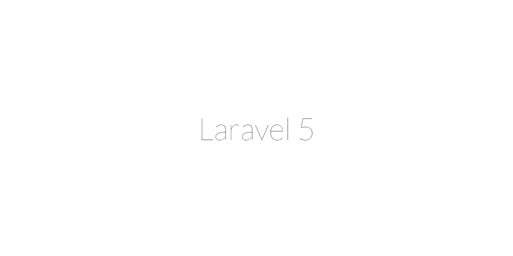
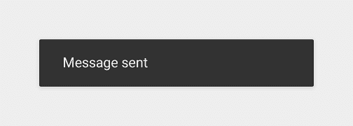
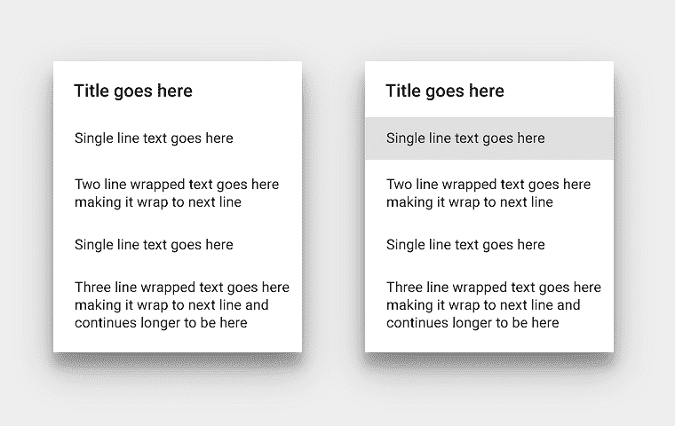

# 灵活且易于维护的 Laravel +角形材料应用

> 原文：<https://www.sitepoint.com/flexible-and-easily-maintainable-laravel-angular-material-apps/>

在这篇文章中，我们将建立一个 Laravel API，在前端使用有角度的材质。我们还将遵循最佳实践，这将有助于我们根据项目开发人员的数量及其背后的复杂性进行调整。大多数教程从另一个角度讲述了这个话题——他们完全忘记了缩放。虽然本教程不是针对小的 todo 应用程序，但如果你打算和其他开发人员一起开发一个大项目，它会非常有帮助。


这里有一个用 Laravel 和 Angular 材料制作的[演示](https://infinite-dusk-3948.herokuapp.com/)。

## 设置 Laravel

### 创建项目

在撰写本文时，我们将从引入最新的 Laravel–5.1 开始。

```
composer create-project laravel/laravel myapp --prefer-dist
```

### 配置环境

所有后续命令都将在`myapp`目录中运行。在本教程的剩余部分，如果您继续学习，我们将假设您正在运行 Linux 环境。如果你不是，我们鼓励你安装 [Homestead Improved](https://www.sitepoint.com/quick-tip-get-homestead-vagrant-vm-running/) 作为一个虚拟的 Linux 环境。

```
cd myapp
```

接下来，我们将使用数据库连接凭证更新我们的`.env`文件:

```
DB_HOST=localhost
DB_DATABASE=your-db-name
DB_USERNAME=your-username
DB_PASSWORD=your-password
```

一旦你的应用程序配置完成，你应该会看到 Laravel 5 的问候页面。



### 不可调试

Laravel debug bar 是最有用的 Laravel 软件包之一。

Debugbar 使调试以下任何内容变得容易:

*   例外
*   视图
*   信息
*   问题
*   邮件
*   作家（author 的简写）
*   路线
*   创建交互式、快速动态网页应用的网页开发技术
*   更多


因此，让我们继续使用 composer 安装它

```
composer require barryvdh/laravel-debugbar
```

接下来，我们需要打开`config/app.php`和:

*   将`Barryvdh\Debugbar\ServiceProvider::class,`添加到`providers`列表中
*   将`'Debugbar' => Barryvdh\Debugbar\Facade::class,`添加到`aliases`列表中

刷新页面，你应该会在页面底部看到`debugbar`！

如果您在`.env`文件中启用了`APP_DEBUG`标志，Debugbar 会自动运行。

## 构建自动化

Laravel 的灵丹妙药是在`gulp`之上的一层，使编写吞咽任务变得更容易。

### 设置

我们将从全球安装 gulp 开始。注意，您需要为这个部分安装 nodeJS。

```
npm install -g gulp
```

然后我们需要拿几个能让我们生活更轻松的包，所以用下面的替换你的`package.json`:

```
{
  "dependencies": {
    "gulp-concat": "^2.6.0",
    "gulp-concat-sourcemap": "^1.3.1",
    "gulp-filter": "^1.0.2",
    "gulp-if": "^1.2.5",
    "gulp-jshint": "^1.9.0",
    "gulp-minify-css": "^0.3.11",
    "gulp-ng-annotate": "^1",
    "gulp-notify": "^2.0.0",
    "gulp-sourcemaps": "^1",
    "gulp-uglify": "^1",
    "jshint-stylish": "^2",
    "laravel-elixir": "^3.0.0",
    "laravel-elixir-livereload": "^1.1.1",
    "main-bower-files": "^2.1.0"
  },
  "devDependencies": {
    "gulp": "^3.9.0"
  }
}
```

然后安装这些包。

```
npm install
```

### 管理前端依赖关系

我喜欢使用 Bower，因为它的[平面依赖树](http://stackoverflow.com/a/18652918/1599122)，但是这真的取决于你的偏好。
你可以使用 npm、requirejs 或者简单的老式*浏览到 url 并下载，然后手动检查更新*。

让我们全球安装 bower。

```
npm install -g bower
```

然后把这一行加到`.gitignore`:

`/bower_components`

并运行`bower init`来创建一个新的`bower.json`文件，该文件将被提交到存储库中。

### 按功能的文件夹

然后，我们想在 Laravel 文件夹中为 Angular 选择一个位置。

大多数人更喜欢将它添加到`resources/js`中，但是因为我更喜欢按照特性架构创建一个**文件夹，所以我们将在根级别创建一个`angular`文件夹。**

我选择这种设置是因为我们希望它能够随着开发人员的数量及其背后的业务复杂性而扩展。

几个月后，我们将为每项功能都准备一个文件夹。下面是我们将在`angular/app`中拥有的文件夹示例:

*   页眉
    *   header.html
    *   header.js
    *   无标题
*   注册
    *   login.html
    *   login.js
    *   登录. less
    *   服务网
*   登陆
*   用户
*   更改密码
*   重置 _ 密码
*   列表 _ 项目
*   添加项目
*   项目 _ 详细信息

在`list_items`页面中修复 bug 要容易得多。我们只需打开`list_items`文件夹，在那里我们可以找到该特性的所有相关文件:

*   模板
*   较少的文件
*   角度控制器
*   角度服务。

相比之下，在调试单个功能时，必须为每个文件打开一个文件夹。

因此，让我们继续创建以下文件夹:

*   `angular`
*   `angular/app`
*   `angular/services`
*   `angular/filters`
*   `angular/directives`
*   `angular/config`

### 酏剂构型

现在我们需要配置 elixir 从`bower_components`文件夹中编译一个`js/vendor.js`和一个`css/vendor.css`文件。

然后，我们需要通过 elixir `angular`任务运行 angular 文件夹，该任务执行以下操作:

*   将我们的应用文件连接成`public/js/app.js`
*   用`jshint`验证(如果`.jshintrc`文件可用)。如果文件是可用的，它不会重新编译我们的源代码，如果你的代码没有通过验证。
*   使用 [ng-annotate](https://github.com/olov/ng-annotate) 的自动依赖性注释

我们需要编译我们的小文件。如果您正在使用 Sass，您可能知道如何让它为 Sass 工作。

我们还需要将视图从`angular`目录复制到`public`目录。

最后，我们将设置 livereload。软重新加载用于 css，这意味着无需重新加载页面即可注入新版本的 CSS。

让我们打开 **gulpfile.js** 并用以下代码替换示例 Elixir 函数调用:

```
var elixir = require('laravel-elixir');
require('./tasks/angular.task.js');
require('./tasks/bower.task.js');
require('laravel-elixir-livereload');

elixir(function(mix){
    mix
        .bower()
        .angular('./angular/')
        .less('./angular/**/*.less', 'public/css')
        .copy('./angular/app/**/*.html', 'public/views/app/')
        .copy('./angular/directives/**/*.html', 'public/views/directives/')
        .copy('./angular/dialogs/**/*.html', 'public/views/dialogs/')
        .livereload([
            'public/js/vendor.js',
            'public/js/app.js',
            'public/css/vendor.css',
            'public/css/app.css',
            'public/views/**/*.html'
        ], {liveCSS: true});
});
```

如果您注意到了，我正在加载几个自定义任务，所以您只需要在项目的根目录下创建`tasks`文件夹，并创建这两个文件:

任务/angular.task.js

```
/*Elixir Task
*copyrights to https://github.com/HRcc/laravel-elixir-angular
*/  var gulp =  require('gulp');  var concat =  require('gulp-concat');  var sourcemaps =  require('gulp-sourcemaps');  var jshint =  require('gulp-jshint');  var stylish =  require('jshint-stylish');  var uglify =  require('gulp-uglify');  var ngAnnotate =  require('gulp-ng-annotate');  var notify =  require('gulp-notify');  var gulpif =  require('gulp-if');  var  Elixir  =  require('laravel-elixir');  var  Task  =  Elixir.Task;  Elixir.extend('angular',  function(src, output, outputFilename)  {  var baseDir = src ||  Elixir.config.assetsPath +  '/angular/';  new  Task('angular in '  + baseDir,  function()  {  // Main file has to be included first.  return gulp.src([baseDir +  "main.js", baseDir +  "**/*.js"])  .pipe(jshint())  .pipe(jshint.reporter(stylish))  //.pipe(jshint.reporter('fail')).on('error', onError) //enable this if you want to force jshint to validate  .pipe(gulpif(! config.production, sourcemaps.init()))  .pipe(concat(outputFilename ||  'app.js'))  .pipe(ngAnnotate())  .pipe(gulpif(config.production, uglify()))  .pipe(gulpif(! config.production, sourcemaps.write()))  .pipe(gulp.dest(output || config.js.outputFolder))  .pipe(notify({ title:  'Laravel Elixir', subtitle:  'Angular Compiled!', icon: __dirname +  '/../node_modules/laravel-elixir/icons/laravel.png', message:  ' '  }));  }).watch(baseDir +  '/**/*.js');  });
```

tasks/bower.task.js

```
/*Elixir Task for bower
* Upgraded from https://github.com/ansata-biz/laravel-elixir-bower
*/
var gulp = require('gulp');
var mainBowerFiles = require('main-bower-files');
var filter = require('gulp-filter');
var notify = require('gulp-notify');
var minify = require('gulp-minify-css');
var uglify = require('gulp-uglify');
var concat_sm = require('gulp-concat-sourcemap');
var concat = require('gulp-concat');
var gulpIf = require('gulp-if');

var Elixir = require('laravel-elixir');

var Task = Elixir.Task;

Elixir.extend('bower', function(jsOutputFile, jsOutputFolder, cssOutputFile, cssOutputFolder) {

    var cssFile = cssOutputFile || 'vendor.css';
    var jsFile = jsOutputFile || 'vendor.js';

    if (!Elixir.config.production){
        concat = concat_sm;
    }

    var onError = function (err) {
        notify.onError({
            title: "Laravel Elixir",
            subtitle: "Bower Files Compilation Failed!",
            message: "Error: <%= error.message %>",
            icon: __dirname + '/../node_modules/laravel-elixir/icons/fail.png'
        })(err);
        this.emit('end');
    };

    new Task('bower-js', function() {
        return gulp.src(mainBowerFiles())
            .on('error', onError)
            .pipe(filter('**/*.js'))
            .pipe(concat(jsFile, {sourcesContent: true}))
            .pipe(gulpIf(Elixir.config.production, uglify()))
            .pipe(gulp.dest(jsOutputFolder || Elixir.config.js.outputFolder))
            .pipe(notify({
                title: 'Laravel Elixir',
                subtitle: 'Javascript Bower Files Imported!',
                icon: __dirname + '/../node_modules/laravel-elixir/icons/laravel.png',
                message: ' '
            }));
    }).watch('bower.json');

    new Task('bower-css', function(){
        return gulp.src(mainBowerFiles())
            .on('error', onError)
            .pipe(filter('**/*.css'))
            .pipe(concat(cssFile))
            .pipe(gulpIf(config.production, minify()))
            .pipe(gulp.dest(cssOutputFolder || config.css.outputFolder))
            .pipe(notify({
                title: 'Laravel Elixir',
                subtitle: 'CSS Bower Files Imported!',
                icon: __dirname + '/../node_modules/laravel-elixir/icons/laravel.png',
                message: ' '
            }));
    }).watch('bower.json');

});
```

这两个任务看起来有点复杂，但是你不必担心。你在这里是为了加速你的开发过程，而不是浪费时间设置构建工具。

我之所以不使用一些在线可用的节点模块，是因为在撰写本文时，它们速度很慢，而且在功能性方面经常受到限制。尽情享受吧！

## 设置角度

### 装置

让我们从下载 Angular 1 的最新版本开始吧

```
bower install angular#1 --save
```

不要忘记`--save`标志，因为我们希望它保存在`bower.json`中

我们现在可以运行`gulp && gulp watch`。

### 配置主模块

让我们从配置`angular/main.js`开始

```
(function(){
"use strict";

var app = angular.module('app',
        [
        'app.controllers',
        'app.filters',
        'app.services',
        'app.directives',
        'app.routes',
        'app.config'
        ]);

    angular.module('app.routes', []);
    angular.module('app.controllers', []);
    angular.module('app.filters', []);
    angular.module('app.services', []);
    angular.module('app.directives', []);
    angular.module('app.config', []);
    })();
```

## 桥接 Laravel & Angular

### 为应用服务

我们需要使用 artisan 创建一个新的控制器。

```
php artisan make:controller AngularController --plain
```

```
AngularController.php

public function serveApp(){
    return view('index');
}
```

然后用以下内容替换`routes.php`中现有的`Route::get('/', ...)`:

```
Route::get('/', 'AngularController@serveApp');
```

起初这似乎没什么用，但是我喜欢将逻辑放在 Routes 文件之外，所以我不喜欢在那里放闭包。最终，我们将把这个控制器用于其他方法，比如不受支持的浏览器页面。

然后，我们需要创建视图`resources/views/index.blade.php`并添加这个 HTML:

```
<html ng-app="app">
<head>
    <link rel="stylesheet" href="/css/vendor.css">
    <link rel="stylesheet" href="/css/app.css">
</head>
<body>

    <md-button class="md-raised md-primary">Welcome to Angular Material</md-button>

    <script src="/js/vendor.js"></script>
    <script src="/js/app.js"></script>
</body>
</html>
```

### 不支持的浏览器

Angular Material 针对的是 evergreen 浏览器，所以我们需要为不支持的浏览器添加一个页面(即< = 10)。

我们首先在我们的`index.blade.php`视图的`<head>`中添加以下条件注释:

```
<!--[if lte IE 10]>
    <script type="text/javascript">document.location.href ='/unsupported-browser'</script>
    <![endif]-->
```

这将把使用不支持的浏览器的用户重定向到`/unsupported-browser`，这是一条我们应该在`routes.php`中处理的路由:

```
Route::get('/unsupported-browser', 'AngularController@unsupported');
```

然后，在`AngularController`中，我们创建了`unsupported`方法:

```
public function unsupported(){
    return view('unsupported');
}
```

最后，我们创建`unsupported.blade.php`视图并输出一条消息，告诉用户他们需要升级到一个现代化的浏览器。

## 拉入角形材料

> Angular Material 是 Angular.js 中材质设计的实现，它基于材质设计系统提供了一组可重用的、经过良好测试的、可访问的 UI 组件。

### 装置

首先，我们使用 Bower 拉有角的材料:

```
bower install angular-material --save
```

然后，我们将`ngMaterial`模块添加到`app.controllers`和`app.config`模块中:

```
angular.module('app.controllers',  ['ngMaterial']); angular.module('app.config',  ['ngMaterial']);
```

最后，我们重新运行`gulp watch`。

### 自定义主题

你可能喜欢棱角分明的材料给你的应用带来的感觉，但你担心它看起来会和棱角分明的材料一模一样。

我们希望对主题应用一些品牌指南，这就是为什么我们需要为 Angular Material 创建一个新的配置提供程序，它允许我们为主题指定 3 种主要颜色:

```
/angular/config/theme.js:  (function(){  "use strict"; angular.module('app.config').config(  function($mdThemingProvider)  {  /* For more info, visit https://material.angularjs.org/#/Theming/01_introduction */ $mdThemingProvider.theme('default')  .primaryPalette('teal')  .accentPalette('cyan')  .warnPalette('red');  });  })();
```

## 设置 ui 路由器

> [ui-router](https://github.com/angular-ui/ui-router) 是使用嵌套视图灵活路由的实际解决方案。

### 装置

让我们从使用 bower 开始:

```
bower install  ui-router --save
```

然后，将`ui.router`模块添加到`app.routes`和`app.controllers`模块中:

```
angular.module('app.routes',  ['ui.router']); angular.module('app.controllers',  ['ngMaterial',  'ui.router']);
```

然后，我们重新运行`gulp watch`。

### 配置路线

现在我们需要设置我们的 routes 文件。让我们继续创建`angular/routes.js`

```
(function(){
    "use strict";

    angular.module('app.routes').config( function($stateProvider, $urlRouterProvider ) {

        var getView = function( viewName ){
            return '/views/app/' + viewName + '/' + viewName + '.html';
        };

        $urlRouterProvider.otherwise('/');

        $stateProvider
        .state('landing', {
            url: '/',
            views: {
                main: {
                    templateUrl: getView('landing')
                }
            }
        }).state('login', {
            url: '/login',
            views: {
                main: {
                    templateUrl: getView('login')
                },
                footer: {
                    templateUrl: getView('footer')
                }
            }
        });

    } );
})();
```

我们创建了两条路径，一条用于登录页面，另一条用于登录页面。请注意我们是如何拥有多个命名视图的。我们需要将它添加到我们的主视图中，在`<body>`中:

```
<div ui-view="main"></div>
<div ui-view="footer"></div>
```

然后，我们在`angular/app`中创建以下文件夹和文件:

*   `landing/landing.html`与输出`Landing view`
*   `login/login.html`与输出`Login view`
*   `footer/footer.html`与输出`Footer view`

现在，每当你需要添加一个新页面时，你只需要添加一个新的`.state()`。

## 设置矩形

> Restangular 是一个 AngularJS 服务，它简化了对 RESTful API 的普通 ajax 调用。

### 装置

restandular 非常适合我们的 laravel api。

让我们通过运行以下命令来获取 Restangular 的最新版本:

```
bower install restangular --save
```

然后，将`restangular`模块添加到`app.controllers`模块:

```
angular/main.js: angular.module('app.controllers',  ['ngMaterial',  'ui.router',  'restangular']);
```

然后，重新运行`gulp watch`。

让我们设置一个示例 API 端点。

```
php artisan make:controller DataController --plain
```

```
DataController.php:

public function index(){
    return ['data', 'here'];
}
```

```
app\Http\routes.php:

Route::get('/data', 'DataController@index');
```

示例用法:

```
Restangular.all('data').doGET().then(function(response){
    window.console.log(response);
});
```

## 烤

toast 在一个小弹出窗口中提供关于操作的简单反馈。



由于我们将在应用程序中大量使用 toast，我们将创建一个 toast 服务`angular/services/toast.js`

```
(function(){
    "use strict";

    angular.module("app.services").factory('ToastService', function( $mdToast ){

        var delay = 6000,
        position = 'top right',
        action = 'OK';

        return {
            show: function(content) {
                return $mdToast.show(
                    $mdToast.simple()
                    .content(content)
                    .position(position)
                    .action(action)
                    .hideDelay(delay)
                    );
            }
        };
    });
})();
```

现在，我们可以在应用程序中使用它:

```
(function(){
    "use strict";

    angular.module('app.controllers').controller('TestCtrl', function( ToastService ){
                    ToastService.show('User added successfully');
            };

        });

})();
```

## 对话

对话框是 Angular Material 中最有用的功能之一。它们非常类似于 Twitter Bootstrap 中的情态动词。



对话框是单页应用中的一个关键组件，这就是为什么我们要编写一个强大的对话框服务

```
(function(){
    "use strict";

    angular.module("app.services").factory('DialogService', function( $mdDialog ){

        return {
            fromTemplate: function( template, $scope ) {

                var options = {
                    templateUrl: '/views/dialogs/' + template + '/' + template + '.html'
                };

                if ( $scope ){
                    options.scope = $scope.$new();
                }

                return $mdDialog.show(options);
            },

            hide: function(){
                return $mdDialog.hide();
            },

            alert: function(title, content){
                $mdDialog.show(
                    $mdDialog.alert()
                    .title(title)
                    .content(content)
                    .ok('Ok')
                    );
            }
        };
    });
})();
```

我们在这个服务中创建了 3 个方法:

*   **`alert(title, content)`** 允许我们显示一个带有标题和消息的对话框。对错误和成功消息有用
*   **`hide()`** 隐藏了对话框
*   **`fromTemplate(template, $scope)`** 从`/angular/dialogs/`中存储的模板创建一个对话框。有用的登录，重置等。对话。您可以通过特性方法使用相同的文件夹在`/angular/dialogs/`目录中创建您自己的组件。您还可以将`$scope`传递给对话框，这将允许您从对话框的控制器中访问`$parent`范围。

我们只需要修复 Elixir 配置来观察和复制`/angular/dialogs`文件夹:

```
 .copy('angular/dialogs/**/*.html', 'public/views/dialogs/');
```

现在，我们可以在应用程序中使用它:

```
(function (){
    "use strict";

    angular.module('app.controllers').controller('DialogTestCtrl', function ($scope, DialogService){

            $scope.addUser = function(){
                return DialogService.fromTemplate('add_user', $scope);
            };

            $scope.success = function(){
                return DialogService.alert('Success', 'User created successfully!');
            };

        });

})();
```

## 部署

这里有一个简单的 bash 脚本，我们将使用它进行部署。可以另存为`deploy.sh`。

您只需要在您的服务器`ssh@your-domain`前添加一个 ssh 命令。

```
php artisan route:clear
php artisan config:clear
git pull
php artisan migrate
composer install
php artisan route:cache
php artisan config:cache
php artisan optimize
```

前两个命令清除路由和配置缓存，然后在提取新代码后再次生成。这将极大地提高您的应用在生产环境中运行时的性能。

不要忘记，您所做的任何配置/路由更改将不会生效，直到您再次清除缓存。

## 代码质量

加强代码质量有助于大型项目的维护。你不希望几个月后有一个糟糕的代码库。这是完全可选的，但是我建议您设置一些自动化代码质量工具。

我们将从安装必要的节点模块开始:

```
npm install -g jshint jscs
```

### EditorConfig

EditorConfig 帮助我们在不同的编辑器和 ide 之间保持一致的编码风格。当有许多开发人员/贡献者在同一个项目上工作时，这尤其有用。

你不希望有人用空格代替制表符，或者相反，用 CRLF 代替 LF 作为行尾，或者相反。

让我们在根级别创建`.editorconfig`文件。随意在 CRLF 和 LF、制表符和空格等之间切换..这完全取决于你的编码风格。

```
root = true

[*]
insert_final_newline = false
charset = utf-8
end_of_line = lf

[*.{js,html}]
indent_size = 4
indent_style = tab
trim_trailing_whitespace = true

[{package.json,bower.json,.jscs.json}]
indent_style = space
indent_size = 2

[*.sh]
end_of_line = lf
```

根据你的代码编辑器，你可能需要[下载](http://editorconfig.org/#download)一个 editorConfig 的插件。

当您使用同一个文本编辑器处理多个项目，并且每个项目都有不同的编码风格指南时，这也很方便。

### jslint

> Jshint 是一个 Javascript 代码质量工具，有助于检测 Javascript 代码中的错误和潜在问题。

它还在您的团队中强制执行编码约定。

我们需要在项目的根级别创建一个`.jshintrc`文件。
您可以在这里浏览 [jshint 的可用选项。
注意，当你添加一个`.jshintrc`文件时，如果 gulpfile 中的`angular`任务没有根据 jshint 进行验证，它将不会重新编译我们的代码。](http://jshint.com/docs/options/)

这里有一个推荐的`jshintrc`用于我们的场景。根据您的编码风格随意修改它。

```
{
  "browser": true,
  "bitwise": true,
  "immed": true,
  "newcap": false,
  "noarg": true,
  "noempty": true,
  "nonew": true,
  "maxlen": 140,
  "boss": true,
  "eqnull": true,
  "eqeqeq": true,
  "expr": true,
  "strict": true,
  "loopfunc": true,
  "sub": true,
  "undef": true,
  "globals": {
    "angular": false,
    "describe": false,
    "it": false,
    "expect": false,
    "beforeEach": false,
    "afterEach": false,
    "module": false,
    "inject": false
  }
}
```

### JSCS

> JSCS 是一个代码风格的 linter，用于以编程方式执行你的风格指南。

我们将在根级别创建一个`.jscs.json`文件。
根据你的风格随意修改。

```
{
  "requireCurlyBraces": [
    "if",
    "else",
    "for",
    "while",
    "do"
  ],
  "requireSpaceAfterKeywords": [
    "if",
    "for",
    "while",
    "do",
    "switch",
    "return"
  ],
  "disallowSpacesInFunctionExpression": {
    "beforeOpeningRoundBrace": true
  },
  "disallowTrailingWhitespace": true,
  "disallowMixedSpacesAndTabs": true,
  "requireMultipleVarDecl": true,
  "requireSpacesInsideObjectBrackets": "all",
  "requireSpaceBeforeBinaryOperators": [
    "+",
    "-",
    "/",
    "*",
    "=",
    "==",
    "===",
    "!=",
    "!=="
  ],
  "disallowSpaceAfterPrefixUnaryOperators": [
    "++",
    "--",
    "+",
    "-"
  ],
  "disallowSpaceBeforePostfixUnaryOperators": [
    "++",
    "--"
  ],
  "disallowKeywords": [
    "with"
  ],
  "disallowKeywordsOnNewLine": [
    "else"
  ],
  "excludeFiles": ["node_modules/**"]
}
```

### phpcms

就像 jshint 一样，我们需要能够对我们的 PHP 文件实施代码清洁和一致性。

让我们从全局安装 phpcs 开始:

```
composer global require "squizlabs/php_codesniffer=*"
```

现在我们可以使用下面的命令来检查`app`文件夹:

```
phpcs --standard=psr2 app/
```

这里很酷的一点是，我们可以使用 PSR2 作为 Laravel 使用的编码标准，因此我们不必设置自定义配置文件。

### 去吧胡克斯

Jshint 和 jscs 是很好的工具，但是它们需要自动执行，否则我们会忘记 lint 我们的代码。

您可以选择为您的文本编辑器或 IDE 安装相应的 linter 插件，但是推荐的方法之一是将这些 linter 作为 g it 提交过程的一部分来运行。

如果不存在，创建`.git/hooks/pre-commit`并添加以下内容:

```
#!/bin/sh
jscs angular/**/*.js
jshint angular/**/*.js
phpcs --standard=psr2 app/
exec 1>&2
```

然后运行`chmod +x .git/hooks/pre-commit`。

别忘了给每个加入你团队的开发人员添加这个，每次有人推送时，他们会被自动警告可能的问题。

## 结论

这篇文章帮助我们建立了一个可扩展的 Laravel 和 Angular Material 应用程序。你也可以在 github 上抓取本教程的源代码:[laravel 5-angular-material-starter](https://github.com/sitepoint-editors/laravel5-angular-material-starter)。如果你一直在使用 Angular 和 Bootstrap，我建议你试试 Angular 材质。你有什么问题吗？我很想知道你的想法。请在评论中告诉我！

## 分享这篇文章