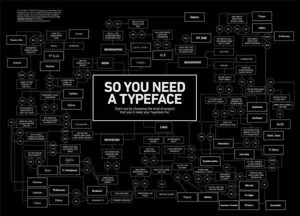
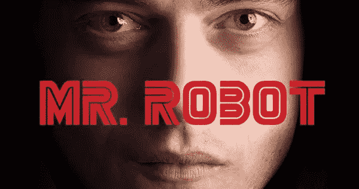
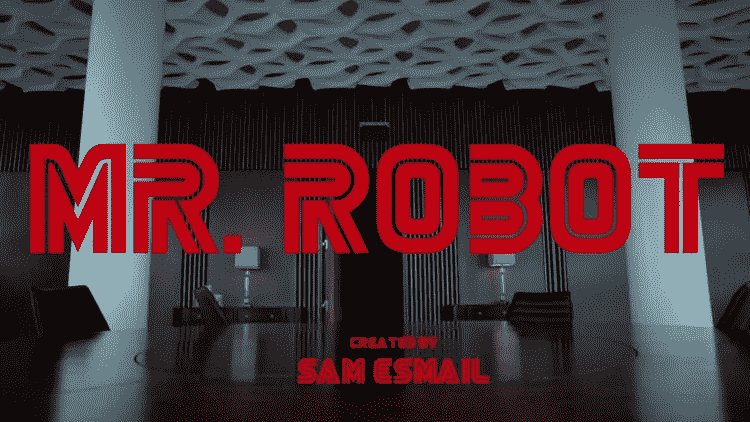
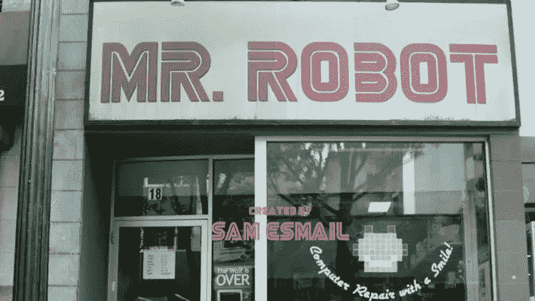
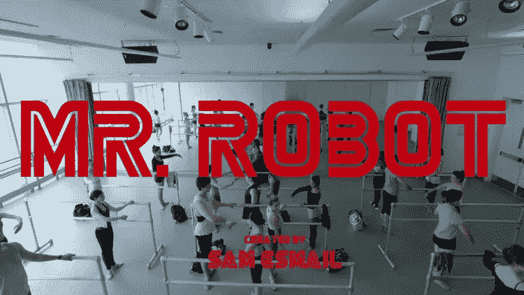
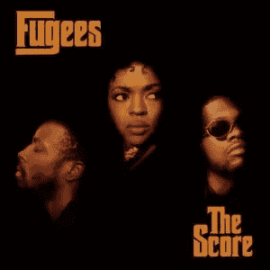
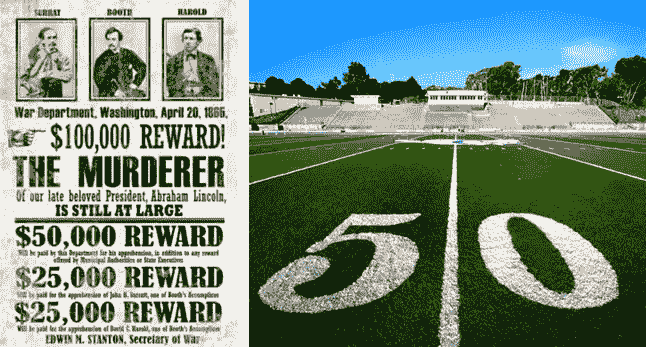
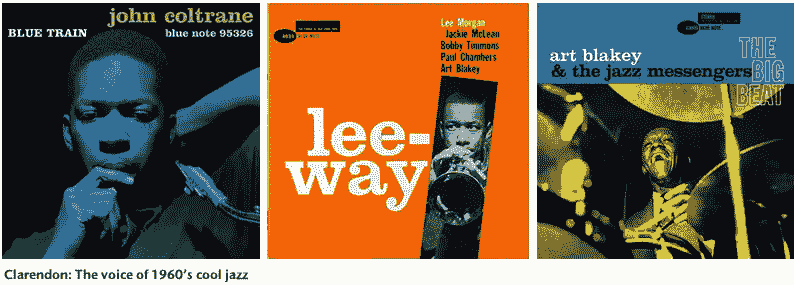

# 你应该勇敢面对你的排版吗？问机器人先生。

> 原文：<https://www.sitepoint.com/brave-typeface-ask-mr-robot/>

大约五年前[朱利安·汉森](http://julianhansen.com/)发表了一张名为“[所以你需要一种字体](http://julianhansen.com/files/infographiclarge_v2.png)的精彩流程图海报。回答一系列简单的“是/否”问题，朱利安会给你指出你需要的字体。

虽然海报有点开玩笑，但它让你知道字体选择有多复杂。有人曾经说过“没有人会因为收购 IBM 而被解雇”，或许同样的话也可以用在“选择 Helvetica”上。作为设计师，如果我们做出*安全*的排版决定，我们很容易被原谅。

老实说， ***是*** 一般来说是合理的建议——尤其是对于密度大、文本多的网页。

但也有点可惜。当前网站趋向于大的图片背景和较低的文字，这为不太保守的选择提供了更多的空间。

### 徽标和电影

电影片名和公司标志是两个有着悠久历史的更具创造性和大胆的字体设计领域。与书籍、报纸或杂志版面相比，你可以有更多的空间来尝试一个标志。

早在 [1975 年，世嘉](http://logos.wikia.com/wiki/Sega)(正式名称为“**SE**service**GA**mes”)推出了这部史诗般的科幻作品——所有的星际迷航、迪斯科和电路板。

这个标志为世嘉带来了辉煌，40 年后几乎没有改变。CNN 的标志(1980)当然是向世嘉的设计致敬，但我不记得从那以后还见过类似的东西。像闪光摇滚一样，它是媚俗的，并且深深植根于它的时代。

## ..直到“机器人先生”

如果你到目前为止还没有看到，《机器人先生》是 2015 年的一部电视心理片,围绕着一个陷入困境的年轻计算机安全专家和一个可疑的黑客组织展开——可以把它想象成《绝命毒师》中的爱德华·斯诺登。

从剧本到摄影再到表演，一切都令人惊叹，但真正从第一秒就定下基调的是片头。

每集都小心翼翼地将“机器人先生”的头衔——用那种超级庸俗的世嘉字体——融入一个新的场景。结果令人震惊。库布里克的画面与 80 年代的视频游戏混合在一起，创造出一种模糊熟悉但令人迷惑的基调。这就是我们的意图——这是一个黑暗、令人不安的故事。

创造者山姆·艾斯梅尔说:

> 字体是片头标题的一个要素，我们一直把它作为我们一致性的标志……在选定我们目前的字体之前，我肯定看过上百种字体。

作为一名设计师，我很确定我的本能会完全避免使用这样的字体。Futura 会很好。Univers 会成功的。没有人会注意到——更不用说抱怨了。

但我怀疑这两种字体是否都有那种不讨人喜欢也不讨人喜欢的世嘉式字体的视觉冲击力。

还有很多其他古怪类型选择的例子。

早在 90 年代中期，Fugees 为“The Score”发行了这张引人注目的专辑封面，采用了非常独特的字体。虽然他们的 R&B 嘻哈与意大利裔美国黑帮没有什么关系，但你可能会从《教父》三部曲中认出这种字体。

它不仅仅是关于选择晦涩难懂的字体。有时候是关于 ***如何使用*** 一种字体。

## 重新发明克拉伦登

早在 1845 年，伦敦人罗伯特·贝斯利就在考虑报纸的情况下设计了克拉伦登板式衬线字体，但它可能会让我们看到全大写的招聘海报。你甚至会在 NFL 的球场标志上看到它。看起来很重，很扎实，很官方。

克拉伦登被用在通缉令和足球场上。

然而，在 20 世纪 60 年代，蓝调唱片公司发行了一系列时髦的爵士乐杰作，由过时的老克莱伦登主导的令人难以置信的标志性封面。当全部大写居中时，克拉伦登非常笨重和静态，但是封面设计师 Reid Miles 发现当全部小写使用时，它具有能量和形状。它有音乐符号的回声。

Miles 还使用了有限的平面调色板和松散的不对称布局来创造一种运动的感觉。

> “50 美元一张的专辑……他们喜欢它，认为它很现代，他们认为它很配音乐……当时可以用一两种颜色和一些令人发指的图形！”。

对我来说，这些都是很好的例子，说明了倾听聪明人可能告诉你的话——以及反其道而行之的力量。

*最初发表于 [SitePoint 设计通讯](https://www.sitepoint.com/newsletter/)。*

## 分享这篇文章