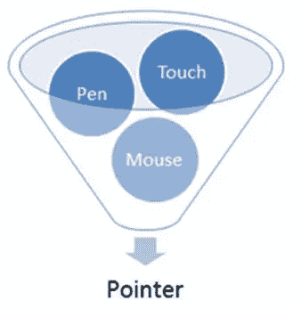
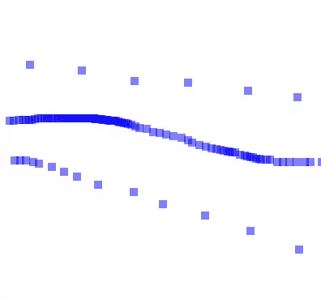
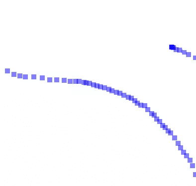
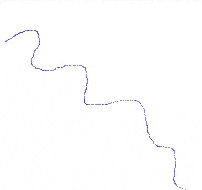
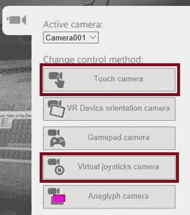
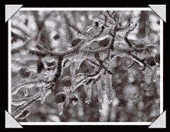
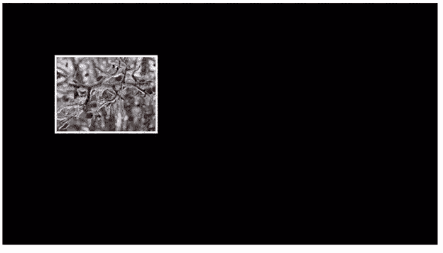
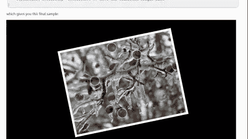

# 指针事件如何简化跨浏览器触摸支持

> 原文：<https://www.sitepoint.com/pointer-events-will-make-cross-browsers-touch-support-easy/>

本文是微软网站开发系列的一部分。感谢您对使 SitePoint 成为可能的合作伙伴的支持。

我经常收到来自开发人员的问题，比如，“*手机和平板电脑上有这么多支持触摸的设备，我该从哪里开始呢？*、*什么是最简单的触摸输入方式？*“简答:*“很复杂。”*当然，有一种更统一的方式来处理网络上的多点触摸输入——在现代的触摸浏览器中，或者作为旧浏览器的后备。在本文中，我将向您展示一些使用[指针](https://www.w3.org/TR/pointerevents/)的浏览器实验，这是一种新兴的多点触摸技术和 polyfills，使跨浏览器支持*变得不那么复杂*。这种代码您也可以在自己的站点上试验并轻松使用。

首先，许多触摸技术在网络上不断发展——为了支持浏览器，你需要看看 [iOS 触摸事件](http://developer.apple.com/library/safari/#documentation/UserExperience/Reference/TouchEventClassReference/TouchEvent/TouchEvent.html)模型和 [W3C 鼠标事件](https://www.w3.org/TR/DOM-Level-2-Events/events.html#Events-eventgroupings-mouseevents)模型，此外还有 at [MSPointers](http://blogs.msdn.com/b/ie/archive/2011/09/20/touch-input-for-ie10-and-metro-style-apps.aspx?WT.mc_id=16517-DEV-sitepoint-article53) ，以支持所有浏览器。然而，越来越多的人支持(和愿意)标准化。2012 年 9 月，微软向 W3C 提交了 [MSPointers 进行标准化](https://www.w3.org/Submission/pointer-events/)，2015 年 2 月，我们达成了 **W3C 推荐**:[https://www.w3.org/TR/pointerevents](https://www.w3.org/TR/pointerevents)。MS Open Tech 团队也发布了 Webkit 的初始指针事件原型，最近，Mozilla 宣布在 Firefox Nightly 中支持指针事件！

我试验指针事件的原因并不是基于设备份额——而是因为微软的基本输入处理方法与目前网络上的完全不同，它值得一看*会变成什么*。不同之处在于，开发人员可以编写更抽象的输入形式，称为“指针”指针可以是鼠标光标、笔、手指或多个手指在屏幕上形成的任何接触点。所以你不用浪费时间为每一种输入分别编码。

*如果你运行 IE10，你需要给 API 加上前缀或者使用我们的 polyfill 库* [*Hand.js*](http://blogs.msdn.com/b/eternalcoding/archive/2013/01/16/hand-js-a-polyfill-for-supporting-pointer-events-on-every-browser.aspx?WT.mc_id=16517-DEV-sitepoint-article53) *。你可以在这里找到带前缀的原文:* [*统一触摸和鼠标:指针事件如何让跨浏览器触摸支持变得简单*](http://www.codeproject.com/Articles/566315/Unifying-touch-and-mouse-how-Pointer-Events-will-m)

## 概念

我们将首先回顾在 Internet Explorer 11、Microsoft Edge 或 Firefox Nightly 中运行的应用程序，这些应用程序暴露了指针事件 API，然后是支持所有浏览器的解决方案。之后，我们将了解如何利用 IE/MS Edge 手势服务，帮助您轻松处理 JavaScript 代码中的触摸。由于 Windows 8.1/10 和 Windows Phone 8.1/Mobile 10 共享相同的浏览器引擎，因此这两个平台的代码和概念是相同的。此外，本文中你将在 touch 上学习的一切将帮助你在用 HTML5/JS 构建的 [Windows 商店应用](http://windowsstore.com/)中完成完全相同的任务，因为这也是正在使用的相同引擎。

指针背后的想法是让你通过一个单一的代码库，使用一个与你已经知道的经典鼠标事件相匹配的模式来寻址鼠标、笔和触摸设备。事实上，鼠标、笔和触摸有一些共同的属性:例如，你可以用它们移动指针，你可以用它们点击元素。然后让我们通过同样的代码来处理这些场景！指针将聚集这些公共属性，并以类似于鼠标事件的方式公开它们。

最明显的常见事件是: [pointerdown](http://msdn.microsoft.com/en-us/library/hh771909(v=vs.85).aspx/?WT.mc_id=16517-DEV-sitepoint-article53) ，[pointer move](http://msdn.microsoft.com/en-us/library/hh771911(v=vs.85).aspx/?WT.mc_id=16517-DEV-sitepoint-article53)&[pointer up](http://msdn.microsoft.com/en-us/library/hh771914(v=vs.85).aspx/?WT.mc_id=16517-DEV-sitepoint-article53)，它们直接映射到鼠标事件等价物。您将得到屏幕的 X & Y 坐标作为输出。

你也有特定的事件，比如:[指针探测器](http://msdn.microsoft.com/en-us/library/hh771913(v=vs.85).aspx/?WT.mc_id=16517-DEV-sitepoint-article53)、[指针探测器](http://msdn.microsoft.com/en-us/library/hh771912(v=vs.85).aspx/?WT.mc_id=16517-DEV-sitepoint-article53)或[指针探测器取消](http://msdn.microsoft.com/en-us/library/hh846776(v=vs.85).aspx/?WT.mc_id=16517-DEV-sitepoint-article53)



但是当然，在某些情况下，您可能希望以不同于默认鼠标行为的方式来处理触摸，以提供不同的 UX。此外，由于多点触摸屏，您可以轻松地让用户旋转、缩放或平移一些元素。笔/手写笔甚至可以为你提供一些鼠标无法提供的压力信息。指针事件仍将汇总这些差异，并允许您为每个设备的细节构建一些自定义代码。

**<u>注意:</u>** 如果你在 Windows 8.1/10 设备上当然有触摸屏，或者如果你使用的是 Windows Phone 8+的话，测试以下嵌入式样本会更好。不过，你可以有一些选择:

1.  通过使用免费的 Visual Studio 2013/2015 Express 开发工具附带的 Windows 8.1/10 模拟器获得初级体验。关于如何工作的更多细节，请阅读本文:[使用 Windows 8 模拟器& VS 2012 调试 IE10 触摸事件&您的响应式设计](http://blogs.msdn.com/b/davrous/archive/2012/07/10/using-the-windows-8-simulator-amp-vs-2012-to-debug-the-ie10-touch-events-amp-your-responsive-design.aspx?WT.mc_id=16517-DEV-sitepoint-article53)。
2.  看看这篇文章末尾还有其他格式的视频。[视频在一台支持触摸、笔&鼠标的 Windows 8 平板电脑上演示了以下所有样本](https://david.blob.core.windows.net/videos/MSPointerEventsArticleVideo.mp4/?WT.mc_id=16517-DEV-sitepoint-article53)。
3.  如果您无法访问 Windows 8 设备或[下载我们的虚拟机](http://dev.modern.ie/tools/vms/windows/?utm_source=SitePoint&utm_medium=article53&utm_campaign=SitePoint)，请使用虚拟交叉浏览测试服务，如 [BrowserStack](http://browserstack.com/) 进行交互式测试。

## 处理简单的触摸事件

### 步骤 1:在 JS 中不做任何事情，但是添加一行 CSS

让我们从基础开始。您可以轻松地使用任何现有的处理鼠标事件的 JavaScript 代码，它将在 Internet Explorer 10/11 和 MS Edge 中使用一些笔或触摸设备按原样工作。如果你不在代码中处理指针事件，IE 和 MS Edge 确实会把触发鼠标事件作为最后的手段。这就是为什么，你可以用手指“点击”按钮或任何网页的任何元素，即使开发者从未想过有一天有人会这样做。因此，任何注册到 mousedown 和/或 mouseup 事件的代码都可以工作，根本不需要修改。但是 mousemove 呢？

让我们回顾一下默认行为来回答这个问题。例如，让我们看看这段代码:

```
<!DOCTYPE html>
<html>
<head>
    <title>Touch article sample 1</title>
</head>
<body>
    <canvas id="drawSurface" width="400px" height="400px" style="border: 1px dashed black;">
    </canvas>
    <script> var canvas = document.getElementById("drawSurface");
        var context = canvas.getContext("2d");
        context.fillStyle = "rgba(0, 0, 255, 0.5)";

        canvas.addEventListener("mousemove", paint, false);

        function paint(event) {
            context.fillRect(event.clientX, event.clientY, 10, 10);
        } </script>
</body>
</html>
```

它只是通过跟踪鼠标的移动，在 HTML5 canvas 元素中绘制一些 10px 乘 10px 的蓝色正方形。要测试它，在盒子里移动你的鼠标。如果您有触摸屏，尝试与画布互动，自己检查当前行为:


*示例 0:如果你什么都不做的默认行为
结果:只有鼠标按下/向上/点击才能与触摸一起工作*

[此处提供互动示例](http://blogs.msdn.com/b/davrous/archive/2015/08/10/handling-touch-in-your-html5-apps-thanks-to-the-pointer-events-of-ie10-and-windows-8.aspx?WT.mc_id=16517-DEV-sitepoint-article53)

您将会看到，当您在 canvas 元素中移动鼠标时，它会绘制一些蓝色方块。但是使用 touch，它只会在你点击画布元素的准确位置绘制一个独特的正方形。一旦您尝试在 canvas 元素中移动手指，浏览器将尝试在页面内平移，因为这是正在定义的默认行为。

然后，您需要指定您想要覆盖浏览器的默认行为，并告诉它将触摸事件重定向到您的 JavaScript 代码，而不是试图解释它。为此，将页面中不应再对默认行为做出反应的元素作为目标，并对它们应用 CSS 规则:

```
touch-action: auto | none | pan-x | pan-y;
```

根据您想过滤或不想过滤的内容，您可以使用不同的值。你会发现 W3C 规范中描述的 IE11、MS Edge 和 Firefox Nightly 的值:[触摸操作 css 属性](https://www.w3.org/TR/pointerevents/#the-touch-action-css-property)和 IE10: [构建触摸友好网站的指南](http://blogs.msdn.com/b/ie/archive/2012/04/20/guidelines-for-building-touch-friendly-sites.aspx?WT.mc_id=16517-DEV-sitepoint-article53)

经典的用例是当你的页面中有一个地图控件时。您希望让用户在地图区域内平移和缩放，但在页面的其余部分保持默认行为。在这种情况下，您将只在公开地图的 HTML 容器上应用这个 CSS 规则。

在我们的例子中，添加这个 CSS 块:

```
 #drawSurface {
  touch-action: none; /* Disable touch behaviors, like pan and zoom */
} 
```

现在产生了这个结果:



*样本 1:* 刚添加**触摸动作:无**
结果:默认浏览器平移禁用，**鼠标移动可用，但只能用一个手指**

[此处提供互动示例](http://blogs.msdn.com/b/davrous/archive/2015/08/10/handling-touch-in-your-html5-apps-thanks-to-the-pointer-events-of-ie10-and-windows-8.aspx?WT.mc_id=16517-DEV-sitepoint-article53)

**<u>如果测试为 IE :</u>** 这里使用前缀版本。微软 Edge 支持最新版本，你可以随时使用其他现代浏览器查询网络平台状态

现在，当您在画布元素中移动手指时，它的行为类似于鼠标指针。太酷了！但是你会很快问自己这个问题:为什么这个代码只跟踪一个手指？嗯，这是因为我们正在做 IE 和 MS Edge 提供非常基本的触摸体验的最后一件事:映射你的一个手指来模拟鼠标。据我所知，我们一次只用一只鼠标。所以一个鼠标===一个手指最大使用这种方法。那么，如何处理多点触摸事件呢？

### 步骤 2:使用指针事件代替鼠标事件

使用您现有的任何代码，将您的“mousedown/up/move”注册替换为“pointerdown/up/move”(或 IE10 中的“MSPointerDown/Up/Move”)，您的代码将直接支持启用指针事件的浏览器中的多点触摸体验！

例如，在前面的示例中，更改这行代码:

```
canvas.addEventListener("mousemove", paint, false);
```

对这一个:

```
canvas.addEventListener("pointermove", paint, false);
```

你会得到这样的结果:



*样本 2:* 用指针移动代替鼠标移动
结果:多点触摸有效

[此处提供互动示例](http://blogs.msdn.com/b/davrous/archive/2015/08/10/handling-touch-in-your-html5-apps-thanks-to-the-pointer-events-of-ie10-and-windows-8.aspx?WT.mc_id=16517-DEV-sitepoint-article53)

**<u>如果测试为 IE:</u>** 这里使用前缀版本。微软 Edge 支持最新版本，你可以随时[和其他现代浏览器一起查询网络平台状态](https://dev.modern.ie/platform/status/pointerevents/?utm_source=SitePoint&utm_medium=article53&utm_campaign=SitePoint)。

现在，您可以根据屏幕支持的触摸点绘制任意多的方块系列！更好的是，同样的代码适用于触摸、鼠标和笔。这意味着，举例来说，你可以用你的鼠标画一些线，同时用你的手指画其他的线。

如果您想根据输入类型更改代码的行为，可以通过 pointerType 属性值进行测试。例如，让我们想象我们想要为手指画一些 10px 乘 10px 的红色方块，为钢笔画 5px 乘 5px 的绿色方块，为鼠标画 2px 乘 2px 的蓝色方块。您需要用这个处理程序替换前面的处理程序(paint 函数):

```
function paint(event) {
    if (event.pointerType) {
        switch (event.pointerType) {
            case "touch":
                // A touchscreen was used
                // Drawing in red with a square of 10
                context.fillStyle = "rgba(255, 0, 0, 0.5)";
                squaresize = 10;
                break;
            case "pen":
                // A pen was used
                // Drawing in green with a square of 5
                context.fillStyle = "rgba(0, 255, 0, 0.5)";
                squaresize = 5;
                break;
            case "mouse":
                // A mouse was used
                // Drawing in blue with a squre of 2
                context.fillStyle = "rgba(0, 0, 255, 0.5)";
                squaresize = 2;
                break;
        }

        context.fillRect(event.clientX, event.clientY, squaresize, squaresize);
    }
}
```

你可以在这里测试结果:


*示例 2b:* 测试**指针类型**以测试触摸/笔或鼠标
结果:您可以更改**鼠标/笔/触摸的行为**但是从 2a 开始**代码现在只有*在支持指针事件的浏览器中工作***

[此处提供互动示例](http://blogs.msdn.com/b/davrous/archive/2015/08/10/handling-touch-in-your-html5-apps-thanks-to-the-pointer-events-of-ie10-and-windows-8.aspx?WT.mc_id=16517-DEV-sitepoint-article53)

**<u>如果为 IE 测试:</u>** 这里测试前缀版本。微软 Edge 支持最新版本，你可以随时[和其他现代浏览器一起查询网络平台状态](https://dev.modern.ie/platform/status/pointerevents/?utm_source=SitePoint&utm_medium=article53&utm_campaign=SitePoint)。

如果你足够幸运地拥有一台支持 3 种输入类型的设备(像*索尼 Duo 11、**微软 Surface Pro* 或*三星平板电脑*)，你将能够看到基于输入类型的三种绘图。很棒，不是吗？

尽管如此，这段代码还是有一个问题。它现在可以在支持指针事件的浏览器中正确处理所有类型的输入，但在其他浏览器中根本无法工作，如 IE9、Chrome、Opera & Safari。

### 步骤 3:进行特征检测以提供回退代码

您可能已经意识到，处理多浏览器支持的最佳方法是进行特性检测。在我们的例子中，您需要测试这个:

```
window.PointerEvent
```

注意这只是告诉你当前的浏览器是否支持指针。它没有告诉你是否支持触摸。要测试是否支持触摸，需要检查 [maxTouchPoints](https://www.w3.org/TR/pointerevents/#widl-Navigator-maxTouchPoints) 。

总之，要让代码支持指针并在其他浏览器中正确地回退到鼠标事件，您需要这样的代码:

```
var canvas = document.getElementById("drawSurface");
var context = canvas.getContext("2d");
context.fillStyle = "rgba(0, 0, 255, 0.5)";
if (window.PointerEvent) {
    // Pointer events are supported.
    canvas.addEventListener("pointermove", paint, false);
}
else {
    canvas.addEventListener("mousemove", paint, false);
}

function paint(event) {
    var squaresize = 2;
    if (event.pointerType) {
        switch (event.pointerType) {
            case "touch":
                // A touchscreen was used
                // Drawing in red with a square of 10
                context.fillStyle = "rgba(255, 0, 0, 0.5)";
                squaresize = 10;
                break;
            case "pen":
                // A pen was used
                // Drawing in green with a square of 5
                context.fillStyle = "rgba(0, 255, 0, 0.5)";
                squaresize = 5;
                break;
            case "mouse":
                // A mouse was used
                // Drawing in blue with a square of 2
                context.fillStyle = "rgba(0, 0, 255, 0.5)";
                squaresize = 2;
                break;
        }
    }

    context.fillRect(event.clientX, event.clientY, squaresize, squaresize);
}
```

你也可以在这里测试结果:



*样本 3:* 特征检测**指针事件**提供回退
结果:IE11/MS Edge 中的完整体验& Firefox Nightly 和**其他浏览器中的默认鼠标事件**

[此处提供互动示例](http://blogs.msdn.com/b/davrous/archive/2015/08/10/handling-touch-in-your-html5-apps-thanks-to-the-pointer-events-of-ie10-and-windows-8.aspx?WT.mc_id=16517-DEV-sitepoint-article53)

**<u>如果测试为 IE:</u>** 前缀版本[此处](https://david.blob.core.windows.net/html5/touchsample5.htm/?WT.mc_id=16517-DEV-sitepoint-article53)。微软 Edge 支持最新版本，你可以随时[和其他现代浏览器一起查询网络平台状态](https://dev.modern.ie/platform/status/pointerevents/?utm_source=SitePoint&utm_medium=article53&utm_campaign=SitePoint)。

### 步骤 4:支持所有触摸实现

如果你想更进一步，支持所有浏览器和所有触摸实现，你有两个选择:

1.  编写代码来并行处理这两个事件模型，就像本文中所描述的:[在所有浏览器中处理多点触摸和鼠标输入](http://blogs.msdn.com/b/ie/archive/2011/10/19/handling-multi-touch-and-mouse-input-in-all-browsers.aspx?WT.mc_id=16517-DEV-sitepoint-article53)
2.  只需添加一个对 HandJS 的引用，这是我的朋友 David Catuhe 编写的非常棒的 JavaScript polyfill 库，就像他在文章中描述的一样: [HandJS 是一个 polyfill，用于支持每个浏览器上的指针事件](http://blogs.msdn.com/b/eternalcoding/archive/2013/01/16/hand-js-a-polyfill-for-supporting-pointer-events-on-every-browser.aspx?WT.mc_id=16517-DEV-sitepoint-article53)

David 写了一个很酷的小库，让你可以利用指针事件规范编写代码。正如我在本文介绍中提到的，微软最近 [](http://blogs.msdn.com/b/ie/archive/2012/09/24/towards-interoperable-pointer-events-evolving-input-events-for-multiple-devices.aspx?WT.mc_id=16517-DEV-sitepoint-article53) [向 W3C](http://blogs.msdn.com/b/ie/archive/2012/09/24/towards-interoperable-pointer-events-evolving-input-events-for-multiple-devices.aspx?WT.mc_id=16517-DEV-sitepoint-article53) 提交了 MSPointer Events 规范进行标准化。W3C 成立了一个新的工作组，并且已经公布了基于微软提议的 W3C 推荐标准[。MS Open Tech 团队还发布了 Webkit](https://www.w3.org/TR/pointerevents/) 的[初始指针事件原型，你可能会感兴趣。](http://blogs.msdn.com/b/interoperability/archive/2012/12/18/open-source-release-from-ms-open-tech-pointer-events-initial-prototype-for-webkit.aspx?WT.mc_id=16517-DEV-sitepoint-article53)

虽然指针事件规范还不是一个标准，但是你仍然可以利用 [David 的 Polyfill](http://blogs.msdn.com/b/eternalcoding/archive/2013/01/16/hand-js-a-polyfill-for-supporting-pointer-events-on-every-browser.aspx?WT.mc_id=16517-DEV-sitepoint-article53) 来实现支持它的代码，并为指针事件成为所有现代浏览器中实现的标准做好准备。通过 David 的库，事件将被传播到 IE10 上的 MSPointer，传播到基于 Webkit 的浏览器上的 Touch 事件，最后传播到鼠标事件。在 Internet Explorer 11、MS Edge 和 Firefox Nightly 中，它将被简单地禁用，因为它们实现了 W3C 规范的最新版本。太酷了。查看他的文章，发现并理解它是如何工作的。请注意，这个 polyfill 对于支持老式浏览器优雅地回退到鼠标事件也非常有用。

要想知道如何使用这个库，请看看这篇文章:[借助 Hand 创建一个适用于所有触摸模式的通用虚拟触摸操纵杆。JS](http://blogs.msdn.com/b/davrous/archive/2013/02/16/creating-an-universal-virtual-touch-joystick-working-for-all-touch-models-thanks-to-hand-js.aspx/?WT.mc_id=16517-DEV-sitepoint-article53) 向你展示了如何使用指针事件编写一个虚拟触摸操纵杆。多亏了 HandJS，它可以在 IE10 上运行，在 Windows 8/RT、Windows Phone 8、iPad/iPhone & Android 设备上运行，代码基础完全相同！

我们也在我们的 **WebGL 开源 3d 引擎**:【http://www.babylonjs.com/】T2 中使用 Hand.js。在兼容 WebGL 的浏览器中启动一个场景，并在控制面板中将摄像机切换到“触摸摄像机”进行单点触摸控制，或者切换到“虚拟操纵杆摄像机”使用两个拇指:



由于手指的力量，你将能够进入 3D 世界！

## 识别简单的手势

现在我们已经了解了如何处理多点触摸，让我们看看如何识别简单的手势，如点击或按住元素，然后是一些更高级的手势，如平移或缩放元素。

谢天谢地，IE10/11 和 MS Edge 提供了一个`MSGesture`对象来帮助我们。注意，这个对象目前是特定于 IE 和 MS Edge 的，而不是 W3C 规范的一部分。结合 IE11 中的 [MSCSSMatrix](http://msdn.microsoft.com/en-us/library/windows/apps/hh453593.aspx/?WT.mc_id=16517-DEV-sitepoint-article53) 元素(MS Edge 更倾向于使用 [WebKitCSSMatrix](http://developer.apple.com/library/safari/#documentation/AudioVideo/Reference/WebKitCSSMatrixClassReference/WebKitCSSMatrix/WebKitCSSMatrix.html) one)，你会发现你可以用非常简单的方式构建非常有趣的多点触控体验。`CSSMatrix`实际上代表了一个 4×4 的同质矩阵，支持文档对象模型(DOM)脚本访问 CSS 二维和三维转换功能。但是在玩那个之前，让我们从基础开始。

基本概念是**首先注册指针向下**。然后在处理 pointerdown 的处理程序中，您需要**选择** **您想要将哪些指针发送到 MSGesture 对象**以让它检测特定的手势。然后它将触发其中一个事件: [**MSGestureTap**](http://msdn.microsoft.com/en-us/library/hh771901(v=vs.85).aspx/?WT.mc_id=16517-DEV-sitepoint-article53) ，[**MSGestureHold**](http://msdn.microsoft.com/en-us/library/hh771894(v=vs.85).aspx/?WT.mc_id=16517-DEV-sitepoint-article53)，[**MSGestureStart**](http://msdn.microsoft.com/en-us/library/hh771898(v=vs.85).aspx/?WT.mc_id=16517-DEV-sitepoint-article53)，[**MSGestureChange**](http://msdn.microsoft.com/en-us/library/hh771887(v=vs.85).aspx/?WT.mc_id=16517-DEV-sitepoint-article53)， [`MSGestureEnd`](http://msdn.microsoft.com/en-us/library/hh771892(v=vs.85).aspx/?WT.mc_id=16517-DEV-sitepoint-article53) ，`MSInertiaStart`。MSGesture 对象然后将所有提交的指针作为输入参数，并在它们上面应用手势识别器，以提供一些格式化的数据作为输出。你唯一需要做的就是选择/过滤你想让哪些指针成为手势的一部分(基于它们的 ID，屏幕上的坐标，等等)。在那之后，`MSGesture`物体将为你完成所有的魔法。

### 示例 1:处理保持手势

我们将看到如何保存一个元素(一个简单的 div，包含一个图像作为背景)。一旦元素将被持有，我们将添加一些角落，以表明用户他目前已经选择了这个元素。将通过动态创建四个添加到图像每个角上的 div 来生成角。最后，一些 CSS 技巧会以一种巧妙的方式使用变换和线性渐变来获得如下结果:



顺序如下:

1.  注册您感兴趣的 HTML 元素上的 pointer down &[mspointer hold](http://msdn.microsoft.com/en-us/library/hh771894(v=vs.85).aspx/?WT.mc_id=16517-DEV-sitepoint-article53)事件
2.  创建一个`MSGesture`对象，它将指向这个完全相同的 HTML 元素
3.  在`pointerdown`处理程序中，向`MSGesture`对象添加您想要监控的各种指针 ID(根据您想要实现的目标，所有指针 id 或它们的子集)
4.  在`MSPointerHold`事件处理程序中，检查用户是否刚刚开始保持手势(`MSGESTURE_FLAG_BEGIN`标志)。如果是，添加角。如果没有，请删除它们。

这导致了下面的代码:

```
<!DOCTYPE html>
<html>
<head>
    <title>Touch article sample 5: simple gesture handler</title>
    <link rel="stylesheet" type="text/css" href="toucharticle.css" />
    <script src="Corners.js"></script>
</head>
<body>
    <div id="myGreatPicture" class="container" />
    <script> var myGreatPic = document.getElementById("myGreatPicture");
        // Creating a new MSGesture that will monitor the myGreatPic DOM Element
        var myGreatPicAssociatedGesture = new MSGesture();
        myGreatPicAssociatedGesture.target = myGreatPic;

        // You need to first register to pointerdown to be able to
        // have access to more complex Gesture events
        myGreatPic.addEventListener("pointerdown", pointerdown, false);
        myGreatPic.addEventListener("MSGestureHold", holded, false);

        // Once pointer down raised, we're sending all pointers to the MSGesture object
        function pointerdown(event) {
            myGreatPicAssociatedGesture.addPointer(event.pointerId);
        }

        // This event will be triggered by the MSGesture object
        // based on the pointers provided during the MSPointerDown event
        function holded(event) {
            // The gesture begins, we're adding the corners
            if (event.detail === event.MSGESTURE_FLAG_BEGIN) {
                Corners.append(myGreatPic);
            }
            else {
                // The user has released his finger, the gesture ends
                // We're removing the corners
                Corners.remove(myGreatPic);
            }
        }

        // To avoid having the equivalent of the contextual 
        // "right click" menu being displayed on the MSPointerUp event, 
        // we're preventing the default behavior
        myGreatPic.addEventListener("contextmenu", function (e) {
            e.preventDefault();    // Disables system menu
        }, false); </script>
</body>
</html>
```

这是结果:


**<u>如果测试为 IE:</u>** 前缀版本的指针[这里](https://david.blob.core.windows.net/html5/touchsample6.html/?WT.mc_id=16517-DEV-sitepoint-article53)。微软 Edge 支持最新版本，你可以随时[和其他现代浏览器一起查询网络平台状态](https://dev.modern.ie/platform/status/pointerevents/?utm_source=SitePoint&utm_medium=article53&utm_campaign=SitePoint)。

尝试点击或鼠标点击元素，没有任何反应。仅用一个手指触摸并保持在图像上，或者用鼠标在图像上长时间点击，角就会出现。松开手指，边角消失。

触摸&在图像上保持两个或更多的手指，因为保持手势只有在一个唯一的手指保持该元素时才会被触发，所以什么也不会发生。

**<u>注:</u>** 通过`toucharticle.css`中定义的 CSS 设置白边、边角和背景图像。`Corners.js`简单地创建四个 div(使用 append 函数),并用适当的 CSS 类将它们放在主元素的顶部。

尽管如此，我对目前的结果还是有些不满意。一旦你拿着照片，只要你稍微动一下手指，`MSGESTURE_FLAG_CANCEL`旗就会升起并被处理程序抓住，处理程序会移除边角。我宁愿只有当用户在图片上方的任何地方松开手指，或者当他将手指移出图片限定的框时，才移除角。为此，我们将只移除`pointerup`或`pointerout`上的拐角。这将给出以下代码:

```
var myGreatPic = document.getElementById("myGreatPicture");
// Creating a new MSGesture that will monitor the myGreatPic DOM Element
var myGreatPicAssociatedGesture = new MSGesture();
myGreatPicAssociatedGesture.target = myGreatPic;

// You need to first register to pointerdown to be able to
// have access to more complex Gesture events
myGreatPic.addEventListener("pointerdown", pointerdown, false);
myGreatPic.addEventListener("MSGestureHold", holded, false);
myGreatPic.addEventListener("pointerup", removecorners, false);
myGreatPic.addEventListener("pointerout", removecorners, false);

// Once touched, we're sending all pointers to the MSGesture object
function pointerdown(event) {
    myGreatPicAssociatedGesture.addPointer(event.pointerId);
}

// This event will be triggered by the MSGesture object
// based on the pointers provided during the pointerdown event
function holded(event) {
    // The gesture begins, we're adding the corners
    if (event.detail === event.MSGESTURE_FLAG_BEGIN) {
        Corners.append(myGreatPic);
    }
}

// We're removing the corners on pointer Up or Out
function removecorners(event) {
    Corners.remove(myGreatPic);
}

// To avoid having the equivalent of the contextual 
// "right click" menu being displayed on the pointerup event, 
// we're preventing the default behavior
myGreatPic.addEventListener("contextmenu", function (e) {
    e.preventDefault();    // Disables system menu
}, false);
```

它现在提供了我一直在寻找的行为:


**<u>如果测试为 IE:</u>** 测试用无前缀版本的指针[这里](https://david.blob.core.windows.net/html5/touchsample6b.html/?WT.mc_id=16517-DEV-sitepoint-article53)。微软 Edge 支持最新版本，你可以随时[和其他现代浏览器一起查询网络平台状态](https://dev.modern.ie/platform/status/pointerevents/?utm_source=SitePoint&utm_medium=article53&utm_campaign=SitePoint)。

### 示例 2:处理缩放、平移和旋转

最后，如果你想缩放、平移或旋转一个元素，你只需要写几行代码。你需要首先注册到 [MSGestureChange](http://msdn.microsoft.com/en-us/library/hh771887(v=vs.85).aspx/?WT.mc_id=16517-DEV-sitepoint-article53) 事件。该事件将通过 [MSGestureEvent 对象](http://msdn.microsoft.com/en-us/library/hh772076(v=vs.85).aspx/?WT.mc_id=16517-DEV-sitepoint-article53)文档中描述的各种属性发送给你，比如当前应用于 HTML 元素的[旋转](http://msdn.microsoft.com/en-us/library/hh772363(v=vs.85).aspx/?WT.mc_id=16517-DEV-sitepoint-article53)、[缩放](http://msdn.microsoft.com/en-us/library/hh772082(v=vs.85).aspx)、[翻译](http://msdn.microsoft.com/en-us/library/hh772083(v=vs.85).aspx/?WT.mc_id=16517-DEV-sitepoint-article53)、[翻译](http://msdn.microsoft.com/en-us/library/hh772085(v=vs.85).aspx/?WT.mc_id=16517-DEV-sitepoint-article53)。

更好的是，默认情况下，MSGesture 对象免费提供惯性算法。这意味着您可以用手指将 HTML 元素放到屏幕上，动画就会自动处理。

最后，为了反映 MSGesture 发送的这些更改，您需要相应地移动元素。最简单的方法是应用一些 CSS 转换来映射旋转、缩放、平移细节，以匹配您的手指手势。为此，使用 [MSCSSMatrix](http://msdn.microsoft.com/en-us/library/windows/apps/hh453593.aspx/?WT.mc_id=16517-DEV-sitepoint-article53) 元素。

总之，如果您想处理前面示例中的所有这些很酷的手势，请像这样注册该事件:

```
myGreatPic.addEventListener("MSGestureChange", manipulateElement, false);
```

并使用以下处理程序:

```
function manipulateElement(e) {
    // Uncomment the following code if you want to disable the built-in inertia provided by dynamic gesture recognition
    // if (e.detail == e.MSGESTURE_FLAG_INERTIA)
    // return;

    var m;
    if (window.WebKitCSSMatrix) {
        // Get the latest CSS transform on the element in MS Edge 
        m = new WebKitCSSMatrix(window.getComputedStyle(myGreatPic, null).transform); 
    }
    else if (window.MSCSSMatrix) {
        // Get the latest CSS transform on the element in IE11 
        m = new MSCSSMatrix(window.getComputedStyle(myGreatPic, null).transform);
    }
    if (m) {
        e.target.style.transform = m
        .translate(e.offsetX, e.offsetY) // Move the transform origin under the center of the gesture
        .rotate(e.rotation * 180 / Math.PI) // Apply Rotation
        .scale(e.scale) // Apply Scale
        .translate(e.translationX, e.translationY) // Apply Translation
        .translate(-e.offsetX, -e.offsetY); // Move the transform origin back
    }
}
```

这给了你最后一个样本:



**<u>如果测试 IE:</u>** 这里用前缀版本的指针测试:[https://David . blob . core . windows . net/html 5/touch sample 7 . html/](https://david.blob.core.windows.net/html5/touchsample7.html/?WT.mc_id=16517-DEV-sitepoint-article53)<u>。</u>微软 Edge 支持最新版本，你可以随时[和其他现代浏览器一起查询网络平台状态](https://dev.modern.ie/platform/status/pointerevents/?utm_source=SitePoint&utm_medium=article53&utm_campaign=SitePoint)。

尝试用一个或多个手指将图像移动并扔进黑色区域。尝试用两个或更多手指缩放或旋转元素。结果非常棒，代码非常简单，因为所有的复杂性都由 IE / MS Edge 本机处理。

### 所有样品的视频和直接链接

如果你没有 IE / MS Edge 的触摸屏体验，并且你想知道这些样本是如何工作的，可以看看这个视频，我在这个视频中描述了本文中在三星 BUILD2011 平板电脑上共享的所有样本:
【编辑团队:请用下面的嵌入视频替换下面的占位符截图:[https://David . blob . core . windows . net/videos/mspointereventsarticlevideo . MP4](https://david.blob.core.windows.net/videos/MSPointerEventsArticleVideo.mp4)



你也可以在这里看到它们:

–[简单触摸示例 0，未执行任何操作](https://david.blob.core.windows.net/html5/touchsample1.htm/?WT.mc_id=16517-DEV-sitepoint-article53)
–[简单触摸示例 1，具有 CSS 触摸动作](https://david.blob.core.windows.net/html5/PECR/touchsample2.htm/?WT.mc_id=16517-DEV-sitepoint-article53)
–[简单触摸示例 2a，具有基本指针移动实现](https://david.blob.core.windows.net/html5/PECR/touchsample3.htm/?WT.mc_id=16517-DEV-sitepoint-article53)
–[简单触摸示例 2b，具有指针类型区分](https://david.blob.core.windows.net/html5/PECR/touchsample4.htm/?WT.mc_id=16517-DEV-sitepoint-article53)
–[简单触摸示例 3，具有指针和鼠标回退](https://david.blob.core.windows.net/html5/PECR/touchsample5.htm/?WT.mc_id=16517-DEV-sitepoint-article53)
–[ms 手势示例 1: MSGestureHold 处理程序](https://david.blob.core.windows.net/html5/PECR/touchsample6.html/?WT.mc_id=16517-DEV-sitepoint-article53)
–[ms 手势](https://david.blob.core.windows.net/html5/PECR/touchsample6b.html/?WT.mc_id=16517-DEV-sitepoint-article53)

### 相关资源:

–[W3C 指针事件规范](https://www.w3.org/TR/pointerevents/)
–[在所有浏览器中处理多点触摸和鼠标输入](http://blogs.msdn.com/b/ie/archive/2011/10/19/handling-multi-touch-and-mouse-input-in-all-browsers.aspx?WT.mc_id=16517-DEV-sitepoint-article53):未来应该会帮助很多开发者的 polyfill 库
–[指针和手势事件](http://msdn.microsoft.com/en-us/library/hh673557(v=vs.85).aspx/?WT.mc_id=16517-DEV-sitepoint-article53)
–[超越平移、缩放、 点击使用手势事件](http://blogs.msdn.com/b/ie/archive/2012/06/20/go-beyond-pan-zoom-and-tap-using-gesture-events.aspx?WT.mc_id=16517-DEV-sitepoint-article53)
–[IE 试驾浏览器 Surface](http://ie.microsoft.com/testdrive/Browser/BrowserSurface/?WT.mc_id=16517-DEV-sitepoint-article53) ，这极大地激发了许多嵌入式演示
–尝试 IE10/11 & MS Edge 中的一些令人敬畏的游戏与触摸:
–[Contre Jour](http://www.contrejour.ie/?WT.mc_id=16517-DEV-sitepoint-article53)并阅读一篇非常有趣的[幕后](http://www.contrejour.ie/BehindTheScenes.html/?WT.mc_id=16517-DEV-sitepoint-article53)文章
–[雅达利街机游戏](http://atari.com/arcade)并阅读这篇非常有价值的文章:[用
–构建会话 3-140 的记录:](http://atari.com/arcade/developers/building-atari-createjs)[触摸屏、手写笔和鼠标，天哪！](http://channel9.msdn.com/Events/Build/2012/3-140/?WT.mc_id=16517-DEV-sitepoint-article53)

从逻辑上讲，有了本文分享的所有细节和其他资源的相关链接，**您现在就可以在您的网站** & Windows 应用商店应用中实现指针事件模型了。然后，您将有机会轻松增强您的用户在 Internet Explorer 10/11、Microsoft Edge 以及即将推出的每个 Firefox 用户中的体验！

## JavaScript 的更多实践

这篇文章是微软技术倡导者的 web 开发系列的一部分，内容涉及实用的 JavaScript 学习、开源项目和互操作性最佳实践，包括[微软 Edge](http://blogs.windows.com/msedgedev/2015/05/06/a-break-from-the-past-part-2-saying-goodbye-to-activex-vbscript-attachevent/?WT.mc_id=16517-DEV-sitepoint-article53) 浏览器和新的 [EdgeHTML 渲染引擎](http://blogs.windows.com/msedgedev/2015/02/26/a-break-from-the-past-the-birth-of-microsofts-new-web-rendering-engine/?WT.mc_id=16517-DEV-sitepoint-article53)。

我们鼓励您使用 [dev.modern.IE](http://dev.modern.ie/tools/?utm_source=SitePoint&utm_medium=article53&utm_campaign=SitePoint) 上的免费工具跨浏览器和设备进行测试，包括 Windows 10 的默认浏览器 Microsoft Edge:

*   [扫描你的网站，寻找过时的库、布局问题和可访问性](http://dev.modern.ie/tools/staticscan/?utm_source=SitePoint&utm_medium=article53&utm_campaign=SitePoint)
*   [在 Mac、Linux 和 Windows 上使用虚拟机](http://dev.modern.ie/tools/vms/windows/?utm_source=SitePoint&utm_medium=article53&utm_campaign=SitePoint)
*   [在您自己的设备上远程测试 Microsoft Edge](https://remote.modern.ie/?utm_source=SitePoint&utm_medium=article53&utm_campaign=SitePoint)
*   [GitHub 编码实验室:跨浏览器测试和最佳实践](https://github.com/deltakosh/interoperable-web-development/?WT.mc_id=16517-DEV-sitepoint-article53)

来自我们的工程师和布道者的关于 Microsoft Edge 和 Web 平台的深入技术学习:

*   【2015 年微软 Edge 网络峰会(对新浏览器、新支持的网络平台标准以及来自 JavaScript 社区的演讲嘉宾有何期待)
*   哇，我可以在 Mac 电脑上测试 Edge & IE 浏览器& Linux！(来自雷伊·班戈)
*   [在不破坏网络的情况下推进 JavaScript】(来自 Christian Heilmann)](http://channel9.msdn.com/Events/WebPlatformSummit/2015/Advancing-JavaScript-without-breaking-the-web/?WT.mc_id=16517-DEV-sitepoint-article53)
*   使网络正常工作的边缘渲染引擎(Jacob Rossi)
*   [用 WebGL](https://channel9.msdn.com/Events/WebPlatformSummit/2015/Unleash-3D-rendering-with-WebGL-and-Microsoft-Edge/?WT.mc_id=16517-DEV-sitepoint-article53) 释放 3D 渲染(来自 David Catuhe，包括 [JS](http://vorlonjs.com/?WT.mc_id=16517-DEV-sitepoint-article53) 和 [babylonJS](http://babylonjs.com/?WT.mc_id=16517-DEV-sitepoint-article53) 项目)
*   [托管网络应用和网络平台创新](https://channel9.msdn.com/Events/WebPlatformSummit/2015/Hosted-web-apps-and-web-platform-innovations/?WT.mc_id=16517-DEV-sitepoint-article53)(来自律师奶爸和基里尔·赛克谢诺夫，包括 [JS](http://manifold.js.com/?WT.mc_id=16517-DEV-sitepoint-article53) 项目)

更多面向网络平台的免费跨平台工具和资源:

*   [适用于 Linux、MacOS 和 Windows 的 Visual Studio 代码](https://code.visualstudio.com/?WT.mc_id=16517-DEV-sitepoint-article53)
*   [用节点编码。JS](https://www.microsoftvirtualacademy.com/en-US/training-courses/building-apps-with-node-js-jump-start-8422/?WT.mc_id=16517-DEV-sitepoint-article53) 和[在 Azure 上免费试用](https://azure.microsoft.com/en-us/pricing/free-trial/?WT.mc_id=16517-DEV-sitepoint-article53)

## 分享这篇文章