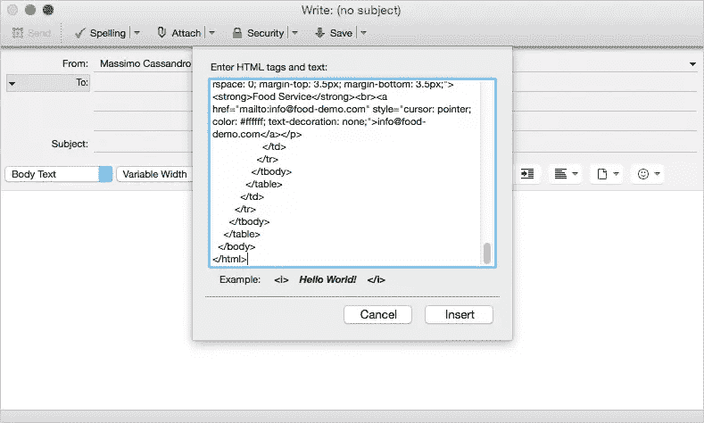
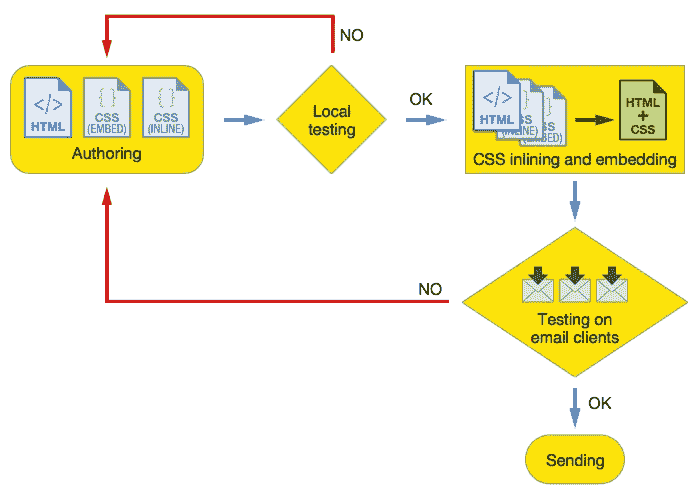
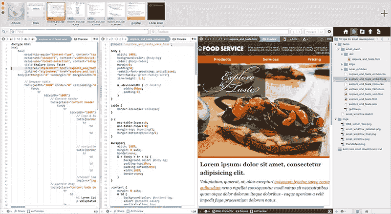
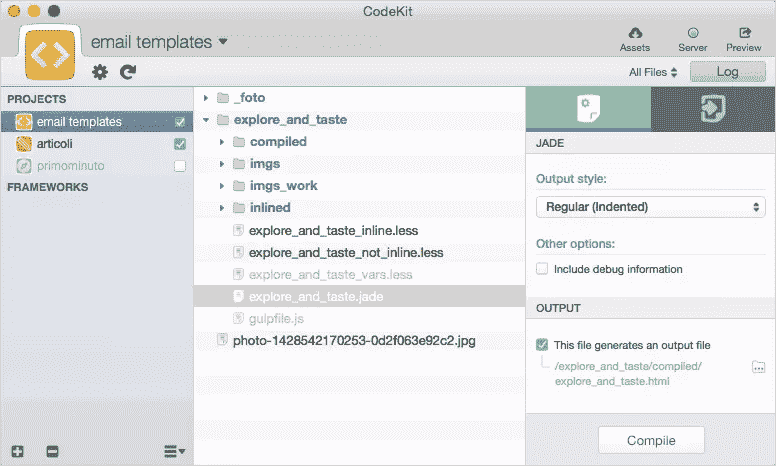
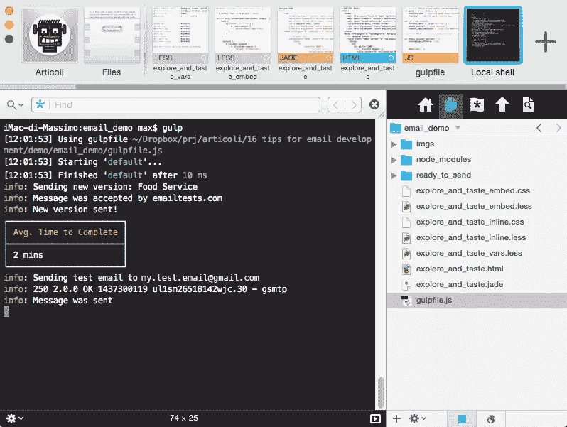
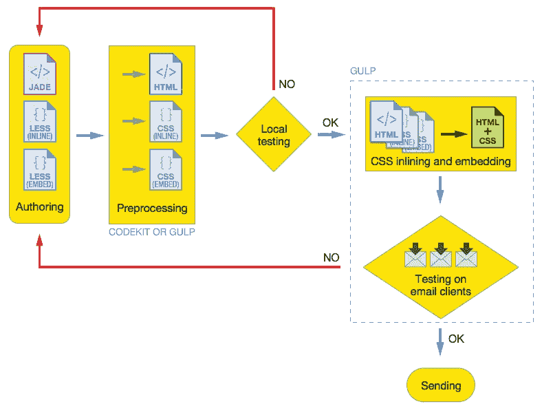

# 我当前的 HTML 电子邮件开发工作流程

> 原文：<https://www.sitepoint.com/my-current-html-email-development-workflow/>

我们每个人都有自己的 web 开发方法:首选的编辑器、一些辅助工具、个人项目流程等等。当我们处理大型或复杂的项目时，有一个清晰的开发路径是很重要的，这样既可以节省时间又可以减少错误。

根据我的经验，这在处理 HTML 邮件项目时尤其重要。电子邮件需要如此多的重复任务，这些任务本身并不特别复杂(至少不经常)，但由于需要检查的元素和任务数量庞大，这可能会成为问题。

在这里，我将尝试解释我个人的 HTML 电子邮件开发工作流程。希望对你挑自己喜欢的部分有用。

## 典型的电子邮件开发工作流程

一个经典的电子邮件开发工作流程有三个主要步骤(详见我的[速成文章](https://www.sitepoint.com/first-email-newsletter/)):

*   创作(带有初步的本地测试)
*   CSS 内联
*   测试


最终测试(使用内联 CSS)是需要更多时间的步骤，因为我们可能要重复很多次。此外,“CSS 内联”和“测试”任务需要一些额外的工作和注意力:首先，您必须注意保存内联的原始工作副本。此外，最后的测试要求你将内联的 HTML 发送到不同的账户，以对照不同的电子邮件客户端检查你的设计。

通过电子邮件发送您的代码有点棘手，因为大多数客户不允许您通过在邮件正文中粘贴 HTML 代码来撰写电子邮件(我知道的唯一一个是 [Thunderbird](https://www.mozilla.org/en-US/thunderbird/) )。但是每个测试都需要许多操作来编写邮件、内嵌 CSS、粘贴代码等等。



如果你有一个测试平台账户( [Litmus](https://litmus.com/) 、 [Email On Acid](https://www.emailonacid.com/) 、 [Campaign Monitor](https://www.campaignmonitor.com/) 或其他)，你可以通过向测试平台提交你的内联代码来简化最终的测试任务，但是为了执行更准确的测试，你仍然必须通过邮件向他们发送你的代码。过去，我使用一点 PHP 脚本来发送测试邮件，这可以节省一些时间，但仍然需要重复某些任务。

回到 CSS，您可能需要处理两个文件:一个要内联，一个要嵌入(对于支持媒体查询的客户端)。

您必须编辑 CSS 以直接内联到您的 HTML 文件中，然后启动一个内联器工具(例如 [Mailchimp 内联器](http://templates.mailchimp.com/resources/inline-css/))，最后您必须将第二个 CSS 嵌入到内联文件中(光是写它就让我厌烦！).

我们现在可以更详细地查看我们的工作流方案:



要获得真正高效的工作流程，许多问题仍未解决，重复性的步骤明显高于创造性的步骤，这很少会带来好的工作。

幸运的是，我们还有一些牌可以打:预处理器和任务运行器。

## 添加 HTML 和 CSS 预处理程序

当我开始使用预处理器时，我立即意识到它们对于电子邮件开发是多么有用。对于 HTML 和 CSS 来说，预处理程序可以很容易地简化对极其冗长的代码(尤其是 HTML)的需求。

我主要使用 HTML 的 [Jade](http://jade-lang.com/) 和 CSS 的 [Less](http://lesscss.org/) ，但是你可以选择你喜欢的技术。Jade 在处理重复和混乱的代码时非常有用，比如嵌套表。看看下面这个三层深表的例子。

```
<table width="100%" id="wrapper">
  <tbody>
    <tr>
      <td width="100%">
        <table align="center" class="header">
          <tbody>
            <tr>
              <td width="100%">
                <table width="100%">
                  <tbody>
                    <tr>
                      <td>cell 1</td>
                      <td>cell 2</td>
                      <td>cell 3</td>
                    </tr>
                  </tbody>
                </table>
              </td>
            </tr>
          </tbody>
        </table>
      </td>
    </tr>
  </tbody>
</table>
```

产生相同代码的玉线如下:

```
table(width="100%" id="wrapper")
  tbody
    tr
      td(width="100%")
        table(class="header" align="center")
          tbody
            tr
              td(width="100%")
                table(width="100%")
                  tbody
                    tr
                      td cell 1
                      td cell 2
                      td cell 3
```

如您所见，未封闭的标签不再有问题，代码也易于阅读。

使用 Jade，您可以创建复杂的模板并构建自己的代码片段库，在更多的项目中重用您的代码。你可以用 Less 或 Sass 做同样的事情。

你可以用 Gulp 或 Grunt 编译你的文件，但是为了快速预览你的工作，我发现最好的解决方案是由 [Coda](https://panic.com/coda/) 和 [CodeKit](https://incident57.com/codekit/) 提供的。

我们工作流程中的“本地测试”任务为我们的工作提供了一个初步的反馈，重要的是它不需要执行额外的操作。

CodeKit 编译我们的 Jade 和 Less 文件进行保存，您的项目可以实时预览。另一方面，Coda 允许您编辑文件，并在一个独特的窗口中预览自动刷新的编译文件:





所有这些步骤都是完全自动化的，您可以将工作重点放在设计上，而不是不太有趣的重复任务上。

现在，我们有了用于创作的 Jade 和 Less 文件，以及用于预览的编译后的 HTML 和 CSS 文件。下一步是把它们放在一起进行最终测试。

## 利用吞咽进行快速测试

我做了很多研究，寻找一些简单的脚本来自动化我们工作流程的最后步骤。npm 提供了许多解决方案，但最终我选择了 [Gulp Email Builder 包](https://www.npmjs.com/package/gulp-email-builder)。这个软件包是一个[更大项目](https://github.com/Email-builder/email-builder-core)的大版本，如果你喜欢，它也有一个咕噜版本。

Email Builder 允许您内嵌或嵌入 CSS 文件，使用[Litmus](https://litmus.com/)API 执行测试，以及发送额外的电子邮件进行测试。

要使用 Email Builder，你当然需要安装 Gulp。我刚刚在我的[使用 Gulp 文章](https://www.sitepoint.com/customizing-bootstrap-icons-using-gulp/)定制引导图标中写了这一点，所以你可以看一下以获得帮助。此外，你可以阅读[艾蒂安·马格拉夫关于吞咽和咕噜工作流程的文章](https://www.sitepoint.com/how-to-grunt-and-gulp-your-way-to-workflow-automation/)。

除了 Email Builder，我们将使用 [Gulp-Replace 包](https://www.npmjs.com/package/gulp-replace)，所以你也需要安装它。

与每个吞咽任务一样，我们必须设置`gulpfile.js`:

```
var gulp = require('gulp'),
    emailBuilder = require('gulp-email-builder'),
    replace = require('gulp-replace');

var current_date = new Date().toString(),

    email_subject = 'Food Service',

    remote_imgs_basepath = 'http://mydomain.com/path/to/remote/imgs/',

    email_builder_options = {
        encodeSpecialChars: true,

        emailTest : {
            // Your Email
            email : 'my.test.email@gmail.com,' + 
                'my.test.email@yahoo.com,' +
                'my.test.email@oulook.com',

            // Your email Subject
            subject : email_subject + ' [' + current_date + ']',

            // Optional
            transport: {
                type: 'SMTP',
                options: {
                    service: 'gmail',
                    auth: {
                        user: 'my.gmail.account@gmail.com',
                        pass: 'my_password'
                    }
                }
            }
        },

        litmus : {
            username : 'Litmus_username',
            password : 'litmus_password',

            // Url to your Litmus account
            url : 'https://myaccount.litmus.com',

            // Optional, defaults to title of email or yyyy-mm-dd if <title> and options.subject not set
            subject : email_subject,

            // Email clients to test for. Find them at https://litmus.com/emails/clients.xml
            // and use the `application_code` field
            applications : ['androidgmailapp','gmailnew', 'iphone5s']
        }
    };

gulp.task('default', function() {
  gulp.src(['./explore_and_taste.html'])
    .pipe(replace(/src="imgs\//g, 'src="' + remote_imgs_basepath))
    .pipe(emailBuilder(email_builder_options))
    .pipe(gulp.dest('./ready_to_send'));
});
```

首先，我们包括我们需要的所有包，并设置四个变量:

*   `current_date`是表示当前日期的字符串；我们将使用它来区分测试电子邮件主题行，从而更容易区分不同的版本。
*   `email_subject`
*   `remote_imgs_basepath`是包含我们图像的远程文件夹的 url。我用它来执行本地测试，为图像设置一个相对路径(这样我可以很容易地做出我需要的所有改变)，但是最终的测试(和发送任务)要求图像被上传到一个远程文件夹，因此我使用 Gulp Replace 用`remote_imgs_basepath`改变所有的`src`属性
*   `email_builder_options`是配置电子邮件生成器的对象

在这个例子中，`email_builder_options`对象有三个元素，你可以查看 [email-builder-core 页面](https://github.com/Email-builder/email-builder-core#options)获得所有可用选项的完整列表。

第一个元素`encodeSpecialChars`，确保所有特殊字符都被编码成它们的 HTML 数字形式。

元素用于设置电子邮件测试。它需要一些参数:

*   `email`:我们发送测试邮件的逗号分隔的电子邮件地址。我为我需要测试的每一个电子邮件服务(Gmail、Outlook、Yahoo 等)都有一个账户。)，以便在他们的网络邮件页面和移动应用程序中快速查看。
*   `subject`:邮件的主题(注意，我添加了`current_date`变量来快速识别我正在处理的版本)。
*   `transport`:发送者执行该任务所需的参数

如果您使用 GMail 作为传输参数，您需要在 Google 帐户设置中激活“允许不太安全的应用程序”，否则发送任务将会失败(最好不要使用您的个人帐户):


第三个参数允许您在 Litmus 平台上设置一个测试(当然，您需要一个 Litmus 帐户)。您必须指明您的帐户参数、可选主题(如果您多次执行测试，它将用于分组测试)以及要测试的电子邮件客户端列表。

要添加客户端，必须使用其*测试应用代码*。您可以从`https://litmus.com/emails/clients.xml`文件的`application_code`字段中获得该信息(注意，您必须登录才能访问该文件)。

在上面的示例中，该行

```
applications : [‘androidgmailapp’,’gmailnew’, ‘iphone5s’]
```

告诉 Litums 用 Gmail 应用程序(Android)、Gmail (Explorer)和 iPhone 5s (iOS7)测试我们的电子邮件。

结果可以在石蕊上看到，就像手工制作的一样:


当然，如果您只想执行电子邮件测试，可以从`email_builder_options`中删除`litmus`参数。

我们的最后一行`gulpfile`做了所有的工作:

*   我们首先告诉 Gulp 在我们的工作中使用`explore_and_taste.html`文件(这是 CodeKit 从我们的 Jade 文件中生成的 HTML，我们刚刚在第一次预览中使用了它)
*   使用*替换*模块，所有本地路径都被替换为我们之前设置的远程路径(`replace(/src="imgs\//g, 'src="' + remote_imgs_basepath)`)
*   最后，执行`EmailBuilder`任务，测试被发送到 Litmus 和电子邮件地址，准备发送的文件被注册。

CSS 文件呢？

Email Builder 确实以一种明确的方式简化了这项任务。你只需要给你的`link`或`style`标签添加一个`data`属性来管理它们:

*   没有数据属性的`link`或`style`标签将被内联
*   如果它们有一个`data-embed`属性，CSS 规则将被嵌入
*   最后，`data-embed-ignore`允许您设置一些仅用于开发目的的 CSS 规则(它们将在处理时被忽略)。

同样，Coda 可以简化吞咽处理，允许您使用其内部终端应用程序:



## 结论

现在我们可以明确地重新安排我们的工作流程了:



您可以根据自己的需要定制这些步骤，使用另一个编辑器而不使用 CodeKit，用 Grunt 代替 Gulp，用 Sass 代替 Less，等等。无论你选择哪种技术，像这样的工作流程确实可以提高你的工作效率。

如果你有自己的 HTML 电子邮件工作流程，请在评论中告诉我，它与本教程中的有何不同。

## 分享这篇文章