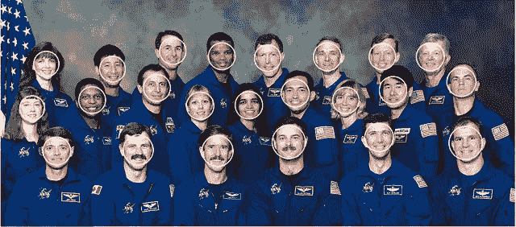
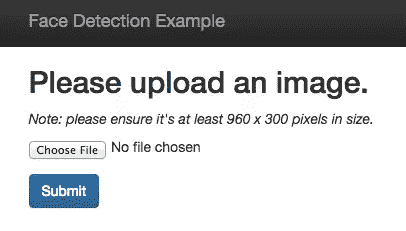
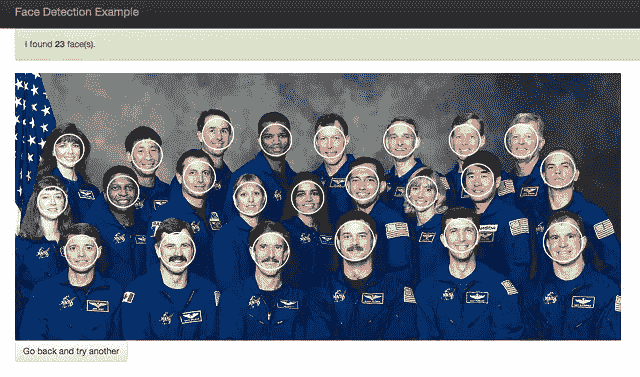

# 使用 Node.js 和 OpenCV 构建人脸检测应用程序

> 原文：<https://www.sitepoint.com/face-detection-nodejs-opencv/>

人类有一种与生俱来的探测、处理和识别面孔的能力——这是我们与生俱来的。计算机也可以做到——只需要一些聪明的算法、大量代码和一些算法训练。

人脸检测是在数字图像中识别人脸的过程。它不应该与面部识别混淆，即试图从照片中找出某人是谁，但这是该过程的第一部分。面部识别在另一个时代是一个巨大的话题，但面部检测是本文的主题。

为了说明这一过程，这里有一个示例图像:


…面部检测的作用如下:



*(原图来自[维基百科](https://en.wikipedia.org/wiki/NASA_Astronaut_Group_15) )*

## 人脸检测的应用

人脸检测有许多应用。一些现代生物识别系统检测面部，然后使用面部识别将这些面部与其数据库中的图像进行比较，以便尝试识别某人，而不必求助于良好的老式密码。一些相机使用面部检测进行自动对焦。像许多其他东西一样，它也可以应用于市场营销。

出于本教程的目的，如果您是脸书用户，我们将复制一个您可能已经使用过的特性。当你上传朋友的照片时，脸书经常会高亮显示所有的面孔，以提示你给照片中的人“加标签”。我们要建造类似的东西。

## 一点背景

在深入研究代码之前，让我们先来看看我们将要使用的一些工具和概念。

### OpenCV 和 Viola-Jones 目标检测算法

[OpenCV](http://opencv.org/) (开源计算机视觉)是数百种计算机视觉算法的开源库。尽管 OpenCV 是用 C++编写的，但由于有了 [opencv](https://www.npmjs.com/package/opencv) 包，我们可以在 Node.js 应用程序中使用它。

OpenCV 中实现的算法之一是 [Viola-Jones 对象检测框架](https://en.wikipedia.org/wiki/Viola%E2%80%93Jones_object_detection_framework)，用于检测图像中的特征。

人脸检测只是特征(对象)检测的一个子集，但该算法专门针对检测人脸所涉及的挑战。

当然，当我们在这个上下文中讨论特性检测时，它与诸如 Modernizr 和 yepnope 等库提供的特性检测没有任何关系！

这种方法在 2004 年由 Paul Viola 和 Michael J. Jones 在一篇文章中首次提出，现在已经成为人脸检测的事实标准。

在本教程后面的[进一步阅读](#summary-and-further-reading)中，你会找到一些关于框架的额外资源。

### 级联和分类

Viola-Jones 算法的一个重要方面是分类器的级联，它被描述为“与 haar-like 特征一起工作的提升分类器的级联”。实际上，这意味着 OpenCV 已经被“训练”在图像中寻找一组视觉特征，以识别特定类型的对象——在我们的例子中是人脸。你可以在文档中找到关于级联和分类器[的更多信息。为我们提供了一个专门用于识别人脸的级联，我们将在查看实现时看到这一点。](http://docs.opencv.org/modules/objdetect/doc/cascade_classification.html)

## 装置

在我们开始玩面部检测之前，我们需要安装一些先决条件。

启动和运行的最简单(也是推荐的)方法是使用 vagger。您将在本文附带的存储库中找到必要的配置和供应脚本。如果您使用这种方法，就没有必要经历这些安装步骤。

### 安装 OpenCV

#### Linux(基于 Debian 的系统)

OpenCV 本身有许多先决条件，我们可以使用`apt-get`来安装:

```
sudo apt-get install build-essential
sudo apt-get install cmake git libgtk2.0-dev pkg-config libavcodec-dev libavformat-dev libswscale-dev
```

还有一些可选的依赖项:

```
sudo apt-get install python-dev python-numpy libtbb2 libtbb-dev libjpeg-dev libpng-dev libtiff-dev libjasper-dev libdc1394-22-dev
```

安装 OpenCV 本身最简单的方法就是使用`apt-get`:

```
sudo apt-get install libopencv-dev
```

在撰写本文时，这将安装版本 2.4.8，尽管最新的 2.x 版本是 2.4.11，而当前的版本是 3.0.0。但是，目前版本 3.0.0 上的 Node.js 包装器存在问题。，所以这个版本就可以了。

#### 从源构建

如果您想从源代码构建，首先安装上面列出的依赖项，然后从[下载](http://opencv.org/downloads.html)页面下载并解压文件。

如上所述，3.0.0 目前存在一些问题。配合 Node.js 模块，所以最好下载 2.4.11 版本。

现在我们需要构建它:

```
cd ~/opencv-2.4.11
mkdir release
cd release
cmake -D CMAKE_BUILD_TYPE=RELEASE -D CMAKE_INSTALL_PREFIX=/usr/local ..
make
sudo make install
```

请注意，最后一步可能需要一段时间！

#### Windows 操作系统

如果你使用的是 Windows，安装就像从网站下载并运行一个可执行文件[一样简单。你会在这里找到最新版本](http://opencv.org/downloads.html)[的直接链接。](http://sourceforge.net/projects/opencvlibrary/files/opencv-win/3.0.0/opencv-3.0.0.exe/download)

#### mac os x

在 OSX 上安装最简单的方法是使用[自制软件](http://brew.sh/):

```
brew tap homebrew/science
brew install opencv
```

你可以在这里找到进一步的说明[。](http://www.learnopencv.com/install-opencv-3-on-yosemite-osx-10-10-x/)

### 图像魔术

您还需要 Imagemagick，它是我们将要使用的图像处理库的一个依赖项。

#### 基于 Debian 的系统

```
apt-get install imagemagick 
```

#### mac os x

```
brew install imagemagick 
```

#### Windows 操作系统

从[页面](http://www.imagemagick.org/script/binary-releases.php#windows)下载并运行适当的 Windows 二进制版本——这是一个可执行文件。

## 构建我们的应用程序

提醒一下，本教程的所有源代码[都可以在 Github](https://github.com/sitepoint-editors/face-detection-nodejs) 上获得。

让我们从定义一些依赖关系开始:

*   我们使用 [express](https://www.npmjs.com/package/express) 作为我们 web 应用程序的基础
*   [手把](http://handlebarsjs.com/)是模板用的，还有[快速手把](https://www.npmjs.com/package/express-handlebars)
*   [lodash](https://www.npmjs.com/package/lodash) 实用程序库
*   multer 是一个处理文件上传的中间件
*   easyimage 是一个图像处理包
*   最后，我们使用[异步](https://www.npmjs.com/package/async)来尝试避免回调地狱

事不宜迟，下面是我们的`package.json`:

```
{
  "name": "sitepoint/face-detection",
  "version": "1.0.0",
  "description": "A simple application which demonstrates face detection in Node.js",
  "main": "index.js",  
  "author": "Lukas White",
  "license": "MIT",
  "dependencies": {
    "async": "^1.4.2",
    "busboy": "^0.2.9",
    "connect-busboy": "0.0.2",
    "easyimage": "^2.0.3",
    "express": "^4.13.3",
    "express-handlebars": "^2.0.1",
    "lodash": "^3.10.1",
    "multer": "^1.0.3",
    "opencv": "^3.0.0"
  }
} 
```

用`npm install`安装依赖项。

接下来，创建几个目录:

```
mkdir public
mkdir public/css
mkdir public/images
mkdir views
mkdir views/layouts
mkdir uploads
```

现在为我们的应用程序创建一个基本布局(`views/layouts/default.hbs`):

```
<!DOCTYPE html>
<html>
  <head>
    <meta charset="utf-8">
    <title>Face Detection Example</title>
    <link rel="stylesheet" href="/css/bootstrap.min.css">
    <link rel="stylesheet" href="/css/bootstrap-theme.min.css">
    <link rel="stylesheet" href="/css/styles.css">
  </head>
  <body>

    <nav class="navbar navbar-inverse navbar-fixed-top">
      <div class="container">
        <div class="navbar-header">
          <a class="navbar-brand" href="/">Face Detection Example</a>
        </div>
      </div>
    </nav>

    <div id="main" class="container">
      {{{body}}}
    </div>
  </body>
</html> 
```

我引用 Bootstrap 框架来稍微美化应用程序，但这是可选的。要么自己下载文件，要么在本文附带的库中找到它们[。](https://github.com/lukaswhite/face-detection-nodejs/tree/master/public/css)

添加一些基本样式(`public/css/styles.css`):

```
#main {
  margin-top: 50px;
}

.frame {
  position: relative;  
}

.frame a {
  display: block;
  position: absolute;
  border: solid 2px #fff;
  border-radius: 50%;
}

.frame a:hover {
  background: rgba(0,0,0,0.5);
}
```

现在让我们实现一个 skeleton Express 应用程序(`index.js`):

```
var express   = require('express')
    , http    = require('http')
    , async   = require('async')
    , multer  = require('multer')
    , upload  = multer({ dest: 'uploads/' })
    , exphbs  = require('express-handlebars')
    , easyimg = require('easyimage')
    , _       = require('lodash')
    , cv      = require('opencv');

// MIME types for image uploads
var exts = {
  'image/jpeg': '.jpg',
  'image/png' : '.png',
  'image/gif' : '.gif'
};

var port = 8080;
var app = express();
app.use(express.static(__dirname + '/public'))

// Configure Handlebars
app.engine('.hbs', exphbs({ extname: '.hbs', defaultLayout: 'default' }));
app.set('view engine', '.hbs');

/**
 * This is a placeholder for the application code
 */

http.createServer(app)
  .listen(port, function(server) {
    console.log('Listening on port %d', port);
  });
```

希望这些评论能让你对这里发生的事情有所了解。

我们还需要一条简单的路线:

```
app.get('/', function( req, res, next ) {
  return res.render('index');
});
```

相应的视图(`views/index.hbs`)本质上只是一个文件上传表单:

```
<div>
  <h2>Please upload an image.</h2>
  <p><em>Note: please ensure it's at least 960 x 300 pixels in size.</em></p>
</div>

<form method="post" action="/upload" enctype="multipart/form-data">
  <div class="form-group">
    <input type="file" name="file">
  </div>
  <div class="form-group">
    <input type="submit" value="Submit" class="btn btn-primary">
  </div>
</form> 
```

在我们进入人脸检测的本质之前，我们需要建立一个简单的文件上传机制。这将允许用户上传一个图像，我们将调整到一个合理的大小，然后显示给他们。

代码如下:

```
// POST callback for the file upload form.
app.post('/upload', upload.single('file'), function(req, res, next){

  // Use filename generated for us, plus the appropriate extension
  var filename = req.file.filename + exts[req.file.mimetype]
  // and source and destination filepaths
  , src = __dirname + '/' + req.file.path
  , dst = __dirname + '/publimg/' + filename;

  async.waterfall(
    [
      function(callback){
        // Check the mimetype to ensure the uploaded file is an image
        if (!_.contains(['image/jpeg','image/png','image/gif'],req.file.mimetype)){
          return callback(new Error(
            'Invalid file - please upload an image (.jpg, .png, .gif).')
          )
        }

        return callback();
      },
      function(callback){
        // Get some information about the uploaded file
        easyimg.info(src).then(
          function(file){
            // Check that the image is suitably large
            if ((file.width 
```

我们在这里所做的就是抓取一个上传的文件，确保它是一个图像，检查它的最小尺寸，如果是，我们就把它的大小调整到 960 像素。面部检测代码暂时被省略了。我们一会儿会谈到这一点。

关于这个过程，我不会说得太详细，因为这不是本文的主要重点——但是如果你想了解发生了什么，可以查看一下 [multer](https://www.npmjs.com/package/multer) 和 [easyimage](https://www.npmjs.com/package/easyimage) 文档。

接下来，我们需要使用 [OpenCV](http://opencv.org/) 库读取图像。在幕后，这将图像转换为像素矩阵，然后可以在其上运行特征检测算法。

我们使用的方法具有以下特征:

```
cv.readImage(filepath, function(err, im){
  // do something with the matrix referred to by the im variable
});
```

因为我们使用的是`async`模块，我们可以简单地将回调作为第二个参数传递给它。第一个参数是目的地`dst`；也就是调整大小过程的结果。所以这个函数看起来像这样:

```
function(callback){
  //Use OpenCV to read the (resized) image 
  cv.readImage(dst, callback);
},
```

接下来，我们需要运行特征检测算法 rthim，这是一个在`Matrix`类上的方法。这是签名:

```
im.detectObject(classifier, options, function(err, faces){
  // faces contains an array of data about any faces it's found
});
```

一切正常的情况下，`faces`变量将包含一个散列数组，它找到的每张脸对应一个散列。每个散列将包含`x`和`y`坐标(`0,0`是图像的左上角)，以及`width`和`height`——从而定义图像中人脸被认为覆盖的区域。

集成到我们的异步“瀑布”中，它看起来像这样:

```
function(im, callback){
  // Run the face detection algorithm 
  im.detectObject(cv.FACE_CASCADE, {}, callback);
} 
```

注意，我们指定了一个专门为人脸检测设计的预建分类器(`cv.FACE_CASCADE`)。

在我们最后的回调中——`async.waterfall()`的第二个参数——如果出错，我们将呈现一个错误模板，否则我们将呈现结果，我们将传递上传图像的文件名，以及我们的人脸数据数组。

这就是我们需要对`index.js`进行的更改。请花一点时间[在 GitHub](https://github.com/sitepoint-editors/face-detection-nodejs/blob/master/index.js) 上查看完整的文件。

我们需要做的最后一件事，是定义我们剩下的两个视图。错误视图(`views/error.hbs`)简单地向用户显示消息:

```
<div class="alert alert-error" role="alert">
  <strong>An error has occured:</strong>
  {{ message }}
</div>

<a href="/" class="btn btn-default">&larr; Go back and try again</a> 
```

结果视图(`views\result.hbs`)稍微有趣一些:

```
{{#if faces.length}}
  <div class="alert alert-success" role="alert">
    I found <strong>{{faces.length}}</strong> face(s).
  </div>
{{else}}
  <div class="alert alert-warning" role="alert">
    Sorry, but I couldn't find any faces...
  </div>
{{/if}}

<div class="frame">
  
  {{#each faces}}
    <a href="#" style="width: {{ width }}px; 
                       height: {{ height }}px; 
                       left: {{ x }}px; 
                       top: {{ y }}px;"></a>  
  {{/each}}
</div>

<a href="/" class="btn btn-default">Go back and try another</a> 
```

我们在这里所做的是将图像包装在一个`<div>`中，我们已经给它分配了`position: relative`，然后为每张脸渲染一个链接。每个链接都显示为一个绝对定位的块，我们使用面数据来定义它的位置和尺寸。

现在运行应用程序:

```
node index.js
```

请注意，您可能会看到以下警告:

```
libdc1394 error: Failed to initialize libdc1394
```

因为对于我们的目的来说,`libdc1394`不是必需的，您可以简单地用下面的命令禁用它，如[这个堆栈溢出回答](http://stackoverflow.com/questions/12689304/ctypes-error-libdc1394-error-failed-to-initialize-libdc1394)中所述:

```
sudo ln /dev/null /dev/raw1394
```

请谨慎使用，因为它可能会影响系统上安装的其他应用程序

现在在浏览器中访问应用程序。如果你正在使用流浪者，你会在这里找到它:

```
http://192.168.10.10:8080/
```

如果一切正常，您应该会看到上传表单:



以下是一次成功的面部检测尝试的结果示例:



您可以从这里抓取截图[中显示的图像，或者尝试使用您自己的图像。需要注意的一点是，这种方法要求人脸处于全景，面向前方且直立。](https://www.sitepoint.com/wp-content/uploads/2015/09/1442313353nasa-small.jpg)

## 总结和进一步阅读

我们对人脸检测的简要介绍到此结束，在此期间，我们构建了脸书的照片标记小部件的克隆的基础。

如果你想真正深入地了解 Viola-Jones 对象检测框架的实现，你可能会对丹麦技术大学的 Ole Helvig Jensen 的论文感兴趣。你可能也会发现这个 [YouTube 视频](https://www.youtube.com/watch?v=_QZLbR67fUU&spfreload=10)有用的背景。

OpenCV 中还有很多值得探索的地方；一个好的开始是文档，尤其是教程。不过，请注意，这些主要是针对 C++的。

你还能想出什么其他的应用？请在评论中告诉我。

## 分享这篇文章