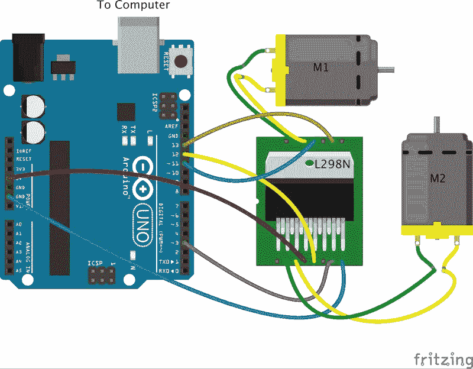

# 使用 Arduino 和 Node.js 控制电动机器人

> 原文：<https://www.sitepoint.com/controlling-a-motorbot-using-arduino-and-node-js/>

最近 GitHub 发表了一篇博客文章，展示了不同语言在这段时间里是如何演变的。排名代表 GitHub 的公共和私人存储库中使用的语言，不包括 forks，由一个名为[语言学家](https://github.com/github/linguist)的库检测。显而易见，JavaScript 在很多领域都赢得了比赛。尽管来自 C、C++和 Java 的竞争非常激烈，但编程语言正在成为游戏编程、机器人和物联网设备的一个非常受欢迎的选择。当 JavaScript 开始驱动机器人时，[节点机器人](http://nodebots.io/)就诞生了。

NodeBots 是由 [Node.js](https://nodejs.org/) 控制的机器人。如果你有兴趣了解更多关于它们的信息，我建议你阅读由 [Patrick Catanzariti](https://www.sitepoint.com/author/pcatanzariti/) 撰写的标题为[NodeBots](https://www.sitepoint.com/an-introduction-to-nodebots/)简介的文章。

在本教程中，我们将制作一个可以从浏览器控制的简单节点机器人。[整个项目的源代码可以在 GitHub](https://github.com/sitepoint-editors/nodebot-sample) 上找到。

## 设置硬件

我们将在这个项目中使用以下硬件:

*   Arduino
*   2 台电机
*   L298 电机控制器
*   将 Arduino 连接到电脑的电线

Arduino 是一个基于易于使用的硬件和软件的开源原型平台。它被用于全世界成千上万的项目中。我们使用 Arduino 的原因是它处理廉价且容易扩展的跨平台问题(它运行在 Windows、Linux 和 OS X 上)。

我们将从组装硬件开始。下面给出了连接的表示。



如果您在理解引脚编号时遇到任何困难，请参考下面给出的示意图。


我建议你根据你的需要(例如，它所能承受的负荷)来选择马达。如果您使用额定电压更高的电机，那么您可能必须使用外部电源，因为 Arduino 提供的电压可能不够。

一旦我们完成连接，我们必须确保 StandardFirmata 安装在板上。Firmata 是一种通用协议，用于通过主机上的软件与微控制器进行通信。为此，请遵循以下简单步骤:

*   下载 [Arduino IDE](http://www.arduino.cc/en/main/software)
*   通过 USB 插入 Arduino 或 Arduino 兼容微控制器
*   打开 Arduino IDE，选择**文件>实例> Firmata >标准 Firmata**
*   点击“上传”按钮。

完成硬件连接并将 StandardFirmata 上传到 Arduino 后，我们可以进入下一部分，创建 web 应用程序。

## 应用程序入门

从 web 应用程序开始，让我们定义项目的软件依赖关系。为此，我们将创建一个类似如下的`package.json`文件:

```
{
  "name": "nodebot-sample",
  "dependencies": {
    "express": "^4.11.2",
    "johnny-five": "^0.8.53",
    "socket.io": "^1.3.3"
  }
```

创建文件后，在项目文件夹的根目录下运行`npm install`,以便安装所有的依赖项。如果你对 [npm](https://www.npmjs.com/) 不熟悉，可以看看标题为[NPM 初学者指南——节点包管理器](https://www.sitepoint.com/beginners-guide-node-package-manager/)的文章，作者是 [Peter Dierx](https://www.sitepoint.com/author/peterdierx/) 。

## 服务器端代码

服务器代码依赖于 [Node.js](https://nodejs.org/) 和 [Express](http://expressjs.com/) 。我们将在项目目录的根目录下创建一个名为`index.js`的文件。这个文件将包含我们所有的服务器端逻辑。

```
var express = require('express');
var app = express();
var io = require('socket.io')(app.listen(8081));
var five = require('johnny-five');

app.use(express.static(__dirname + '/app'));

app.get('/', function (res) {
  	res.sendfile('/index.html');
});

var board = new five.Board({
  	repl:false
});
```

`express()`函数是由 Express 模块导出的顶级函数。`express.static()`负责向客户端提供静态资产服务。`app.get`用回调函数将 HTTP 请求路由到指定路径。`res`对象表示 express 应用程序在收到请求时发送的 HTTP 响应。`sendFile`方法将文件从特定路径发送到浏览器。

我们使用的是[插座。IO](http://socket.io/) 利用 WebSockets 和 [johnny-five](http://johnny-five.io/api/) 的力量帮助 Arduino 与服务器通信，从而维持客户端和服务器之间的实时连接。johnny-five 是一个基于 Firmata 协议的物联网和机器人编程框架。

首先，我们创建一个新的`Board`实例。一旦完成，所有的逻辑都将在电路板准备就绪时实现(这意味着当`ready`事件被触发时)。在回调函数中，我们通过提供一个包含两个数字的数组来创建一个`Motor`的两个实例。具体来说，`[3,12]`和`[11,13]`代表 Arduino 的引脚，各自的电机连接到这些引脚。

```
board.on('ready', function () {
    var speed, commands, motors;
    motors = {
        a: new five.Motor([3, 12]),
        b: new five.Motor([11, 13])
    };

    commands = null;

    io.on('connection', function (socket) {
        socket.on('stop', function () {
            motors.a.stop();
            motors.b.stop();
        });

        socket.on('start', function () {
            speed = 255;
            motors.a.fwd(speed);
            motors.b.fwd(speed);
        });

        socket.on('reverse', function () {
            speed = 120;
            motors.a.rev(speed);
            motors.b.rev(speed);
        });

        socket.on('left', function () {
            var aSpeed = 220;
            var bSpeed = 50;
            motors.a.fwd(aSpeed);
            motors.b.rev(bSpeed);
        });

        socket.on('right', function () {
            var aSpeed = 50;
            var bSpeed = 220;
            motors.a.rev(aSpeed);
            motors.b.fwd(bSpeed);
        });
    });
});
```

电机的速度由 0 到 255 范围内的数字指定。`.stop()`方法让电机滑行停止。还有一种替代方法`.brake()`强制电机停止(而不是滑行),但它只对带有专用制动销的电路板有效。`.fwd()`和`.rev()`方法只是`.forward()`和`.reverse()`的别名。它们都接受一个数字作为参数，范围从 0 到 255，以控制速度。我们使用前进和后退速度的不同组合来获得马达的不同运动。

为了完成我们的项目，我们必须实时检测用户何时在客户端选择了特定的选项。这是哪里的插座。木卫一进场。当与客户端建立新的连接时，触发`connection`事件。每当客户端发出一个事件时，`.on()`方法允许我们在服务器端监听该事件并执行一些动作。

## 客户端代码


客户端实现包括创建用户可以选择电机不同运动的界面。我们首先在目录根目录下的`app`文件夹中创建一个`index.html`文件。在这个页面中，我们包括了 Socket.IO 的客户端版本。

```
<body>
   <div class="container">
       <i class="fa fa-angle-up" id="forward"></i>
       <i class="fa fa-angle-left" id="left"></i>
       <i class="fa fa-angle-down" id="reverse"></i>
       <i class="fa fa-angle-right" id="right"></i>
       <i class="fa stop" id="stop">STOP</i>
   </div>
   <script src="//cdnjs.cloudflare.com/ajax/libs/socket.io/1.3.6/socket.io.min.js"></script>
   <script src="app.js"></script>
</body>
```

插座。IO 公开了一个全局方法，它被添加到被称为`io()`的`window`对象上。`socket.emit('right')`将用事件名`right`向服务器发回一条消息。一旦`.emit()`在客户端被调用，服务器端附带的`socket.on('right')`回调就会被执行。

```
var socket = io();

function moveForward(){
    socket.emit('start');
}
function turnRight(){
    socket.emit('right');
}
function turnLeft(){
    socket.emit('left');
}
function moveReverse(){
    socket.emit('reverse');
}
function stop(){
    socket.emit('stop');
}

document.getElementById('forward').onclick = moveForward;
document.getElementById('right').onclick = turnRight;
document.getElementById('left').onclick = turnLeft;
document.getElementById('reverse').onclick = moveReverse;
document.getElementById('stop').onclick = stop;
```

有了这最后一段代码，我们就完成了代码。现在，您可以从浏览器控制电机了。您甚至可以将`keypress`事件绑定到箭头键，并使用它们来控制电机。

要启动服务器，打开终端并在项目目录的根目录下运行`node index.js`。现在，您可以在浏览器上的`127.0.0.1:8081`访问您的网页，并从那里开始控制您的电机。如果有任何类似`Board not found`的问题，请确保 Arduino 和计算机之间的连接正常，并且您已经正确地将标准固件数据从 Arduino IDE 上传到板上。

这个项目是结合 Node.js 和 Arduino 所能实现的一个很小的例子。您可以使用 WebSockets 的功能将从传感器( [MPU6050](http://playground.arduino.cc/Main/MPU-6050) )接收的数据实时传输到浏览器。你可以在此基础上显示实时图表，并根据你收到的读数控制电机。在这些原则上的类似实现可以在[这里](https://github.com/sitepoint-editors/arduinode)找到，它是当前项目的扩展。如果你对这个项目感兴趣，你一定要去看看。

## 结论

在本教程中，我们学习了创建一个基本的节点机器人。同时，我们还探索了 Node.js 提供的各种可能性，以及我们如何利用它的力量在 web 应用程序和机器人之间建立联系。

我希望你们都喜欢这篇文章，并找到更多热爱 JavaScript 的理由。我要再次强调的是，你可以在 GitHub 上找到[整个项目的源代码。](https://github.com/sitepoint-editors/nodebot-sample)

## 分享这篇文章