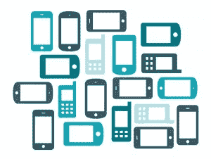
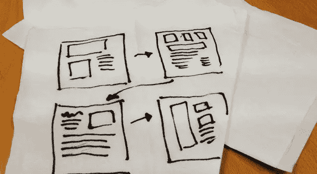
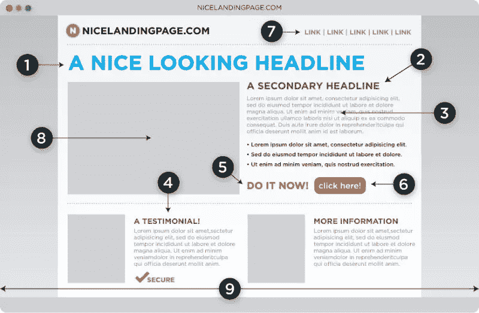
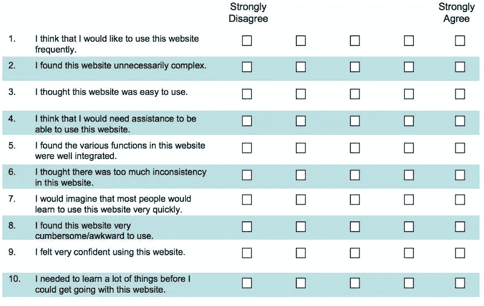

# 用户测试绝对初学者指南

> 原文：<https://www.sitepoint.com/the-absolute-beginners-guide-to-user-testing/>

这篇文章是我新发布的 [incrementalux 播客](http://incrementalux.com/podcast)的姊妹篇，基于我采访比我聪明得多的人的经验。

## 追求完美的产品

虽然用户测试在 web 开发过程中一直占有一席之地，但也许是智能手机和支持互联网的设备的爆炸才真正让用户测试成为焦点。

在最近的过去，一些设计方法集中于来自终端用户的反馈。**精益 UX** 将衡量反馈作为其核心原则之一。**以用户为中心的设计**把用户、..嗯，在中心。

成为一名 UX 设计师需要大量的测试和收集反馈。现在市场上有很多产品可以让我们分析和评估我们的用户。但是，在你把信用卡用在大量用户测试软件和服务上之前，你需要(至少)对用户测试的内容、时间和方式有一个绝对初学者的理解。

这就是我今天要解决的问题！

让我们从最容易回答的问题开始。

## 何时测试

用户测试在投入开发之前使用是最有效的。在开始编码或构建之前，它有助于发现概念或思维层面的问题。在您致力于构建解决方案之前进行大量测试会有所帮助。

尽早测试，经常测试是我们头脑中反复灌输的一句口头禅。但是，仅仅早期测试是不够的。

来源:[用户测试](https://www.usertesting.com/blog/2015/04/14/4-reasons-why-you-should-user-test-your-product/)

也就是说，一旦你有了任何有形的东西，你就开始对用户进行测试。第一张餐巾纸草图或白板图表是开始测试的好地方。

来源: [Zurb](http://zurb.com/article/917/how-much-life-does-the-paper-napkin-sketc)

纸上原型允许你画出并测试整个流程。在这里，用户用纸上草图来模仿他们的交互。作为一名设计师，你要测试整个工作流程，找出用户心理模型与你构建的系统心理模型之间的差距。

这个测试阶段既快速又反复。一旦你发现了问题，下一个版本就该被快速地勾画和测试了。一旦你完成了像草图和白板图这样的一次性原型，你就可以继续做更实际的 wirefreames 或 photoshop 模型。

## 如何测试

### 5 秒钟测试

**目标** : *一个简单的是/否测试来确定一个想法是否可行*

收集设计反馈的最快最简单的方法是 5 秒测试。用 5 秒钟时间向你的团队成员、朋友或配偶展示你的设计，并向他们提问如下问题:

*   你觉得这个设计是关于什么的？
*   你可以采取的主要行动是什么？
*   你喜欢它的什么？
*   你不喜欢它的什么？

这是一个很好的方式，可以快速收集设计是“成功还是失败”的反馈。在注意力经济中，屏幕的主要目的是否被即时传达是一件大事，在这里用户被视觉、信息、数据甚至废话轰炸。然而，它是非常二进制的，并没有进入更好的细节。

### 游击测试

**目标** : *在公共场所随机收集人们对设计的反馈*

> “滚出大楼”是设计界经常听到的一句话。

游击测试是一个有趣的名字，它出现在一家咖啡店，随机选择一些人，并(礼貌地)询问他们对设计的反馈。

这是从各种来源获得反馈的好方法。非常适合需要来自不同人群反馈的面向客户的应用程序。

游击测试的缺点是当人们给你不相关的反馈时，他们可以得到免费的咖啡作为交换。这可以通过观察用户和他们的行为来缓解。将观察到的笔记与他们的口头反应结合使用，有助于更好地理解设计中的问题。

### 纵向研究

**目标** : *在一段时间内反复收集同一个人的反馈*

很多焦点都集中在用户任务的初始印象和指标上，比如注册、签约、付费。这种专注超越了你在行业中的角色。

*   产品经理关注用户入职
*   营销人员关注登录页面和转化率
*   开发人员关注第一次加载时间或第一个字节的时间

我们在这方面做了很多工作，以至于我们已经将登陆页面的元素细化为一门科学。但除此之外会发生什么呢？

排序优先级:来源:[表单堆栈](https://www.formstack.com/the-anatomy-of-a-perfect-landing-page)

#### 狂看网飞

对于长时间使用应用程序的用户，有几个测试用例。日志研究要求用户在一段时间内在应用程序中记录他们的体验。这样，你不仅是在收集“第一印象”的反馈。你也在为重复使用而优化。

纵向研究是指在一段时间内从同一个人那里收集对同一应用程序的反馈。您实际上是在应用程序中记录客户的一生。

想想你第一次使用网飞这样的服务和现在使用它的体验有什么不同。最初的体验都是关于熟悉我们自己的界面，但后来都是关于看电影的狂欢。用户的期望和要求随着使用和时间而变化。与用户相关联的反馈也是如此。

#### 收集关于功能变化的反馈

纵向研究也是一种很好的方式，可以收集对现有产品变化的反馈，以及用户对应用程序的看法如何根据核心产品的新增和删除而变化。

谷歌的新标志

*   谷歌新 logo 给人的感觉如何？
*   它一发布人们会有什么反应？
*   一个月后怎么样？
*   当您删除一个功能时会发生什么？
*   他们如何评价这种变化后的体验？

#### 系统可用性量表

**目标** : *收集和衡量反馈的标准度量/尺度*

说到评级，收集反馈的最佳方式之一是使用标准的量表。系统可用性等级是收集主观反馈的一个很好的工具。

*   用户对这个设计感觉如何？
*   他们觉得容易吗？
*   他们对完成任务有信心吗？
*   他们会推荐给朋友吗？

使用一个标准尺度可以得到一个好的参考点，比如说 X%是基准。如果人们对它的评价高于 X%，这意味着变化仍然存在，而低于 X%的负面反应则意味着，我们将扼杀这种变化。

## 测试什么

通常，你会在网站功能的核心任务上测试用户。对于电子商务网站来说，那就是发现和购买产品。有些任务可能是这样的:

*   寻找一件你最喜欢的颜色的夹克并购买它
*   找到你最喜欢的品牌的裤子
*   完成你感兴趣的 3 件物品的结帐

你如何定性地衡量对这些项目的反馈？使用的一些标准指标有:

*   **任务时间**–用户完成任务花了多长时间？
*   **任务成功**–用户成功完成任务的频率如何？
*   **失败率**–他们失败的频率有多高？

## 临终遗言

用户测试是测试你的屏幕有效性的强有力的方法。通常建议你结合使用定性和定量技术来衡量用户反馈。

另外，如果你有兴趣了解更多关于用户测试和用户研究的信息，你应该看看 [incrementalux 播客](http://incrementalux.com)上的[这一集](http://incrementalux.com/podcast/user-research-with-danielle-smith/)。

## 分享这篇文章