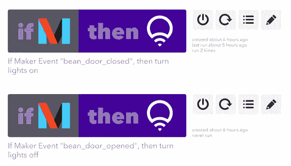
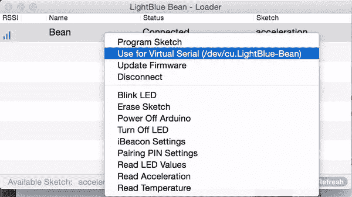

# 使用 LightBlue Bean 和 IFTTT 实现 LIFX 灯光自动化

> 原文：<https://www.sitepoint.com/automating-lifx-lights-with-the-lightblue-bean-and-ifttt/>

[LightBlue Bean](http://legacy.punchthrough.com/bean/) 是一款小型低能耗蓝牙 Arduino 微控制器，内置 3 轴加速度计和温度传感器。这是一种非常有趣的方式，通过蓝牙连接而不是 Wi-Fi 来增加物体的连接性。它像典型的 Arduino 一样有数字和模拟引脚，因此您可以通过向设置中添加新元素来扩展它的功能。

为了添加新元素，需要进行一些焊接。对于本文，我想要一个无焊料演示，任何有浅蓝色 Bean 的人都可以跟随，所以我们将重点放在内置加速度计上。几个月前，我在 SitePoint 上做了一个 IFTTT 演示，当我把颚骨设置为睡眠模式时，它会自动关闭 LIFX 灯。这是一个很好的触摸，但我仍然需要每天晚上拿出我的智能手机来打开我的灯。我更喜欢更自动化的东西，并决定尝试一些技术实验，以方便的方式打开灯。在这篇文章中，我将介绍我的第一个原型——我将使用一个浅蓝色的豆子来检测我的门的运动，并根据我的门是开着还是关着来打开或关闭我的灯。

对于那些喜欢浅蓝豆的人来说，现在 Kickstarter 上有一个新版本的浅蓝豆，叫做[浅蓝豆+](https://www.kickstarter.com/projects/1966384672/a-bluetooth-arduino-for-the-mobile-age-lightblue-b) ，看起来非常漂亮！它有一个可充电电池，无焊连接器和更多有用的功能。只有几天的时间来把你的承诺！

## 这将如何工作

我们的演示将像这样工作:

1.  把浅蓝色的豆子贴在我们要追踪的门上。
2.  上传一个 Arduino 草图，观察加速度计的变化(门向一边或另一边摆动)并通过 Bean Loader 虚拟串行发送消息。
3.  设置一个节点服务器，监视传入的串行消息。
4.  在节点服务器中设置对这些消息的响应，向 IFTTT 的 Maker 通道发送一个 HTTP 请求，告诉它打开灯。
5.  将浅蓝色 Bean 设置为虚拟串行模式。
6.  运行节点服务器，关上你的门，看你的灯亮了！

稍后可以在我们的节点服务器中包含额外的规则，以确保代码也只在一天中的特定时间运行(以避免灯在实际上不需要的时候亮起)。或者更好——添加一个光敏电阻，自动检测是否需要照明！

## 设置您的浅蓝色 Bean

如果你是一个使用 LightBlue Bean 的新手，你需要在你的 Windows 8.1 或 Mac 电脑上安装最新的 Arduino 软件和 Bean Loader 软件(显然 Bean Loader 软件不能在旧的 Windows 电脑上运行)。在 LightBlue Bean 网站上，关于如何将您的 LightBlue Bean 连接到您的 Mac 或 PC 的指南非常全面:

*   [Mac OSX 入门](http://legacy.punchthrough.com/bean/getting-started-osx/)
*   【Windows 8.1 入门

这个演示已经在 Mac OSX 上完成了，但是理论上也可以在 Windows 上运行。

本文中的步骤将假设你已经熟悉了在你的 LightBlue Bean 上绘制草图的基础知识，如果还不熟悉，请先浏览上面的操作系统“入门”链接。

## 我们的 Arduino 草图代码

所有的代码都可以在 [GitHub](https://www.github.com/sitepoint-editors/BeanDoorWatcher) 上找到，你可以根据自己的需要使用和修改！

我们的 Arduino 草图包含了门后观看的大部分大脑，看起来是这样的:

```
int minXVal = 0;
int maxXVal = 0;
int minYVal = 0;
int maxYVal = 0;
int minZVal = 0;
int maxZVal = 0;
int movement = 15;
bool ready = false;

void setup() {
  Serial.begin();
}

void loop() {
  AccelerationReading acceleration = Bean.getAcceleration();

  if (!ready) {
    for (int i = 0; i  maxXVal) {
           maxXVal = acceleration.xAxis;
        } else if (acceleration.xAxis  maxYVal) {
           maxYVal = acceleration.yAxis;
        } else if (acceleration.yAxis  maxZVal) {
           maxZVal = acceleration.zAxis;
        } else if (acceleration.zAxis  maxZVal + movement) {
      String stringToPrint = "OPEN";
      Serial.println(stringToPrint);
    }
  }

  Bean.sleep(1000);
}
```

## 我们的草图代码解释了

首先，你会看到一系列变量，分别叫做`minXVal`、`maxXVal`、`minYVal`、`maxYVal`、`minZVal`和`maxZVal`。这些跟踪我们的浅蓝豆的初始加速度计读数。在我的演示代码中，我们实际上只使用 z 值，但是我将其他值留在这里，因为您可能需要在自己的实现中使用它们的值(例如，如果您将 Bean 放在门上的不同方向，或者有不同类型的门，如滑动门)。加速度计追踪豆子每一侧的重力。我们只想知道这些力的变化，所以我们需要知道当豆子在我们打开的门上静止时，最初作用在豆子上的力的范围。这是我们存储这些值的地方:

```
int minXVal = 0;
int maxXVal = 0;
int minYVal = 0;
int maxYVal = 0;
int minZVal = 0;
int maxZVal = 0;
```

接下来我们设置一个名为`movement`的变量，它是我们在触发动作之前接受的移动级别。你需要调整这个来适应你自己的情况(你的门可能比我的门打开时移动得更微妙)。在示例代码中，我们允许在触发任何东西之前，从最小值和最大值移动大约-15 到+15:

```
int movement = 15;
```

我们需要时间来运行最小和最大值的初始测试，所以我们使用`ready`变量来告诉我们的循环，我们是否准备好开始在我们的最小和最大范围内观察门的运动:

```
bool ready = false;
```

在我们的`setup()` Arduino 函数中，我们将串行连接设置为在 Arduino 就绪时开始运行:

```
void setup() {
  Serial.begin();
}
```

在我们的循环中，我们从 Bean 中执行对加速度计值的所有观察。这些都可以通过我们在`loop()`函数开始时设置的`acceleration`变量读取:

```
void loop() {
  AccelerationReading acceleration = Bean.getAcceleration();

  // Our accelerometer tests
}
```

我们的第一个加速度计读数将是实现我们的最小值和最大值。这些在`ready`最初为假时运行。初始读数被读取 100 次，每 10 毫秒一次，应该在大约一秒钟内准备好最小值和最大值。一旦它通过了这个循环，我们将`ready`设置为真，这样它就可以进入下一个阶段。不过我们先跳过这里，首先我们来看看这个循环中有什么。

```
if (!ready) {
  for (int i = 0; i Within each 10 millisecond reading, we read in each axis' accelerometer value via acceleration.xAxis, acceleration.yAxis and acceleration.zAxis. We compare each to the current max and min values we have stored for each axis and if it is greater than or less than the respective value, we update it to the new minimum or maximum:

[code language="c"]
if (acceleration.xAxis > maxXVal) {
   maxXVal = acceleration.xAxis;
} else if (acceleration.xAxis The next phase is the one in which we watch for movement that occurs outside of the min/max values that is greater than our movement variable.

For the door movement, I only needed to test the z values as that was the axis which changed most when my door swung open and closed. If they were less than the minimum resting value, then my door was being closed and if they were greater than the maximum resting value, the door was being opened. This may be different for your if your LightBlue Bean is placed differently on your door. Experiment and see what works for you!

For each, we send either "OPEN" or "CLOSED" over the software serial port via Serial.println(stringToPrint).

[code language="c"]
else {
  if (acceleration.zAxis  maxZVal + movement) {
    String stringToPrint = "OPEN";
    Serial.println(stringToPrint);
  }
}
```

## 附加您的 Bean

在你把代码放到你的 Bean 上之前，用你喜欢的方式把你的浅蓝色 Bean 粘在你的门上。我暂时用了 Blu Tack，但是豆子看起来很轻，可以很好的粘在上面。对于我的示例代码，我像这样附加了我的浅蓝色 Bean:


## 设置 LIFX 和 IFTTT

为了能够告诉我们的 LIFX 灯泡打开和关闭，我们将设置一个 IFTTT 规则来完成这项工作。我设置了食谱，当门关上时打开灯，当我再次开门离开房间时关闭灯。

对于本文，我假设读者了解 IFTTT 的基础知识。如果没有，请快速阅读我之前的一篇关于使用 IFTTT 将 LIFX 灯泡连接到物联网的文章。

我们创建的两个配方将使用[Maker 通道](https://ifttt.com/maker)作为触发通道，以及事件名称“bean_door_closed”(打开我们的灯)和“bean_door_opened”(关闭我们的灯)。动作通道将为 LIFX，动作为“开灯”或“关灯”。完成后，它们应该是这样的:



## 我们的节点服务器代码解释

节点服务器的代码如下所示:

```
var port = process.env.PORT || 5000,
    SerialPort = require("serialport").SerialPort,
    serialPort = new SerialPort("/dev/cu.LightBlue-Bean", {
      baudrate: 57600
    }),
    request = require('request');

serialPort.on("open", function () {
  console.log("Connected to LightBlue Bean serial port");

  serialPort.on("data", function(data) {
    console.log("Data: " + data);
    data = data + "";

    if (data == "CLOSED") {
      request.post({
        url: "http://maker.ifttt.com/trigger/bean_door_closed/with/key/YOURKEYHERE"
      }, function(error, response, body) {
        console.log(body);
        if (error) console.log("Error was ", error);
      });
    } else if (data == "OPEN") {
      request.post({
        url: "http://maker.ifttt.com/trigger/bean_door_open/with/key/YOURKEYHERE"
      }, function(error, response, body) {
        console.log(body);
        if (error) console.log("Error was ", error);
      });
    }
  });
});
```

服务器的启动通过[节点-串行端口](https://github.com/voodootikigod/node-serialport)模块设置我们的串行端口功能，将其设置为 57600 波特。我们还定义了我们的[请求](https://www.npmjs.com/package/request)模块，它将对 IFTTT 进行 HTTP 调用。

```
var SerialPort = require("serialport").SerialPort,
    serialPort = new SerialPort("/dev/cu.LightBlue-Bean", {
      baudrate: 57600
    }),
    request = require('request');
```

然后，我们打开与串行端口的连接，开始观察串行端口是否有任何消息。它记录下它收到的任何消息(当门打开和关闭时，我们应该会看到一个“数据:打开”和“数据:关闭”日志的列表)。

```
serialPort.on("open", function () {
  console.log("Connected to LightBlue Bean serial port");

  serialPort.on("data", function(data) {
    console.log("Data: " + data);
    data = data + "";

    // Responding to "OPEN" and "CLOSED"
  }
}
```

如果我们收到的数据是字符串`"CLOSED"`，我们向`http://maker.ifttt.com/trigger/bean_door_closed/with/key/YOURKEYHERE`发出一个 HTTP 请求(用 IFTTT 在[创客频道页面](https://ifttt.com/maker)上提供的密钥替换`YOURKEYHERE`)。成功后，我们记录来自 IFTTT 的响应，它应该类似于`"Congratulations! You've fired the bean_door_closed event"`。

我们对`"OPEN"`做同样的事情，只是将 URL 中的动作从`bean_door_closed`切换到`bean_door_open`。

```
if (data == "CLOSED") {
  request.post({
    url: "http://maker.ifttt.com/trigger/bean_door_closed/with/key/YOURKEYHERE"
  }, function(error, response, body) {
    console.log(body);
    if (error) console.log("Error was ", error);
  });
} else if (data == "OPEN") {
  // Same pattern!
}
```

## 管理一切

如果你还没有，就像前面描述的那样把豆子贴在你的门上，然后用草图给你的浅蓝色豆子编程。

然后，在 Bean 加载器中右键单击您的 Bean，并选择“用于虚拟串行”。这将为来自 LightBlue Bean 的任何消息设置一个虚拟串行端口。



通过运行以下常用命令，安装节点服务器的所有依赖项:

```
npm install
```

然后运行您的服务器:

```
node index.js
```

(如果上面的任何一个命令对你来说看起来像是胡言乱语，我建议在尝试之前先阅读一下 Node！)

打开然后关上那扇门！您应该看到日志显示了根据门的摆动对 IFTTT 服务器的调用。我发现需要调整一下`movement`的灵敏度才能很好地工作，所以你可能需要调整一下。

如果你把浅蓝色的豆子放在门的另一边，我想你可能需要在你的 Arduino 草图中切换“关闭”和“打开”的输出，因为豆子面向相反的方向。

## 结论

这就是如何使用 LightBlue Bean、IFTTT、LIFX 和 Node 根据门是打开还是关闭来神奇地关闭和打开灯！您可以修改这段代码来检测物体是否被拿起或移动(想象一下，每当有人试图打开一个盒子或抽屉时，就向您的帐户发送一条推文)。浅蓝色的豆子足够小，不碍事，而且很容易附在东西上！

如果你真的用这段代码创建了一个天才的安全系统来保护你爱吃糖的同事不拿走你的糖果(或者像你的笔记本电脑一样重要的东西！)，或者其他我没有想到的有趣的用途——请在评论中留言或在 Twitter 上与我联系( [@thatpatrickguy](https://www.twitter.com/thatpatrickguy) )，我很想听听你都做了些什么！

我还在我位于 DevDiner.com 的新配套网站上整理了一组与开发浅蓝豆相关的链接。所以，如果你在网上找到关于这个主题的链接，你会觉得非常有用，请和我联系，这样我就可以把它们添加到指南中去！

## 分享这篇文章