# 粒子光子入门

> 原文：<https://www.sitepoint.com/getting-started-with-the-particle-photon/>

去年年底，粒子公司的团队宣布了他们的最新设备——光子。经过热切的期待，我的光子在本周到达了邮箱。我决定对它进行一次测试，并将这个过程与使用粒子核心进行比较。

光子是他们粒子核心的后续设备，粒子核心是一个与云连接的微型微控制器。你可能知道它是火花核心——他们最近改名了，现在是粒子！我之前在关于使用粒子核心的[云连接新像素和使用 IFTTT](https://www.sitepoint.com/cloud-connected-neopixels-using-the-particle-core/) 监控粒子设备的和[的文章中写过关于粒子核心的内容。这些演示也适用于 Photon——Photon 非常向后兼容核心应用程序。](https://www.sitepoint.com/monitoring-your-particle-devices-with-ifttt/)

在本文中，我将介绍将 Photon 连接到 Wi-Fi 的基础知识，以及在其上运行一些基本示例代码所涉及的内容。首先，我将向那些已经精通粒子生态系统并且只想知道硬件细节的人解释一下硬件与粒子内核相比有什么不同！

## 硬件差异

对于使用过粒子核心的人来说，有一些硬件差异:

### 模式按钮已被重命名

模式按钮已被重命名为设置按钮。这意味着当你想重置你的设备，你按住设置按钮。老实说现在更有意义了。

### 引脚 A6 现在是 DAC 引脚

对于那些只想用你的粒子光子做简单构建的人来说，就像他们用粒子核心所做的那样，你可以忽略这种差异，在你的代码中把它称为`A6`,把它作为模拟或数字输入，就像你用粒子核心一样。然而，它现在的能力不止于此！

DAC 引脚的真正使命是充当数模转换器(DAC)。这是一个接受数字信号并将其转换为 0 到 3.3V 之间的输出电压的引脚。这为输出语音和音乐等音频或启动机械部件的运动带来了可能性。

通过内核上一些引脚的脉宽调制器(PWM)输出引脚功能，移动电机等已经成为可能，但是 PWM 引脚不会输出电压变化的真实模拟信号。PWM 引脚的“占空比”可以改变，以改变信号输出的平均功率。音频和模拟输出的其他更精确的用途不可能通过 PWM 实现。

DAC 引脚为您提供真正的模拟引脚输出选项。要使用 DAC 功能，请在代码中将其称为`DAC`或`DAC1`。

如果在代码中将其称为`DAC2`，引脚 A3 显然也可以作为 DAC 输出。

### 管脚 A7 现在是 WKP 管脚

WKP 代表高电平有效唤醒引脚。此引脚仍可用作代码中`A7`的模拟或数字输入，但它也可用于将光子从睡眠或待机状态唤醒。它也可以用作 PWM 引脚。

### 改进的 Wi-Fi、CPU 和内存

光子使用了一种不同的、更可靠的 Wi-Fi 芯片——博通的 BCM43362 芯片。Photon 的 CPU 比内核更强大，从 72Mhz 到 120Mhz。闪存也从 128KB 增加到 1MB，RAM 从 20KB 增加到 128KB。总的来说，你的作品应该在光子上运行得更流畅！

有关更详细的硬件信息，请参见[光子数据表](https://docs.particle.io/datasheets/photon-datasheet/)。

## 光子入门

我购买了光子工具包，它将光子装在一个非常整洁的小盒子里，里面有一个样本试验板图和一些样本组件(一个 LED，两个电阻和一个光传感器)，供人们开始使用。如果你是微控制器世界的新手，你将有足够的能力从他们的工具箱中找出绝对的基础知识。

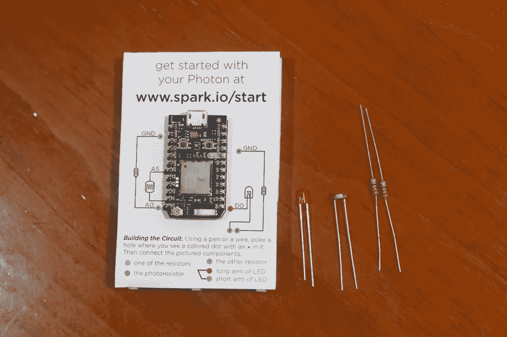

对于我自己的简单测试，我将连接他们提供的 LED，并使用他们的示例代码使其闪烁。我的主要目的是比较将光子连接到 Wi-Fi、在其上获取代码的过程，并比较整体硬件。请放心，在接下来的几个月里，将会有大量更复杂的光子动力演示建立在这个基础上！

我沿用了他们的试验板布局，但我更喜欢将我的微控制器设置在靠近试验板边缘的地方，所以我将布局下移了一点。总的来说，它与光子工具包中提供的草图相同，只是没有连接光传感器。我将 LED 连接到引脚 D0(较长的正端连接到我的试验板上的 B19，较短的一端连接到 B18)，并在地(我的试验板上的 A27)和 LED 的负端(我的试验板上的 A18)之间连接一个电阻。

我们将在本文中进一步选择的示例代码实际上有两个 LED，因此您可以在 D7 上添加第二个 LED，使其更加精彩。我关注的是本文部署过程的快速设置和测试，而不是准确地测试代码本身。

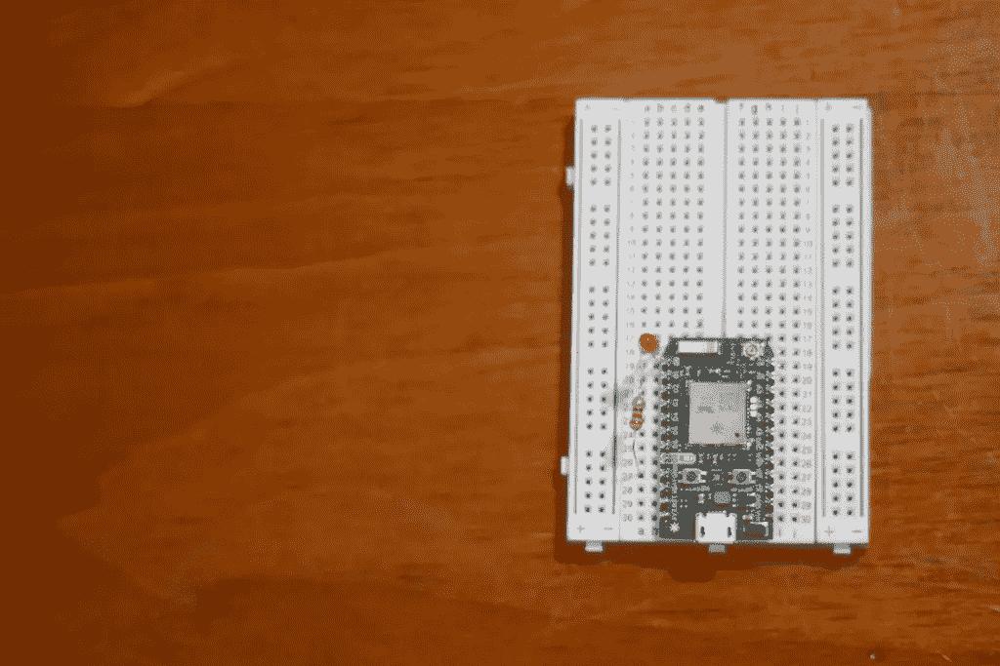

要将 Photon 连接到 Wi-Fi，您可以通过智能手机应用程序或 USB 连接它。我们将在此介绍智能手机应用程序流程。这与核心配对过程的想法几乎完全相同。

你需要新的粒子智能手机应用，你可以在 [iPhone 应用商店](https://itunes.apple.com/us/app/particle-build-photon-electron/id991459054?ls=1&mt=8)和 [Android Play 商店](https://play.google.com/store/apps/details?id=io.particle.android.app)获得。我发现它比 Spark 应用程序漂亮得多，它的设计真的很可爱。我下面的所有说明都是指该应用程序的 Android 版本，我没有机会使用 iPhone 来尝试其他版本，但我假设大多数步骤是相同的。

安装后，使用您的粒子登录登录，您将看到您的设备列表。如果你像我一样，过去玩过粒子核心，你会看到这些已经列出来了:

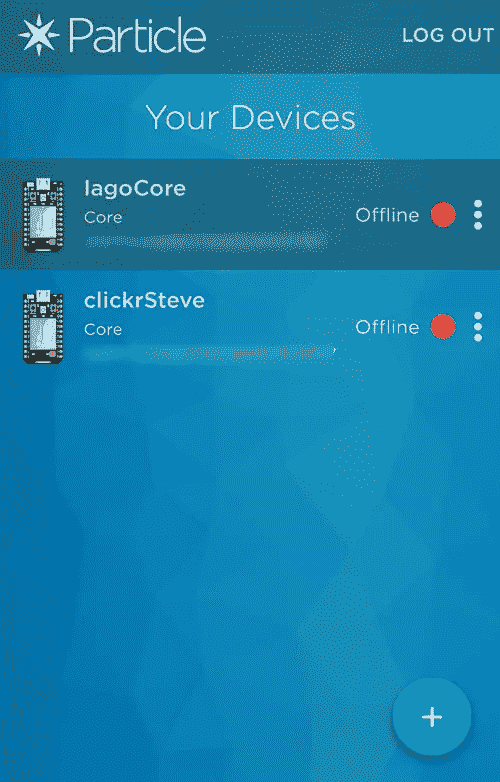

将光子插入电脑或兼容的 USB 电源，使其开始闪烁蓝光。这意味着它正在寻找 Wi-Fi 连接。

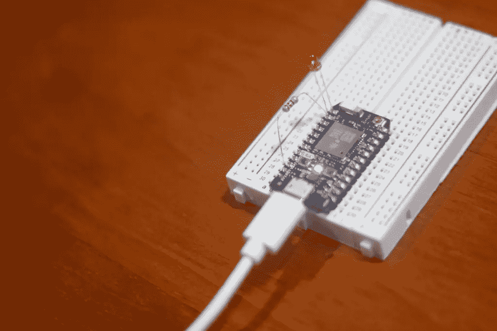

点击右下角的加号图标，并选择“设置光子”来添加您的新设备。

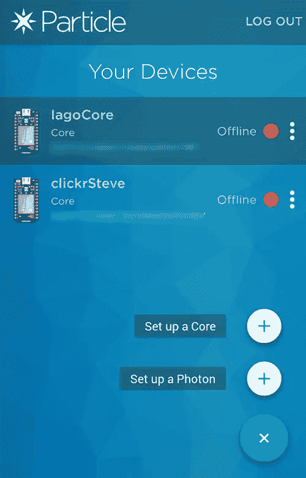

该应用程序会告诉你，以确保你的光子在线，并准备好设置。当您的光子确实准备好了，请单击“准备好”:

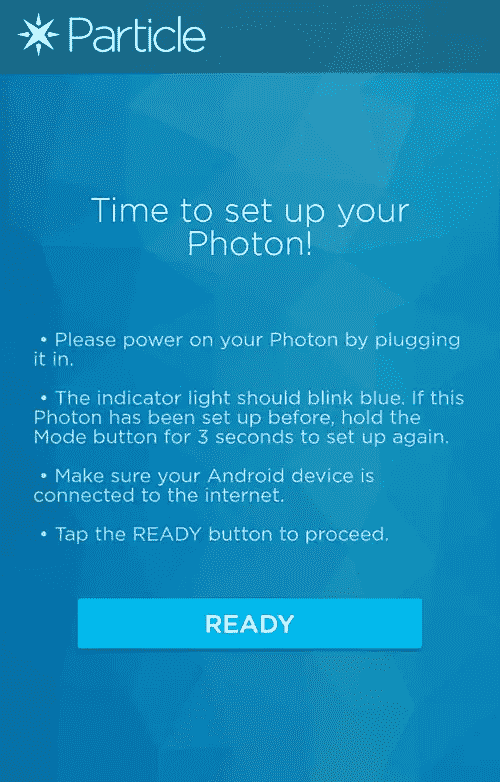

它会搜索并找到你的光子，选择它:

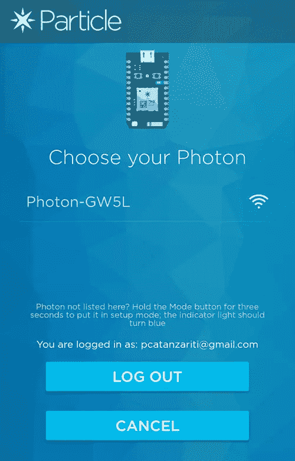

然后，您可以选择希望光子连接的 Wi-Fi 网络。我把附近的无线网络都藏起来了。

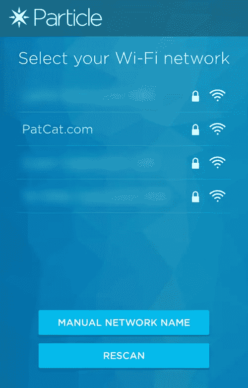

然后输入您的 Wi-Fi 密码并点击“连接”:

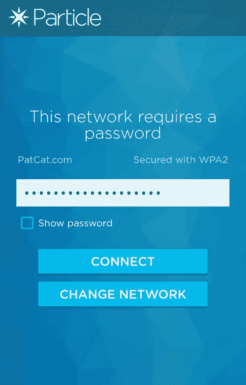

它将为您连接和整理一切:

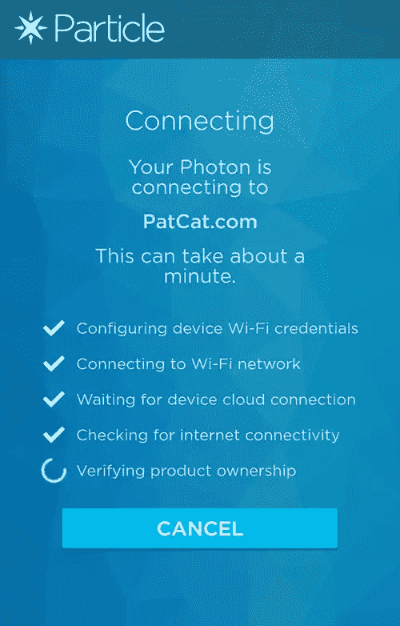

一旦全部配置完毕，您将会看到这个屏幕。选择“完成”:

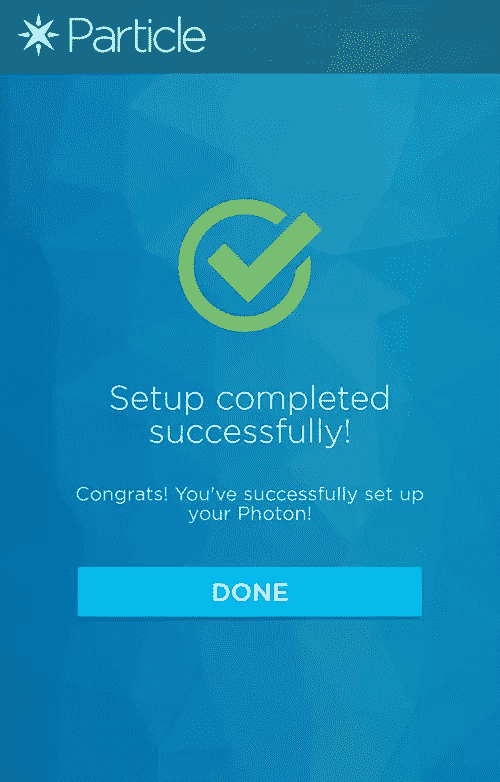

它给你的光子起了一个随机的名字，我的名字是“scraper_station ”,我觉得这个名字有点奇怪。

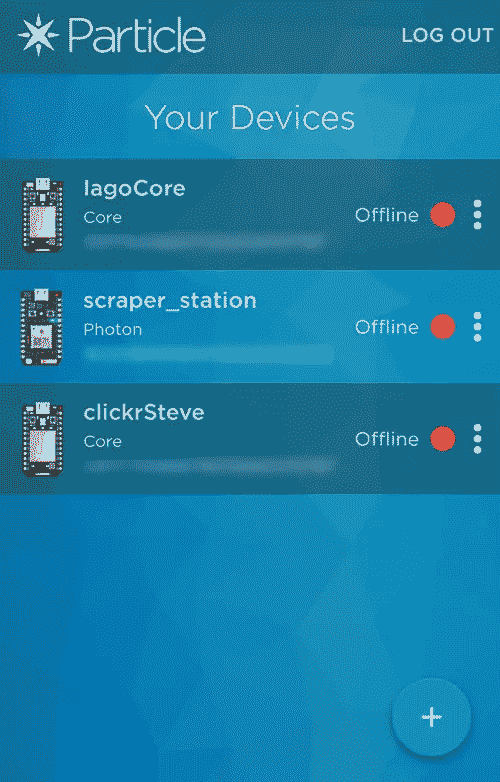

要更改光子的名称，您可以点按设备旁边的三个点，然后从菜单中选取“重命名…”。

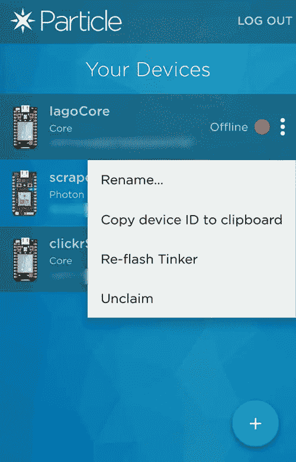

它建议了一个新的随机名称(我承认，我更喜欢这个名称，但仍然决定将其更改为更短的名称):

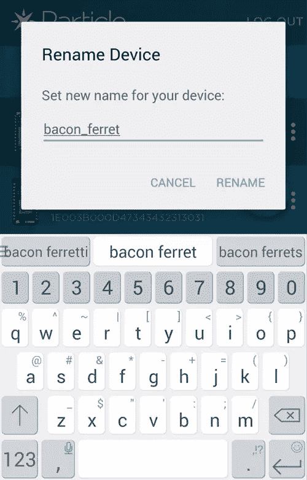

我的光子改名为“丁满”。我坚持我的“IagoCore”的狮子王主题:

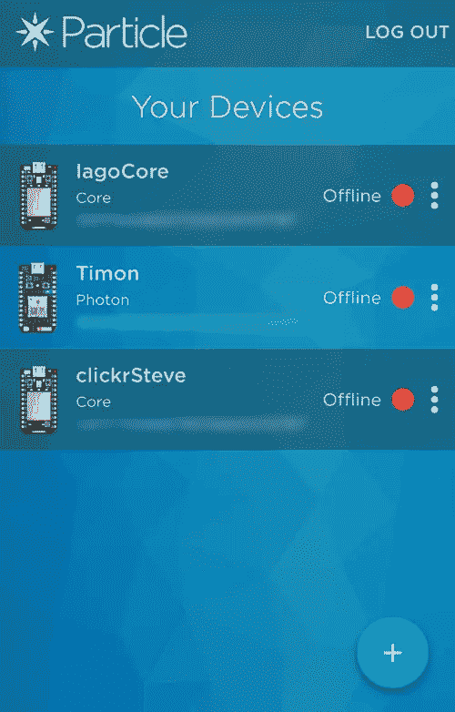

## 把代码放到光子上

这个过程与将代码放入粒子核心完全相同。进入[https://build . particle . io](https://build.particle.io)并打开“闪烁 LED”示例应用。然后点击左下角看起来像十字准线的“设备”图标:

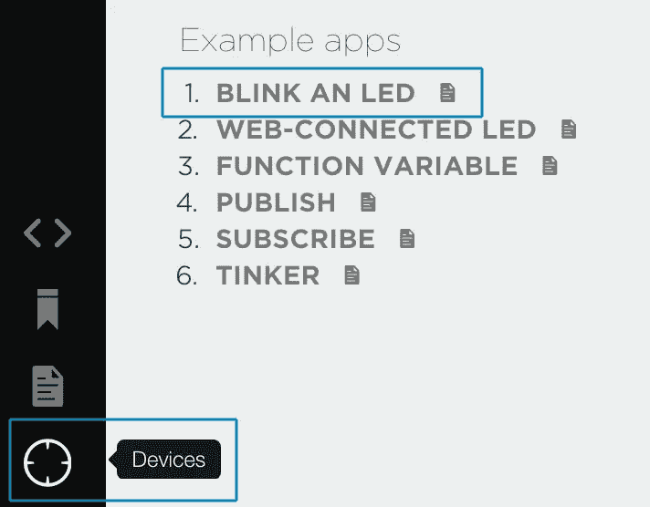

在“设备”菜单上，您会看到一个现在可用的光子部分。你的光子应该在那里等着你。点按它的左侧，给它一个星号，并使它成为您将向其刷新代码的设备。

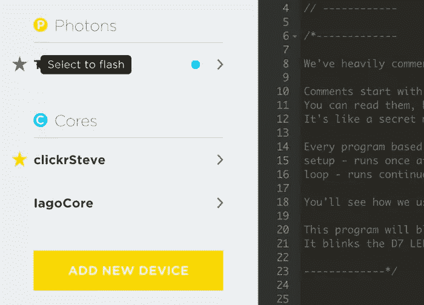

当您的设备被选中时，它旁边应该有一颗黄色的星星:

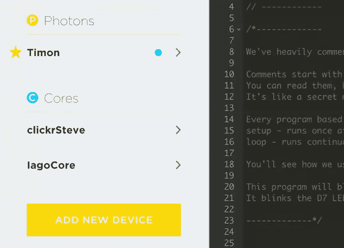

如果您单击左上角的闪电图标，它会将“闪烁 LED”示例闪烁到您的光子上:

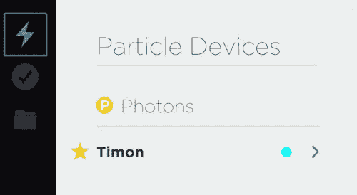

您的设备应该闪烁一会儿洋红色，然后再次呼吸青色。然而，这种青色呼吸也应该伴随着闪烁的 LED 灯！

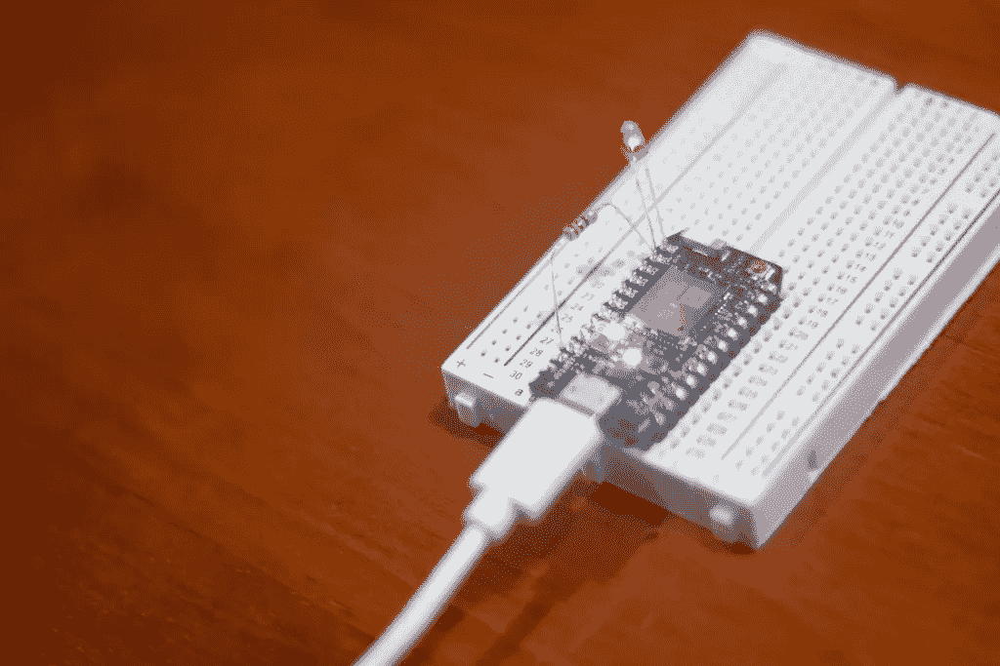

我发现将代码上传到我的设备上花费的时间相当长，但是我是在 4G 连接上做这些的，所以这很可能是原因！我很想听听遵循这个指南的其他人的意见——你的光子用呼吸青色的光子拾取代码并运行它需要多长时间？

## 结论

到目前为止，我对光子印象深刻！令人难以置信的是，光子的售价比核心低 20 美元——19 美元而不是 39 美元！因此，它不仅更快，也同样容易使用…不知何故，它也更便宜。

在接下来的几个月里，我将进一步修补光子，但我很想知道你的想法。你对光子做过什么修补吗？你的经历如何？我特别感兴趣的是看看它能多可靠地连接到我不太好的 Wi-Fi 网络。在初始配置后，我很难让它切换到新的 Wi-Fi 网络，但这可能是我的 Wi-Fi 出了问题。你可以在下面的评论中提供你的想法，或者在 Twitter 上通过 [@thatpatrickguy](https://www.twitter.com/thatpatrickguy) 与我联系。

## 更多链接

渴望了解更多关于光子的知识或发现我遗漏的东西吗？以下链接应该有所帮助:

*   [官方光子入门指南](https://docs.particle.io/guide/getting-started/intro/photon/)
*   [每个光子 LED 灯的颜色代表什么](https://docs.particle.io/guide/getting-started/modes/photon/)
*   [最初的光子公告](http://blog.particle.io/2014/11/12/introducing-the-19-dollar-photon/)

## 分享这篇文章