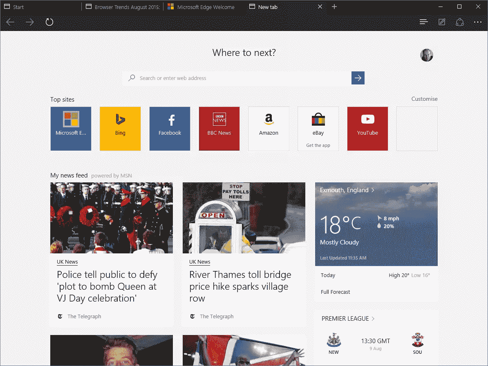
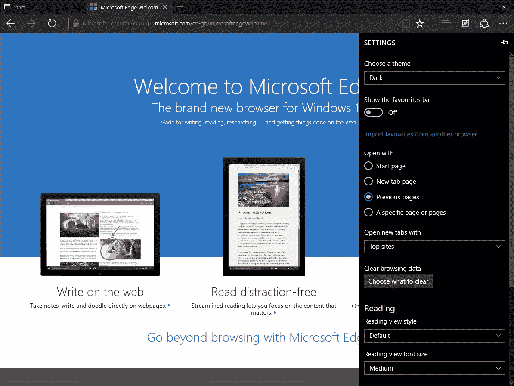
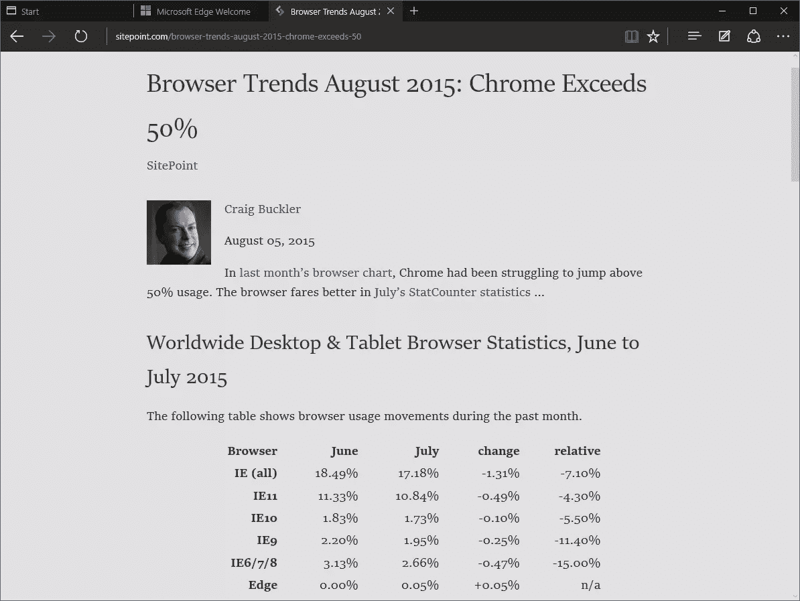
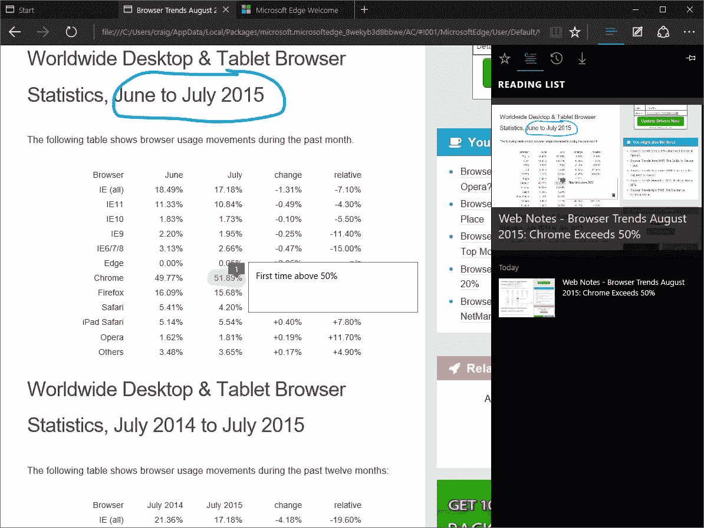
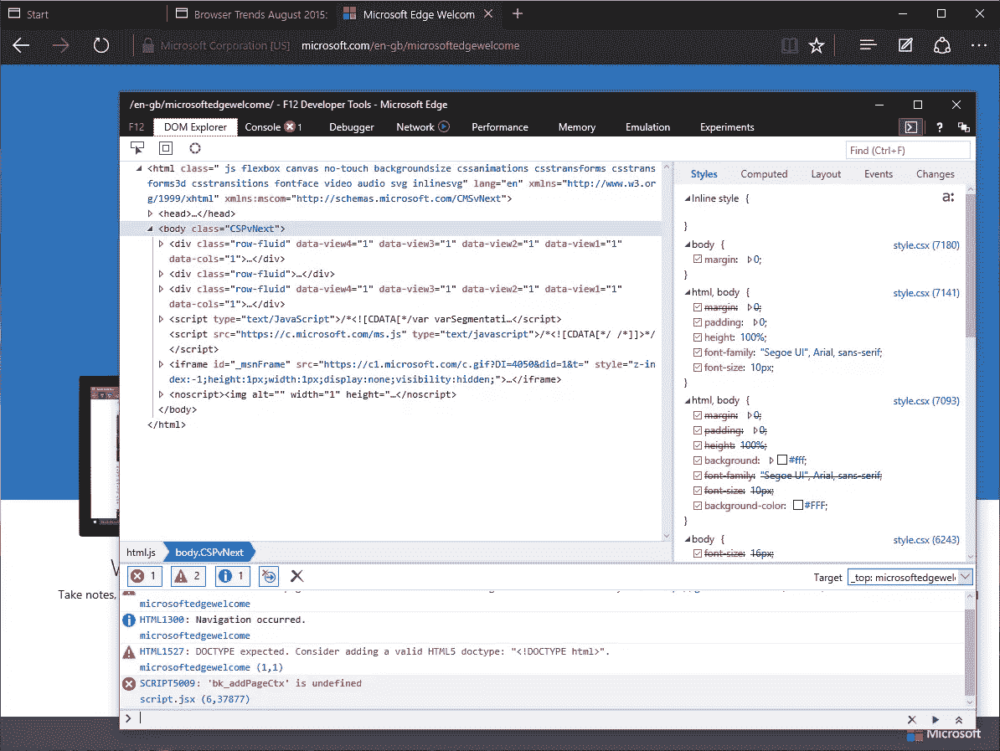

# 微软 Edge:评论

> 原文：<https://www.sitepoint.com/microsoft-edge-review/>

几年来，微软一直在做正确的事情。他们参与社区，修复漏洞并提前[宣布新功能](http://dev.modern.ie/platform/status/) *(某些不太开放的竞争对手可以从他们的例子中学习)*。 [IE11 是一款不错的浏览器](https://www.sitepoint.com/internet-explorer-11-review/)——或者说在 2013 年发布的时候是。尽管如此，IE 的历史遗产依然存在。在最好的情况下，开发者忽略了浏览器，而[的市场份额](https://www.sitepoint.com/browser-trends-august-2015-chrome-exceeds-50/)一直在减少。

为了摆脱被玷污的 ie 品牌，微软发布了 Edge。新浏览器基于相同的 Trident 引擎，但已经消除了臃肿，渲染速度加快，并添加了现代的 HTML5 功能。将 ActiveX 和 VBScript 扔进技术垃圾堆是一个新的开始。

优势是未来，但只有一种方法可以得到它…

## 安装 Windows 10

Windows 7、8 和 8.1 用户可以等待升级，也可以使用 [Windows 10 媒体创建工具](https://www.microsoft.com/en-us/software-download/windows10)强制升级。很少有人会有问题，但也有过吓人的故事。我是其中一个不幸的人，结果有几天机器都不能用了。根据我的经验，最安全的选择是:

1.  备份您的数据、应用程序、配置选项和任何您害怕丢失的东西。然后再次备份。并验证。你不能太小心。
2.  确保您手头有一张 Windows 8 安装 DVD。如果出现任何问题，你需要重新安装或向微软支付新的 Windows 10 许可证。
3.  如果您在 SSD 上安装，您可能需要在 BIOS 中禁用快速启动。
4.  请等待更新，或者从媒体创建工具中选择“升级这台电脑”。从 ISO 或 DVD 安装似乎更成问题。
5.  一旦安装了 Windows 10，请确保它已被激活。这将允许您安装一个全新的副本，而无需升级 Windows 8。

这不是一个完整的评论，但 Windows 10 是一个伟大的操作系统。它弥补了 Windows 8 的漏洞，使系统更加桌面友好。对于那些从任何版本的 Windows 迁移过来的人来说，这是一个相当大的成就。

一个真正的开始按钮又回来了，尽管“所有应用”列表更窄，更不可用。cortana——相当于 Windows 的 Siri 很有趣，尽管她主要使用阿炳搜索。

有一些奇怪和不一致的地方。新的设置面板是一个改进，但旧的控制面板仍然存在，你将经常需要在两者之间切换。一些 Metro(或者他们想叫它什么)应用程序不是为在更小的非全屏窗口中运行而设计的，这可能会导致问题。但许多问题应该在未来几个月内得到解决。大多数人会喜欢 Windows 10 … *但是他们会喜欢 Edge 吗？*

## 推到边缘

Edge 是默认的 Windows 10 浏览器。切换到其他东西很容易(设置>系统>默认应用程序)，但相对来说很少有人会费心。微软现在可以自由地推广 Edge，因为他们已经支付了罚款，并满足了美国和欧盟监管机构的要求。浏览器市场是健康的，所有操作系统都需要一个默认浏览器，无论是 Windows、OS X、Ubuntu、iOS 还是 Android。

如果你遇到网站问题，IE11 仍然存在。也就是说，我在使用 Edge 时没有遇到任何兼容性问题——甚至 Gmail 也能正常工作，尽管有相反的报道。唯一的小问题是，当其他浏览器更持久时，人们倾向于放弃在不稳定的 Wi-Fi 连接上加载网站。

## 界面

我不喜欢后 IE9 界面，但 Edge 看起来很棒:

[](https://www.sitepoint.com/wp-content/uploads/2015/08/1439549689012-edge-review-start.png)

它干净，简约，有一个黑暗的主题，这使它不那么突兀。几乎不需要配置；您不能重新排列面板或图标，但标准视图可以。“中枢”图标*(看起来像左对齐的文本？)*打开一个选项卡式面板，包含收藏夹、阅读列表、历史记录和下载。最后，我们有一个设置面板来取代令人困惑的互联网选项对话框，它已经存在了二十年(尽管它仍然存在于 IE11 中):

[](https://www.sitepoint.com/wp-content/uploads/2015/08/1439549683012-edge-review-settings.png)

## 特征

有一些新功能。阅读视图清理杂乱的页面，类似于其他浏览器提供的视图， [Pocket](https://getpocket.com/) 或 [Instapaper](https://www.instapaper.com/) :

[](https://www.sitepoint.com/wp-content/uploads/2015/08/1439549676012-edge-review-reading.png)

也许网站开发者应该对阅读视图的必要性感到失望，但总会有设计糟糕、过度动画化、广告泛滥的网站。

Web Note 允许您用文本或突出显示内容对网页进行批注，然后保存到您的阅读列表或使用 OneNote 或电子邮件与其他人共享。你的客户会喜欢的。做好被*“我们能不能调整一下这个”*请求轰炸的准备:

[](https://www.sitepoint.com/wp-content/uploads/2015/08/1439549695012-edge-review-webnote.png)

Cortana 是集成的。突出显示一个短语，右键单击并选择“询问 Cortana”以在窗格中显示更多信息。这很有用，但只是对其他浏览器中“搜索谷歌”选项的一个小改进。

奇怪的是，Edge 也是默认的 PDF 阅读器。它简单而快速，运行良好——相对于日益臃肿的 Adobe Reader，它可能成为你的首选。

新功能是受欢迎的，但是有一些奇怪的遗漏——比如标签锁定、同步和扩展。也许微软应该先专注于基础知识？

## 开发者工具

F12 开发人员工具存在于 Edge 中。除了实验性的 JavaScript 编辑选项和无法在浏览器中停靠工具之外，您不会注意到其他重大变化吗？

[](https://www.sitepoint.com/wp-content/uploads/2015/08/1439549670012-edge-review-devtools.png)

开发者工具很好。它们有点落后于 Chrome/Opera 和 Firefox 中提供的那些，但它们感觉很熟悉，你不会介意使用它们。

## HTML5 支持

包括 Edge 在内的所有浏览器在 [Acid3 测试](http://acid3.acidtests.org/)中的得分都是 100/100，所以让我们来考察一下【HTML5test.com】的[结果](http://html5test.com/):

| 浏览器 | 得分 |
| 边缘 | 555 人中的 402 人 |
| IE11 | Three hundred and forty-eight |
| 火狐 39 | Four hundred and sixty-seven |
| 铬 44 | Five hundred and twenty-six |

有些人会宣称这证明 Chrome 比它好 30%,但 Edge 主要是缺少一些更新的技术，比如

*   web 组件
*   WebRTC
*   `picture`元素
*   服务人员
*   服务器发送的事件
*   网络通知
*   画布绘图图元
*   一些表单域和音频/视频编解码器。

其中许多在 Chrome 中是实验性的，可能会改变，或者只影响少数前沿应用。幸运的是，大多数不是在开发中就是在考虑中。就个人而言，我很高兴看到 CSS3 `transform-style: preserve-3d`属性得到了支持！

如果你想和朋友分享有趣的笑声，看看 Edge 的用户代理字符串:

```
Mozilla/5.0 (Windows NT 10.0; Win64; x64) AppleWebKit/537.36 (KHTML, like Gecko) Chrome/42.0.2311.135 Safari/537.36 Edge/12.10240
```

它提到了除 MSIE 之外的所有主流浏览器！

## 表演

我不能声称实验室条件严格，但这些是我在新安装的 Windows 10 PC 上的结果，在单标签浏览器中启动，没有运行其他应用程序。数字越大，性能越好:

| 基准 | 边缘 | IE11 | 铬 | 火狐浏览器 |
| [JetStream](http://browserbench.org/JetStream/) | 152.92 ± 5.1131 | 98.522 ± 3.6815 | 141.61 ± 2.2098 | 121.01 ± 12.019 |
| [辛烷 2.0(谷歌)](http://octane-benchmark.googlecode.com/svn/latest/index.html) | Twenty-three thousand nine hundred and eighty-four | Twelve thousand two hundred and thirty-five | Twenty-four thousand six hundred and seventy-two | Twenty-two thousand two hundred and nine |
| [4000 条鱼的水族馆(微软)](http://webglsamples.org/aquarium/aquarium.html) | 28 fps | 20 帧/秒 | 17 fps | 10 帧/秒 |

Edge 总体上胜出，在(谷歌拥有的)辛烷值测试中仅比 Chrome 稍慢。基准测试不一定是性能的证明，但 Edge 感觉比竞争对手更快、反应更快。内存使用类似于 Chrome，尽管它似乎需要更少的进程。

如果你想要性能，Edge 是你能得到的最快的浏览器。也许一旦它背负着扩展的负担，这种情况就会改变，但现在，Edge 赢得了这场比赛。

## 结论

微软承诺定期更新，但 Edge 1.0 已经是一款很棒的浏览器了:

### 赞成的意见

*   疯狂的快速和响应
*   一个吸引人的、干净的、不显眼的界面
*   卓越的网站兼容性
*   良好的操作系统集成
*   大幅改进的设置面板
*   良好、可靠的开发工具
*   一些创新功能
*   改进的 HTML5 支持，没有传统的 cruft
*   IE 棺材上的又一颗钉子。

### 骗局

*   只有 windows 10——IE 还不会死
*   少数定制选项
*   一些奇怪的遗漏，如标签固定
*   没有扩展功能。

IE11 很好，但是我从来没有把它当作我的默认浏览器。有一些小问题阻止我全职迁移到 Edge，但我已经比以前更多地使用它了。我怀疑要求较低的 Windows 10 用户会坚持使用浏览器。它比 Chrome 或 Firefox 更快更好看。即使是铁杆超级用户也不会介意在开发过程中或在奇怪的浏览会话中切换到 Edge。你甚至会发现自己很享受这种体验！

假设微软能够保持更新，Edge 的未来很有希望。相互竞争的供应商不能自满。

## 分享这篇文章