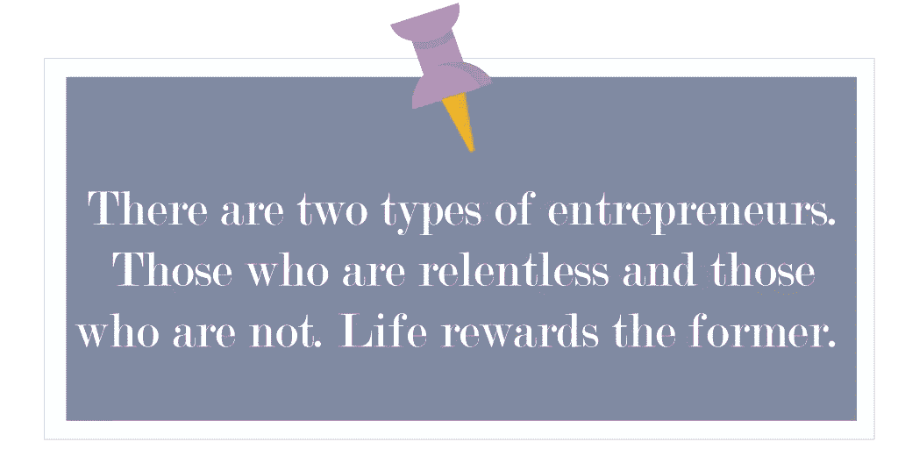
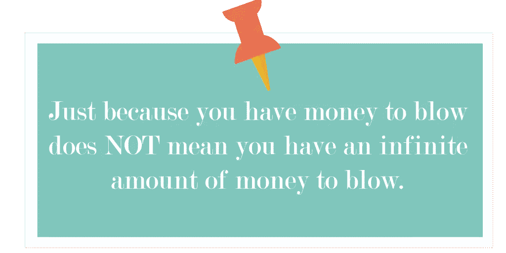

# 创业公司最难学的 4 课

> 原文：<https://www.sitepoint.com/hardest-lessons-for-startups/>

谷歌的 [重组](http://www.nytimes.com/2015/08/11/technology/google-alphabet-restructuring.html?action=click&contentCollection=Technology&module=RelatedCoverage&region=Marginalia&pgtype=article) 。

Zen99 的[关](https://medium.com/@tmzier/zen99-is-closing-its-doors-8-25-169830ec7da8) 。

Zirtual 的 [消失了](http://techcrunch.com/2015/08/10/zirtual-pause/?ncid=rss) (然后 [重新出现](https://medium.com/@marenkate/zirtual-what-happened-and-what-s-next-f9bd493ecc49) )。

和 Homejoy 的 [弃船](http://techcrunch.com/2015/07/17/homejoy-is-shutting-down-at-the-end-of-the-month/) 。

对于一个充满渴望和幻想的企业家来说，这是一个在不到一周的时间内消化的坏消息。

作为一名 [的创业型创始人](http://freelanship.com) 我自己，这简直吓死我了——直到我振作起来，做了一些阅读，并从所有这些令人沮丧的创业新闻中推断出一些非常重要的教训。

在这篇文章中，我与你分享我的学习，这样你就不会想要放弃你的梦想——至少今天不会。

## 要点 1:你必须把自己拆成碎片，否则别人会拆了你。

******

作为公司的创始人和高管，你的最终目标是将消费者的需求与技术上的可能性联系起来。

如果你有一个新的创新，甚至是一个想法的暗示，可以解决你的客户的一个强烈感受和长期遭受的痛点，那么你不仅应该为他们，也应该为你自己，将这个新产品或服务公之于众。

如果你不这么做，因为你担心这会损害你目前的公司，那么你最好相信其他人会想到这个解决方案并将其推向市场。然后呢？反正你已经出局了。

这就是谷歌重组的原因。

他们知道，要想站在创新的顶端和前沿，他们需要拆自己的台。这也正是苹果长期保持领先地位的原因。

为了防止你不相信我，这里还有一个快速的轶事(和一个统计数据)来说明这一点。

[上世纪 20 年代一家 S & P 500 公司的平均寿命](http://www.bbc.com/news/business-16611040) 是 67 年。2012 年，平均寿命仅为 15 岁。

问题:你知道柯达实际上发明了数码相机吗？

很可能不会，因为柯达担心损害其胶片业务，所以没有将其创新商业化。

当柯达意识到他们没有把这种产品推向市场是愚蠢的时候，已经太晚了。佳能和富士胶片早已巩固了自己作为数码相机市场领导者的地位，而到了 2012 年，在130 岁的时候，柯达被迫申请破产保护。

**#尴尬#愚蠢**

## 秘诀 2:你必须绝对坚持不懈，并且具有极强的适应能力。

****

有两种类型的企业家——坚持不懈的和不坚持不懈的。你想成为前者——当然，前提是你想成为游戏规则的改变者。

如果创始人更关注客户而不是融资，我们会看到这么多资金充足的创业公司倒闭吗？

如果你想知道，答案是:“不，我们不会。”

Zen99 在点播行业 一有风吹草动就把投资人的几百万 [退了回去，跳槽了。这是后一类企业家的一个例子。](http://www.businessinsider.com/uber-driver-lawsuit-judge-deciding-whether-to-grant-class-status-2015-8)

前一种坚韧不拔的企业家的一个例子是优步的 CEO 特拉维斯·卡兰尼克，他将赢得 **，因为他别无选择** 。

阅读这篇节选自今年早些时候的一篇 [文章](http://www.buzzfeed.com/johanabhuiyan/its-already-over-and-uber-has-won#.dpW4x2KdJ1) :

> 2014 年 1 月，伊利诺伊州参众两院在优步之后出台了一系列新规定。他们禁止司机进入机场，并限制了他们每天可以坐在方向盘后面的时间。然而，优步没有退出市场，而是动员了近 90，000 名消费者向州长请愿，要求否决这些规定。他做到了。然后优步抓住要害，公布了立法者的联系信息，否则他们可能会试图推翻否决。当一名立法者提出动议时，伊利诺伊州的立法机关已经被愤怒的优步消费者吓得够呛，该动议立即被否决了。

我的企业家朋友们，这是最不妥协的表现。

**#胜利#无情**

## **要点三:你需要透明。**

****

正如我父亲常说的，“只要对我坦诚，我会比你一开始不坦诚的时候更加理解你所做的一切。”

当我看到 TechCrunch 的标题:“ [*虚拟助手启动 Zirtual 是‘暂停所有操作*](http://techcrunch.com/2015/08/10/zirtual-pause/) ”时，我惊讶得目瞪口呆”

然后我不得不在读邮件的时候再把它捡起来。

对于他们的关闭，我并不感到惊讶。我对**他们是如何处理的感到惊讶。**

 **据文章中引用的 Zirtual 助理 Traci Hare 说，她是在 Zirtual 向媒体宣布关闭的当天早上才得知这个消息的！

> 我和其他 500 名 Zirtual 员工一样，被首席执行官马人·凯特·多诺万发来的一封电子邮件吓了一跳，邮件称该公司自周五晚上起不再营业。我们中的许多人都是全职父母，努力平衡工作和生活，这样我们就可以在白天和孩子在一起，而不必把他们放在日托所。我们不知道最后一周的工作是否会得到报酬，我们是否还有医疗保险，或者我们是否有资格失业。说我们陷入困境是一种保守的说法。

当公司在没有通知 500 多名员工的情况下关闭商店时，它们不能指望忠诚的员工(或提前两周通知的员工)。

***透明就好。***

如果你做到了，人们会更加宽容。

老实说，我非常怀疑 Zirtual 是否会成功，不管它收到了多少额外的资金，因为，嗯，现在我们不能信任他们了。

**#透明度**

## **外卖 4:钱花不完。**

****

仅仅因为你有钱可花，并不意味着你有无限的钱可花。

Homejoy 被迫关闭，原因很简单，他们无法筹集更多资金来维持业务。这是一个本不该发生的问题，因为 Homejoy 迄今已筹集了近 4000 万美元的资金。

在得知 Homejoy 倒闭的消息后，我碰巧看到了第一轮合伙人罗布·海斯(Rob Hayes)的一篇关于第一轮的文章，他在文章中详细介绍了他给所有第一次创业的人的三条关键建议。

Hayes 的一条建议特别适合这一课。是 2 号，上面写着，

“不要把钱用完。”

> 创始人应该一直担心手头的现金。即使员工爱你，如果你不能支付他们，他们也不会留下来…你能做的最好的事情之一是与你的投资者和顾问分享你的现金计划(无债务和收入)。它建立了直接的责任。
> 
> 你想确保如果发生了什么事，有人会在那里问，“搞什么鬼？怎么回事？”
> 
> Hayes 说:“人们经常会忽略这一点，真是疯了。“在早期，我知道这只是关于现金。这是你必须花并且应该花的所有钱。”

**#NoMoneyToBlow**

****

## 分享这篇文章**