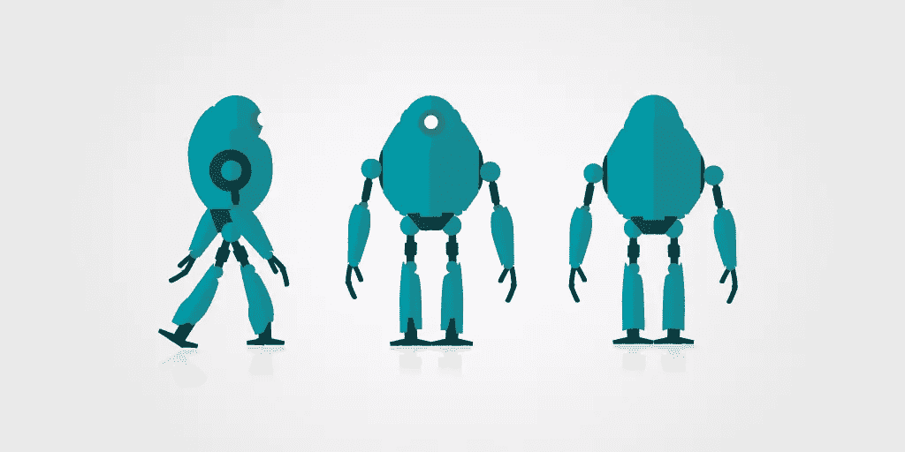

# 提高生产力的 18 个最佳 IFTTT 食谱

> 原文：<https://www.sitepoint.com/best-ifttt-recipes-productivity/>

有很多创造性的生产力黑客。但是你可能已经发现，它们中的大部分都是完全不切实际的。当然，你可以提前一个小时起床，但是你也可以提前一个小时睡觉。或者你可以工作 20 分钟，中间休息 5 分钟——但不可避免的是，这些休息时间会延长到 8 分钟，然后 10 分钟。

与其尝试和失败怪异的生产力建议，不如掌握你的时间 *正确的* 方式:用 IFTTT 食谱。

IFTTT 代表“如果这个，那么那个”它的网站上有成千上万的“食谱”这些食谱是自动化的过程，旨在使你的生活更简单，并由预先选择的行动或事件触发。

虽然浏览一下 [完整的食谱清单](https://ifttt.com/recipes) 是值得的，但这里是我的 18 个更有效率的选择。

## **电子邮件:**

大多数专业人士会告诉你电子邮件是他们最大的时间消耗。幸运的是，有几种方法可以简化你的收件箱。

注意:这些食谱中的大多数都需要一个谷歌账户。

### 1。[将我的电子邮件附件保存到 Google Drive](https://ifttt.com/recipes/99068-save-my-email-attachments-to-google-drive)

如果你经常收到文件，这个食谱是个不错的选择。你再也不用翻遍你的电子邮件来寻找你的同事几个月前发给你的 Word 文档……另外，如果你不在工作电脑旁，需要查看一个文件，你也可以轻松地访问它。

### 2。[如果我在 Gmail 中打开了一封邮件，创建一个提醒来处理它](https://ifttt.com/recipes/126848-if-i-star-an-email-in-gmail-create-a-reminder-to-take-care-of-it)

我们都打开过电子邮件，并决定不马上回复；不幸的是，我们都忘记回复这些邮件了。有了这个食谱，你可以安全地推迟回复邮件。

### 3。[只需在 Gmail 上贴上“Evernote”的标签，就可以发送到那里](https://ifttt.com/recipes/2174-simply-label-a-gmail-evernote-to-send-it-there)

也许你会不断收到正文中包含有用内容的消息，如提示、项目反馈、电话号码等。将这些邮件转发到 Evernote，快速保存它们。

### 4。[收到高优先级邮件时得到通知](https://ifttt.com/recipes/307819-get-a-notification-when-you-receive-a-high-priority-email)

非常不言自明。

## **工作**

不管你是在家工作，在小隔间工作，在当地的咖啡店工作，还是在世界各地工作，这些食谱都会让你更有效率。

### 1。[通过电子邮件向某人发送你的位置](https://ifttt.com/recipes/226624-send-someone-your-location-via-email)

很多时候，快速告诉别人你在哪里会很有帮助。也许你经常出差，你需要让你的同事知道你的位置。或者你开会要迟到了，你想让别人知道你就快到了。

### 2。[离开会议——给自己打个电话](https://ifttt.com/recipes/257257-get-out-of-a-meeting-send-yourself-a-phone-call)

说到会议，这是一个逃离低效会议的巧妙方法。

### 3。[让你的团队知道你何时离开](https://ifttt.com/recipes/227077-let-your-team-know-when-you-re-away)

也许你正跑出去吃午饭或喝杯咖啡，或者提前回家。不管是哪种情况，如果你的同事知道你走了，他们会做出相应的反应——这样你就不会回到十亿个“你去哪儿了？”消息。

### 4。[将你的工作时间记录在 Google Drive 的电子表格中](https://ifttt.com/recipes/234848-log-your-work-hours-in-a-spreadsheet-on-google-drive)

如果你是企业家、远程工作者或自由职业者，这将让你看到你实际上在项目上花了多少时间。

### 5。[将下一个小时设为“请勿打扰”](https://ifttt.com/recipes/192149-block-off-the-next-hour-as-do-not-disturb)

为了表示你不想被打扰(不惹怒任何人)，打开“请勿打扰”菜单。你的谷歌日历会显示你接下来的 60 分钟很忙。我们建议与您的同事共享您的 Google 日历，以便更好地利用它。

### 6。[将手写笔记保存到 OneNote](https://ifttt.com/recipes/258136-save-your-handwritten-notes-to-onenote)

用手记笔记被低估了；它不仅能帮助你比输入笔记更好地记住信息，还能让你专注于说话的人，而不会被诱惑去看短信、电子邮件、社交媒体等等。但是手写的笔记不方便以后参考。通过将您的上传到云服务(如 OneNote)来轻松解决问题。

### 7。[记账](https://ifttt.com/recipes/226644-keeping-tally-on-anything)记账

这个食谱太棒了。正如制作者解释的那样， “它 让你可以简单地计算一天中发生的 事件，无论是你喝了多少杯咖啡，你多久从办公桌前站起来一次，还是你一天中笑了多少次。每次你按下按钮，它都会被存储在一个 Google Drive 电子表格中。”

我们建议使用这个食谱来保持注意力集中。每当你发现自己分心的时候就按这个按钮。或者用它来跟踪你完成的任务；看到它们堆积在电子表格中可能正是你需要的动力。

## **社交媒体**

对我们大多数人来说，社交媒体已经从我们在业余时间做的事情变成了对我们的职业生涯有帮助的事情。这些食谱减轻了不断发布新的、相关的、有帮助的帖子的压力。

### 1。[自动将 Instagram 帖子发布为推特照片](https://ifttt.com/recipes/103249-automatically-post-your-instagrams-as-twitter-photos)

通过同步你的 Instagram 和 Twitter 账户，将两篇文章合二为一。更好的是:这是让你的 Instagram 照片在 Twitter 上显示为完整图片(而不是链接)的唯一方法。

### 2。[使用 Buffer 分享你最新的 Feedly 资源](https://ifttt.com/recipes/99553-use-buffer-to-share-your-latest-feedly-sources)

许多专业人士通过 Feedly 订阅他们最喜欢的网站(如果你没有， [试试](https://feedly.com/i/welcome) ！)现在，你可以自动在 Twitter、脸书和 LinkedIn 上与你所有的粉丝分享你的阅读材料。

### 3。[将你在脸书发布的新链接分享到 Twitter](https://ifttt.com/recipes/105786-share-new-links-you-post-on-facebook-to-twitter)

又是一笔买二送一的交易。当然，如果你的脸书页面是专业的，你应该安装这个食谱。

### 4。[保留一份你收藏过其推文的人的名单](https://ifttt.com/recipes/157212-keep-a-list-of-people-whose-tweets-you-ve-favorited)

在旅途中，你并不总是有时间查看个人的推特资料。有了这个食谱，你可以创建一个自我管理的潜在客户列表。

## **人生**

有了这些杂七杂八的食谱，你可以消除生活中的一些“痛点”。

### 1。[保存收据到 Evernote](https://ifttt.com/recipes/222385-save-receipts-to-evernote)

这个食谱会在税收季节为你节省时间。快速给收据拍照，它会自动保存到你的 Evernote 帐户。然后你可以对你的费用进行分类(例如，“业务费用”、“个人费用”、“慈善费用”、“旅行费用”等)。).你也可以搜索它们。

### 2。[阅读一周热门商业日文章的摘要](https://ifttt.com/recipes/197665-read-a-digest-of-the-week-s-popular-business-day-articles)

在商业世界中保持与时俱进总是个好主意。然而，你可以定制这个食谱来与任何 *【纽约时报】* 栏目合作，从技术或书籍到你的金钱或美国

### 3。[在谷歌日历上的任何活动开始前收到短信提醒](https://ifttt.com/recipes/13-get-an-sms-alert-before-any-event-starts-on-your-google-calendar)

在谷歌日历中，要求在活动前收到通知需要几个额外的步骤——但当你通过 IFTTT 这样做时，你会收到每个条目的文本。

## 分享这篇文章