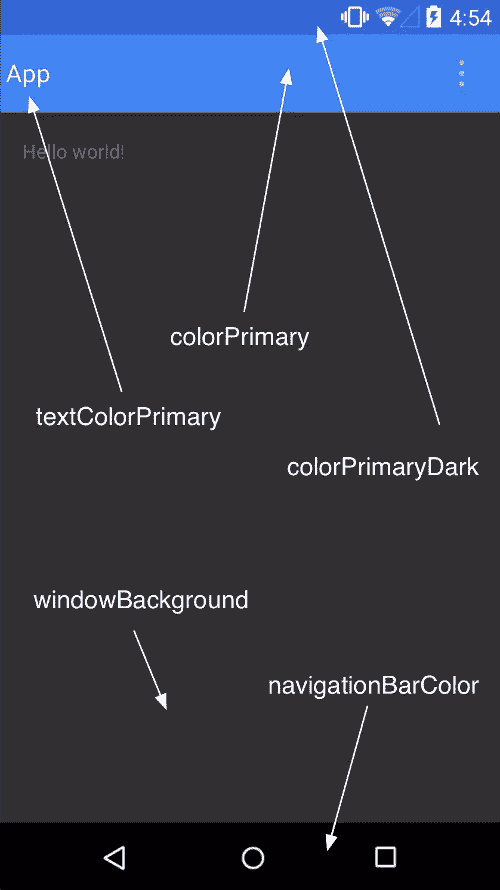
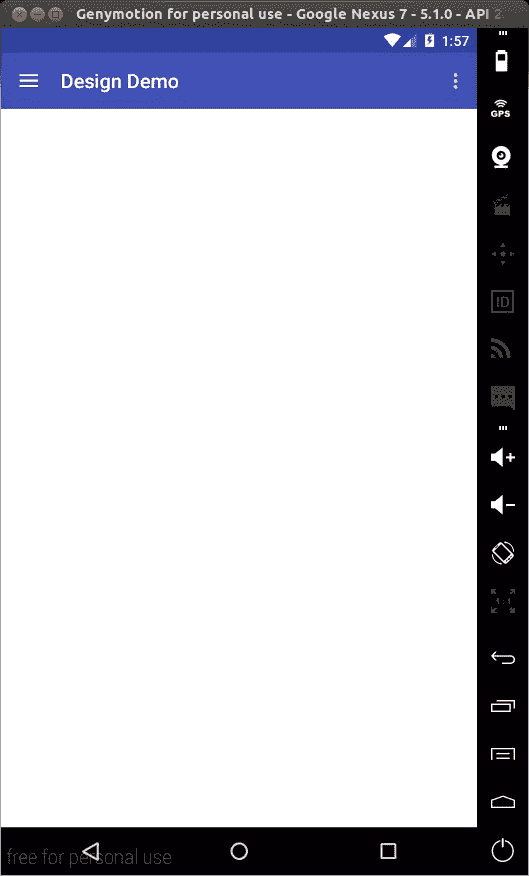
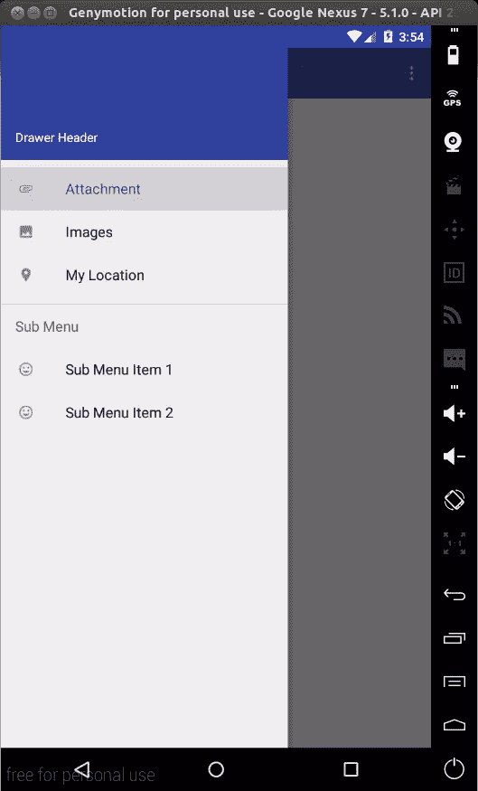
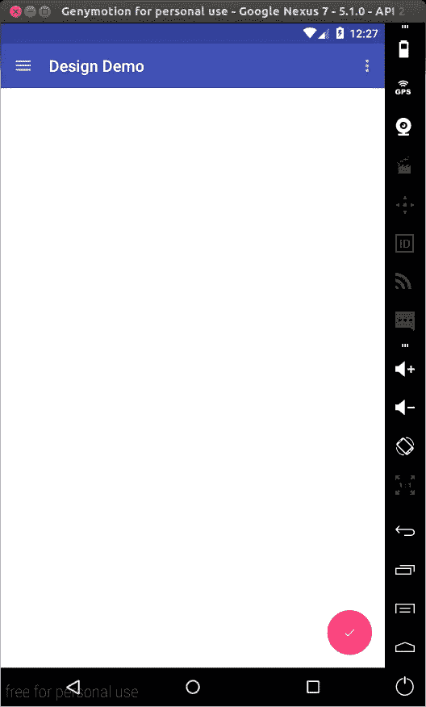
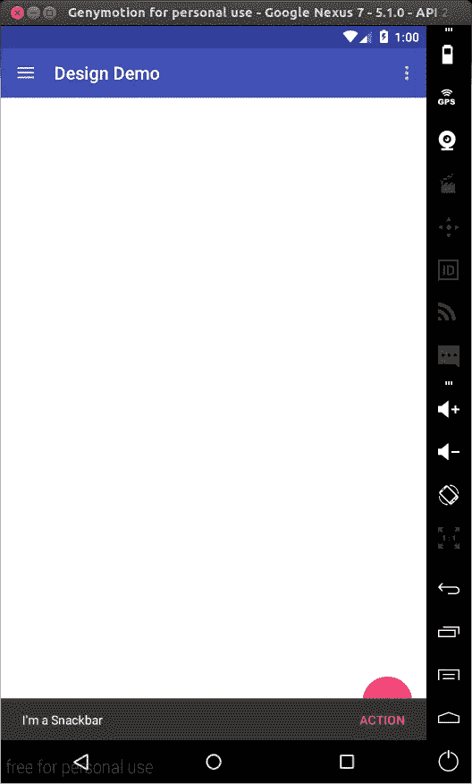
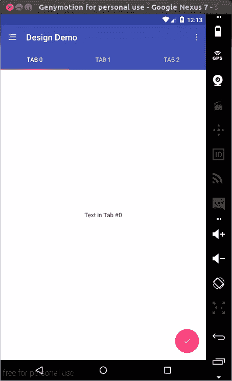
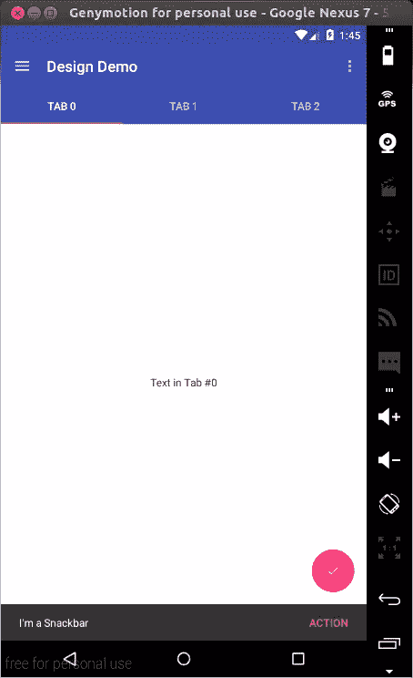
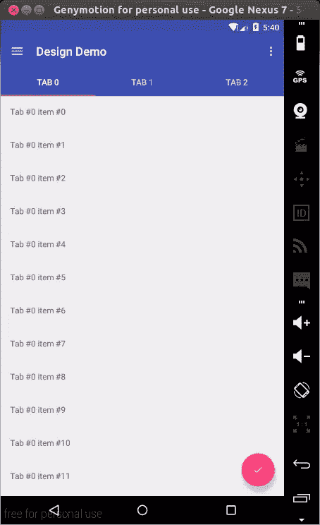
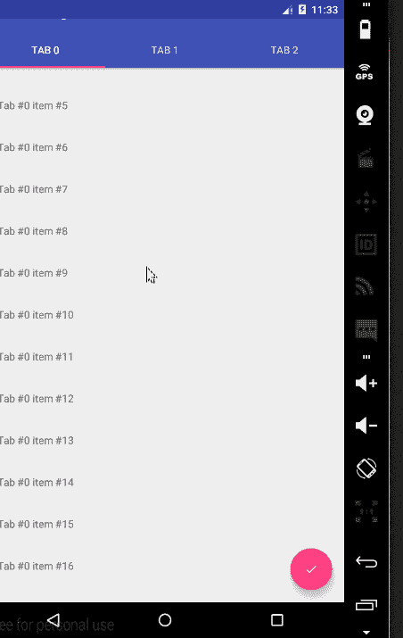

# 使用 Android 设计支持库进行材料设计

> 原文：<https://www.sitepoint.com/material-design-android-design-support-library/>

Material Design 是一种新的设计语言，它为 Android 应用程序和其他平台上的应用程序提供设计指南，随着 Android 5.0 Lollipop 的发布而引入。

随之而来的是新的用户界面组件，比如“浮动操作按钮”。在确保向后兼容性的同时实现这些新组件通常是一个乏味的过程。通常需要第三方库来简化流程。

在今年的谷歌 IO 大会上，谷歌推出了 Android 设计支持库，为开发者带来了许多重要的材料设计组件。这些组件是向后兼容的，支持回到 Android 2.1，实现它们比以前更容易。该库包括一个导航抽屉视图，用于编辑文本的浮动标签，一个浮动操作按钮，snackbar，标签和一个将它们联系在一起的运动和滚动框架。在本教程中，我们将创建一个展示这些组件的应用程序。

## 入门指南

你可以在 [gitHub](https://github.com/sitepoint-editors/Design-Demo) 上找到最终的项目代码。

在开始组件之前，我们将设置项目并设置一些样式。使用 Android Studio 创建一个新的 Android 项目。将其命名为“Design Demo ”,并将其他设置保留为默认设置，确保 SDK 的最低版本为 API 级别 15。

将以下依赖项添加到 *build.gradle* (Module:app)文件中。

```
compile 'com.android.support:design:22.2.1'
compile 'com.android.support:cardview-v7:22.2.1'
```

第一条语句添加了设计支持库，第二条语句添加了 CardView 库，我们稍后会用到。将项目与更新的 Gradle 文件同步。这可能需要下载一些支持库。

在 *res/values* 文件夹中创建一个名为 *colors.xml* 的资源文件。修改如下:

```
<?xml version="1.0" encoding="utf-8"?>
<resources>
    <color name="primary">#3F51B5</color>
    <color name="primary_dark">#303F9F</color>
    <color name="accent">#FF4081</color>
</resources>
```

修改 *res/values/strings.xml* 如下。这些是我们这个项目需要的所有字符串:

```
<resources>
    <string name="app_name">Design Demo</string>
    <string name="hello_world">Hello world!</string>
    <string name="action_settings">Settings</string>
    <string name="nav_item_attachment">Attachment</string>
    <string name="nav_item_images">Images</string>
    <string name="nav_item_location">My Location</string>
    <string name="nav_sub_menu">Sub Menu</string>
    <string name="nav_sub_menu_item01">Sub Menu Item 1</string>
    <string name="nav_sub_menu_item02">Sub Menu Item 2</string>
    <string name="drawer_header_text">Drawer Header</string>
    <string name="second_activity_text">Lorem ipsum dolor sit amet, consectetur adipiscing elit. Proin consectetur diam id aliquam scelerisque. Donec ultrices lacus vel dignissim pharetra. Vivamus pharetra augue quis rhoncus placerat. Sed ultricies at risus non cursus. Nam rutrum leo nec placerat consectetur. Vestibulum feugiat eleifend diam, nec interdum augue tincidunt sit amet. Praesent feugiat est auctor lacus consectetur, vitae pellentesque dolor laoreet.</string>
    <string name="title_activity_second">SecondActivity</string>
</resources>
```

修改`res/values/styles.xml`如下:

```
<resources>

    <!-- Base application theme. -->
    <style name="AppTheme" parent="Theme.AppCompat.Light.NoActionBar"> <!-- Customize your theme here. -->
        <item name="colorPrimary">@color/primary</item>
        <item name="colorPrimaryDark">@color/primary_dark</item>
        <item name="colorAccent">@color/accent</item> </style>

</resources>
```

在上面的代码中，我们通过设置材料设计指南中指定的原色、原色暗和强调色来自定义了应用程序的[调色板](https://developer.android.com/training/material/theme.html#ColorPalette)。

其他可以自定义的主题设置如下图所示。

注意，我们没有在项目名称前加上前缀`android:`(例如`android:colorPrimaryDark`)。这是为了向后兼容。`android:`注释要求将最低 API 级别设置为 21。我们使用一个带有`NoActionBar`的主题，因为我们将使用一个工具栏作为我们的动作栏(或者现在叫做 AppBar)。



(来源:[https://developer.android.com/training/material/theme.html](https://developer.android.com/training/material/theme.html))

要创建工具栏，请修改 *res/layout/activity_main* :

```
<RelativeLayout xmlns:android="http://schemas.android.com/apk/res/android"
    xmlns:tools="http://schemas.android.com/tools"
    android:layout_width="match_parent"
    android:layout_height="match_parent"
    tools:context=".MainActivity">

    <android.support.v7.widget.Toolbar
        android:id="@+id/toolbar"
        android:layout_width="match_parent"
        android:layout_height="?attr/actionBarSize"
        android:background="?attr/colorPrimary"
        android:theme="@style/ThemeOverlay.AppCompat.Dark" />

</RelativeLayout>
```

上面，我们移除了`RelativeLayout`上的默认填充，并从支持库中添加了一个工具栏。如果您支持 API 级别 21 及以上的设备，您只需要使用默认的工具栏组件，而不需要使用支持库中的组件。

在*MainActivity.java*修改`onCreate(Bundle)`的方法:

```
@Override
protected void onCreate(Bundle savedInstanceState) {
    super.onCreate(savedInstanceState);
    setContentView(R.layout.activity_main);

    Toolbar toolbar = (Toolbar) findViewById(R.id.toolbar);
    setSupportActionBar(toolbar);
    ActionBar actionBar = getSupportActionBar();
    actionBar.setHomeAsUpIndicator(R.drawable.ic_menu);
    actionBar.setDisplayHomeAsUpEnabled(true);
}
```

[从 gitHub](https://github.com/sitepoint-editors/Design-Demo/tree/master/app/src/main/res) 下载项目资源，其中包含可绘制的文件夹，您可以将其粘贴到 *res* 目录中，这样上面的代码就不会出错。

当 Android Studio 提示时，确保从支持库中导入工具栏。

在上面的代码中，我们获得了对工具栏的引用，并将其设置为操作栏。然后我们得到一个动作栏的引用，并将它的主页图标设置为[臭名昭著的汉堡菜单图标](http://www.bbc.com/news/magazine-31602745)。

运行应用程序，你应该看到工具栏设置为应用程序的 AppBar。



## 导航视图

导航抽屉是 Android 应用程序中的常见组件。这是在 Android 上构建导航层次的方法之一，其他的是选项卡和微调器。实现一个从来都不是一个快速的过程，但是现在有了设计支持库，它的实现就简单多了。

首先，修改 *activity_main.xml* ，如图所示。

```
<android.support.v4.widget.DrawerLayout
    xmlns:android="http://schemas.android.com/apk/res/android"
    xmlns:app="http://schemas.android.com/apk/res-auto"
    android:id="@+id/drawer_layout"
    android:layout_width="match_parent"
    android:layout_height="match_parent"
    android:fitsSystemWindows="true">

    <RelativeLayout
        android:layout_width="match_parent"
        android:layout_height="match_parent">

        <android.support.v7.widget.Toolbar
            android:id="@+id/toolbar"
            android:layout_width="match_parent"
            android:layout_height="?attr/actionBarSize"
            android:background="?attr/colorPrimary"
            android:theme="@style/ThemeOverlay.AppCompat.Dark" />

    </RelativeLayout>

    <android.support.design.widget.NavigationView
        android:id="@+id/navigation_view"
        android:layout_width="wrap_content"
        android:layout_height="match_parent"
        android:layout_gravity="start"
        app:headerLayout="@layout/drawer_header"
        app:menu="@menu/drawer"/>
</android.support.v4.widget.DrawerLayout>
```

在上面的代码中，我们向布局添加了一个`NavigationView`。一个`NavigationView`被放置在一个`DrawerLayout`内。需要注意的两个重要属性是`app:headerLayout`，它控制用于标题的(可选)布局，以及`app:menu`，它是为导航项目扩展的菜单资源(也可以在运行时更新)。

在`res/layout`文件夹中创建一个标签为 *drawer_header.xml* 的文件，并修改它，如图所示。

```
<?xml version="1.0" encoding="utf-8"?>
<LinearLayout xmlns:android="http://schemas.android.com/apk/res/android"
    android:orientation="vertical"
    android:layout_width="match_parent"
    android:layout_height="150dp"
    android:background="?attr/colorPrimaryDark"
    android:padding="16dp"
    android:theme="@style/ThemeOverlay.AppCompat.Dark"
    android:gravity="bottom">

    <TextView
        android:layout_width="match_parent"
        android:layout_height="wrap_content"
        android:text="@string/drawer_header_text"
        android:textAppearance="@style/TextAppearance.AppCompat.Body1"/>

</LinearLayout>
```

这将为抽屉创建一个标题，它将具有应用程序设置的基色的背景颜色(在我们的例子中是蓝色)，高度为 150dp 和一些文本。

接下来在`res/menu`文件夹中创建一个名为 *drawer.xml* 的文件，并修改它，如图所示。

```
<?xml version="1.0" encoding="utf-8"?>
<menu xmlns:android="http://schemas.android.com/apk/res/android">

    <group android:checkableBehavior="single">
        <item
            android:id="@+id/navigation_item_attachment"
            android:checked="true"
            android:icon="@drawable/ic_attachment"
            android:title="@string/nav_item_attachment" />
        <item
            android:id="@+id/navigation_item_images"
            android:icon="@drawable/ic_image"
            android:title="@string/nav_item_images" />
        <item
            android:id="@+id/navigation_item_location"
            android:icon="@drawable/ic_place"
            android:title="@string/nav_item_location" />
    </group>

    <item android:title="@string/nav_sub_menu">
        <menu>
            <item
                android:icon="@drawable/ic_emoticon"
                android:title="@string/nav_sub_menu_item01" />
            <item
                android:icon="@drawable/ic_emoticon"
                android:title="@string/nav_sub_menu_item02" />
        </menu>
    </item>

</menu>
```

在上面，我们创建了抽屉的菜单项。第一部分显示了可检查菜单项的集合。选中的项目将在导航抽屉中突出显示，确保用户知道当前选择了哪个导航项目。在第二部分中，我们使用副标题将第二组项目与第一组项目分开。

在*MainActivity.java*中添加以下成员变量。

```
private DrawerLayout mDrawerLayout;
```

然后在`onCreate(Bundle)`的底部加上以下内容。

```
mDrawerLayout = (DrawerLayout) findViewById(R.id.drawer_layout);
```

如图所示修改`onOptionsItemSelected(MenuItem)`:

```
@Override
public boolean onOptionsItemSelected(MenuItem item) {
    // Handle action bar item clicks here. The action bar will
    // automatically handle clicks on the Home/Up button, so long
    // as you specify a parent activity in AndroidManifest.xml.
    int id = item.getItemId();

    switch (id) {
        case android.R.id.home:
            mDrawerLayout.openDrawer(GravityCompat.START);
            return true;
        case R.id.action_settings:
            return true;
    }

    return super.onOptionsItemSelected(item);
}
```

当点击主页按钮(带有汉堡菜单图标的那个)时，抽屉就会出现在屏幕上。运行应用程序，您应该会看到以下内容。



为了捕捉菜单项上的点击事件，我们需要在`NavigationView`上设置一个`OnNavigationItemSelectedListener`。将以下内容放在`onCreate(Bundle)`的底部。

```
NavigationView navigationView = (NavigationView) findViewById(R.id.navigation_view);
navigationView.setNavigationItemSelectedListener(new NavigationView.OnNavigationItemSelectedListener() {
        @Override
        public boolean onNavigationItemSelected(MenuItem menuItem) {
            menuItem.setChecked(true);
            mDrawerLayout.closeDrawers();
            Toast.makeText(MainActivity.this, menuItem.getTitle(), Toast.LENGTH_LONG).show();
            return true;
        }
    });
```

上面的代码在导航视图上设置了一个监听器，这样当选择了一个抽屉菜单项时，该菜单项被设置为 checked(这将只影响标记为 checkable 的菜单项)，抽屉被关闭，并显示一个显示所选菜单项标题的 Toast。

在一个真正的应用程序中，你会做一些事情，比如导航到另一个片段，而不仅仅是显示一个祝酒词。如果您再次打开抽屉，您可以通过突出显示来确认所选菜单项现在已被选中(仅针对标记为可选中的项目)。

## 浮动操作按钮(FAB)

浮动操作按钮是一个圆形按钮，表示界面上的主要操作。设计库的`FloatingActionButton`给出了一个一致的实现，默认使用你的主题中的`colorAccent`来着色。

除了正常尺寸(56dp)浮动操作按钮，当与其他元素的视觉连续性至关重要时，它还支持迷你尺寸(40dp)。

要添加一个 FAB 到布局，如图所示修改`res/layout/activity_main.xml`。

```
<android.support.v4.widget.DrawerLayout
    xmlns:android="http://schemas.android.com/apk/res/android"
    xmlns:app="http://schemas.android.com/apk/res-auto"
    android:id="@+id/drawer_layout"
    android:layout_width="match_parent"
    android:layout_height="match_parent"
    android:fitsSystemWindows="true">

    <RelativeLayout
        android:layout_width="match_parent"
        android:layout_height="match_parent">

        <android.support.v7.widget.Toolbar
            android:id="@+id/toolbar"
            android:layout_width="match_parent"
            android:layout_height="?attr/actionBarSize"
            android:background="?attr/colorPrimary"
            android:theme="@style/ThemeOverlay.AppCompat.Dark" />

        <android.support.design.widget.FloatingActionButton
            android:id="@+id/fab"
            android:layout_width="wrap_content"
            android:layout_height="wrap_content"
            android:layout_alignParentBottom="true"
            android:layout_alignParentRight="true"
            android:layout_marginRight="@dimen/activity_horizontal_margin"
            android:layout_marginBottom="@dimen/activity_vertical_margin"
            android:src="@drawable/ic_done" />

    </RelativeLayout>

    <android.support.design.widget.NavigationView
        android:id="@+id/navigation_view"
        android:layout_width="wrap_content"
        android:layout_height="match_parent"
        android:layout_gravity="start"
        app:headerLayout="@layout/drawer_header"
        app:menu="@menu/drawer"/>
</android.support.v4.widget.DrawerLayout>
```

在上面，我们在布局的右下角添加了`FloatingActionButton`。`android:src`设置按钮内显示的图标。在代码中，你可以用`setImageDrawable()`来设置。

运行应用程序，您应该会看到 FAB。



在下一节中，我们将在 FAB 上设置一个`onClickListener`。

## 小吃店

传统上，如果你想给用户一个快速简单的反馈，你会使用祝酒词。现在有了另一个选择——小吃店。

Snackbars 显示在屏幕底部，包含带有可选单个操作的文本。它们会在给定时间后自动超时，并在屏幕上显示动画。用户也可以在超时前将它们刷走。

通过包括通过动作和滑动解除与 Snackbar 交互的能力，它们比 toasts 强大得多，并且 API 是熟悉的。

在*MainActivity.java*中，将以下内容添加到`onCreate(Bundle)`的底部:

```
FloatingActionButton fab = (FloatingActionButton)findViewById(R.id.fab);
fab.setOnClickListener(new View.OnClickListener() {
    @Override
    public void onClick(View v) {
        Snackbar.make(findViewById(R.id.drawer_layout), "I'm a Snackbar", Snackbar.LENGTH_LONG).setAction("Action", new View.OnClickListener() {
                @Override
                public void onClick(View v) {
                    Toast.makeText(MainActivity.this, "Snackbar Action", Toast.LENGTH_LONG).show();
                }
            }).show();
        }
    });
```

在上面的例子中，我们在 FAB 上设置了一个`onClickListener`,这样当点击它时，就会显示一个 Snackbar。我们在 Snackbar 上创建了一个动作，并设置了一个`onClickListener`,当点击它时会显示一段祝酒词。

注意使用视图作为`make()`的第一个参数。Snackbar 将尝试找到 Snackbar 视图的适当父视图，以确保它锚定到底部。运行应用程序对此进行测试。



请注意，小吃店与 FAB 重叠。我们将在`CoordinatorLayout`部分解决这个问题。

## 表格布局

使用标签在不同视图之间切换在 Android 上并不是一个新概念。设计库的`TabLayout`简化了向应用添加标签的过程。它既实现了固定选项卡，其中视图的宽度在所有选项卡之间平均分配，也实现了可滚动选项卡，其中选项卡的大小不一致，可以水平滚动。

要将`TabLayout`添加到应用程序，请修改`res/layout/activity_main.xml`,如图所示。

```
<android.support.v4.widget.DrawerLayout
    android:id="@+id/drawer_layout"
    xmlns:android="http://schemas.android.com/apk/res/android"
    xmlns:app="http://schemas.android.com/apk/res-auto"
    android:layout_width="match_parent"
    android:layout_height="match_parent"
    android:fitsSystemWindows="true">

    <RelativeLayout
        android:layout_width="match_parent"
        android:layout_height="match_parent">

        <LinearLayout
            android:layout_width="match_parent"
            android:layout_height="match_parent"
            android:orientation="vertical">

            <android.support.v7.widget.Toolbar
                android:id="@+id/toolbar"
                android:layout_width="match_parent"
                android:layout_height="?attr/actionBarSize"
                android:background="?attr/colorPrimary"
                android:theme="@style/ThemeOverlay.AppCompat.Dark" />

            <android.support.design.widget.TabLayout
                android:id="@+id/tablayout"
                android:layout_width="match_parent"
                android:layout_height="wrap_content"
                android:background="?attr/colorPrimary"
                app:tabGravity="fill"
                android:theme="@style/ThemeOverlay.AppCompat.Dark" />

            <android.support.v4.view.ViewPager
                android:id="@+id/viewpager"
                android:layout_width="match_parent"
                android:layout_height="0dp"
                android:layout_weight="1"/>

        </LinearLayout>

        <android.support.design.widget.FloatingActionButton
            android:id="@+id/fab"
            android:layout_width="wrap_content"
            android:layout_height="wrap_content"
            android:layout_alignParentBottom="true"
            android:layout_alignParentRight="true"
            android:layout_marginBottom="@dimen/activity_vertical_margin"
            android:layout_marginRight="@dimen/activity_horizontal_margin"
            android:src="@drawable/ic_done"/>

    </RelativeLayout>

    <android.support.design.widget.NavigationView
        android:id="@+id/navigation_view"
        android:layout_width="wrap_content"
        android:layout_height="match_parent"
        android:layout_gravity="start"
        app:headerLayout="@layout/drawer_header"
        app:menu="@menu/drawer"/>
</android.support.v4.widget.DrawerLayout>
```

在上面，我们添加了一个`TabLayout`和一个`ViewPager`。`ViewPager`将用于启用选项卡之间的水平分页。

在*MainActivity.java*中添加以下子类。

```
public static class DesignDemoFragment extends Fragment {
    private static final String TAB_POSITION = "tab_position";

    public DesignDemoFragment() {

    }

    public static DesignDemoFragment newInstance(int tabPosition) {
        DesignDemoFragment fragment = new DesignDemoFragment();
        Bundle args = new Bundle();
        args.putInt(TAB_POSITION, tabPosition);
        fragment.setArguments(args);
        return fragment;
    }

    @Nullable
    @Override
    public View onCreateView(LayoutInflater inflater, ViewGroup container, Bundle savedInstanceState) {
        Bundle args = getArguments();
        int tabPosition = args.getInt(TAB_POSITION);
        TextView tv = new TextView(getActivity());
        tv.setGravity(Gravity.CENTER);
        tv.setText("Text in Tab #" + tabPosition);
        return tv;
    }
}
```

```
static class DesignDemoPagerAdapter extends FragmentStatePagerAdapter {

    public DesignDemoPagerAdapter(FragmentManager fm) {
        super(fm);
    }

    @Override
    public Fragment getItem(int position) {
        return DesignDemoFragment.newInstance(position);
    }

    @Override
    public int getCount() {
        return 3;
    }

    @Override
    public CharSequence getPageTitle(int position) {
        return "Tab " + position;
    }
}
```

然后在`onCreate(Bundle)`的底部添加以下内容。

```
DesignDemoPagerAdapter adapter = new DesignDemoPagerAdapter(getSupportFragmentManager());
ViewPager viewPager = (ViewPager)findViewById(R.id.viewpager);
viewPager.setAdapter(adapter);
TabLayout tabLayout = (TabLayout)findViewById(R.id.tablayout);
tabLayout.setupWithViewPager(viewPager);
```

在上面的例子中，我们创建了一个`Fragment`类，它创建了一个简单的片段，以单个`TextView`作为其内容。然后我们创建一个`FragmentStatePagerAdapter`，它将被用作`ViewPager`的适配器。`DesignDemoPagerAdapter`类的`getCount()`函数返回页面/标签的数量。`getItem(int)`返回将放置在视图页面上的片段，而`getPageTitle(int)`返回将出现在特定选项卡上的标题。为此，我们在`TabLayout`上使用`setupWithViewPager()`。这确保了标签选择事件更新`ViewPager`并且页面改变更新所选择的标签。

运行应用程序，你应该会看到标签。你可以滑动以更改标签，或者只需点击标签即可切换到该标签。



## 坐标布局

设计库引入了`CoordinatorLayout`，这种布局提供了对子视图之间的触摸事件的额外控制，这是设计库中许多组件所利用的。

一个例子是当你添加一个`FloatingActionButton`作为你的`CoordinatorLayout`的孩子，然后把那个`CoordinatorLayout`传递给你的`Snackbar.make()`调用。

与之前看到的 snackbar 显示在浮动动作按钮上不同，`FloatingActionButton`利用了`CoordinatorLayout`提供的额外回调，在 snackbar 动画出现时自动向上移动，并在 snackbar 动画出现时返回其位置。Android 3.0 及更高版本的设备支持此功能。

要在我们的布局中使用`CoordinatorLayout`，修改*RES/layout/activity _ main . XML*，如下所示:

```
<android.support.v4.widget.DrawerLayout
    android:id="@+id/drawer_layout"
    xmlns:android="http://schemas.android.com/apk/res/android"
    xmlns:app="http://schemas.android.com/apk/res-auto"
    android:layout_width="match_parent"
    android:layout_height="match_parent"
    android:fitsSystemWindows="true">

    <android.support.design.widget.CoordinatorLayout
        android:id="@+id/coordinator"
        android:layout_width="match_parent"
        android:layout_height="match_parent">

        <LinearLayout
            android:layout_width="match_parent"
            android:layout_height="match_parent"
            android:orientation="vertical">

            <android.support.v7.widget.Toolbar
                android:id="@+id/toolbar"
                android:layout_width="match_parent"
                android:layout_height="?attr/actionBarSize"
                android:background="?attr/colorPrimary"
                android:theme="@style/ThemeOverlay.AppCompat.Dark" />

            <android.support.design.widget.TabLayout
                android:id="@+id/tablayout"
                android:layout_width="match_parent"
                android:layout_height="wrap_content"
                android:background="?attr/colorPrimary"
                app:tabGravity="fill"
                android:theme="@style/ThemeOverlay.AppCompat.Dark" />

            <android.support.v4.view.ViewPager
                android:id="@+id/viewpager"
                android:layout_width="match_parent"
                android:layout_height="0dp"
                android:layout_weight="1"/>

        </LinearLayout>

        <android.support.design.widget.FloatingActionButton
            android:id="@+id/fab"
            android:layout_width="wrap_content"
            android:layout_height="wrap_content"
            android:layout_alignParentBottom="true"
            android:layout_gravity="bottom|right"
            android:layout_marginBottom="@dimen/activity_vertical_margin"
            android:layout_marginRight="@dimen/activity_horizontal_margin"
            android:src="@drawable/ic_done"/>

    </android.support.design.widget.CoordinatorLayout>

    <android.support.design.widget.NavigationView
        android:id="@+id/navigation_view"
        android:layout_width="wrap_content"
        android:layout_height="match_parent"
        android:layout_gravity="start"
        app:headerLayout="@layout/drawer_header"
        app:menu="@menu/drawer"/>
</android.support.v4.widget.DrawerLayout>
```

如上所示，FAB 需要成为`CoordinatorLayout`的子节点，所以我们用`CoordinatorLayout`替换了之前的`RelativeLayout`。另请注意，我们将 FAB 的位置设置更改为`android:layout_gravity="bottom|right"`。

接下来在*MainActivity.java*中构造 Snackbar 时，将`CoordinatorLayout`作为视图参数传递。

```
Snackbar.make(findViewById(R.id.coordinator), "I'm a Snackbar", Snackbar.LENGTH_LONG).setAction("Action", new View.OnClickListener() {
                @Override
                public void onClick(View v) {
                    Toast.makeText(MainActivity.this, "Snackbar Action", Toast.LENGTH_LONG).show();
                }
            }).show();
```

运行应用程序，现在当你点击 FAB 时，Snackbar 将滑入视野，但这次它不会与 FAB 重叠，FAB 将与它一起向上滑动，当 Snackbar 通过暂停或滑动被取消时，FAB 将落回原位。



`CoordinatorLayout`的另一个主要用例涉及应用程序栏和滚动技术。设计库提供了`AppBarLayout`，它允许工具栏和其他视图(如`TabLayout`提供的选项卡)对带有`ScrollingViewBehavior`标记的同级视图中的滚动事件做出反应。

在看这个之前，让我们先创建一个可以滚动的东西。我们将使用一个`RecyclerView`来创建一个我们可以滚动浏览的条目列表。

**注意**:我花了大约一个小时试图让`CoordinatorLayout`和`ListView`一起工作，但是滚动行为就是不起作用。简单的搜索让我找到了[这篇文章](https://www.reddit.com/r/androiddev/comments/3808fi/coordinatorlayout_does_not_work_with/)、[这篇文章](http://stackoverflow.com/questions/30612453/scrollingviewbehavior-for-listview)和[这篇文章](http://stackoverflow.com/questions/30561037/coordinatorlayout-not-working)。如果你检查一下那些链接，似乎`CoordinatorLayout`和`ListViews`(显然还有`GridViews`和`ScrollViews`)开箱即用都不太好用。最后两个链接展示了一个让它与`ListView`一起工作的变通方法，但是它似乎并不是向后兼容的。我想让你知道万一你在同样的问题上卡住了。对`ListViews`的支持可能会在未来的更新中加入。

我将简单介绍一下`RecyclerView`的创建，因为这超出了本教程的范围，你可以很容易地在网上找到关于`RecyclerViews`的帮助。

将以下内容放入您的 *build.gradle* (Module: app)文件中，并同步 gradle 文件..

```
compile 'com.android.support:recyclerview-v7:22.2.1'
```

在 *res/layout* 中创建一个名为 *fragment_list_view.xml* 的文件。如图所示进行修改。

```
<?xml version="1.0" encoding="utf-8"?>
<android.support.v7.widget.RecyclerView
    xmlns:android="http://schemas.android.com/apk/res/android"
    android:id="@+id/recyclerview"
    android:layout_width="match_parent"
    android:layout_height="match_parent"/>
```

在 *res/layout* 中创建另一个布局文件，命名为 *list_row.xml* 。用下面的内容替换其内容。

```
<?xml version="1.0" encoding="utf-8"?>
<LinearLayout xmlns:android="http://schemas.android.com/apk/res/android"
          android:orientation="vertical"
          android:padding="16dp"
          android:layout_width="match_parent"
          android:layout_height="56dp">

    <TextView
        android:id="@+id/list_item"
        android:layout_width="wrap_content"
        android:layout_height="wrap_content"/>

</LinearLayout>
```

创建一个名为*DesignDemoRecyclerAdapter.java*的 java 文件，并粘贴以下内容。

```
package com.echessa.designdemo; // Rename as Appropriate

import android.support.v7.widget.RecyclerView;
import android.view.LayoutInflater;
import android.view.View;
import android.view.ViewGroup;
import android.widget.TextView;

import java.util.List;

/**
 * Created by echessa on 7/24/15.
 */
public class DesignDemoRecyclerAdapter extends RecyclerView.Adapter<DesignDemoRecyclerAdapter.ViewHolder> {

    private List<String> mItems;

    DesignDemoRecyclerAdapter(List<String> items) {
        mItems = items;
    }

    @Override
    public ViewHolder onCreateViewHolder(ViewGroup viewGroup, int i) {
        View v = LayoutInflater.from(viewGroup.getContext()).inflate(R.layout.list_row, viewGroup, false);

        return new ViewHolder(v);
    }

    @Override
    public void onBindViewHolder(ViewHolder viewHolder, int i) {
        String item = mItems.get(i);
        viewHolder.mTextView.setText(item);
    }

    @Override
    public int getItemCount() {
        return mItems.size();
    }

    public class ViewHolder extends RecyclerView.ViewHolder {

        private final TextView mTextView;

        ViewHolder(View v) {
            super(v);
            mTextView = (TextView)v.findViewById(R.id.list_item);
        }
    }

}
```

修改*MainActivity.java*中的`DesignDemoFragment.onCreateView()`，如图所示:

```
@Nullable
    @Override
    public View onCreateView(LayoutInflater inflater, ViewGroup container, Bundle savedInstanceState) {
        Bundle args = getArguments();
        int tabPosition = args.getInt(TAB_POSITION);

        ArrayList<String> items = new ArrayList<String>();
        for (int i = 0; i < 50; i++) {
            items.add("Tab #" + tabPosition + " item #" + i);
        }

        View v =  inflater.inflate(R.layout.fragment_list_view, container, false);
        RecyclerView recyclerView = (RecyclerView)v.findViewById(R.id.recyclerview);
        recyclerView.setLayoutManager(new LinearLayoutManager(getActivity()));
        recyclerView.setAdapter(new DesignDemoRecyclerAdapter(items));

        return v;
    }
```

这将扩大先前创建的布局文件。现在片段的视图将包含一个项目列表。运行应用程序来确认这一点。



完成后，我们可以看看`CoordinatorLayout`提供的滚动行为。

修改 *activity_main.xml* 如图所示。

```
<android.support.v4.widget.DrawerLayout
    android:id="@+id/drawer_layout"
    xmlns:android="http://schemas.android.com/apk/res/android"
    xmlns:app="http://schemas.android.com/apk/res-auto"
    android:layout_width="match_parent"
    android:layout_height="match_parent"
    android:fitsSystemWindows="true">

    <android.support.design.widget.CoordinatorLayout
        android:id="@+id/coordinator"
        android:layout_width="match_parent"
        android:layout_height="match_parent">

        <android.support.design.widget.AppBarLayout
            android:layout_width="match_parent"
            android:layout_height="wrap_content"
            android:theme="@style/ThemeOverlay.AppCompat.Dark">

            <android.support.v7.widget.Toolbar
                android:id="@+id/toolbar"
                android:layout_width="match_parent"
                android:layout_height="?attr/actionBarSize"
                android:background="?attr/colorPrimary"
                app:layout_scrollFlags="scroll|enterAlways"/>

            <android.support.design.widget.TabLayout
                android:id="@+id/tablayout"
                android:layout_width="match_parent"
                android:layout_height="wrap_content"
                android:background="?attr/colorPrimary"
                app:tabGravity="fill"/>

        </android.support.design.widget.AppBarLayout>

        <android.support.v4.view.ViewPager
            android:id="@+id/viewpager"
            android:layout_width="match_parent"
            android:layout_height="match_parent"
            app:layout_behavior="@string/appbar_scrolling_view_behavior"/>

        <android.support.design.widget.FloatingActionButton
            android:id="@+id/fab"
            android:layout_width="wrap_content"
            android:layout_height="wrap_content"
            android:layout_alignParentBottom="true"
            android:layout_gravity="bottom|right"
            android:layout_marginBottom="@dimen/activity_vertical_margin"
            android:layout_marginRight="@dimen/activity_horizontal_margin"
            android:src="@drawable/ic_done"/>

    </android.support.design.widget.CoordinatorLayout>

    <android.support.design.widget.NavigationView
        android:id="@+id/navigation_view"
        android:layout_width="wrap_content"
        android:layout_height="match_parent"
        android:layout_gravity="start"
        app:headerLayout="@layout/drawer_header"
        app:menu="@menu/drawer"/>
</android.support.v4.widget.DrawerLayout>
```

在上面的例子中，我们将`Toolbar`和`TabLayout`嵌套在一个`AppBarLayout`中。`AppBarLayout`允许`Toolbar`和其他视图(比如`TabLayout`提供的选项卡)对带有`ScrollingViewBehavior`标记的同级视图中的滚动事件做出反应。当用户在`RecyclerView`中滚动时，`AppBarLayout`通过使用其子级的滚动标志来控制它们如何进入(在屏幕上滚动)和退出(在屏幕外滚动)来做出响应。

标志包括:

*   **scroll** :所有想要滚动出屏幕的视图都应该设置这个标志。对于不使用此标志的视图，它们将保持固定在屏幕顶部
*   **enterAlways** :该标志确保任何向下滚动都会使该视图可见，从而启用“快速返回”模式
*   **enterAlwaysCollapsed** :当你的视图声明了一个`minHeight`并且你使用了这个标志时，你的视图只会以它的最小高度进入(即‘collapsed’)，只有当滚动视图到达它的顶部时才会重新展开到它的最大高度。
*   **exituntillcollapsed**:这个标志导致视图在退出前滚动直到‘折叠’(它的`minHeight`)

请注意，所有使用 scroll 标志的视图必须在不使用该标志的视图之前声明。这确保了所有视图都从顶部退出，留下固定的元素。

在我们的应用程序中，我们使用工具栏上的`scroll`和`enterAlways`标志，这将导致工具栏向上滚动时滚离屏幕，向下滚动时回到屏幕上。注意查看页面上`app:layout_behavior="@string/appbar_scrolling_view_behavior"`的使用。支持库包含一个特殊的字符串资源`@string/appbar_scrolling_view_behavior`，它映射到`AppBarLayout.ScrollingViewBehavior`，用于在特定视图上发生滚动事件时通知`AppBarLayout`。行为必须建立在触发事件的视图上。

运行应用程序，查看在应用程序栏上滚动的效果。



## 折叠工具栏布局

`CollapsingToolbarLayour`为`AppBar`提供了另一种类型的滚动行为。为了查看它的运行情况，我们将首先创建另一个有`Toolbar`，但没有`TabLayout`的活动。

创建一个空白活动(*文件- >新建- >活动- >空白活动*，命名为`SecondActivity`。

修改*RES/layout/activity _ second . XML*如图所示。

```
<android.support.design.widget.CoordinatorLayout
    xmlns:android="http://schemas.android.com/apk/res/android"
    xmlns:app="http://schemas.android.com/apk/res-auto"
    android:layout_width="match_parent"
    android:layout_height="match_parent">

    <android.support.design.widget.AppBarLayout
        android:layout_width="match_parent"
        android:layout_height="250dp"
        android:theme="@style/ThemeOverlay.AppCompat.Dark.ActionBar">

        <android.support.design.widget.CollapsingToolbarLayout
            android:id="@+id/collapsing_toolbar"
            android:layout_width="match_parent"
            android:layout_height="match_parent"
            app:contentScrim="?attr/colorPrimary"
            app:layout_scrollFlags="scroll|exitUntilCollapsed">

            <ImageView
                android:layout_width="match_parent"
                android:layout_height="match_parent"
                android:scaleType="centerCrop"
                android:src="@drawable/image"
                app:layout_collapseMode="parallax"/>

            <android.support.v7.widget.Toolbar
                android:id="@+id/toolbar"
                android:layout_width="match_parent"
                android:layout_height="?attr/actionBarSize"
                app:layout_collapseMode="pin"/>

        </android.support.design.widget.CollapsingToolbarLayout>

    </android.support.design.widget.AppBarLayout>

    <android.support.v4.widget.NestedScrollView
        android:layout_width="match_parent"
        android:layout_height="match_parent"
        app:layout_behavior="@string/appbar_scrolling_view_behavior">

        <LinearLayout
            android:layout_width="match_parent"
            android:layout_height="match_parent"
            android:orientation="vertical"
            android:paddingTop="24dp">

            <android.support.v7.widget.CardView
                android:layout_width="match_parent"
                android:layout_height="wrap_content"
                android:layout_margin="16dp">

                <LinearLayout
                    android:layout_width="match_parent"
                    android:layout_height="wrap_content"
                    android:orientation="vertical"
                    android:padding="16dp">

                    <TextView
                        android:layout_width="match_parent"
                        android:layout_height="wrap_content"
                        android:text="Lorem ipsum"/>

                    <TextView
                        android:layout_width="match_parent"
                        android:layout_height="wrap_content"
                        android:text="@string/second_activity_text"/>

                </LinearLayout>

            </android.support.v7.widget.CardView>

            <android.support.v7.widget.CardView
                android:layout_width="match_parent"
                android:layout_height="wrap_content"
                android:layout_marginBottom="16dp"
                android:layout_marginLeft="16dp"
                android:layout_marginRight="16dp">

                <LinearLayout
                    android:layout_width="match_parent"
                    android:layout_height="wrap_content"
                    android:orientation="vertical"
                    android:padding="16dp">

                    <TextView
                        android:layout_width="match_parent"
                        android:layout_height="wrap_content"
                        android:text="Sed quam eros"/>

                    <TextView
                        android:layout_width="match_parent"
                        android:layout_height="wrap_content"
                        android:text="@string/second_activity_text"/>

                </LinearLayout>

            </android.support.v7.widget.CardView>

            <android.support.v7.widget.CardView
                android:layout_width="match_parent"
                android:layout_height="wrap_content"
                android:layout_marginBottom="16dp"
                android:layout_marginLeft="16dp"
                android:layout_marginRight="16dp">

                <LinearLayout
                    android:layout_width="match_parent"
                    android:layout_height="wrap_content"
                    android:orientation="vertical"
                    android:padding="16dp">

                    <TextView
                        android:layout_width="match_parent"
                        android:layout_height="wrap_content"
                        android:text="Sed a euismod dui"/>

                    <TextView
                        android:layout_width="match_parent"
                        android:layout_height="wrap_content"
                        android:text="@string/second_activity_text"/>

                </LinearLayout>

            </android.support.v7.widget.CardView>

            <android.support.v7.widget.CardView
                android:layout_width="match_parent"
                android:layout_height="wrap_content"
                android:layout_marginBottom="16dp"
                android:layout_marginLeft="16dp"
                android:layout_marginRight="16dp">

                <LinearLayout
                    android:layout_width="match_parent"
                    android:layout_height="wrap_content"
                    android:orientation="vertical"
                    android:padding="16dp">

                    <TextView
                        android:layout_width="match_parent"
                        android:layout_height="wrap_content"
                        android:text="Fusce nec lacinia mi"/>

                    <TextView
                        android:layout_width="match_parent"
                        android:layout_height="wrap_content"
                        android:text="@string/second_activity_text"/>

                </LinearLayout>

            </android.support.v7.widget.CardView>

            <android.support.v7.widget.CardView
                android:layout_width="match_parent"
                android:layout_height="wrap_content"
                android:layout_marginBottom="16dp"
                android:layout_marginLeft="16dp"
                android:layout_marginRight="16dp">

                <LinearLayout
                    android:layout_width="match_parent"
                    android:layout_height="wrap_content"
                    android:orientation="vertical"
                    android:padding="16dp">

                    <TextView
                        android:layout_width="match_parent"
                        android:layout_height="wrap_content"
                        android:text="Praesent hendrerit"/>

                    <TextView
                        android:layout_width="match_parent"
                        android:layout_height="wrap_content"
                        android:text="@string/second_activity_text"/>

                </LinearLayout>

            </android.support.v7.widget.CardView>

        </LinearLayout>

    </android.support.v4.widget.NestedScrollView>

</android.support.design.widget.CoordinatorLayout>
```

在上面的例子中，我们使用了带有`scroll`和`exitUntilCollapsed`标志的`CollapsingToolbarLayout`，这将使它的子视图滚动出屏幕。然而，对于工具栏，我们设置了`app:layout_collapseMode="pin"`，这将确保工具栏本身在视图折叠时保持固定在屏幕顶部。我们将得到的另一个效果是，当布局完全可见时，`CollapsingToolbarLayout`中的标题会显得更大，然后在折叠时过渡到默认大小。我们将在代码中设置这个标题。布局的其余部分包含一个`NestedScrollView`，几个卡片作为它的子卡片。

在*SecondActivity.java*修改`onCreate(Bundle)`如图所示。

```
@Override
protected void onCreate(Bundle savedInstanceState) {
    super.onCreate(savedInstanceState);
    setContentView(R.layout.activity_second);

    Toolbar toolbar = (Toolbar) findViewById(R.id.toolbar);
    setSupportActionBar(toolbar);
    getSupportActionBar().setDisplayHomeAsUpEnabled(true);

    CollapsingToolbarLayout collapsingToolbar = (CollapsingToolbarLayout) findViewById(R.id.collapsing_toolbar);
    collapsingToolbar.setTitle("Second Activity");
}
```

这里我们在工具栏上设置了向上插入符号，然后为`CollapsingToolbarLayout`设置了一个标题。

为了让 Up 插入符号工作，将以下内容作为`SecondActivity`的`activity`标记的子元素放入清单文件中。

```
<meta-data
            android:name="android.support.PARENT_ACTIVITY"
            android:value="com.echessa.designdemo.MainActivity" />
```

在*DesignDemoRecyclerAdapter.java*中修改` onBindViewHolder()，如图所示。

```
@Override
public void onBindViewHolder(ViewHolder viewHolder, int i) {
    String item = mItems.get(i);
    viewHolder.mTextView.setText(item);

    viewHolder.mTextView.setOnClickListener(new View.OnClickListener() {
        @Override
        public void onClick(View view) {
            Context context = view.getContext();
            context.startActivity(new Intent(context, SecondActivity.class));
        }
    });
}
```

在上面的例子中，我们在`RecyclerView`的每一行上为`TextView`设置了一个`onClick`监听器。这不是在`RecyclerView`项上设置监听器的最佳方式，因为如果运行应用程序，监听器的触摸目标将只覆盖该行的文本区域，而不是整行。我在这里这样做是因为我想要的只是一种开始新活动的方式，所以我选择了一种编写最少代码的方式。

运行应用程序，你会看到下面的滚动行为。


## 编辑文本的浮动标签

我们要看的设计支持库的最后一个组件是改进的`EditText`。通常，当在`EditText`上开始输入时，字段上的占位符提示是隐藏的。现在，您可以将一个`EditText`包装在一个`TextInputLayout`中，使提示文本成为一个浮动标签，位于`EditText`上方，确保用户永远不会丢失他们所输入内容的上下文。

要了解这一点，请将以下代码放入 *activity_second.xml* 中的一个`CardViews`中。可以放在卡的第二个`TextView`之后。

```
<android.support.design.widget.TextInputLayout
                    android:layout_width="match_parent"
                    android:layout_height="wrap_content">

                    <EditText
                        android:layout_width="match_parent"
                        android:layout_height="wrap_content"
                        android:inputType="textEmailAddress"
                        android:hint="Email" />

                </android.support.design.widget.TextInputLayout>
```

运行应用程序，当你开始输入编辑文本时，提示文本会浮在字段上方。


除了显示提示，您还可以通过调用`setError()`在`EditText`下面显示一条错误消息。

## 结论

这就导致了本教程的结束。教程的完整项目可以从[这里](https://github.com/sitepoint-editors/Design-Demo)下载。关于 Android 设计支持库的更多信息，请阅读 [Android 开发者博客](http://android-developers.blogspot.co.ke/2015/05/android-design-support-library.html)。

## 分享这篇文章