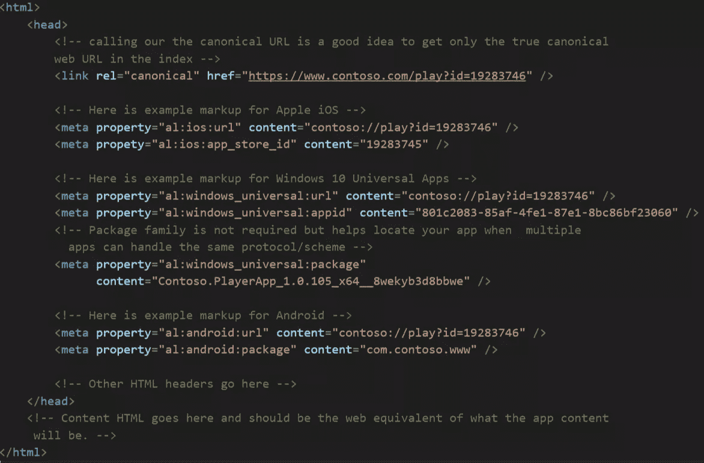

# 应用程序中的深度链接提高了可发现性

> 原文：<https://www.sitepoint.com/deep-linking-in-apps-for-improved-discoverability/>

对于独立的 app 开发者来说，可发现性并不是一件容易实现的事情。在所有的应用商店中，尤其是 Google Play，通常情况是少数较大的知名开发者主宰了排行榜。[研究表明](http://www.androidauthority.com/google-needs-tackle-app-discovery-problem-372094/)在 Play store 的 250 个顶级应用中，只有 3%是由新发行商开发的，这些仅占应用总收入的 1.2%。

Tune 进行的一项[研究发现，47%的用户通过苹果商店找到应用，而 53%的用户通过 Google Play 找到应用。发现应用程序的其他方法包括:](http://www.mobiledevhq.com/resources/white-paper-how-users-find-apps "study carried out by Tune")

*   在线阅读:11%
*   网络搜索:2%
*   应用商店排行榜:10%
*   特色应用:1%
*   朋友推荐:1%
*   点击进入另一个应用的广告:1%

很明显，用户主要使用应用商店来寻找应用。这并不奇怪。虽然谷歌在 2013 年 10 月推出了深度链接，但直到最近它才得到足够的改进，可以在移动搜索中发现应用程序。现在，谷歌允许发现用户设备上没有安装的应用程序。

必应引入了深度链接，脸书在去年的 F8 开发者大会上引入了应用链接。

然而，截至去年这个时候，[前 200 名](http://marketingland.com/study-22-percent-top-200-apps-using-deep-links-90177 "just 22% of the top 200") iOS 应用中只有 22%使用深度链接，Android 应用中只有 17%。

## 什么是深度链接？

在搜索中，应用程序对搜索机器人来说就像“围墙花园”,它们包含的内容不会呈现给搜索者。从用户的角度来看，这意味着有必要安装一个应用程序，看看它是否适合他们的需求。

深度链接和应用程序链接允许开发者在搜索中发现他们应用程序中的内容。应用程序链接将网站内容链接到应用程序内容。向网页添加标记来链接应用程序很简单。使用一组`;`标签建立网站 URL 和应用程序 URI 之间的关系，格式如下。

```
<meta property="al:(platform):(property name)" content="(property value)"/>;
```

下图给出了标签如何链接页面和应用程序的更详细的例子。这允许搜索机器人以通常的方式索引网页，但也索引网站和应用程序之间的关系。这是确保你的应用出现在搜索结果中的一个简单方法。Bing 提供了一个名为 Applinks Markup Tester 的工具，这样你就可以测试你的标记，并了解 Bing 是如何从你的网站中提取应用链接数据的。



## 应用链接与深度链接

您可以将应用程序内容链接到网站上的特定页面。这是一种更强大的方法，将返回指向应用程序中特定位置的搜索结果。应用程序链接出现在普通搜索结果的下方，带有一个指向应用程序内容的链接，单击该链接会打开应用程序本身。

例如，如果用户搜索了“鲜花”,而你的应用程序内容的一部分包含了关于鲜花的内容，那么你的网址可能会显示为[http://www.yourwebsite.com/flowers](http://www.yourwebsite.com/flowers),当点击时，应用程序会打开应用程序中的鲜花内容页面。

向你的应用添加深层链接是特定于平台的，所以你必须根据操作系统采用不同的方法。在 Android 中，你首先需要在应用清单中注册 URL 方案。一旦你做到了这一点，你将需要使用意图来映射应用内活动的路线。

阅读 [Android 开发者文档，了解关于如何添加意图、测试深层链接和指定索引内容的完整说明](https://developer.android.com/training/app-indexing/deep-linking.html)。

对于 iOS，在实现`AppDelegate`中的`openURL`方法之前，你必须在项目设置或 *info.plist* 文件中注册 URL 方案。

关于添加深度链接的更多信息，请阅读[谷歌开发者指南](https://developers.google.com/app-indexing/ios/app)。

你的目标应该是创建一个与你的网站结构紧密匹配的 URL 结构。

例如:

```
Web link: http://www.yourwebsite.com/category/flowers
Deep link: yourwebsite://category/flowers
```

然后，你必须添加标签，以便第三方网站可以将相关流量发送到应用程序中的正确页面。为此，将这些标签作为`meta`标签添加到您网站的 head 部分:

```
<meta property="al:ios:app_store_id" content="456788990" />;
<meta property="al:ios:url" content="sample://page1" />;
<meta property="al:ipad:app_store_id" content="234788990" />;
<meta property="al:ipad:url" content="sample://page1" />;
<meta property="al:android:package" content="com.sample.android" />;
<meta property="al:android:url" content="com.sample.android" />;
<meta property="al:windows_phone:url" content="sample://page1" />;
<meta property="al:windows_phone:app_id" content="12345678-1234-1234-1234-123456789012" />;
```

## 听起来太复杂了？

深度链接和应用链接现在没有被广泛使用的原因之一可能是因为开发者需要投入额外的工作。如果你开发 iOS 和 Android 版本的应用程序，这一点尤其正确。然而，到目前为止，我们还没有任何方法来索引应用程序内容，对于独立开发者来说，这是一个进步，因为只要做一点额外的工作，就有可能提高可发现性。

有些资源可以为你提供一个工作框架。为开发者提供一个平台，让他们可以在任何操作系统下添加深度链接。价格是按点击量收费的，所以它不是免费资源。

根据 [Applinks.org'](http://applinks.org) 的简介，

> App Links 是一个开放的、跨平台的应用程序到应用程序链接解决方案，为您提供在应用程序中展示深层链接或链接到其他应用程序所需的工具。

应用链接旨在让开发者更容易链接应用，而且是免费的。

应用链接和深度链接对应用开发者和整个网络来说都是积极的一步。应用程序的成功已经成为规模更大、更受欢迎的开发者的领域，用一个新的应用程序获得任何牵引力都是非常困难的。在普通搜索中发现应用程序的能力肯定会改变这一点，一旦它起飞，这可能意味着我们将看到本地应用程序而不是网络应用程序的转变。

那些能够加入并学习如何添加深层链接的开发者将会在未来的努力中获得更多的成功。

延伸阅读:

*   Appboy: *[深度链接应用内资源:iOS](https://documentation.appboy.com/Advanced_Use_Cases/Deep_Linking_to_In-App_Resources/iOS)*
*   Appboy: *[深度链接应用内资源:Android 和 FireOS](https://documentation.appboy.com/Advanced_Use_Cases/Deep_Linking_to_In-App_Resources/Android_and_FireOS)*
*   App 索引: *[App 深度链接指南](http://appindex.com/blog/app-deep-linking-guide/)*
*   [移动深度链接项目](http://mobiledeeplinking.org/):旨在为应用程序开发人员提供高质量文档、样本代码和 SDK 的行业合作项目
*   [iOS 中的应用搜索](https://developer.apple.com/library/prerelease/ios/releasenotes/General/WhatsNewIniOS/Articles/iOS9.html#//apple_ref/doc/uid/TP40016198-DontLinkElementID_1):关于 iOS9 中深度链接的新方法和改进方法的信息

## 分享这篇文章