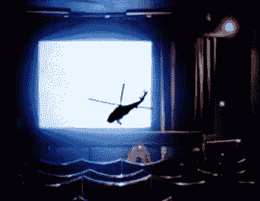
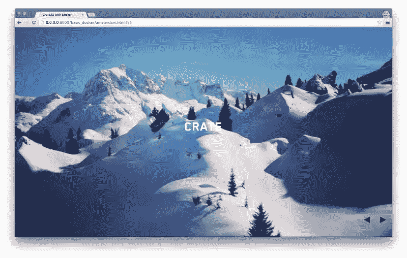
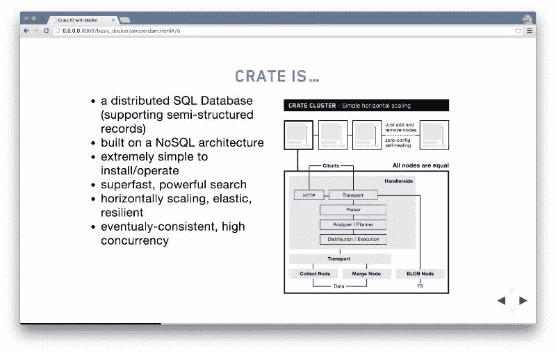
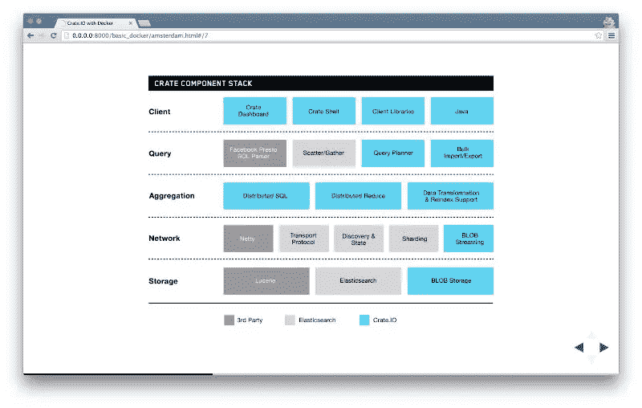
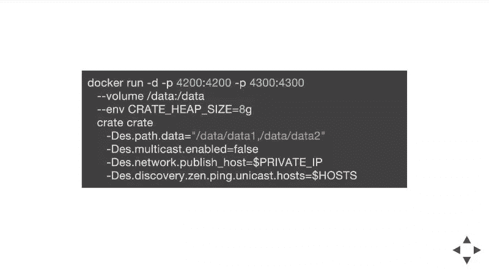
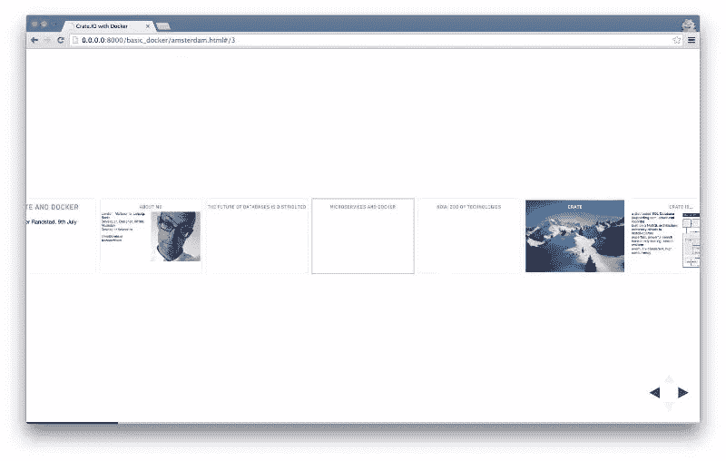
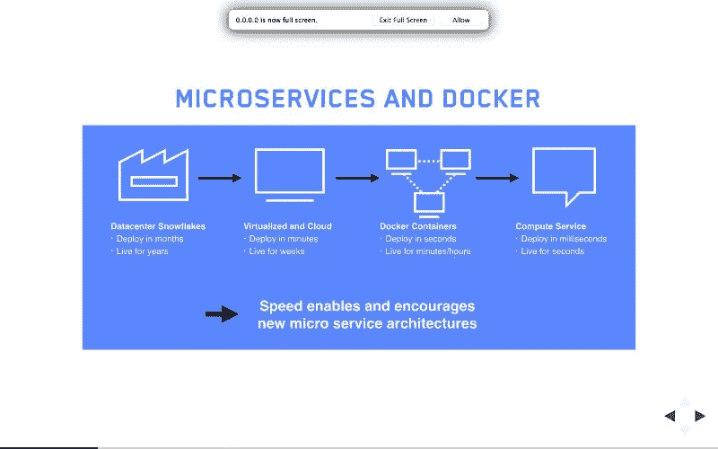

# 开源演示工具:我们到了吗？

> 原文：<https://www.sitepoint.com/open-source-presentation/>

[](https://www.flickr.com/photos/conchur/492988106/)

[摄影:康纳·劳里斯](https://www.flickr.com/photos/conchur/492988106/)

最近几个月，我一直试图让我的工作和创造性产出尽可能地开放和协作。由于我的大部分输出是代码和 markdown，所以这相对简单。

然而，我做了很多关于开放文化的演讲，而且通过封闭的、非协作的软件来发表这些演讲似乎有点虚伪。

虽然 MS Powerpoint 已经赢得了 Keynote 和 Prezi 等应用程序的竞争，但它们仍然是封闭的，只是半合作的格式。重要的是，它们都是“死端”格式，也就是说，一个 powerpoint 文件，只是一个 powerpoint 文件，它不容易被重复使用或解释为任何其他文件的一部分。我这样说的意思以后会更清楚。

我知道有一些选项可以用来创建一个更加“开放”的演示，通常是基于浏览器的格式，利用 JavaScript 和 CSS 来重现那些传统演示工具的外观、感觉和效果。

除了简单地以一种更开放的格式重新创建我现有的演示文稿(来自 PowerPoint 和 Keynote ),我还有一些其他的需求需要满足。

## 我的动机是什么？

### 一次写入，多次重复使用

我希望能够为博客帖子、演示文稿和其他一些目的编写相同的内容，并能够在我不同的用例中呈现它们。

### 共享性

通常，当我在一个会议上演讲时，组织者会在会后索要幻灯片。对于一些人来说，一个链接就足够了，但是对于其他人来说，他们需要一个独立的文件，比如 PDF。这使得演示文稿可以上传到 Slideshare 等服务上，在那里我的演示文稿得到了大量曝光。

### 吸引力

我喜欢用全屏图像、清晰易读的文本和其他引人入胜的比喻来创建演示文稿，以引起人们的注意。我对只支持小格式图像和文本的框架不感兴趣。

## 我的选择框架

实际上，我发现的框架比我预期的要少，于是决定使用 [Reveal。JS](http://lab.hakim.se/reveal-js/#/) ,因为它满足了我的先决条件，还提供了一些我以前甚至没有考虑过的特性，比如演示者视图和注释。

在这一点上值得注意的是，*这些框架中的大多数*是针对那些有技术知识的人的。有些确实提供商业拖放创建工具，但是要利用它们的真正潜力，你需要对 CSS、HTML 和(可能)JavaScript 有扎实的工作知识。

## 创建演示文稿

在基本层面上，这是一个简单的过程，我们已经在 SitePoint 上有了一个很好的介绍。

在默认的 reveal HTML 文件中，你会发现一个包含多个标签的`<div class="slides">`，这些是你的幻灯片。使用 reveal，您可以创建“嵌套”幻灯片，或允许在演示文稿中创建逻辑部分的垂直幻灯片。这些是通过在一个`section`标签中嵌套更多的`section`标签来创建的。

之后，幻灯片只是 HTML，有一些自定义标签和参数独特的揭示。如果你能编写 HTML，你可以创建一个演示文稿，如果你不能，Reveal 会为你提供一个商业产品，即[slides.com](http://slides.com/)服务。

因此，在本文的其余部分，我将假设您能够编写一些基本的幻灯片，并向您展示我在迁移演示文稿的过程中学到的提示和技巧。

### 全屏图像



将以下类添加到您的部分/幻灯片`div`:

```
<section data-background="imagefile">
```

然后，您可以像往常一样在该图像上叠加其他内容。图像应该如何显示有许多选项，记住一些加载选项，当切换屏幕时，你可能需要防止渐进的图像加载。

### 左侧和右侧面板



通常在 Powerpoint 和 Keynote 中，模板的左右面板包含两组不同的内容，例如图像和文本。虽然有人会说使用这种布局违背了 reveal 更流畅的设计原则，但我认为偶尔还是有必要的。用一些基本的 CSS 很容易复制:

```
.left-align {
  float:left;
  width:50%;
}

.right-align {
  float:right;
  width:50%;
}

.panel {
  text-align:left;
}

.panel img {
  width:100%;
}
```

我们创建了一个通用的`panel`类，它将文本向左对齐，而不是 reveal 典型的居中对齐。我们创建两个类来设置浮动和宽度，并使面板中的任何图像填充 100%宽度。以上都是个人口味，适合我的需要，但你得到的想法。

### 拉伸图像



无论是填充整张幻灯片还是我们上面创建的一个面板，我们有时都希望图像按比例填充它所占据的空间。这是通过将`stretch`类添加到任何媒体、图像和包含的媒体来实现的。

### 密码

代码突出显示是 reveal 的突出特性之一，但我仍然发现它有局限性，并对其进行了调整。这是因为它使用了`pre`标签，该标签将完全按照它所看到的进行渲染，这意味着如果你像我一样痴迷于代码布局，那么你的代码可能不会按照你想要的方式在演示文稿中进行渲染。



我发现我可以通过使用这个 CSS 片段获得更多的控制:

```
.reveal code {
  white-space: pre-line;
  text-align: left;
}
```

然后利用`&emsp;`标签 HTML 实体来控制标签如何缩进，即:

```
docker run -d -p 4200:4200 -p 4300:4300
&emsp;--volume /data:/data
&emsp;--env CRATE_HEAP_SIZE=8g
&emsp;crate crate
&emsp;&emsp;-Des.path.data="/data/data1,/data/data2"
&emsp;&emsp;-Des.multicast.enabled=false
&emsp;&emsp;-Des.network.publish_host=$PRIVATE_IP
&emsp;&emsp;-Des.discovery.zen.ping.unicast.hosts=$HOSTS
```

我建议你设置代码类来更好地控制它的显示方式，也就是说，我会使用`<code data-trim class="bash">`。

### 效果

动画和效果仅限于幻灯片过渡，动画背景和“片段”，幻灯片元素，可以显示自己的增量。有些人可能会发现这有点限制创造性，但我们都知道演示动画往往比相反的更过分。

### 使用降价

我在介绍中提到，我希望能够编写一次我的文本，然后将它用于多种用途。随着 Reveal 的降价加载和一些规划，这是(大部分)可能的。

要使用 Markdown 文件作为幻灯片的源，您可以使用以下代码，而不是创建一系列 section divs:

```
<section data-markdown="index.md"
            data-separator="\n\n\n"
            data-separator-vertical="\n### "
            data-separator-notes="^Note:"
            data-charset="iso-8859-15">
        </section>
```

上面的重要参数是分隔符值。这些可以让你定义减价文件的结构如何影响幻灯片的结构，这就是计划发挥作用的地方。

在上面的例子中，我定义了三个新的行来确定一个新幻灯片的开始和一个垂直幻灯片的 3 级标题。这允许我有一个合理的结构良好的降价文件用于多种目的。

## 呈现

### 演讲者注释

我喜欢创建重图像的演示，留下尽可能多的文本让我说，而不是让人们读。这意味着我需要笔记并重视所有演示软件中的演示者视图。

Reveal 提供了同样的功能，当你点击“ *s* 键时，它会打开一个单独的浏览器窗口。此窗口包含当前幻灯片、下一张幻灯片的演讲者注释、计时器和一组额外的控件。

在某些方面，对于涉及演示的演示来说，reveal 比“普通”应用程序更好，因为你不必不停地从全屏应用程序切换，或者在扩展桌面上寻找丢失的终端或代码窗口。任何东西都可以在你需要的时候定位到你需要的地方。

### 概述和全屏模式



快速按下“ *Esc* 或“ *o* ”键将缩小到演示文稿中所有幻灯片的概览，这对于查找特定的幻灯片非常有用，或者如果你想的话，也许可以模拟 prezi。按下“ *F* ”会让你的演示进入全屏模式，这意味着你不需要依赖浏览器来完成这个，因为那样会不一致。



## 让你的演讲更进一步

### 应用程序接口

其他演示软件有没有自带 [API](https://github.com/hakimel/reveal.js#api) ？

这个 API 可以让你在进行演示的时候抓住各种很酷的机会。一个简单的例子可能是实时发布当前幻灯片的链接。另一种可能是将你在屏幕上显示的代码提交到一个存储库中，然后在演示完成时推送它。为现场的人们创造一个演示。

可能性几乎是无限的，如果你想得到更多的元，揭示本身可以由 API 控制。

### 插件

如果你需要一些额外的功能，reveal 有数量有限的[插件](https://github.com/hakimel/reveal.js/wiki/Plugins,-Tools-and-Hardware)可用，但由于它们只是 JavaScript，你可以随时创建自己的插件。

## 出口

为了适应我的“写一次，再利用多次”的策略，出口是一个重要的因素。Reveal 内置的 [PDF 导出](https://github.com/hakimel/reveal.js#pdf-export)有点令人失望，仅仅依靠一个特殊的样式表和浏览器打印对话框，比这更糟糕的是，它只有 Chrome / Chromium。

还有其他选择，比如使用 [WKHTMLtoPDF](http://wkhtmltopdf.org/) 或者通过 [Pandoc](http://pandoc.org) 和[Latex](http://www.latex-project.org/)Markdown 到 PDF，但是它们最好留到另一篇文章中。

坚持使用默认的 reveal 选项，使用起来很简单。将`print-pdf`添加到演示文稿的查询字符串中，即*？print-pdf* 和演示文稿将使用 reveal 的 pdf 样式表( *css/print/pdf.css* )呈现，然后您可以依靠打印对话框导出到 pdf。你会发现默认的样式表需要一些定制，我不确定为什么这只在 Chrome 中有效，如果它只是使用系统打印对话框的话。

另一个选择是 [DeckTape](https://github.com/astefanutti/decktape) 项目，它是 HTML 表示框架的 PDF 导出器。我还没有尝试过，但它需要更多的配置。

## 结论

Reveal 和其他类似的框架不会完全取代 PowerPoint/Keynote，但如果你愿意尝试一些不同的东西来开拓新的可能性，那么它们很容易上手。

我是使用这种框架的新手，但我热衷于探索它们在集成和工作流优化方面的全部潜力。我喜欢你遵循的技巧、诀窍和方法来达到同样的目的。

## 分享这篇文章