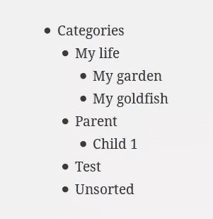
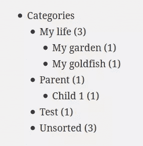
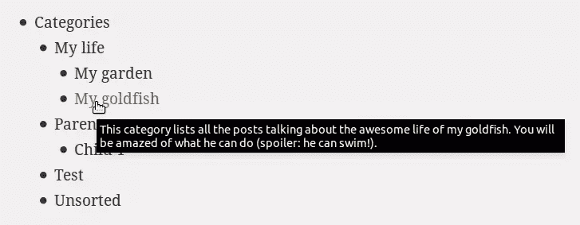
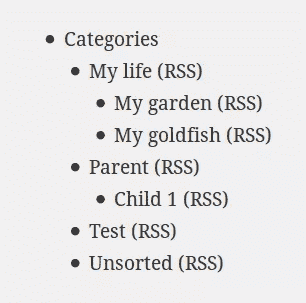

# 如何使用类别 API 在 WordPress 中列出类别

> 原文：<https://www.sitepoint.com/wordpress-categories-api/>

在之前的一篇文章中，我们看到了[如何在 WordPress](https://www.sitepoint.com/wordpress-categories-explained/ "WordPress Categories Explained") 中轻松处理类别。我们讲述了如何将我们的文章分类，然后可以编辑或删除。

已经介绍了基础知识，现在是时候看看开发人员更感兴趣的东西了:类别 API，以及如何检索和显示类别数据。

像[链接管理器 API](https://www.sitepoint.com/mastering-wordpress-links-manager-api/ "Mastering the WordPress Links Manager API") 一样，类别 API 也是一个大话题，就可用功能的数量而言甚至更大。在这篇文章中，我们将讨论一个当我们想要列出我们的类别时有用的函数。

## 列表类别

在链接管理器 API 中，我们发现了一个重要的功能，允许我们列出我们的链接。因此，我们在 Categories API: `wp_list_categories()`中发现同样的事情也就不足为奇了，这就是我们在这里要使用的函数。

基本上，你必须在你想看到你的分类列表的地方调用这个函数。

```
wp_list_categories();
```



可以想象，这个结果是完全可以定制的。为了使它符合我们的需要，我们可以给这个函数传递一个参数:一个包含我们想要设置的选项值的数组。让我们来看看一些可用的选项。

## 选择要显示的类别

在了解如何定制输出之前，我们将从一些选项开始，这些选项允许我们选择要显示的内容。

### 包括和排除类别

首先，我们找到选项`include`，它接受要显示的类别 id 列表。当你使用这个选项时，`wp_list_categories()`将只显示你传递给它的 id 的类别。您可以指定一个或多个 id。如果您想要表示两个或更多 id，您必须用逗号分隔这些数字。

```
$args = array(
'include' => '15,16,9'
);

wp_list_categories($args);
```

另一方面，如果你不想选择显示什么，而是不想显示什么，那么`exclude`选项就是为你准备的。完全可以像`include`一样使用。

```
$args = array(
'exclude' => '15,16,9'
);
```

注意，如果要使用`exclude`选项，`include`必须为空(其默认值)。否则，`include`选项会胜出，并且只会显示传递给它的类别。

另一个排除类别的选项是`exclude_tree`。同样，它接受逗号分隔的要排除的类别 id 列表。不同之处在于，它将排除选定的类别及其所有子类别。注意，要看到这个选项工作，您必须将选项`hierarchical`设置为`0`(我们将在下面看到这个选项的作用)。

```
// 14 is the ID of "My life", parent of "My goldfish" and "My garden" which will also be hidden
$args = array(
'exclude_tree' => '14',
'hierarchical' => 0
);
```

### 订购输出

默认情况下，类别按字母顺序列出。借助接受字符串的`orderby`选项，您可以修改这种行为。您可以从以下选项中选择:`ID`按 ID 对类别进行排序(不会吧，真的？)，`name`按字母顺序排序(默认值)，`slug`按 slugs 的字母顺序排序，`count`按文章数量排序。

通过将`DESC`(降序)设置为`order`选项的值(默认情况下，该选项设置为`ASC`(升序))，可以颠倒选择的顺序。

在下面的例子中，我们根据类别中包含的文章数量来列出类别:由于顺序相反，包含最多文章的类别将首先显示。

```
$args = array(
'orderby' => 'count',
'order' => 'DESC'
);
```

### 限制显示类别的数量

一旦我们订购了我们的类别，我们可能希望限制列出的项目数量。这可以通过使用`number`选项来实现。默认情况下，该选项设置为`null`，没有限制，因此显示所有类别。通过指定一个数字，可以定义要显示的最大类别数。例如，我们可以列出五个最常用的类别。

```
$args = array(
'orderby' => 'count',
'order' => 'DESC',
'number' => 5
);
```

本示例列出了帖子数量最多的类别。另一个解决方案是隐藏未使用的类别。要做到这一点，我们可以使用`hide_empty`，一个默认设置为`1`的布尔值:不显示空类别。您可以通过将此项设置为`0`来选择显示它们。

```
// Show me all the categories, even the empty ones
$args = array(
'hide_empty' => 0
);
```

## 指定要显示的详细信息

细节很重要，总有一些是我们想要包含的。

### 柜台！

例如，您可能希望显示每个类别中包含的帖子数量。要显示这个，您可以使用选项`show_count`并将其设置为`1`。默认情况下，该布尔值被设置为`0`，并且不会显示该计数。

```
$args = array(
'show_count' => 1
);
```

请注意，子类别中的帖子也将添加到其父类别的帖子总数中。例如，下面的截图是在“*我的生活*”类别中的三个帖子:虽然该类别中只有一个帖子，但其他两个都在子类别中。



您可以通过选项`pad_counts`修改这种行为。如果您将此设置为`0`，父类别的计数将只显示这些父类别中的帖子数量，而不包括其子类别中的帖子。

```
$args = array(
'show_count' => 1,
'pad_counts' => 0
);
```


### 类别描述

正如我们在上一篇文章中看到的，我们可以为我们的类别设置一个描述。该描述可通过选项`use_desc_for_title`显示。它是一个默认设置为`1`的布尔值:描述显示在列表中链接的`title`属性中。如果你不想看到这个描述，你可以设置为`0`。

```
$args = array(
'use_desc_for_title' => 1
);
```



### 饲料

就像 WordPress 为你的文章生成一个 feed 一样，它也为每个类别创建一个 feed。如果访问者不喜欢你的所有内容，他们可以选择只关注他们感兴趣的类别的更新。

多亏了选项`feed`，这些订阅源的链接可以显示在我们的类别列表中。默认情况下，此选项设置为空字符串，并且不显示链接。下面的代码显示了如何启用该选项。

```
$args = array(
'feed' => 'RSS'
);
```



默认情况下，链接的提要是 RSS2 提要。但是 WordPress 可以生成更多的 feed 类型。例如，如果你喜欢 Atom，你可以强制 WordPress 显示这种类型的提要，而不是 RSS2。

要选择您想要显示的输入类型，您可以指定以下选项:`atom`、`rss`、`rss2`和`rdf`。

```
$args = array(
'feed' => 'Atom',
'feed_type' => 'atom'
);
```

最后，如果你喜欢用图片链接到你的 RSS 提要，你可以在`feed_image`选项中指明你想看到的图片的 URL。然后，`feed`选项中的文本将成为图像的替代文本。

```
$args = array(
'feed' => 'RSS',
'feed_image' => 'http://website.org/my-awesome-rss-image.png'
);
```

## 这个类别是当前的类别吗？

如果您在一个归档页面上使用`wp_list_categories()`(在`archive.php`模板中)，您可以看到当前类别(归档页面显示的类别)被高亮显示:包含该类别链接的`li`标签比其他标签多了一个类，名为`current-cat`。你不需要做任何事情来激活这个行为，也不能去激活它(但是你可以自由的在你的 CSS 中不使用它！).

然而，也许你想在更多的页面上看到这种行为，比如那些显示帖子的页面。好消息是你可以，多亏了选项`current_category`。默认情况下，该布尔值被设置为`0`。通过将其设置为`1`，当前类别将与之前引用的类别一起高亮显示。

```
$args = array(
'current_category' => 1
);
```

例如，假设我们在`single.php`模板上显示了类别列表。然后，使用前面的数组，由于类`current-cat`，当前文章的类别被突出显示。我们现在要做的就是添加适当的 CSS 来显示它。

## 显示层次结构

如果你有许多类别，把它们组织成逻辑层次是一个好主意，在那里我们可以找到父类别和它们下面的子类别。有许多选项可以用来处理层次结构的显示。

我们先来看`hierarchical`。这是一个默认设置为`1`的布尔值，其中`wp_list_categories()`显示了类别之间的层次结构(有父类和子类)，就像本文开头的截图一样。如果你不想显示你的层次结构，你可以将其设置为`0`:你的类别将会被列在一列中，而不会缩进子类别。

注意`hierarchical`的副作用:如果您选择显示层次结构，那么父类别将一直显示，即使它们是空的并且`hide_empty`选项被设置为`1`。

```
// Don't show me the hierarchy
$args = array(
'hierarchical' => 0
);
```

您还可以使用 hierarchy 做其他事情，比如使用`child_of`显示给定类别的子类别。我们可以把它描述成`exclude_tree`的反义词:我们给它一个类别的 ID，而`wp_list_categories()`将只显示它的孩子。但是，不会显示父类别的名称。

```
// Show me all the children of this category
$args = array(
'child_of' => 14
);
```

与`exclude_tree`不同的是，我们只能将单个 ID 传递给`child_of`。

`depth`选项允许您控制列表中可以显示的级别数。如果您喜欢类别，并且有一个包含许多代的复杂树，那么它会很有用。默认情况下，它被设置为`0`并显示所有代。下面的示例只显示了两个级别的类别:父类别及其第一级子类别。如果这些孩子有他们自己的孩子类别，他们不会被显示。

```
$args = array(
'depth' => 2
);
```

注意`depth`是链接到`hierarchical`的。事实上，如果您将`hierarchical`设置为`0`，那么给`depth`赋值是没有用的:所有的类别都会显示出来，不管它们在树中处于什么级别。相反，你也可以在一种情况下用`depth`覆盖`hierarchical`的值:你将`depth`设置为`-1`。该值的作用是显示没有任何关系的所有类别。所有类别将显示在一列中，即使`hierarchical`设置为`1`。

## 控制输出

默认情况下，`wp_list_categories()`显示我们的类别列表。如果您不希望这样，并且希望将结果存储在一个变量中以便以后显示，那么您可以将`echo`设置为`0`。

```
$args = array(
'echo' => 0
);

$cats = wp_list_categories($args);
```

如果您想在显示列表之前对其进行修改，这将非常有用。

接下来，我们来看看`show_option_none`。默认情况下，如果`wp_list_categories()`没有找到任何类别(例如，如果其他选项过于严格，就会发生这种情况)，它会显示文本“*没有类别*”。您可以使用此选项将其更改为您想要的文本。

```
$args = array(
'show_option_none' => 'Nothing found :('
);
```

下一个`title_li`。在我们的测试中，您可能已经注意到类别列表被封装到另一个列表的项目中。例如，如果您在菜单中使用`wp_list_categories()`，这将非常有用。此外，WordPress 为这个列表显示了一个标题，默认为“*类别*”。

你可以通过玩`title_li`来修改这个默认标题，甚至禁用它。它接受一个字符串，该字符串是要显示的标题。如果您给这个选项一个空字符串，类别列表将不会被封装在另一个列表中。

```
$args = array(
'title_li' => 'My awesome categories'
);
```

注意:如果你用一个空字符串禁止显示列表，你必须用`ul`标签把列表括起来！

你不喜欢列表？您会喜欢`style`选项:默认情况下，它被设置为`list`并且`wp_list_categories()`将类别显示为列表项。如果您将`style`设置为`none`，您的类别将由`br`标签分隔。

```
$args = array(
'style' => 'none'
);
```

最后，多亏了选项`show_option_all`，你可以让 WordPress 显示你所有类别的链接。你给这个选项一个字符串，WordPress 会显示一个新的链接，指向你所有的类别。

```
$args = array(
'show_option_all' => 'All categories'
);
```

## 结论

`wp_list_categories()`到此为止。正如您所看到的，这个函数的可用选项非常多。

当然，Categories API 并不局限于这个函数。然而，这是重要的一点:如果你没有任何具体的需求，只是想要一个基本的类别列表，不要寻找另一个功能，这是你最简单的选择！

注意，本文中我们并没有谈到`wp_dropdown_categories()`。这个函数将我们的类别显示在一个下拉 HTML 元素中。像`wp_list_categories()`一样，由于有一系列选项，它的输出可以完全定制。这些选项与`wp_list_categories()`提供的选项相似，所以我们在这里不做描述。唯一的困难是有些选项有其他默认值。想了解更多关于`wp_dropdown_categories()`的信息，可以去 [WordPress Codex](https://codex.wordpress.org/Function_Reference/wp_dropdown_categories) 。

但是还有其他情况:如果我们想以一种特殊的方式显示我们的类别呢？在这种情况下，`wp_list_categories()`不够灵活，因为我们需要构建自己的 DOM 树。这就是为什么，在下一篇文章中，我们将看看 Categories API 中其他一些有用的函数。

## 分享这篇文章