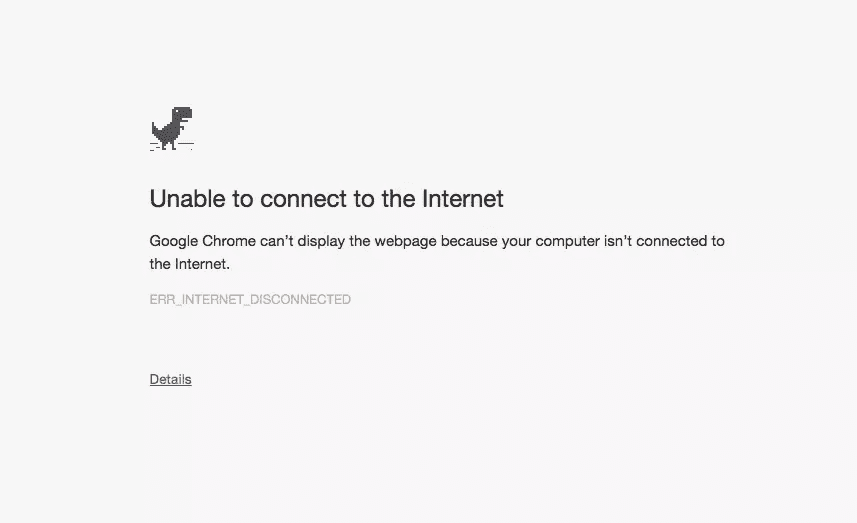

# 应该开发桌面还是 Web 应用？

> 原文：<https://www.sitepoint.com/web-desktop-apps/>

他们说他们会死。

从我们的码头进入我们的浏览器。

桌面应用的消亡早就被预测为基于浏览器的模式。但随着 Slack、Sunrise 和 Quip 等服务都走向桌面，我们到底能不能停止为原生应用写赞歌？

## 原生应用的消亡

你看不到好技术的衰落是有原因的。正如许多文章指出的那样，科技行业已经抛弃了本地应用，转而支持网络应用。

如果你想知道为什么，事实证明他们有一些非常充分的理由。这是五美元。

### 1.没有要下载的内容。没有要安装的内容

如果人们可以马上开始使用你的应用，那么说服他们使用你的应用通常要容易得多。下载和安装感觉更像是一种承诺，而不是在你的网络浏览器上玩一玩。你有效地消除了入职过程中的一个重要步骤。

### 2.不再更新

好吧，自从自动更新被引入以来，它就不再像以前那样有巨大的优势了。然而，在网上更新你的应用程序确实可以确保没有人在使用过时的版本。这反过来消除了大多数兼容性问题。

### 3.更适合循环定价模式

可下载的应用程序与一次性付款相关联。你买了它，你就拥有了它。

网络应用似乎更适合利润更高的周期性支付结构。

这并不是说你不能用桌面应用程序做到这一点——想想 [Dropbox](http://dropbox.com/) 和有争议的[创意云](http://www.adobe.com/uk/creativecloud.html)。但人们似乎更愿意为网络应用付费。

### 4.访问分析

从商业的角度来看，能够直接看到你的用户如何与你的产品互动是一个巨大的优势。它可以帮助你减少任何可用性问题，重新评估没有人参与的功能。

### 5.开发成本更低

你想要一个能在 OS X、PC 和 Linux 上运行的本地应用吗？准备好花大钱吧。

优秀的程序员并不便宜，而且有那么多版本要开发，难怪很多人青睐基于浏览器的应用。

综上所述，选择网络应用而不是本地应用似乎是显而易见的。那么，为什么公司仍然发布可下载的副本呢？

## 土著还没有去任何地方

与上述相反，仍然有一些小但重要的功能是浏览器目前无法与之竞争的。

### 1.我们并不总是保持联系

人们四处走动。他们不会总是坐在家里，身边的光纤宽带快乐地嗡嗡作响。

他们上火车，住酒店，有时在咖啡店里扎营(顶多有断断续续的 wifi)。

更不用说居住在没有可靠互联网的国家的人们了。

一些公司正在着手离线开发 web 应用程序，这很好。

Alex Feyerke 写了一篇[关于离线第一设计的文章](http://alistapart.com/article/offline-first)。

但是仍然有许多问题需要解决，比如处理来自许多来源的冲突数据和丢失重要数据。

从互联网的角度来看，原生应用感觉更安全。

即使他们依赖于连接来同步，从桌面工作也比担心点击后退按钮或点击任何可能会遇到这种情况的东西更容易:

也许 Chrome 是个不好的例子，那个空格键游戏真的会让人上瘾。

### 2.dock 图标的魅力

如果你有一个本地应用程序，你会有一个闪亮的大 dock 图标。只要人们记得把你的应用放在他们的 dock 中，你就能更好地持续使用。

如果你的用户和我一样，他们的浏览器标签会有点让人不知所措。以下是我写这篇文章的理由:

> 标签可能会在人群中丢失。更糟糕的是，它们可能会被关闭，永远不会重新打开。有了原生应用程序，你的徽标就少了竞争，也不太可能被意外关闭。

### 3.托管更便宜

这只适用于你只有原生应用而没有混合应用的情况。托管一个可能有数千人需要持续访问的大型 web 应用程序不会便宜。

如果你只有一个可下载的应用程序，你的主机只需要花很小的代价就能拥有几个带有下载链接的网页。

### 4.两样都做越来越容易了

我认为我们看到原生应用增加的主要原因是[你现在就可以轻松创建一个](https://medium.com/dev-rocket/desktop-apps-are-back-thanks-to-the-web-767f30c333a1)。

流行的消息应用 Slack 使用 [MacGap](https://github.com/MacGapProject/MacGap1) 引入 web 应用的功能，然后在它周围添加一个原生包装器。

如果你的应用程序很简单，这可能是一个很好的方式，让它以很低的成本出现在人们的桌面上。了解 FrontApp 如何将其产品转变为主要使用 HTML/CSS 的混合应用。

## 那么，桌面应用程序正在卷土重来吗？

通常情况下，是和不是。

我不认为原生应用已经死亡，它只是变得更不实用，开发它们的成本更高。

对许多公司来说，基于网络的应用程序的好处远远超过了本地应用程序的好处。

不仅从商业角度，也从用户角度(想想 InVision、Google Analytics 和 Medium——这些肯定没有足够大的对原生版本的需求)。

我们需要根据人们将如何使用我们的软件来进行设计。

#### 用户不在乎你的应用是本地的还是基于网络的，只要它能正常工作。

杰森·格雷斯比有一篇关于辩论多余本质的精彩文章。他说:

#### 仅仅因为用户以不同的界面或格式与来自网络的信息互动，这并不意味着网络已经死亡。对我来说，这条弧线更像是一次进化，而不是灭绝。”

我们看到本地应用增长的主要原因是，越来越多的公司意识到在其战略中同时采用两种技术的价值。

随着某样东西越来越受欢迎，学习资源也越来越受欢迎，最终是技术。

与其说是台式机的衰落，不如说是混合动力车的崛起。

#### 交给你了。如何看待 native vs web 的争论？一个比另一个好还是我们都应该采用混合策略？请在评论中告诉我们！

## 分享这篇文章