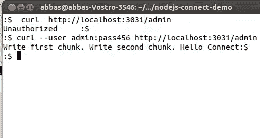

# 开始使用 Connect

> 原文：<https://www.sitepoint.com/getting-started-with-connect/>

如果您需要编写模块化和可重用的组件， [Connect](https://www.npmjs.com/package/connect) 可能是您的最佳解决方案。它使用被称为中间件的“插件”来处理用于 Node.js 和 T4 的可扩展 HTTP 服务器框架 T2。

中间件组件是一个插件，它获取一个请求，然后进行一些处理，之后它可能处理和结束请求，或者将它们传递给下一个中间件插件。处理请求并将其传递给下一个处理程序的插件被称为*过滤器*，而实际处理请求的插件被称为*提供者*。在第一组中，我们可以找到请求日志插件或认证插件，这里仅举几个例子。至于提供者，他们主要是应用程序业务逻辑的一部分。

在本文中，您将看到如何开始在 Node.js 应用程序中使用 Connect 中间件框架。

## 设置连接

对于 Node.js，包依赖是通过 npm 完成的，它允许您指定和获取应用程序所需的依赖包。npm 的包依赖关系在一个名为 [package.json](https://docs.npmjs.com/files/package.json) 的文件中定义。虽然这个文件可以手动编写，但是最好也强烈建议使用 npm 命令来创建它。

要完成此任务，请运行以下命令:

```
$ npm init
```

然后回答它将显示的问题(例如包名等等)。完成后，您的“package.json”文件应该出现在根文件夹中，内容如下所示:

```
{
  "name": "nodejs-connect-demo",
  "version": "1.0.0",
  "description": "Demo on how to use connect framework for Node.js",
  "main": "server.js",
  "scripts": {
    "test": "echo \"Error: no test specified\" && exit 1"
  },
  "repository": {
    "type": "git",
    "url": "https://github.com/abbassoftware/nodejs-connect-demo.git"
  },
  "keywords": [
    "connect"
  ],
  "author": "Abbas",
  "license": "",
  "bugs": {
    "url": "https://github.com/abbassoftware/nodejs-connect-demo/issues"
  },
  "homepage": "https://github.com/abbassoftware/nodejs-connect-demo"
}
```

该文件已经包含有关该项目的信息，但是它没有声明依赖项。要将 Connect 声明为依赖项，需要在“package.json”文件中添加依赖项值，并按如下方式更新它:

```
{
  ...
  "dependencies": {
        "connect": "3.x"
  },
  ...
}
```

或者，您可以运行以下命令:

```
npm install connect --save
```

此时，我们可以运行以下 npm 命令来下载所有依赖项(在这种情况下仅连接):

```
$ npm install
```

## 创建一个“Hello World”组件来响应请求

一旦指定了依赖关系，我们就可以继续创建一个中间件提供者，它使用 Hello Connect 响应来响应所有的请求。为此，在 Node.js 项目目录中创建一个“server.js”文件，并添加以下代码:

```
var connect = require("connect");
var app = connect();

function sayHello(req, res, next) {
    res.setHeader('Content-Type', 'text/plain');
    res.end('Hello Connect');
}

app
   .use(sayHello)
   .listen(3031);

console.log("Server is listening");
```

在上面的代码中，我们首先使用 Node.js `require()`函数加载 Connect 模块，然后使用函数的返回值创建一个服务器。其次，我们创建一个中间件组件，它只是一个函数，有三个参数:`request`、`response`和`next`。`next`代表链中的下一个处理程序。`sayHello()`函数设置响应对象中的标题和响应文本。之后，由于有了`use()`函数，我们可以使用这个中间件组件。最后，我们允许服务器监听端口 3031。

现在，我们可以使用下面的命令运行我们的 Connect 应用程序:

```
node server
```

如果我们将浏览器指向`localhost:3031`，我们应该能够看到如下输出:


## 请求和响应对象

在本节中，我们将深入研究我们在上一节中提到的`request`、`response`和`next`参数。`request`对象保存关于传入请求的细节。`request`天体中一些最重要的信息有:

*   `method`:包含请求的类型:GET、POST 等等。
*   `url`:包含请求的完整 URL。您可以解析这个 URL 来获取 get 请求的查询参数。
*   `headers`:这是你可以用于请求头的属性。

`response`对象保存将被发回的响应。根据您的应用程序，您可以向其中添加标题和数据。`response`对象的一些重要功能是:

*   `setHeader()`:这个方法给响应添加一个头。
*   `removeHeader()`:这个方法删除了响应的头。
*   `write()`:写一个对`response`对象的部分响应很有用。
*   这是一种用来标记回应结束的方法。

## 在 Connect 中使用多个中间件组件

在上一节中，我们创建了一个中间件提供者，它用“Hello connect”来响应所有请求。现在，我们将再添加一个过滤器中间件，它记录传入请求的详细信息。然后，我们将请求传递给我们的`sayHello()`,它将返回响应。为了完成另一项任务，我们将使用以下代码更新我们的“server.js”文件:

```
var connect = require("connect");
var url = require('url');
var app = connect();

function sayHello(req, res, next) {
    res.setHeader('Content-Type', 'text/plain');
    res.write('Write first chunk. ');
    res.write('Write second chunk. ');
    res.end('Hello Connect');
}

function loggingMiddleware(req, res, next) {
    console.log("The request method is: " + req.method );
    console.log("The request url is: " + req.url );
    var queryData = url.parse(req.url, true).query;
    console.log("The query parameters are : " + queryData.name );
    next();
}

app
   .use(loggingMiddleware)
   .use(sayHello)
   .listen(3031);

console.log("Server is listening");
```

在上面的代码中，我们使用`loggingMiddleware()`函数添加了一个中间件组件。它记录请求的 URL 和方法，并解析 URL 以打印提供的可能的`name`参数。然后，它调用`next()`函数，该函数将请求传递给下一个处理程序。

当我们让连接服务器监听端口时，首先使用`loggingMiddleware()`，然后使用`sayHello()`。现在，如果我们启动 Node.js 服务器并运行以下命令:

```
curl http://localhost:3031?name=abbas
```

我们将看到以下消息:


## 添加身份验证处理程序

接下来要做的是使用 HTTP 的[基本访问认证向我们网站的管理部分添加一个认证。要做到这一点，我们必须探索如何为服务器的管理部分运行一个处理程序。Connect 的`use()`函数可以将第一个参数作为`request.url`中调用处理程序的路径。因此，如果我们想要 admin 部分专用的身份验证处理程序，我们需要更新“server.js”文件，如下所示:](https://en.wikipedia.org/wiki/Basic_access_authentication)

```
var connect = require("connect");
var url = require('url');
var app = connect();
var authJsonObj = require("./authDetails.json");

function sayHello(req, res, next) {
    res.setHeader('Content-Type', 'text/plain');
    res.write('Write first chunk. ');
    res.write('Write second chunk. ');
    res.end('Hello Connect');
}

function loggingMiddleware(req, res, next) {
    console.log("The request method is : " + req.method );
    console.log("The request url is : " + req.url );
    var queryData = url.parse(req.url, true).query;
    console.log("The query parameters are : " + queryData.name );
    next();
}

function authenticateAdmin(req, res, next) {
    console.log("authenticateAdmin");
    var authorization = req.headers.authorization;
    //if the Authorization header is not present return error.
    if (!authorization) return returnAuthError(res);

    var parts = authorization.split(' ');

    //Check the Authorisation header contains both the parts.
    if (parts.length !== 2) return returnAuthError(res);

    //Check the Authorization header Scheme is correct.
    var scheme = parts[0];
    if ('Basic' != scheme) return returnAuthError(res);

    //Credentials will be base64 encoded. After decoding they will be in the format username:password
    var credentials = new Buffer(parts[1], 'base64').toString()
    var index = credentials.indexOf(':');

    var user = credentials.slice(0, index)
    var pass = credentials.slice(index + 1);

    //If the password does not match return error.
    if(authJsonObj[user] != pass) return returnAuthError(res);

    //Auth is complete pass to the next handler.
    next();
}

function returnAuthError(res) {
  res.statusCode = 401;
  res.end('Unauthorized');
};

app
   .use(loggingMiddleware)
   .use('/admin', authenticateAdmin)
   .use(sayHello)
   .listen(3031);

console.log("Server is listening");
```

然后我们需要在“server.js”的同一个目录下创建一个“authDetails.json”文件，内容如下:

```
{
   "abbas":"pass123",
   "admin":"pass456"
}
```

在上面的代码中，我们加载了一个名为“authDetails.json”的 json 文件(刚刚创建的文件)，其中包含一个 JSON 对象，该对象包含授权用户的用户名和密码列表。然后我们再添加一个名为`authenticateAdmin`的连接处理程序，仅用于网站的管理部分。前面提到的处理程序检查授权头，然后解码用户名/密码对，并对照 JSON 文件内容检查授权。在请求未被授权的情况下，带有响应代码 401 的未授权响应被发送到客户端。

通过此更新，如果我们向站点的管理部分发出请求，输出将如下:



## 结论

在本文中，我们深化了一个叫做 Connect 的小而强大的 Node.js 模块的特性。它可以帮助您构建中间件组件来轻松处理请求。使用 Connect 和中间件插件将减少您的工作量，并将您的应用程序转化为一个更加结构化和可用的项目。

你呢？你试过吗？我们开始讨论吧。

## 分享这篇文章