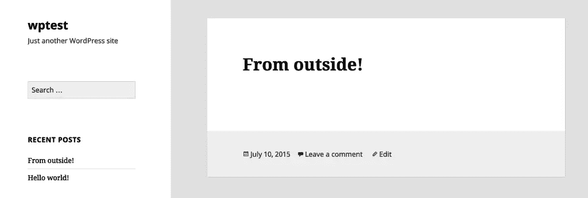

# WP API 和 OAuth——使用 WordPress 而不使用 WordPress

> 原文：<https://www.sitepoint.com/wp-api-and-oauth-using-wordpress-without-wordpress/>

在本教程中，我们将学习如何通过 OAuth 安装和使用[WP-API](https://github.com/WP-API/WP-API), OAuth 是一个 WordPress 插件，它使用类似 REST 的 API 端点来允许未经认证的用户读取 WP 内容，并向通过 OAuth(或通过主题和插件的 Cookies)认证的用户写入 WP 内容。


使用插件并不简单，先决条件列表也很长，所以这篇文章写得简单易懂(只要你能控制自己的服务器)。

本教程假设对终端有基本的了解，为了便于开发，对[和](https://www.sitepoint.com/re-introducing-vagrant-right-way-start-php/)有基本的了解。

## 安装

像往常一样，我们将使用 SitePoint 的可信的 [Homestead 改进的](https://www.sitepoint.com/quick-tip-get-homestead-vagrant-vm-running/)实例来获得一个全新的运行环境:

```
git clone https://github.com/swader/homestead_improved hi_wp_github
cd hi_wp_github
sed -i '' "s@map\: \.@map\: $PWD@g" Homestead.yaml
```

最后一行是一个快捷方式，它将主机的当前文件夹共享到虚拟机的`Code`文件夹中。我还将站点块更改为:

```
sites:
    - map: test.app
      to: /home/vagrant/Code/wptest
```

*记得按照[指令](https://www.sitepoint.com/quick-tip-get-homestead-vagrant-vm-running/)在你的`/etc/hosts`文件中有`test.app`(或者你选择的网址)。*

接下来，我们启动并运行一个新的 WP 实例。既然 Homestead 预装了 MySQL，这就是小菜一碟。

```
cd ~/Code
wget https://wordpress.org/latest.tar.gz
tar -xvzf latest.tar.gz
mv wordpress wptest
cd wptest
cp wp-config-sample.php wp-config.php
```

在我们相应地更新了`wp-config.php`并设置了我们的密钥和数据库凭证之后，WP 实例就准备好了，可以通过在浏览器中运行它来完成。

## WP-API

尽管这些年来饱受批评(其中很大一部分是由我自己的[双高射炮](https://sites.google.com/site/kazeohin/home/flack15.jpg)发射的)，但 WP 确实在努力与时俱进，同时仍然适应他们陈旧的、技术上无能的用户群。

一个这样的努力是 [WP-API](https://wordpress.org/plugins/json-rest-api/) ，一组类似 REST 的端点作为插件内置到 WP 中，这样 WordPress 安装的内部可以被外部访问。例如，获取 JSON 格式的帖子就像 pinging】一样简单。

它可以通过默认的插件管理器轻松安装——稳定版本是 1.2。*在撰写本文时，让我们开始吧。


如果我们在安装后立即进行测试，URL `/wp-json/posts`应该会产生一个 JSON 数组，显示最初的“Hello World”帖子。然而，实际的提交过程(更新和发布)并不简单。

## OAuth–服务器

> 不幸的是，就像所有 WP 的东西一样，即使他们试图变得现代也已经过时了。

因此，他们使用 [OAuth1 而不是 OAuth2](http://stackoverflow.com/questions/4113934/how-is-oauth-2-different-from-oauth-1) 进行认证。为此，我们需要安装 OAuth1 插件。对于*那个*，我们需要`wp-cli`升级，一种从终端使用 WP 命令的方法:

```
curl -O https://raw.githubusercontent.com/wp-cli/builds/gh-pages/phar/wp-cli.phar
chmod +x wp-cli.phar
sudo mv wp-cli.phar /usr/local/bin/wp
```

然后，我们获取 OAuth 插件:

```
cd ~/Code/wptest
git clone https://github.com/WP-API/OAuth1 wp-content/plugins/oauth-server
```

激活插件(现在应该出现在插件列表中)并返回到终端运行:

```
wp oauth1 add
```

这将产生一个可用于 OAuth 身份验证的密钥/秘密组合:

```
ID: 4
Key: xOp1fGMgouBl
Secret: Sk7YcM48qsmcDPp2NSmna3kMEfTtDNfxpy43xjWp1mSP7ytw
```

除了他们的协议方法已经过时之外，还有一个问题是我们必须使用 3 条腿的 OAuth，而不是像 2 条腿的 OAuth 流那样更简单、UI 更少的东西。要了解不同之处，[请阅读这份详尽的指南](https://github.com/Mashape/mashape-oauth/blob/master/FLOWS.md#oauth-10a-three-legged)。希望以后会有所改善。

不过，好消息是，如果你是 WP 网站的*所有者*,并且你正在为其他人启用 OAuth API 访问——你就大功告成了！由他们来开发一个客户端，这也是我们接下来要做的。

## OAuth–客户端

为了通过 WP-API 测试 WP 中的提交，我们需要一个“应用程序”作为“提交者”。为此，我们在虚拟机的另一个文件夹中创建了一个新项目——非常适合测试。首先，我们编辑虚拟机的`Homestead.yaml`文件以包含一个新站点:

```
sites:
    - map: test.app
      to: /home/vagrant/Code/wptest
    - map: test2.app
      to: /home/vagrant/Code/submitter
```

然后，我们用`exit`退出虚拟机，用`vagrant provision`重新调配，然后用`vagrant ssh`重新租用虚拟机。既然我们的`submitter`虚拟主机已经定义好了，让我们向其中添加一个简单的`index.php`文件，和一个(目前)空的`callback.php`文件。

```
mkdir ~/Code/submitter
touch ~/Code/submitter/index.php
touch ~/Code/submitter/callback.php
touch ~/Code/submitter/credentials.php
cd ~/Code/submitter
```

凭证文件应该包含我们从 WP 应用程序获得的密钥:

```
// credentials.php
<?php

return [
    'consumer_key' => 'xOp1fGMgouBl',
    'consumer_secret' => 'Sk7YcM48qsmcDPp2NSmna3kMEfTtDNfxpy43xjWp1mSP7ytw'
];
```

我们还需要安装一些软件包:

```
composer require --dev symfony/var-dumper
composer require guzzlehttp/guzzle:~5
```

VarDumper 在那里帮助我们调试，Guzzle 5 在那里帮助我们在 WP-API 发出请求。我们可以使用通用的 OAuth 客户端，但是为什么不使用 [Guzzle 的](https://github.com/guzzle/oauth-subscriber)？

```
composer require guzzlehttp/oauth-subscriber
```

请注意，我们将在下面构建的*提交者*只是一个演示脚本，应该仅用作在您自己的应用程序中实现 OAuth+WP-API 的灵感，而不是完整的应用程序演示。

还有一件事——默认情况下，WordPress 阻止登录到外部网站的重定向(域不同的网站),所以需要添加一个新的过滤器来允许这一点。回到 WP 应用的源代码，打开`default-filters.php`并将以下内容添加到文件中:

```
add_filter( 'allowed_redirect_hosts' , 'my_allowed_redirect_hosts' , 10 );
function my_allowed_redirect_hosts($content){
    $content[] = 'test2.app';
    return $content;
}
```

当然，如果您使用了不同的 URL，请用您自己的 URL 替换`test2.app`。

## 认证–第 1 阶段

通过 OAuth 使用 WP API 进行认证是文档中完全没有的东西，但这是因为 OAuth 认证是非常具体的，并且在项目中几乎完全相同。然而，这并不意味着它很简单。我们大部分时间都会以这样或那样的方式遵循[这篇文章](https://www.sitepoint.com/using-guzzle-twitter-via-oauth/)的程序。

赋予`index.php`文件以下内容:

```
<?php

require_once 'vendor/autoload.php';

session_start();

use GuzzleHttp\Client;
use GuzzleHttp\Subscriber\Oauth\Oauth1;

$client = new Client([
    'defaults' => ['auth' => 'oauth']
]);

$oauth = new Oauth1(include 'credentials.php');

$client->getEmitter()->attach($oauth);
$callback = 'http://test2.app/callback.php';

$req = $client->createRequest("POST", 'http://test.app/oauth1/request',
    ['body' => ['oauth_callback' => $callback]]);

try {

    $res = $client->send($req);
    parse_str($res->getBody());

    $_SESSION['oauth_token'] = $oauth_token;
    $_SESSION['oauth_token_secret'] = $oauth_token_secret;

    header("Location: http://test.app/oauth1/authorize?oauth_token={$oauth_token}&oauth_callback=".$callback);

} catch (\Exception $e) {
    dump($e);
}
```

首先，我们定义一个新的 Guzzle 客户端，并将其默认的 auth 模式设置为 Oauth。然后，我们设置一个新的 OAuth1 客户端实例，并通过运行`wp oauth1 add`为它提供我们之前获得的密钥和秘密。我们使用这个实例作为发射器，并从中创建一个 POST 请求(还定义了一个回调——一旦我们授权，WP 应该将我们重定向到的 URL ),然后这个请求被发送到我们的 WP 应用程序。

在 try/catch 块中，我们将响应转换成两个字符串:`$oauth_token`和`$oauth_token_secret`，我们需要这两个字符串来继续 auth 过程。我们将它们保存到会话中，然后继续第 2 步:T2 文件。

## 认证–第 2 部分

对于[三腿 OAuth 流](https://github.com/Mashape/mashape-oauth/blob/master/FLOWS.md#oauth-10a-three-legged)的第二条腿，我们需要构建`callback.php`文件。

当我们登录 WP 并授权我们的提交者应用程序时，WP 会将我们发送回我们提供的回调 URL。它还会发送一些额外的参数:`oauth_token`、`oauth_verifier`和`wp_scope`。

我们使用验证器和`oauth_token`向`/access`端点发送一个请求，并获得一个访问令牌(*秘密*),它将*最终*让我们对数据库进行操作。

```
<?php

require_once 'vendor/autoload.php';

session_start();

use GuzzleHttp\Client;
use GuzzleHttp\Exception\ClientException;
use GuzzleHttp\Subscriber\Oauth\Oauth1;

$authToken = $_GET['oauth_token'];
$authVerifier = $_GET['oauth_verifier'];

$client = new Client(['defaults' => ['auth' => 'oauth']]);

$oauth = new Oauth1(
    array_merge(include 'credentials.php',
        ['token' => $_SESSION['oauth_token']])
);

$client->getEmitter()->attach($oauth);

if ($authToken == $_SESSION['oauth_token']) {
    $req = $client->createRequest("POST", 'http://test.app/oauth1/access',
        ['body' => ['oauth_verifier' => $authVerifier]]);

    try {
        $res = $client->send($req);

        $params = (string)$res->getBody();

        parse_str($params);

        $_SESSION['oauth_token'] = $oauth_token;
        $_SESSION['oauth_token_secret'] = $oauth_token_secret;

        header("Location: makepost.php");
    } catch (ClientException $e) {
        dump((string)$e->getResponse()->getBody());
    } catch (\Exception $e) {
        dump($e);
    }
}
```

## 认证–第 3 部分

最后，让我们创建一个文件`makepost.php`,我们将使用它在我们的 WP 应用程序中创建一个样本帖子——如果通过，这意味着一切工作正常。

```
<?php

require_once 'vendor/autoload.php';

session_start();

use GuzzleHttp\Client;
use GuzzleHttp\Exception\ClientException;
use GuzzleHttp\Subscriber\Oauth\Oauth1;

$client = new Client([
    'defaults' => ['auth' => 'oauth']
]);

$array = array_merge(include 'credentials.php', [
    'token' => $_SESSION['oauth_token'],
    'token_secret' => $_SESSION['oauth_token_secret']
]);

$oauth = new Oauth1($array);

$client->getEmitter()->attach($oauth);

$post = [
    'title' => 'From outside!',
    'content' => 'This post was submitted via the API!!!',
    'status' => 'publish'
];

$req = $client->createRequest("POST", 'http://test.app/wp-json/posts',
    ['json' => $post]);

try {
    $res = $client->send($req);
    dump((string)$res->getBody());
} catch (ClientException $e) {
    dump((string)$e->getResponse()->getBody());
} catch (\Exception $e) {
    dump($e);
}
```

我们有一个简单的“post ”,它是一个包含三个字段的数组，默认为“publish”模式，这样我们就可以立即在 WP 应用的主页上看到它，而不必进入编辑器手动发布它。

执行后，帖子应该可以在我们的 WP 应用程序的主屏幕上看到:



当然，上面的三个文件(`index.php`、`callback.php`、`makepost.php`)是 OAuth 使用的例子，可能应该变成更可重用和更一致的东西，但是对于纯粹测试集成是否工作，它们就很好。不过不要担心——我们将在接下来的帖子中对此进行大幅升级。

## 结论

在本教程中，我们安装并激活了 WP-API 和 WP-Oauth，试图使我们的 WP 安装对外部世界是可访问的。如您所见，这并不简单，但希望本教程能帮助您入门并运行。

你有使用 WP-API 的经验吗？你想看更多的例子吗？让我们知道！

## 分享这篇文章