# 使用 WatchKit 扩展 iOS 应用程序

> 原文：<https://www.sitepoint.com/extending-an-ios-app-with-watchkit/>

在本教程中，我将向你展示如何使用一款名为“大脑增强器”的大脑训练应用程序，通过 WatchKit 扩展现有的 iOS 应用程序。该应用的 Watchkit 版本将是完整 iOS 应用的精简版。这将是一种不同的体验，但在 iOS 应用的背景下，以避免两个应用之间的脱节体验。用户应该明白他们仍然在使用同一个应用程序。

这款手表应用将利用眼神和通知。一旦用户打开手表应用程序，他们将能够与小版本的测验进行互动。把这些想象成小测验。本教程将展示如何将功能添加到手表应用程序中，以允许用户参加小测验。

你可以在 [GitHub](https://github.com/sitepoint-editors/Brain-Train-WatchKit-Begin) 上找到本教程的开始代码。

## 用户界面

下面是 iOS 应用中的两个主要场景。第一个场景将是这样的:

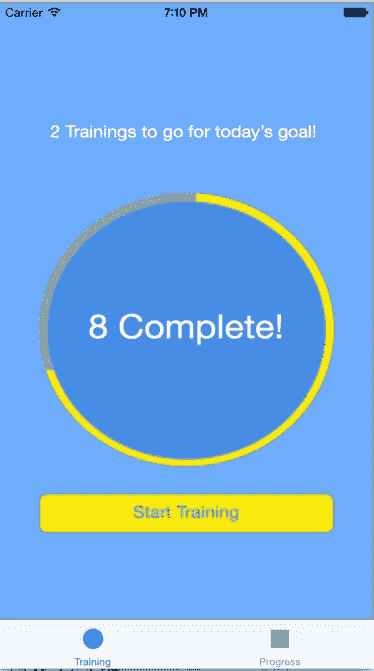

第二个这样:

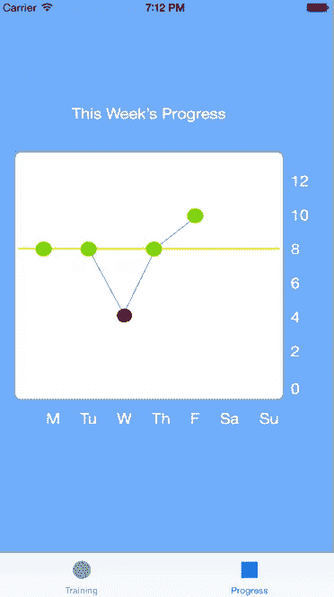

对于手表应用程序，glance 将显示一个简短的通知，说明预定的培训即将开始。

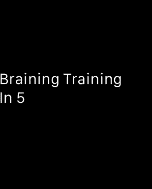

通知将从以下屏幕开始:

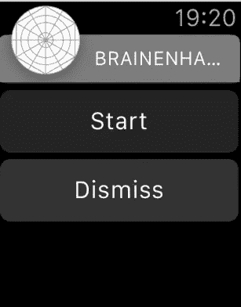

点击“开始”后，用户将进入 Watch 应用程序，测验将发布第一个问题:

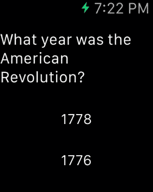

当用户点击正确答案时，将显示下一个问题，否则按钮将高亮显示红色。

## 创建 Watchkit 项目

要将手表套件扩展添加到已经创建的 iOS 项目中，请执行以下操作:

选择*文件- >新建- >目标*。选择 Apple Watch

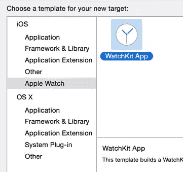

点击下一个的*，选择通知和扫视选项:*


点击*完成*，然后在激活方案弹出窗口中点击*激活*。

现在，项目中应该有类似于以下内容的文件夹:

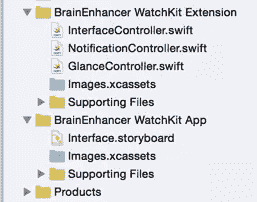

有用于通知和扫视的控制器。实际的手表应用程序代码将在*interface controller . swift*中。

这就完成了项目的设置。现在让我们开始构建 UI 并添加功能。

## 构建手表应用程序用户界面

Watchkit 对手表应用、扫视和通知使用一个故事板。

先说一眼。扫视需要显示文本“大脑训练在 5”。为了适应一览，标签高度需要增加，它需要多线。

将标签拖到底部扫视组中，并调整高度。它应该类似于以下内容:

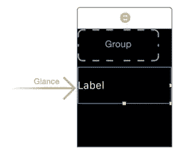

在标签的属性检查器中，将“线条”调整为 2。

对于通知，将标签更改为“培训时间”。

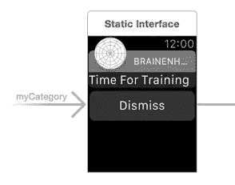

最后，Watch 应用程序需要一个标签和两个按钮，如下所示:


要创建此布局，请将标签拖到应用程序中。调整高度，使三行文本进入标签，高度为 65.5 应该没问题。将标签做成 3 行，类似于扫视标签。

要完成手表应用程序 UI，请将两个按钮拖到上面。

## 启用应用程序组

接下来，该应用程序将模拟来自 iOS 应用程序的数据，以创建一瞥。在现实世界中，iOS 应用程序可能会按照时间表让用户知道下一次培训何时开始。这个应用程序会在 iOS 应用程序中设置一个计时器，在 5 秒钟后显示扫视。要将 iOS 应用程序中的数据放入 glance，请创建一个应用程序组，这是一个用于存储数据的共享容器。为此，需要在 [iOS 开发中心](https://developer.apple.com/devcenter/ios/index.action)拥有一个帐户。

首先打开 app 群。在项目导航器中点击项目，然后点击 iOS 应用目标，再点击*功能*。打开应用程序群组。如果需要添加应用程序组，可以通过点击任何列出的应用程序组下的 *+* 来完成。

在下面的截图中，我正在使用一个名为*groups . brain enhancer _ test*的应用程序组。

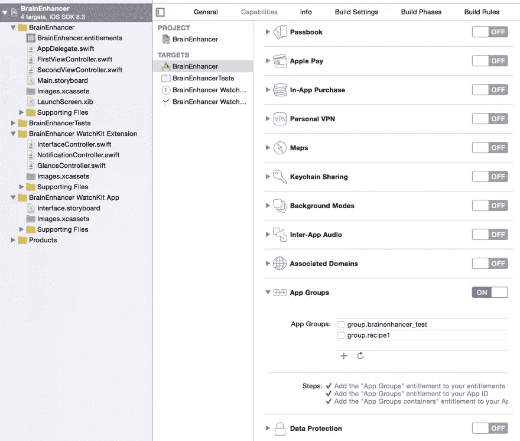

单击打开应用程序组时，可能会弹出如下所示的窗口:

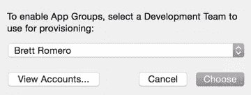

这个弹出窗口允许开发者选择他们的开发中心帐户。

接下来启用手表套件扩展的应用程序组。它位于塔吉特百货公司下面。只需遵循上述相同的步骤，并确保使用与 iOS 应用程序相同的应用程序组。

## 给目光装上电线

接下来，扫视标签需要一个`IBOutlet`。打开*界面，故事板*和*控件，点击*从标签中拖拽到 *GlanceController.swift* ，通过助理编辑打开。将插座命名为`updateLabel`，并使其成为*强*存储类型。这将创造一个`IBOutlet`。这些步骤与在 iOS 应用程序中创建`IBOutlets`的步骤相同。

```
@IBOutlet var updateLabel: WKInterfaceLabel!
```

创建好插座后，添加将从 iOS 应用程序更新标签的代码。为此，在 iOS 应用程序中，打开第一个场景视图控制器。将以下内容添加到`viewDidLoad`:

```
let sharedDefaults = NSUserDefaults(suiteName: "group.brainenhancer_test")
sharedDefaults?.setObject("Braining Training In 5", forKey: "payload")
sharedDefaults?.synchronize()
```

上面是用`NSUserDefaults`把数据推送到 app 群。我正在使用键`payload`，这将是手表应用程序中引用的提取数据的同一个键。

在`GlanceController`中，将以下内容添加到`willActivate`功能中:

```
let timer = NSTimer.scheduledTimerWithTimeInterval(5, target:self, selector: Selector("updatePayLoad"), userInfo: nil, repeats: true)
```

这将设置一个计时器，使数据在扫视出现 5 秒后显示在扫视上。`NSTimer`引用了名为`updatePayLoad`的函数。为该方法添加以下内容:

```
func updatePayLoad(){
  let sharedDefaults = NSUserDefaults(suiteName: "group.brainenhancer_test")
  let payload = sharedDefaults?.objectForKey("payload") as! String
  updateLabel.setText(payload)
}
```

这与 iOS 应用程序中的情况正好相反。引用相同的应用程序组，如`payload`键。

文本是通过函数而不是属性分配给`updateLabel`的。这是 Watchkit 的一个不同之处。大多数操作都是通过函数而不是属性来执行的。

要运行扫视，请从方案菜单中选择它:

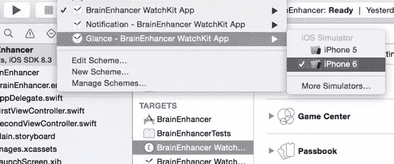

iOS 应用在这种情况下不会运行，只有扫视。如果手表应用模拟器确实出现了，打开*硬件- >外部显示器- > Apple Watch* 。5 秒钟后，我们的消息应该会出现在手表应用程序标签上。

一旦扫视运行，5 秒钟后，文本“5 分钟内 Braining Training”将可见。

## 发出通知

Watchkit 通知类似于 iOS 应用中的通知。扫视和通知的主要区别在于扫视是快速的，只读的信息和通知允许更多的交互。

启动手表应用程序并开始测验。我将使用*pushnotificationpayload . apns*进行通知，可以在*扩展*文件夹中的*支持文件*下找到。该文件包含用于配置通知 UI 的 JSON。唯一要改的是标题文字:

```
"WatchKit Simulator Actions": [
    {
        "title": "Start",
```

通知上会出现两个按钮，*解散*和*开始*。如果用户单击“解除”,通知将会消失，常规观察将会出现。如果用户点击开始，手表应用将启动。

要运行通知，使用与 glance 相同的菜单，但这次选择通知。

## 构建测验观察应用程序

现在是时候构建我们的手表应用程序了。


`IBOutlets`是所有三个 UI 元素所必需的。用助理编辑打开*interface controller . swift*。*控件点击并拖动*从每个 UI 元素进入*界面控制器*。应该有以下出口:

```
@IBOutlet var questionLabel: WKInterfaceLabel!

@IBOutlet var buttonA: WKInterfaceButton!

@IBOutlet var buttonB: WKInterfaceButton!
```

我将在扩展文件夹中添加一个`Question`类。这将在一个结构化对象中存储每个问题、答案集和正确答案。右键单击扩展文件夹并选择新建文件。添加一个`NSObject`类，并将以下内容粘贴到该类中:

```
class Question: NSObject {
var questionText: String
var answerId: Int
var answers = [Int: String]()

init(questionText:String, answerId: Int, answers:[Int:String]){
    self.questionText = questionText
    self.answerId = answerId
    self.answers = answers
}
}

class QuestionManager: NSObject {
 func getAnswerText(questionsArray:[Question], answerId:Int, questionId:Int) -&gt; String{
    let question = questionsArray[questionId]
    return question.answers[answerId]!
}

func checkAnswer(questionsArray:[Question], answerId:Int, questionId:Int) -&gt; Bool{
    let question = questionsArray[questionId]
    if(question.answerId == answerId){
        return true
    }
    return false
}
```

}

每个问题实例都用问题文本、答案 ID 和答案集初始化。还有一个类叫`QuestionManager`。这个类帮助我们获得答案文本，并检查答案是否正确。

现在回到 *InterfaceController* 并在类声明下添加以下内容:

```
var counter = 0
let questionManager = QuestionManager()
var questions = [
    Question(questionText: "What is the capital of Arizona?",
        answerId: 0,
        answers:[0:"Phoenix",1:"Flagstaff"]),
    Question(questionText: "What year was the American Revolution?",
        answerId: 1,
        answers:[0:"1778",1:"1776"])
]
```

上面的代码创建了一个`QuestionManager`类的实例，并设置了两个问题，它们被添加到一个数组中。给定问题数组以及我们如何将`NSUserDefaults`与应用程序组相关联，您可以看到这个数组是如何来自 iOS 应用程序的。

以下方法被添加到*界面控制器*中，并帮助进入下一个问题:

```
func setupNextQuestion(){

    questionLabel.setText(questions[counter].questionText)
    let answerText = questionManager.getAnswerText(questions, answerId: 0, questionId: counter)
    buttonA.setTitle(answerText)
    buttonA.setBackgroundColor(UIColor.blackColor())
    let answerText2 = questionManager.getAnswerText(questions, answerId: 1, questionId: counter)
    buttonB.setTitle(answerText2)
    buttonB.setBackgroundColor(UIColor.blackColor())
}
```

按钮背景总是重置为黑色，以防选择了错误的答案，导致背景变为红色。

现在为这两个按钮创建`IBActions`。*控件点击并拖动*各个按钮到*interface controller . swift*，应该在助理编辑器中打开。选择`IBAction`并提供以下名称。一旦创建了动作，也应该有相同的功能。

```
@IBAction func buttonA_click() {}
@IBAction func buttonB_click() {}
```

修改上面的函数，使它们看起来像这样:

```
@IBAction func buttonA_click() {
    if(questionManager.checkAnswer(questions,answerId: 0,questionId: counter)){
        counter++
        if(counter < questions.count){
            setupNextQuestion()
        }
    }
    else {
        buttonA.setBackgroundColor(UIColor.redColor())
    }
}

@IBAction func buttonB_click() {
    if(questionManager.checkAnswer(questions,answerId: 1,questionId: counter)){
        counter++
        if(counter < questions.count){
            setupNextQuestion()
        }
    }
    else {
        buttonB.setBackgroundColor(UIColor.redColor())
    }
}
```

按下按钮时，检查是否选择了正确答案。如果有，转到下一步按钮。否则，将按钮背景颜色更改为红色，不要进入下一个问题。

这应该会完成我们的手表应用程序。要运行它，请进入用于浏览和通知的同一菜单，但这次选择 Watchkit 应用程序。该应用程序将在手表模拟器中启动。选择正确答案，然后转到问题 2。如果选择了错误的答案，按钮背景将变为红色，并停留在答案上，直到按下正确的按钮。

教程的最终代码可以在 [GitHub](https://github.com/sitepoint-editors/Brain-Train-WatchKit-Final) 上找到，但是请确保在运行之前将应用组设置更改为您自己的设置。

## 结论

在本教程中，我们看到了如何扩展现有的 iOS 应用程序，并将数据从 iOS 应用程序移动到 Watchkit 扩展中。我们在手表应用程序中内置了处理测验的功能。我们学会了如何在 Xcode 中轻松启动浏览、通知或观看应用程序。

随着对界面故事板的更多探索，你会发现你可以用 watch 应用做更多的事情，让它与你的 iOS 应用相似。手表应用可以内置很多功能。这篇文章提供了一个很好的起点。一如既往，我渴望听到你们的想法和经历。

## 分享这篇文章