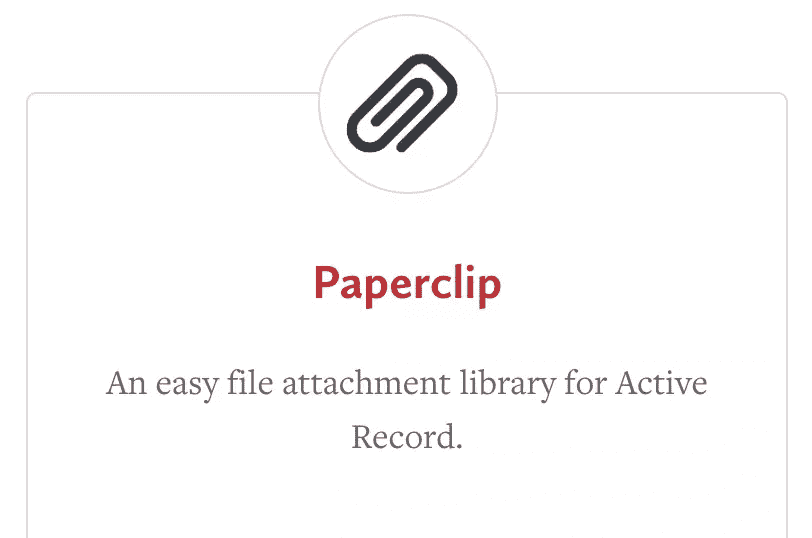

# 用回形针上传文件

> 原文：<https://www.sitepoint.com/uploading-files-with-paperclip/>



前一段时间，我用蜻蜓的和 T2 的写了[更好的文件上传，两篇文章涵盖了](https://www.sitepoint.com/file-uploads-dragonfly/)[蜻蜓的](https://github.com/markevans/dragonfly)，这是一个处理各种附件的好工具。在本文中，我将介绍 Thoughtbot 的[回形针](https://github.com/thoughtbot/paperclip),这可能是将文件上传和管理集成到应用程序中的最流行、功能最丰富的解决方案。

回形针最大的好处之一就是它庞大而活跃的社区——这个宝石会不断更新，这真的很重要。你不会想用一年后就废弃的方案吧？

我们将观察回形针的所有主要功能，并创建一个非常简单但有用的应用程序，其特点是:

*   基本文件上传
*   验证和回调
*   后处理(生成缩略图)
*   亚马逊 S3

我会给你所有必要的信息，以真正快速地开始，并提供进一步阅读的链接。

演示应用的源代码可以在 [GitHub](https://github.com/bodrovis/Sitepoint-source/tree/master/SimpleUploader) 上找到。

演示应用程序的工作示例可在[sitepoint-paperclip-uploader.herokuapp.com](https://sitepoint-paperclip-uploader.herokuapp.com)访问。

## 一些准备工作

我们将制作一个应用程序，允许用户上传自己的照片，以及浏览他人添加的照片。

创建一个名为`SimpleUploader`的新 Rails 应用程序:

```
$ rails new SimpleUploader -T
```

我这里用的是 Rails 4，但是 Paperclip 兼容 Rails 3.2，甚至 Rails 2(那样的话就用 Papeclip 2.7)。

我将使用 Bootstrap 进行基本的样式设计，但是您可以跳过这一步:

*Gemfile*

```
[...]
gem 'bootstrap-sass'
[...]
```

奔跑

```
$ bundle install
```

并更新必要的样式文件:

*application.scss*

```
@import 'bootstrap-sprockets';
@import 'bootstrap';
```

现在，调整布局以包含一个顶部菜单，并设置主要内容的样式:

*layouts/application . html . erb*

```
[...]
<nav class="navbar navbar-inverse">
  <div class="container">
    <div class="navbar-header">
      <%= link_to 'Simple Uploader', root_path, class: 'navbar-brand' %>
    </div>
    <div id="navbar" class="collapse navbar-collapse">
      <ul class="nav navbar-nav">
        <li><%= link_to 'Photos', root_path %></li>
        <li><%= link_to 'Upload Your Photo', new_photo_path %></li>
      </ul>
    </div>
  </div>
</nav>

<div class="container">
  <% flash.each do |key, value| %>
    <div class="alert alert-<%= key %>">
      <%= value %>
    </div>
  <% end %>

  <%= yield %>
</div>
[...]
```

我们将只有一个控制器:

*照片 _ 控制器. rb*

```
class PhotosController < ApplicationController
end
```

设置相应的路线:

*config/routes.rb*

```
[...]
resources :photos, only: [:new, :create, :index, :destroy]

root to: 'photos#index'
[...]
```

让我们创建我们的`Photo`模型。现在，只添加一个`title`属性…我们稍后会处理其他属性:

```
$ rails g model Photo title:string
$ rake db:migrate
```

基本上准备工作都做好了。现在，我们可以集成回形针和充实控制器。进入下一部分！

## 60 秒内实现文件上传

### 系统需求

在继续之前，请花几分钟时间检查您的系统是否已准备好回形针。有几件事必须要做:

*   必须安装 Ruby 2.0 或更高版本，并且必须使用 Rails 3.2 或 4。你仍然可以使用 Ruby 1.8.7 或者 Rails 2，但是为了这个，坚持使用回形针 2.7。这个版本有一个[单独的自述文件](http://www.rubydoc.info/gems/paperclip/2.7.0)，我不打算在这里介绍。
*   Windows 用户必须安装 [DevKit](https://github.com/oneclick/rubyinstaller/wiki/Development-Kit) 。
*   必须安装 ImageMagick ，这是一个很好的图像处理工具。所有主要平台的二进制版本都可用。
*   `file`命令应该可用。Windows 没有，但是 DevKit 提供了。然而，在某些情况下，你必须手动添加它——点击阅读更多[。](https://github.com/thoughtbot/paperclip#file)

当这个小清单中的所有项目都完成后，进行下一步！

### 集成回形针

你不必成为超级英雄，只要使用 Rails 和回形针，就可以在一分钟内将文件上传功能集成到你的应用程序中。说真的，真的很容易上手。首先，包括创业板:

*Gemfile*

```
[...]
gem "paperclip", "~> 4.2"
[...]
```

并安装它:

```
$ bundle install
```

现在，我们需要向`photos`表添加一些属性。您可以为此生成一个简单的迁移，但是 Paperclip 有一个很好的生成器:

```
$ rails generate paperclip photo image
```

下面是最终的迁移结果:

*XXX _ add _ attachment _ image _ to _ photos . Rb*

```
class AddAttachmentImageToPhotos < ActiveRecord::Migration
  def self.up
    change_table :photos do |t|
      t.attachment :image
    end
  end

  def self.down
    remove_attachment :photos, :image
  end
end
```

如你所见，回形针甚至提供了自己的`attachment`方法，这真的很方便。这个方法实际上是做什么的？它将下列添加到您的表中:

*   `{attachment}_file_name`
*   `{attachment}_file_size`
*   `{attachment}_content_type`
*   `{attachment}_updated_at`

附件字段的名称是提供给`attachment`方法的参数(在我们的例子中是`image`)。实际上，只有`{attachment}_file_name`字段是必需的，所以如果您不想存储其他信息，可以创建一个基本迁移。

现在应用迁移:

```
$ rake db:migrate
```

并为您的模型配备回形针功能:

*模特/照片. rb*

```
[...]
has_attached_file :image
[...]
```

设置控制器:

*照片 _ 控制器. rb*

```
class PhotosController < ApplicationController
  def index
    @photos = Photo.order('created_at')
  end

  def new
    @photo = Photo.new
  end

  def create
    @photo = Photo.new(photo_params)
    if @photo.save
      flash[:success] = "The photo was added!"
      redirect_to root_path
    else
      render 'new'
    end
  end

  private

  def photo_params
    params.require(:photo).permit(:image, :title)
  end
end
```

请注意，您只需要允许`image`，而不是`image_file_name`或其他字段。那些是回形针内部使用的。

`new`动作的视图:

*views/photos/new . html . erb*

```
<div class="page-header"><h1>Upload Photo</h1></div>

<%= form_for @photo do |f| %>
  <%= render 'shared/errors', object: @photo %>

  <div class="form-group">
    <%= f.label :title %>
    <%= f.text_field :title, class: 'form-control' %>
  </div>

  <div class="form-group">
    <%= f.label :image %>
    <%= f.file_field :image, class: 'form-control'%>
  </div>

  <%= f.submit 'Upload', class: 'btn btn-primary' %>
<% end %>
```

我更喜欢将错误消息提取到单独的部分:

*views/shared/_ errors . html . erb*

```
<% if object.errors.any? %>
  <div class="panel panel-warning errors">
    <div class="panel-heading">
      <h5><i class="glyphicon glyphicon-exclamation-sign"></i> Found errors while saving</h5>
    </div>

    <ul class="panel-body">
      <% object.errors.full_messages.each do |msg| %>
        <li><%= msg %></li>
      <% end %>
    </ul>
  </div>
<% end %>
```

好的，如你所见，这个表格非常简单。只需使用`f.file_field :image`来呈现适当的字段。对于 Rails 3，您还必须为`form_for`方法提供`:html => { :multipart => true }`。

但是，如果您现在尝试上传文件，将会引发异常。为什么？因为回形针比其他任何人都更关心您的应用程序的安全性！从版本 4 开始，要求在您的模型中至少有一个内容类型验证，所以让我们添加它:

*模特/照片. rb*

```
[...]
validates_attachment :image,
                     content_type: { content_type: ["image/jpeg", "image/gif", "image/png"] }
[...]
```

请注意，为了使验证生效，您的表必须有一个`<attachment>_content_type</attachment>`列。

但是，如果我们是经验丰富的开发人员，能够照顾好自己，那会怎么样呢？我们能告诉回形针我们的附件不应该被验证吗？但是，当然:

```
do_not_validate_attachment_file_type :avatar
```

但是，只有在你真正明白自己在做什么的情况下，才加上这一行。

验证就绪后(或者明确禁用后)，您可以上传您的第一个文件。然而，在此之前，让我们创建`index`视图:

*views/photos/index . html . erb*

```
<div class="page-header"><h1>Photos</h1></div>

<%= render @photos %>
```

我们只是简单地迭代`@photos`数组。默认情况下将使用 *_photo.html.erb* 部分，所以让我们创建它:

*views/photos/_ photo . html . erb*

```
<div class="media">
  <div class="media-left">
    <%= link_to image_tag(photo.image.url, class: 'media-object'), photo.image.url, target: '_blank' %>
  </div>
  <div class="media-body">
    <h4 class="media-heading"><%= photo.title %></h4>
  </div>
</div>
```

为了显示图像，我们使用了古老的方法。`image.url`，正如你已经猜到的，返回原始图像的 URL。

继续上传一些东西。一切都应该运行良好，但还有更多工作要做，所以让我们进行下一步。

## 生成缩略图和后期处理

如果你上传一个大图片，它会完全破坏你的页面布局。我们可以应用一些简单的样式来缩小`.media`块中的大图像，但这并不是最理想的。用户仍然需要下载图像的完整版本，然后调整大小。为什么要这样浪费带宽？让我们在 ImageMagick 的帮助下生成缩略图！

每个附件可以有一组定义原始图像各种版本的“样式”。再补充一个:

*模特/照片. rb*

```
[...]
has_attached_file :image,
                  styles: { thumb: ["64x64#", :jpg] }
[...]
```

这一切意味着什么？`thumb`是“风格”的名称。`64x64`，正如你所猜测的，意味着这个版本的图像大小为 64×64 像素。`#`表示如果图像大于提供的尺寸(带重心)，ImageMagick 应该裁剪图像。

如果你浏览[这一页](http://www.imagemagick.org/script/command-line-processing.php#geometry)你不会找到这个选项，但是回形针自己把它添加到。顺便说一下，蜻蜓也做同样的事情。

`:jpg`表示原始文件应该转换成 JPEG。非常整洁干净。

您可以使用以下命令根据新样式重新生成缩略图:

```
$ rake paperclip:refresh:thumbnails CLASS=User
```

要重新生成所有图像(包括原始图像),请使用:

```
$ rake paperclip:refresh CLASS=Photo
```

要仅生成缺失的图像:

```
$ rake paperclip:refresh:missing_styles
```

现在，更新部分:

*views/photos/_ photo . html . erb*

```
[...]
<%= link_to image_tag(photo.image.url(:thumb), class: 'media-object'), photo.image.url, target: '_blank' %>
[...]
```

我们只是向`url`方法提供样式的名称。看看结果！

让我们添加更多的后处理选项:

*模特/照片. rb*

```
[...]
has_attached_file :image,
                  styles: { thumb: ["64x64#", :jpg],
                            original: ['500x500>', :jpg] },
                  convert_options: { thumb: "-quality 75 -strip",
                                     original: "-quality 85 -strip" }
[...]
```

`original`表示需要对原图应用以下样式。`500x500>`表示如果需要，图像应该调整到 500×500 并缩小。如果图像的尺寸更小，它将保持不变。

在`convert_options`的帮助下，你可以传递额外的参数。在这个例子中，我们说图像质量应该相应地被重新缩放到 75% (thumb)和 85% (original)以减小它们的大小。`-strip`选项告诉 ImageMagick 去掉所有元信息。

重新生成所有图像:

```
$ rake paperclip:refresh CLASS=Photo
```

并观察结果。

通过将`lambda`传递给`styles`，可以很容易地动态定义样式:

```
has_attached_file :image, :styles => lambda { |attachment| { :thumb => (attachment.instance.title == 'Special' ? "100x100#" : "64x64#") } }
```

在这个非常简单的例子中，我们只需检查照片的标题，如果它是“特殊的”，就使用其他维度进行造型。

回形针为您提供方便的回调`before_post_process`和`after_post_process`来完成后期处理前后的工作。您甚至可以定义特定于附件的回调:

```
before_{attachment}_post_process
after_{attachment}_post_process
```

回调使用的经典例子是检查文件是否是图像。回形针的文档提供了以下片段:

```
before_post_process :skip_for_audio

def skip_for_audio
  ! %w(audio/ogg application/ogg).include?(asset_content_type)
end
```

如果`before`回调返回`false`，则不会进行后处理。在这里阅读更多。

值得一提的是，你可以编写自己的处理器，存储在 *lib/paperclip_processors* 里面——paper clip 自动加载所有放在这里的文件。在这里阅读更多。

## 确认

让我们回到我们的[验证](https://github.com/thoughtbot/paperclip#validations)并添加更多的验证。例如，我希望所有照片都设置了图像，并且大小不超过 500 KB。这很简单:

*模特/照片. rb*

```
validates_attachment :image, presence: true,
                     content_type: { content_type: ["image/jpeg", "image/gif", "image/png"] },
                     size: { in: 0..500.kilobytes }
```

顺便说一下，回形针还可以自动防止内容类型欺骗，也就是说，你不能上传 HTML 文件为 JPEG 格式。更多信息请点击查看[。](https://github.com/thoughtbot/paperclip#security-validations)

另一件要记住的事情是，如果模型无效，即验证失败，后处理不会开始。

## 存储图像

[默认情况下](https://github.com/thoughtbot/paperclip#understanding-storage)所有图像都放在 Rails 项目的 *public/system* 目录中。您可能不希望用户看到该路径并以某种方式混淆它。回形针也能搞定！

*模特/照片. rb*

```
[...]
has_attached_file :image,
                  url: "/system/:hash.:extension",
                  hash_secret: "abc123"
[...]
```

必须为此进行设置。

您可能会问的另一个问题是，当相应的记录被销毁时，图像会发生什么变化？通过向控制器添加一个`destroy`方法来找出答案

*照片 _ 控制器. rb*

```
[...]
def destroy
  @photo = Photo.find(params[:id])
  @photo.destroy
  flash[:success] = "The photo was destroyed."
  redirect_to root_path
end
[...]
```

并且修改部分:

*views/photos/_ photo . html . erb*

```
<div class="media">
  <div class="media-left">
    <%= link_to image_tag(photo.image.url(:thumb), class: 'media-object'), photo.image.url, target: '_blank' %>
  </div>
  <div class="media-body">
    <h4 class="media-heading"><%= photo.title %></h4>
    <%= link_to 'Remove', photo_path(photo), class: 'btn btn-danger', method: :delete, data: {confirm: 'Are you sure?'} %>
  </div>
</div>
```

删除一些照片——相应的图片也应该被销毁。然而，[的这种行为可以通过将`preserve_files`设置为`true`来改变](https://github.com/thoughtbot/paperclip#file-preservation-for-soft-delete):

*模特/照片. rb*

```
[...]
has_attached_file :image,
                  preserve_files: "true"
[...]
```

当使用类似于[的东西将*作为*偏执狂](https://github.com/ActsAsParanoid/acts_as_paranoid)来软删除记录时，这很方便。

## 坐在云端

你会问，我们能在 CDN 中存储图像吗？是的，是的，我们可以。在这个演示中，我将向你展示如何使用[亚马逊 S3](https://aws.amazon.com/s3/) 作为文件存储。回形针[支持](https://github.com/thoughtbot/paperclip#storage)其他存储选项，比如 Dropbox。

新宝石的掉落:

*Gemfile*

```
[...]
gem 'aws-sdk', '~> 1.6'
[...]
```

然后跑

```
$ bundle install
```

写这篇文章的时候，回形针**还没有**支持 AWS SDK 版，暂时不要用！不过对它的支持[应该很快就会加入](https://github.com/thoughtbot/paperclip/pull/1903)。

现在修改你的模型(同时删除`url`和`hash_secret`选项):

*模特/照片. rb*

```
[...]
has_attached_file :image,
                  styles: { thumb: ["64x64#", :jpg],
                            original: ['500x500>', :jpg] },
                  convert_options: { thumb: "-quality 75 -strip",
                                     original: "-quality 85 -strip" },
                  storage: :s3,
                  s3_credentials: {access_key_id: ENV["AWS_KEY"], secret_access_key: ENV["AWS_SECRET"]},
                  bucket: "YOUR_BUCKET"
[...]
```

实际上，`s3_credentials`可以接受一个带有`access_key_id`和`secret_access_key`的 YAML 文件的路径。此外，您可以为各种环境提供不同的值，如下所示:

```
development:
  access_key_id: 123...
  secret_access_key: 123...
test:
  access_key_id: abc...
  secret_access_key: abc...
production:
  access_key_id: 456...
  secret_access_key: 456...
```

不过，对我们来说，那就有点过了。点击阅读更多[。](http://www.rubydoc.info/gems/paperclip/Paperclip/Storage/S3)

现在，去哪里拿那些钥匙？在 [AWS](https://console.aws.amazon.com) 注册并导航至安全证书(右上角的下拉菜单)。接下来打开“用户”选项卡，并单击“创建新用户”按钮。我们将创建一个特殊的服务用户帐户，该帐户将只具有使用 S3 的权限。在引入这个系统之前，我们必须使用根密钥，这不是很安全。任何获得这个密钥的人都拥有对你所有 AWS 服务的**完全**访问权。亚马逊仍然支持根键，但我真的不建议使用它们。

点击创建新用户后，输入用户名并勾选“为每个用户生成一个访问密钥”。单击创建。

现在单击“Show User Security Credentials”，将访问密钥 ID 和秘密访问密钥复制并粘贴到您的模型中。这将是用户凭据最后一次可供下载，因此您可能还希望下载并将其存储在安全的地方。非常小心这个密钥对，并且**永远不要**暴露它(特别是，它不应该在 GitHub 中可见)。在 Heroku 上部署时，我使用环境变量来存储这个密钥对。

完成后，转到“组”页面并单击“创建新组”。输入群组名称(类似于“access *to* s3”)。

点击下一步，在下一页的搜索表单中输入“S3”。这是为组选择策略的页面。选择“AmazonS3FullAccess”并点击下一步和创建。顺便说一下，您可以在相应的页面上创建自己的策略来定义自定义权限(例如，如果您想授予某人访问账单信息的权限——默认情况下没有这样的策略)。

单击新创建的组，然后单击将用户添加到组。接下来，只需从列表中选择您的新用户，然后单击 Add Users。现在，您的用户拥有使用 S3 的所有必要权限。如果你以前使用过 [Active Directory](https://en.wikipedia.org/wiki/Active_Directory) ，这个过程应该非常熟悉。

另外，不要忘记打开 S3 管理控制台，并创建一个新的存储桶来存储您的图像(您可能会认为存储桶是简单的文件夹)。在模型文件的`bucket`选项中提供桶的名称。

基本上，你可以走了。尝试使用新存储上传一些文件！

请注意，默认情况下，这些文件是用`public_read`权限加载的，这意味着任何人只需输入正确的 URL 就可以查看它们。使用`s3_permissions`选项你可以改变它(这里的是关于 S3 权限的信息)。

回形针的维基还提供了一份关于限制访问 S3 图片的[精美指南](https://github.com/thoughtbot/paperclip/wiki/Restricting-Access-to-Objects-Stored-on-Amazon-S3)。基本上，它建议将`s3_permissions`设置为`private`，并在 URL 过期的控制器中使用特殊的`download`动作。

最后要注意的是，一般来说，S3 是有偿服务。然而，在第一年，您每月可以免费获得 5GB 的存储空间、20000 个 get 和 2000 个 PUT 请求。完整的定价信息可在[这里](https://aws.amazon.com/s3/pricing/)找到。

## 结论

在本文中，我们讨论了回形针及其各种功能，如后处理、回调、URL 混淆和对各种存储选项的支持。如果你从未在你的项目中使用过回形针，当需要文件上传支持时，我真的建议你尝试一下。

一如既往，我们非常欢迎您的反馈，请随时提问。感谢您的阅读，再见！

## 分享这篇文章