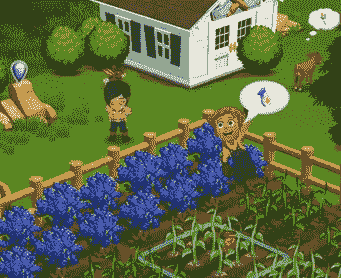

# 什么时候绿色的牧场实际上不是绿色的？

> 原文：<https://www.sitepoint.com/cognitive-dissonancegreen-pastures-not-actually-green/>

作为 SitePoint 的咖啡饮用大户，我们每周也生产一箱牛奶。最近，我们使用的牛奶公司更名。这是新标签。

如果说大脑有可能“退缩”，那么当我看到这个的时候，我的大脑就退缩了。其实每次看到这个奶瓶，我的大脑还是会退缩。

毫无疑问,“绿色牧场”对任何乳制品来说都是一个非常体面的名字。这个短语让人联想到平静、满足的奶牛在茂盛的田野里懒洋洋地吃草的景象。

伙计们，在命名研讨会上击掌吧！

然而，他们是如何决定用一种干燥、尘土飞扬的棕色来描绘他们的“绿色牧场”标签——干旱、沙漠和晒干的粘土的颜色——的想法是生命中最大的谜团之一。勇于设计是很好的，但是你需要小心不要破坏你的信息。

虽然有些人比其他人更强烈地感受到这种感觉，但当我们注意到这样的奇怪现象时，大多数人都会感到某种精神不适。心理学家称这种不适为“认知失调”——这一概念首先由[利昂·费斯汀格](https://en.wikipedia.org/wiki/Leon_Festinger)提出。

费斯汀格认为，当人们遇到这种情况时，他们通常会:

1.  尝试消除或解决不适
2.  避免将来不舒服

我们的牛奶*尝起来*很好，因为它是送到冰箱的，所以我用它。但是我会从超市货架上选择它吗？不，如果我有选择的话。当然，这只是一个印刷的贴纸，但感觉有点不对劲。

奇怪的是，这甚至发生在随机的、偶然的不和谐出现的时候。

红色和绿色的 Scrum 封面

我目前正在为大卫·格林的《Scrum:新手到忍者》做封面。显然大卫只是姓“绿”，而不是色调(他可能是也可能不是“政治绿”)。

然而，当我把他的名字合成到橙色背景上时，感觉很奇怪。起初我甚至想不出为什么，但我的潜意识似乎在某个地方不耐烦地用肘推我。最终我的意识也“明白”了。

当我把橙色换成绿色的时候，就像是从我的鞋子里抖出了一块石头。它修好了东西。

即使看了上面的动画，我还是有同样的感觉。很奇怪吧。

### 不要不和谐

这难道不意味着你应该不惜一切代价避免认知失调吗？

不。事实上，像 Farmville，Sim City，甚至 ol' school Mouse Trap 棋盘游戏这样的游戏的整个机制都是围绕着利用你自己的不适来吸引你更深地进入游戏而建立的。

你投资一些时间，然后有一个选择。无所事事，逐渐失去你所拥有的。或者投入更多的时间，保护你所拥有的并获得更多——即使你获得的“更多”没有任何有形的价值。

毕竟，你的理由是，如果因为你没有及时收获而让那些虚拟的茄子在藤上枯萎，那将是疯狂的，对吗？你花了那么多时间…

Zynga 在 2010-2011 年能够每天赚进数千万美元，就是因为它为休闲游戏玩家提供了缓解他们“精神不适”的方法。他们甚至不需要提供有趣的游戏、手眼协调挑战甚至是乐趣。

事实上，没有多少人谈论过*喜欢玩 Farmville* 的体验——他们只是更喜欢它，而不是当他们停止游戏和他们的农场死亡时发生的事情。

因此，事实证明，如果你正确利用它，认知失调可以成为一种真正有用的力量，来移动和激励那些已经参与到你的网站、应用程序、游戏等中的人。

但是，如果它出现在你的产品/服务的介绍过程中，它的破坏性会更大。这时候最容易缓解他们不适的方法就是选择另一家牛奶公司。

不和谐是一种黑暗而强大的力量。明智地使用它。

*转载自 [SitePoint 设计简讯](https://www.sitepoint.com/newsletter/)*

## 分享这篇文章