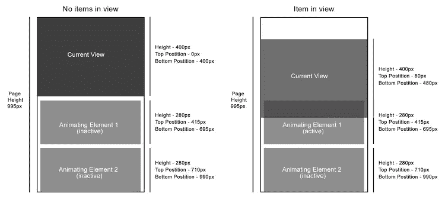

# 使用 jQuery 和 CSS3 创建基于滚动的动画

> 原文：<https://www.sitepoint.com/scroll-based-animations-jquery-css3/>

创造运动是为观众提供有趣互动体验的好方法。随着现代网站提供了更多的交互性，人们越来越期望即使是简单的网站也能提供一定程度的动画/动作来吸引访问者。

今天，我将概述一项技术，您可以将其应用到您的 web 项目中——当滚动到预定义的区域时触发动画。这些动画将使用 CSS [变换](https://developer.mozilla.org/en-US/docs/Web/CSS/transform)和 CSS [过渡](https://developer.mozilla.org/en-US/docs/Web/CSS/transition)来创建。我们还将使用 jQuery 来检测元素何时可见，并添加/删除适当的类。

对于那些想看实际例子的人，你可以[直接跳到演示](#scroll-animation-examples)。

### 为什么在滚动时触发动画？

我们希望在滚动时触发动画的主要原因是，当用户将一个元素滚动到视图中时，动画就会被激活。

我们可能想要淡入元素，或者提供一个有趣的转换，这些只有在用户可以实际查看它们时才有意义。

## 用 CSS 还是用 jQuery 制作动画？

每种方法都有利弊。jQuery (read JavaScript)允许你将 CSS 不能做的事情(比如滚动位置，或者一个元素的属性)做成动画，而 CSS 动画对于那些喜欢将他们所有的动画和表现逻辑放在 CSS 层的开发者来说是非常有吸引力的。

我将通过 CSS 使用转换，但是根据你的情况，总有一些变量需要考虑。我会考虑以下因素:

### 浏览器兼容性

由于我们的解决方案将基于变换，我们的浏览器兼容性将限于那些支持 2D 变换或 3D 变换的浏览器。

所有现代浏览器都将[支持 3D 转换](http://caniuse.com/#feat=transforms3d)，一些老版本的浏览器如 Internet Explorer 9 和 Opera 11.5 将[支持 2D 转换](http://caniuse.com/#feat=transforms2d)。对桌面和移动浏览器的全面支持。

jQuery 的 [animate 方法](http://api.jquery.com/animate/)可以在任何(sane)浏览器中工作，前提是您使用的是 1。库的 x 版本。jQuery 2。x 移除了对 IE8 及以下版本的支持，所以只有在不需要支持传统浏览器的情况下才使用它(你真幸运！).

### 速度

我们想要快速流畅的动画，尤其是在移动设备上。因此，尽可能使用过渡和转换总是最好的。

这些例子将使用 3D 变换和 2D 回退来支持旧的浏览器。我们想要强制硬件加速以提高速度，因此 3D 转换是必须的(我们将使用`translate3d`以及其他导致 GPU 加速渲染的函数)。

jQuery 的`animate`方法比 GPU 辅助的转换要慢得多，所以我们只是将 jQuery 用于我们的事件处理/计算，而不是我们的动画本身(因为我们希望它们尽可能平滑)。

### 边注

我们都知道`jQuery !== JavaScript`，对吧？事实证明，在动画中使用普通的 JS 可能并不是一个坏主意。虽然这超出了本教程的范围，但对于那些有兴趣了解更多的人来说，这里有两篇关于这个主题的优秀文章:

*   [CSS 与 JS 动画:哪个更快？](http://davidwalsh.name/css-js-animation)
*   [打破神话:CSS 动画 vs. JavaScript](https://css-tricks.com/myth-busting-css-animations-vs-javascript/)

现在回到节目…

## 检测视图中的动画元素

这项技术的要点是浏览我们标记为可动画的所有元素，然后确定它们当前是否在视口中。让我们逐步了解我们将如何实现这一目标:

### 选择器缓存

滚动是一项昂贵的业务。如果您将一个事件监听器附加到`scroll`事件，那么每当用户滚动页面时，它将被触发多次。因为每当用户滚动时，我们将调用我们的维度/计算函数，所以将选择器返回的元素存储在变量中是一个好主意。这被称为[选择器缓存](http://ttmm.io/tech/selector-caching-jquery/)，避免我们一遍又一遍地查询 DOM。

在我们的脚本中，我们将引用`window`对象和我们想要制作动画的元素集合。

```
//Cache reference to window and animation items
var $animation_elements = $('.animation-element');
var $window = $(window);
```

注意变量前面的美元符号。这是一个约定，表示它们持有一个 jQuery 对象或对象集合。

### 查看滚动事件

接下来，我们创建监听`scroll`事件的事件处理程序。这将在我们滚动页面时触发。我们向它传递一个对我们的`check_if_in_view`函数的引用(我们马上就会用到它)。每次触发滚动事件时，都会执行该函数。

```
$window.on('scroll', check_if_in_view);
```

### 处理调整大小

因为我们在计算高度和宽度，所以我们需要考虑方向的变化以及一般的尺寸调整。

我们可以更新我们的事件处理程序来监听`scroll`和`resize`事件。这将使我们的检测功能工作时，我们调整大小或改变方向。

```
$window.on('scroll resize', check_if_in_view);
```

此外，我们还使用 jQuery `trigger`方法在 DOM 准备就绪时触发一个`scroll`事件。我们这样做是为了，如果任何应该被动画化的元素在视口内，它们将被检测为在视图中，并且动画被应用，就像我们已经滚动一样。

```
$window.trigger('scroll');
```

### 滚动位置检测

该示例的实际检测部分来自以下脚本。

```
function check_if_in_view() {
  var window_height = $window.height();
  var window_top_position = $window.scrollTop();
  var window_bottom_position = (window_top_position + window_height);

  $.each($animation_elements, function() {
    var $element = $(this);
    var element_height = $element.outerHeight();
    var element_top_position = $element.offset().top;
    var element_bottom_position = (element_top_position + element_height);

    //check to see if this current container is within viewport
    if ((element_bottom_position >= window_top_position) &&
        (element_top_position <= window_bottom_position)) {
      $element.addClass('in-view');
    } else {
      $element.removeClass('in-view');
    }
  });
}
```

让我们来分析一下这里发生了什么。

当 DOM 准备好的时候，调用函数`check_if_in_view`,然后每次我们调整大小或者滚动的时候。

我们得到窗口的当前高度，以及它的顶部和底部位置，这样我们就知道我们在看什么区域。

我们遍历并寻找所有将在中动画的项目(保存在`$animation_elements`变量中)。对于这些元素中的每一个，我们收集它的高度以及它的顶部和底部位置(这样我们就知道它在页面上的位置)。

我们比较每一项，看它的底部位置是否大于窗口的顶部位置，以及该项的顶部位置是否小于窗口的底部位置。

这是一个直观的例子



### 计算高度和宽度

在我们的检测函数中，我们需要获得各种元素的高度和位置来正确计算，这就是我们使用 jQuery 的`height`函数的地方。分析这些高度函数是如何工作的很重要

#### 高度()和宽度()

`height()`和`width()`函数返回一个元素的高度或宽度。它们不包括所有填充、边框和边距。


如需详细分析，请访问[高度](http://api.jquery.com/height/)或[宽度](http://api.jquery.com/width/)文档。

#### 内侧高度()和内侧宽度()

`innerHeight()`和`innerWidth()`函数返回元素的高度或宽度，包括它的附加填充(但是它不包括边框和边距)


如需详细分析，请访问[内高](http://api.jquery.com/innerHeight/)或[内宽](http://api.jquery.com/innerWidth/)文档。

#### 外部高度()和外部宽度()

`outerHeight()`和`outerWidth()`函数返回元素的高度或宽度，包括其填充和边框。

此外，您还可以通过向函数传递一个值`true`来指定包含其边距。


如需详细分析，请访问[外部高度](http://api.jquery.com/outerHeight/)或[外部宽度](http://api.jquery.com/outerWidth/)文档

## 滚动动画示例

下面列出了一系列动画，它们使用了我们讨论过的基础知识。这些示例将寻找动画元素，并在它们位于视口内时应用活动的`in-view`类。

您想要移动的元素都应该有一个标准的类，比如`animation-element`，将它的位置设置为相对或绝对。此外，如果你要创建多个效果，你可以创建相应的类，比如可以与`in-view`类结合的`slide-left`。然后，您应该将转换应用到一个类，比如`animation-element.slide-left.inview`

### 从左侧滑入

对于我们的第一个例子，当元素进入视口时，我们将从左边滑入元素。我们通过在元素 x 轴上使用一个`translate3d`来实现这一点。

在 [CodePen](http://codepen.io) 上通过 SitePoint ( [@SitePoint](http://codepen.io/SitePoint) )从左滑入。