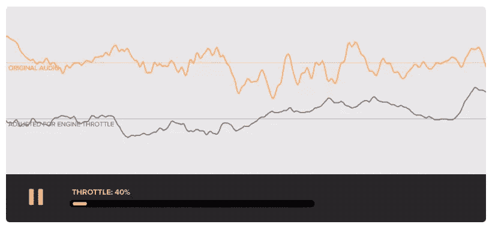
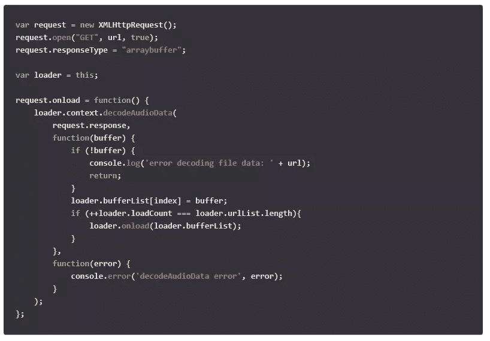
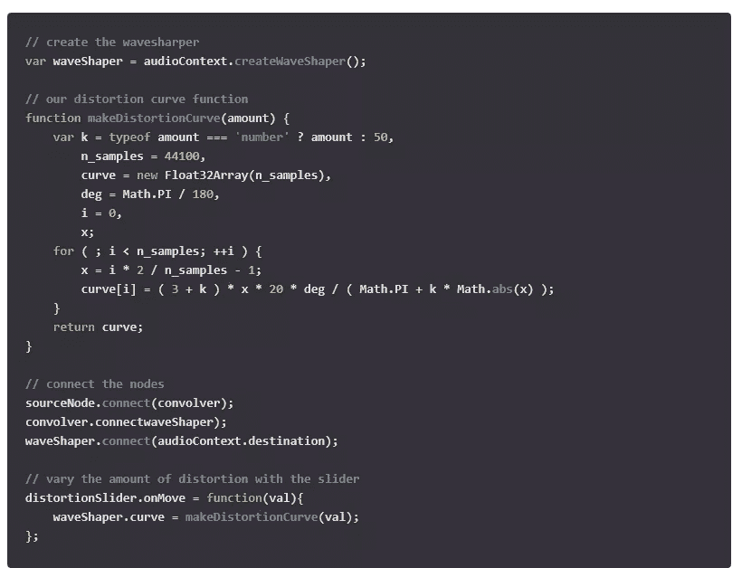
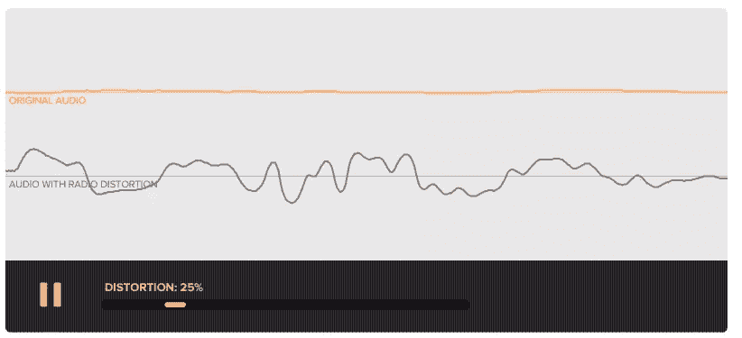

# 网络音频 API 的动态声音

> 原文：<https://www.sitepoint.com/dynamic-sound-with-the-web-audio-api/>

本文是微软网站开发系列的一部分。感谢您对使 SitePoint 成为可能的合作伙伴的支持。

在[网络音频 API](https://dvcs.w3.org/hg/audio/raw-file/tip/webaudio/specification.html?WT.mc_id=13407-DEV-sitepoint-article31) 之前，HTML5 给了我们`audio`元素。现在可能很难记住，但是在`audio`元素之前，我们在浏览器中最好的声音选择是插件！`audio`元素确实令人兴奋，但它有一个非常独特的焦点。它本质上是一个没有视频的视频播放器，适合音乐或播客之类的长音频，但不适合游戏的需求。我们忍受了(或找到了解决办法)循环问题，并发声音限制，故障和完全缺乏对声音数据本身的访问。

幸运的是，我们的耐心得到了回报。在缺少`audio`元素的地方，Web Audio API 提供了。它让我们对声音有了前所未有的控制，是从游戏到复杂声音编辑的完美选择。所有这些都有一个整洁的 API，使用起来非常有趣，并且得到了很好的支持。

让我们更具体一点:网络音频让你访问声音的原始波形数据，并让你操纵、分析、扭曲或以其他方式修改它。它对于音频就像画布 API 对于像素一样。你可以深入且自由地接触声音数据。真的很厉害！

本教程是 Flight Arcade 系列的第二篇，旨在展示 web 平台和新的[微软 Edge 浏览器和 EdgeHTML 渲染引擎](http://dev.modern.ie/?utm_source=SitePoint&utm_medium=article31&utm_campaign=SitePoint)的可能性。本文的交互式代码和示例也位于:http://www.flightarcade.com/learn/

[youtube xyaq9TPmXrA]

## 飞行声音

即使是飞行模拟器的最早版本也努力使用声音来重现飞行的感觉。最重要的声音之一是发动机的动态音调，它随着油门的变化而变化。我们知道，当我们为网络重新设计游戏时，静态的引擎噪音会看起来很单调，所以引擎噪音的动态音调是网络音频的明显候选。

你可以在这里互动尝试一下。

不太明显(但可能更有趣)的是我们飞行教练的声音。在 Flight Arcade 的早期版本中，我们播放了教练的声音，就像它被录制下来一样，听起来就像是从录音棚里出来的一样！我们注意到，我们开始将声音称为“讲述者”，而不是“指导者”不知何故，原始的声音打破了游戏的幻觉。驾驶舱里嘈杂的声音掩盖了如此完美的音频，这似乎不太对劲。因此，在这种情况下，我们使用网络音频将一些简单的失真应用到语音指令中，增强了学习飞行的真实感！

在文章的最后有一个教师音频的样本。在下面的章节中，我们将向您详细介绍我们是如何使用网络音频 API 来创建这些声音的。

## 使用 API: AudioContext 和音频源

任何网络音频项目的第一步都是创建一个`AudioContext`对象。一些浏览器(包括 Chrome)仍然需要这个 API 作为前缀，所以代码看起来像这样:

那么你需要一个声音。实际上，您可以使用 Web Audio API 从头开始生成声音，但出于我们的目的，我们希望加载一个预先录制的音频源。如果你已经有一个 HTML `audio`元素，你可以使用它，但是很多时候你不会。毕竟，如果你有网络音频，谁还需要一个`audio`元素呢？最常见的情况是，你只需通过 http 请求将音频直接下载到缓冲区:

现在我们有了一个音频上下文和一些音频数据。下一步是让这些东西一起工作。为此，我们需要…

## 音频代码

你对网络音频所做的一切都是通过某种 AudioNode 发生的，它们有许多不同的风格:一些节点用作音频源，一些用作音频输出，一些用作音频处理器或分析器。你可以把它们连在一起做有趣的事情。

你可能会认为音频环境是一种声音舞台。它包含的各种乐器、放大器和扬声器都是不同类型的音频节点。使用 Web Audio API 很像是将所有这些东西连接在一起(比如，将乐器连接到效果踏板，将踏板连接到放大器，然后连接到扬声器，等等)。).

嗯，为了对我们新获得的 AudioContext 音频源做任何有趣的事情，我们需要首先将音频数据封装为一个源 AudioNode。

## 重放

就是这样。我们有消息来源。但是在我们播放它之前，我们需要将它连接到一个目的节点。为了方便起见，AudioContext 公开了一个默认的目的节点(通常是您的耳机或扬声器)。一旦连接上，就只需要调用 start 和 stop。

值得注意的是，在每个源节点上只能调用一次`start()`。这意味着不直接支持“暂停”。一旦源被停止，它就过期了。幸运的是，源节点是廉价的对象，易于创建(请记住，音频数据本身在单独的缓冲区中)。因此，如果您想要恢复暂停的声音，您可以简单地创建一个新的源节点，并使用时间戳参数调用 start()。AudioContext 有一个内部时钟，可以用来管理时间戳。

## 引擎声

这是最基本的，但是我们到目前为止所做的一切(简单的音频回放)都可以用旧的`audio`元素来完成。对于 Flight Arcade，我们需要做一些更动态的东西。我们希望螺距随着引擎的速度而变化。

对于网络音频来说，这其实很简单(如果没有它，这几乎是不可能的)！源节点具有影响回放速度的速率属性。要提高音调，我们只需提高回放速率:

发动机声音也需要循环。这也很简单(它也有一个属性):

但是有一个问题。许多音频格式(尤其是压缩音频)将音频数据存储在固定大小的帧中，通常，音频数据本身不会“填充”最终的帧。这可能会在音频文件的结尾留下一个微小的间隙，并在这些音频文件循环播放时导致滴答声或毛刺。标准的 HTML 音频元素不能对这种差距提供任何控制，这对于依赖循环音频的网页游戏来说是一个巨大的挑战。

幸运的是，使用 Web Audio API 进行无缝音频播放非常简单。这只是为音频的循环部分的开始和结束设置一个时间戳的问题(注意，这些值是相对于音频源本身而不是 AudioContext 时钟)。

## 教官的声音

到目前为止，我们所做的一切都是通过一个源节点(我们的音频文件)和一个输出节点(我们之前设置的声音目的地，可能是您的扬声器)，但 AudioNodes 可以用于更多，包括声音处理或分析。在 Flight Arcade 中，我们使用了两种节点类型(ConvolverNode 和 WaveShaperNode)来使讲师的声音听起来像是通过扬声器发出的。

### 盘旋

来自 W3C 规范:

*卷积是一种数学过程，可应用于音频信号以实现许多有趣的高质量线性效果。通常，该效果用于模拟一个声学空间，如音乐厅、大教堂或室外圆形剧场。它还可以用于复杂的滤镜效果，如来自壁橱内部的低沉声音、水下声音、来自电话的声音或通过老式音箱播放的声音。这种技术在大型电影和音乐制作中非常常用，被认为是非常通用和高质量的。*

卷积基本上结合了两个声音:一个要处理的声音(教师的声音)和一个称为脉冲响应的声音。脉冲响应确实是一个声音文件，但它只对这种卷积过程有用。您可以将它视为某种音频过滤器，旨在与另一种声音卷积时产生特定的效果。结果通常比音频的简单数学处理更真实。

为了使用它，我们创建一个卷积器节点，加载包含脉冲响应的音频，然后连接节点。

### 波形整形

为了增加失真，我们还使用了波形整形器节点。这种类型的节点可让您将数学失真应用到音频信号，以实现一些真正戏剧性的效果。失真被定义为曲线函数。这些函数可能需要一些复杂的数学运算。为

下面这个例子，我们在 [MDN](https://developer.mozilla.org/en-US/docs/Web/API/WaveShaperNode?WT.mc_id=13407-DEV-sitepoint-article31) 从朋友那里借了一个好的。

请注意原始波形和应用了波形整形器的波形之间的明显差异。

你可以在这里互动尝试一下。

上面的例子生动地展示了你可以用网络音频 API 做多少事情。我们不仅对浏览器中的声音做了一些非常戏剧性的改变，而且我们还分析了波形并将其渲染到画布元素中！Web Audio API 非常强大，功能多样，坦率地说，非常有趣！

## JavaScript 的更多实践

微软有许多关于开源 JavaScript 主题的免费学习，我们的任务是用 [Microsoft Edge](http://blogs.windows.com/msedgedev/2015/04/29/introducing-microsoft-edge-the-browser-built-for-windows-10/?WT.mc_id=13407-DEV-sitepoint-article31) 创造更多。以下是一些要检查的:

*   【2015 年微软 Edge 网络峰会(关于新浏览器、新网络平台功能和社区演讲嘉宾的完整系列)
*   //BUILD/和 Windows 10 的构建(包括网站和应用的新 JavaScript 引擎)
*   [在不破坏网络的情况下推进 JavaScript](http://channel9.msdn.com/Events/WebPlatformSummit/2015/Advancing-JavaScript-without-breaking-the-web?WT.mc_id=13407-DEV-sitepoint-article31)(Christian heil Mann 最近的主题演讲)
*   [托管网络应用和网络平台创新](http://channel9.msdn.com/Events/Build/2015/2-665?WT.mc_id=13407-DEV-sitepoint-article31)(深入探讨流形等主题。JS)
*   [让你的 HTML/JavaScript 更快的实用性能技巧](http://channel9.msdn.com/Series/Practical-Performance-Tips-to-Make-Your-HTMLJavaScript-Faster/06?WT.mc_id=13407-DEV-sitepoint-article31)(从响应式设计到休闲游戏再到性能优化的 7 部分系列)
*   现代网络平台快速启动(HTML、CSS 和 JS 的基础)

以及一些免费的入门工具: [Visual Studio Code](https://code.visualstudio.com/?WT.mc_id=13407-DEV-sitepoint-article31) 、 [Azure 试用版](http://azure.microsoft.com/en-us/pricing/free-trial/?WT.mc_id=13407-DEV-sitepoint-article31)和[跨浏览器测试工具](http://dev.modern.ie/?utm_source=SitePoint&utm_medium=article31&utm_campaign=SitePoint)——都适用于 Mac、Linux 或 Windows。

本文是微软网站开发技术系列的一部分。我们很高兴与您分享[微软 Edge](http://blogs.windows.com/msedgedev/2015/04/29/introducing-microsoft-edge-the-browser-built-for-windows-10/?WT.mc_id=13407-DEV-sitepoint-article31) 和新的 [EdgeHTML 渲染引擎](http://blogs.windows.com/msedgedev/2015/02/26/a-break-from-the-past-the-birth-of-microsofts-new-web-rendering-engine/?WT.mc_id=13407-DEV-sitepoint-article31)。在 [modern 获得免费虚拟机或在您的 Mac、iOS、Android 或 Windows 设备上进行远程测试。即](http://dev.modern.ie/?utm_source=SitePoint&utm_medium=article31&utm_campaign=SitePoint)。

## 分享这篇文章