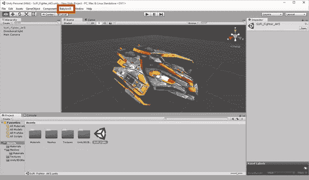
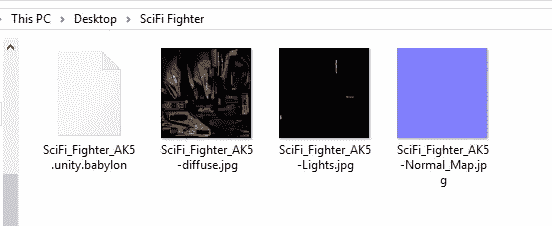
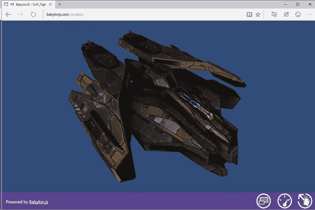
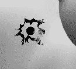
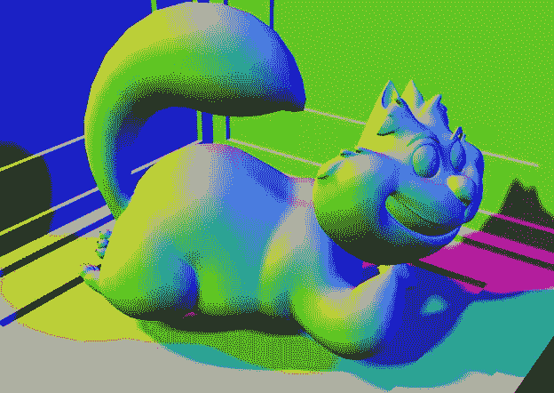
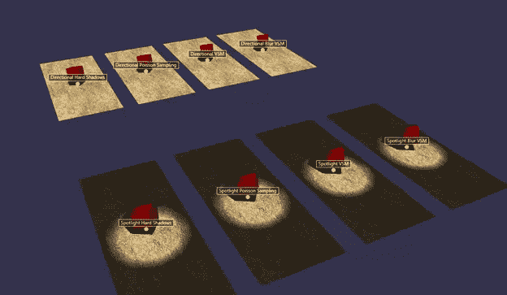
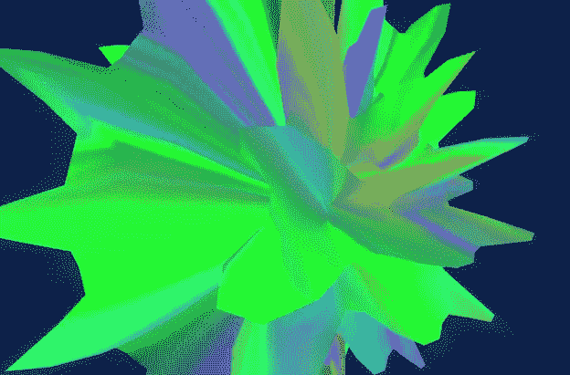
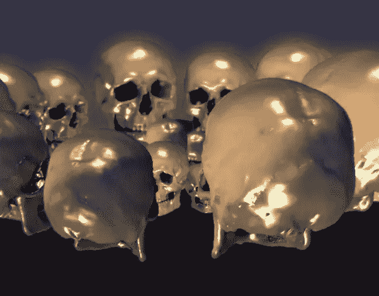

# Babylon.js 有什么新内容？

> 原文：<https://www.sitepoint.com/whats-new-babylon-js/>

本文是微软网站开发系列的一部分。感谢您对使 SitePoint 成为可能的合作伙伴的支持。

[巴比伦。微软的 JS](http://babylonjs.com/?WT.mc_id=13405-DEV-sitepoint-article29) 团队最近发布了一个新的更新(v2.1)，其中有许多新的和改进的工具来构建基于浏览器的 3D 体验，如[刺客信条海盗](http://race.assassinscreedpirates.com/?WT.mc_id=13405-DEV-sitepoint-article29)和[飞行街机](http://flightarcade.com/?WT.mc_id=13405-DEV-sitepoint-article29)。在本文中，我将带您了解一些主要的更新，以及您可以自己尝试的演示和沙盒构建的链接。

首先，对社区说一声“谢谢”。在过去的几个月里，我们获得了前所未有的社区支持。感谢所有这些优秀的人，我们能够发布许多新功能和改进！


所以让我们开始吧！你可以在这里找到所有代码[。](https://github.com/BabylonJS/Babylon.js/releases/tag/v2.1?WT.mc_id=13405-DEV-sitepoint-article29)

## Unity 5 出口商

Unity 是一个很棒的工具，可以用来制作几乎可以在所有操作系统上运行的游戏。我喜欢 Unity 5 WebGL 导出器——这是一个将所有游戏导出到 WebGL/ASM 的好方法。JS/WebAudio 网站。

要完成此解决方案，如果您想要将网格导出到可以在没有 ASM 的情况下运行的较轻的投影。JS，现在可以安装 Babylon.js 导出器:[这里有](https://github.com/BabylonJS/Babylon.js/tree/master/Exporters/Unity%205?WT.mc_id=13405-DEV-sitepoint-article29)。

安装后，导出器允许您通过转到 Babylon.js 导出器菜单来导出场景:



几秒钟后，一个`.babylon`文件与相关纹理一起生成:



现在，您可以从您的 JavaScript 项目中加载这个 Babylon，或者使用[Babylon . js 沙箱](http://www.babylonjs.com/sandbox?WT.mc_id=13405-DEV-sitepoint-article29)直接测试它。



## 贴花纸

贴花通常用于在 3D 对象上添加细节(弹孔、局部细节等)。从内部来看，贴花是一个网格，它是由前一个网格的子集产生的，并带有一个小的偏移，以便显示在它的顶部。

在使用 CSS 时，可以像 zIndex 属性一样看到偏移量。如果没有它，当两个 3D 对象完全在同一个位置时，您会看到 z 战斗问题:



创建新贴花的代码如下:

```
var newDecal = BABYLON.Mesh.CreateDecal("decal", mesh, decalPosition, normal, decalSize, angle);
```

例如，在这个演示中，你可以点击猫，在它身上贴上一些弹孔贴纸。


## SIMD.js

微软 Edge 以及 Firefox 和 Chrome 宣布支持 SIMD . js——一种直接从 JavaScript 代码中使用多标量 CPU 的原始能力的 API。这对于矩阵乘法之类的标量运算尤其有用。

我们决定(在英特尔的大力帮助下)将 SIMD 支持直接整合到我们的数学库中。

例如，这导致了这种代码的发展(其中相同的操作被应用 4 次):


收件人:


主要思想是用数据加载 SIMD 寄存器，然后只执行一条指令，而以前需要多条指令。

您现在可以直接在我们的网站上试用[。](http://www.babylonjs.com/scenes/simd.html?WT.mc_id=13405-DEV-sitepoint-article29)

这个演示试图保持一个恒定的帧速率(默认为 50fps)，同时每秒添加一个新的舞者。这导致了大量的矩阵乘法来制作舞者使用的骨骼动画。

如果您的浏览器支持 SIMD，您可以启用它并查看性能提升(*请注意，目前，* [*微软 Edge 仅在 ASM.js 代码*](http://blogs.windows.com/msedgedev/2015/05/21/intel-and-microsoft-partnering-for-an-improved-web-experience/?WT.mc_id=13405-DEV-sitepoint-article29) *内支持 SIMD，但这一限制将在未来版本*中移除)。


## 碰撞 Webworkers

Ranaan Weber(Babylon.js 的顶级撰稿人)做了大量的工作，通过允许 Babylon . js 在专用的 webworker 上计算碰撞，极大地改进了碰撞引擎。

在此之前，如果你想在一个场景中启用碰撞，你需要在你的物体周围添加不可见的视点替用特效来减少计算量。现在这仍然有效，但是因为计算不是在主线程上完成的，所以你可以很容易地处理更复杂的场景。

例如，让我们看看这个场景，我们有一个相当不错的网格(一个漂亮的头骨)，在相机上启用了碰撞(这意味着如果你使用鼠标滚轮，你将无法穿过头骨)。这个演示没有使用视点替用特效，而是使用真实的网格本身，它有超过 41000 个顶点需要检查。

对于常规的碰撞，主线程必须渲染场景并计算碰撞。

启用 webworkers 后，主线程不必关心冲突，因为有一个 webworker(即另一个线程)在其上工作。由于现在大多数 CPU 都至少有两个内核，这是一个非常棒的优化。

要在 webworker 上启用冲突，您必须执行以下代码:

```
scene.workerCollisions = true|false;
```

要了解更多关于碰撞的知识:[去这里](http://doc.babylonjs.com/page.php?p=22091?WT.mc_id=13405-DEV-sitepoint-article29)。

Raanan 也就这个话题写了两篇很棒的文章:

*   [碰撞使用 Workers for Babylon.js](http://blog.raananweber.com/2015/05/26/collisions-using-workers-for-babylonjs/?WT.mc_id=13405-DEV-sitepoint-article29)
*   没有单独 JS 文件的 Web Workers 的自动构建

## 新阴影引擎

给场景添加阴影总是能增强真实感。以前版本的阴影引擎只能处理平行光的动态阴影。新版本增加了对聚光灯和两个新滤镜的支持，以产生非常好看的柔和阴影，正如你在这个演示中看到的。



这个演示向你展示了你现在可以用来投射动态阴影的各种选项。



要进一步了解阴影，请阅读相关文档。

## 参数形状

Jerome Bousquie (另一位顶级贡献者)基于参数形状添加了数量惊人的新网格。

到目前为止，你在 Babylon.js 中看到的基本网格都有一个预期的形状:当你创建一个球体网格时，你期望看到一个球形。这同样适用于箱形网格、圆环体、圆柱体等。

还有另一种最终形状不固定的网格。它们的最终形状取决于特定函数使用的一些参数。所以我们称这些网格为“参数化形状”。

Jerome 使用这些参数化形状，将以下形状添加到现成的网格列表中:

*   [丝带](http://www.babylonjs.com/?RIBBONS?WT.mc_id=13405-DEV-sitepoint-article29)
*   唱片
*   虚线
*   车床
*   管



如果你想了解更多关于参数化形状的信息:[查看本指南](http://doc.babylonjs.com/page.php?p=24847?WT.mc_id=13405-DEV-sitepoint-article29)。

杰罗姆还创建了一个教程来更好地理解丝带:[在这里阅读](http://doc.babylonjs.com/page.php?p=25088?WT.mc_id=13405-DEV-sitepoint-article29)。

## 新镜头效果

**Jahow** (另一位顶级贡献者)使用 Babylon.js 的后处理渲染管道，让你达到照片般的真实感。

流水线中使用了两个后处理:

1.  一个“色差”着色器，在屏幕上轻微移动红色，绿色和蓝色通道。这种效果在边缘更强。
2.  一个“景深”着色器，它实际上做的还不止这些:

*   镜头边缘模糊
*   透镜畸变
*   景深模糊和高光增强
*   景深“散景”效果(模糊区域出现的形状)
*   颗粒效果(噪波或自定义纹理)

你可以在[操场](http://www.babylonjs-playground.com/#DX6AV?WT.mc_id=13405-DEV-sitepoint-article29)玩现场演示。



和往常一样，如果你想更进一步:[访问此页面了解更多信息](http://doc.babylonjs.com/page.php?p=24841?WT.mc_id=13405-DEV-sitepoint-article29)。

## 还有很多其他的东西

正如我之前提到的，这只是我们添加的一小部分功能。因此，请使用以下链接自行测试:

*   [主网站](http://www.babylonjs.com/?WT.mc_id=13405-DEV-sitepoint-article29)
*   [GitHub 回购](https://github.com/BabylonJS/Babylon.js?WT.mc_id=13405-DEV-sitepoint-article29)
*   [在操场上实验学习](http://www.babylonjs.com/playground?WT.mc_id=13405-DEV-sitepoint-article29)
*   [文档](http://doc.babylonjs.com/?WT.mc_id=13405-DEV-sitepoint-article29)

## JavaScript 的更多实践

微软有许多关于开源 JavaScript 主题的免费学习，我们的任务是用 [Microsoft Edge](http://blogs.windows.com/msedgedev/2015/04/29/introducing-microsoft-edge-the-browser-built-for-windows-10/?WT.mc_id=13405-DEV-sitepoint-article29) 创造更多。以下是一些要检查的:

*   【2015 年微软 Edge 网络峰会(关于新浏览器、新网络平台功能和社区演讲嘉宾的完整系列)
*   //BUILD/和 Windows 10 的构建(包括网站和应用的新 JavaScript 引擎)
*   [在不破坏网络的情况下推进 JavaScript](http://channel9.msdn.com/Events/WebPlatformSummit/2015/Advancing-JavaScript-without-breaking-the-web?WT.mc_id=13405-DEV-sitepoint-article29)(Christian heil Mann 最近的主题演讲)
*   [托管网络应用和网络平台创新](http://channel9.msdn.com/Events/Build/2015/2-665?WT.mc_id=13405-DEV-sitepoint-article29)(深入探讨流形等主题。JS)
*   [让你的 HTML/JavaScript 更快的实用性能技巧](http://channel9.msdn.com/Series/Practical-Performance-Tips-to-Make-Your-HTMLJavaScript-Faster/06?WT.mc_id=13405-DEV-sitepoint-article29)(从响应式设计到休闲游戏再到性能优化的 7 部分系列)
*   现代网络平台快速启动(HTML、CSS 和 JS 的基础)

以及一些免费的入门工具: [Visual Studio Code](https://code.visualstudio.com/?WT.mc_id=13405-DEV-sitepoint-article29) 、 [Azure 试用版](http://azure.microsoft.com/en-us/pricing/free-trial/?WT.mc_id=13405-DEV-sitepoint-article29)和[跨浏览器测试工具](http://dev.modern.ie/?utm_source=SitePoint&utm_medium=article29&utm_campaign=SitePoint)——都适用于 Mac、Linux 或 Windows。

本文是微软网站开发技术系列的一部分。我们很高兴与您分享[微软 Edge](http://blogs.windows.com/msedgedev/2015/04/29/introducing-microsoft-edge-the-browser-built-for-windows-10/?WT.mc_id=13405-DEV-sitepoint-article29) 和新的 [EdgeHTML 渲染引擎](http://blogs.windows.com/msedgedev/2015/02/26/a-break-from-the-past-the-birth-of-microsofts-new-web-rendering-engine/?WT.mc_id=13405-DEV-sitepoint-article29)。在 [Modern.ie](http://dev.modern.ie/?utm_source=SitePoint&utm_medium=article29&utm_campaign=SitePoint) 获得免费虚拟机或在您的 Mac、iOS、Android 或 Windows 设备上进行远程测试

## 分享这篇文章