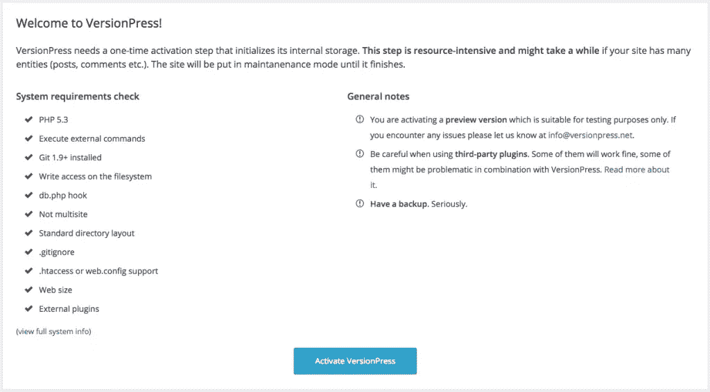
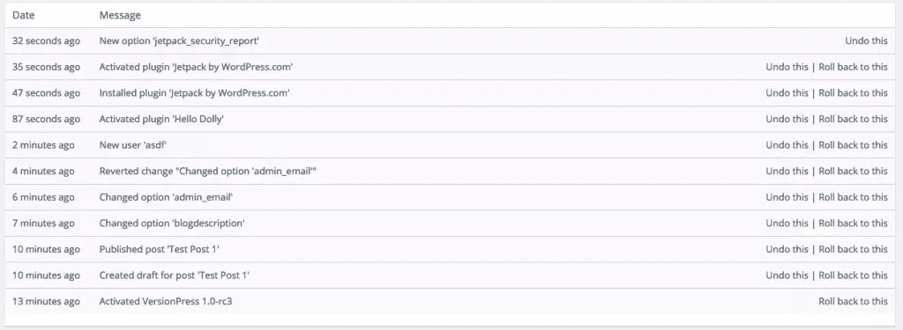
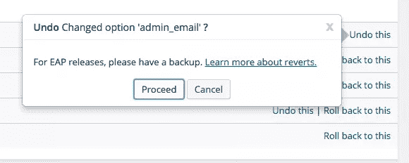
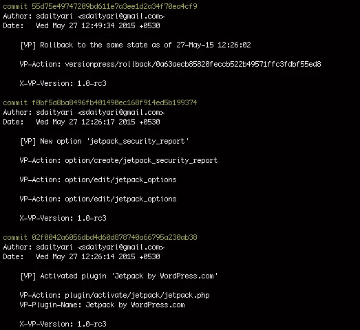
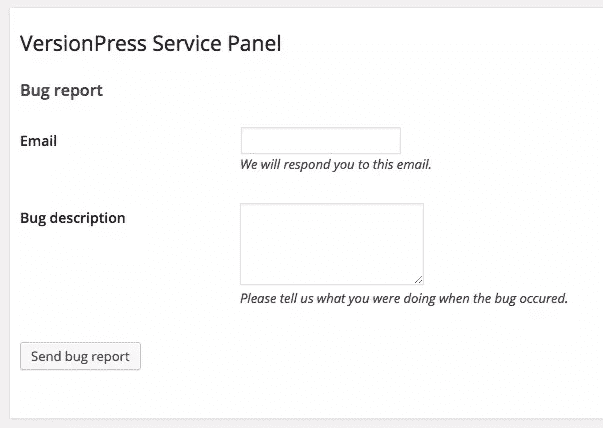

# 版本发布——WordPress 符合版本控制

> 原文：<https://www.sitepoint.com/versionpress-wordpress-meets-version-control/>

随着版本控制越来越受欢迎，大多数开发人员现在已经习惯了它的功能。我们试图将版本控制的使用扩展到源代码管理之外——比如管理数据库转储和设计。因此，在过去的几年中，版本控制在 WordPress 中的应用也是不足为奇的。

今年早些时候，我在 WordPress 的 Git 插件 revisir T1 上发表了一篇文章。Revisr 使您能够在 WordPress 源代码中初始化 Git 存储库，并且在备份中包含数据库转储。

Revisr 是一个很好的工具，但它并不适合所有人。您需要对 Git 有基本的了解，才能无缝地使用这个插件。此外，我认为初学者很难操作遥控器将他们的备份转移到云中。

这篇文章关注的是 [VersionPress](http://versionpress.net/) ，另一个插件[我们之前提到过的](https://www.sitepoint.com/versionpress-version-control-comes-to-wordpress/)，它试图对 WordPress 项目应用版本控制。虽然 VersionPress 用的是 [Git](http://git-scm.com/) ，但是没有提到 Git，只要你安装了需求。它跟踪你在 WordPress 管理面板上执行的每一个操作，使你能够撤销每一个改变，或者回滚到那个改变的状态。给我印象最深的是插件的简单性——没有不必要的设置来分散你的注意力。

在我的例子中，我将使用 1.0-RC3 版本的插件。下载插件，安装并激活它。激活后，左侧面板上会出现一个新项目。点击它会把你带到激活的第二步，在跟踪你的 WordPress 站点的变化之前，插件需要执行一些动作。



*第二步激活。*

## 跟踪对整个网站的更改

现在让我们探索一下 VersionPress 能做什么。让我们创建并发布一个新帖子——“测试帖 1”，看看 VersionPress 是如何记录我们的行动的。


*创建帖子后的状态。*

VersionPress 正确地指出，首先创建了帖子的草稿，然后发布了它。我们将在下一节讨论撤消和回滚。

现在让我们更改一些设置，看看 VersionPress 如何记录它们。


*更改设置后的状态。*

有趣的是，在更改多个设置时，VersionPress 仅在更改旁边的消息中报告一个更改。当我们深入研究插件的工作时，我们将回到这个问题。

接下来，我们安装一个插件并检查 VersionPress 报告的更改，以确保它记录了每个更改。



## 时光倒流

如前所述，VersionPress 允许您执行两个操作—

*   恢复特定的更改，而不影响新的更改
*   回滚到更改后的状态

让我们首先撤销前一部分中的设置更改。



值得注意的是，虽然消息只显示了一个更改，但是撤销影响了我对设置所做的所有更改。

类似地，让我们回到插件安装阶段。


需要注意的另一个重要部分是 VersionPress 只记录对数据库或源代码所做的更改。它不能确定撤销或回滚的过程是否会破坏站点。例如，在激活上面的 jetpack 插件时，你也可以看到一个特定的表格变化。回滚或撤销一个会影响插件，这就是为什么你应该小心执行这些变化。

## 检查 Git 状态

这是一个可选部分，只有在您熟悉 Git(一个流行的版本控制解决方案)的情况下，您才应该继续。

在导航到 WordPress 项目的根文件夹时，您会发现 VersionPress 已经初始化了一个 Git 存储库。您可以通过运行以下命令来检查已经创建的提交—

```
git status 
```

如果您仔细观察，您会发现当您撤消更改而不是删除提交时，会创建恢复提交。



此外，如果您决定通过终端或 GUI 客户机处理 Git 存储库，那么您创建的定制提交会在 VersionPress 日志中被选中，您可以对它们执行撤销或回滚操作。


## 插件的数据库结构

如果您注意到数据库模式，就会发现 VersionPress 只创建了一个表— `vp_id`。这是为了链接 WordPress 中具有相同 id 的不同元素，如帖子、页面或评论，VersionPress 以相同的方式处理它们。


## 解决纷争

这个项目是相当新的，有很高的错误概率。如果你发现一个错误，点击右上角的齿轮，并向开发人员发送一份错误报告。



## 最后的想法

我们现在已经详细介绍了 VersionPress 的工作原理。开发人员很快就会添加新的特性，其中之一就是引入为整个项目创建备份的能力。不需要单独的数据库备份功能，因为数据库中的每次更改都会被 VersionPress 记录下来，并且您可以轻松地将其恢复。另一个很棒的特性是能够通过远程将本地存储库中的更改与云同步(尽管目前可以通过添加远程并手动推送更改来实现)。

将来使用这个插件可能会出现一些问题。让我们以体育新闻网站 Sportskeeda 为例，它依靠社区每天成千上万的贡献而蓬勃发展。[脸书得出结论](https://code.facebook.com/posts/218678814984400/scaling-mercurial-at-facebook/)Git 在如此大量的提交后会变得更慢。看看 VersionPress 将如何处理 Git 的这些缺点会很有趣——当 Git 本身占用大量空间并且多人同时访问网站时。

最后，我要祝贺开发人员推出了一款出色的产品，为大众简化了一个复杂的问题。如果你想测试这个插件，请随意[在这里](http://versionpress.net/)联系 VersionPress 开发者。

## 分享这篇文章