# Linux 上的 Microsoft Visual Studio 代码入门

> 原文：<https://www.sitepoint.com/visual-studio-code-linux/>

Microsoft Visual Studio 是目前最强大的集成开发环境之一，但有一个缺点:它只适用于 Windows。为了吸引 Linux 和 Mac 用户使用 Visual Studio 系列开发工具，微软最近推出了 Visual Studio Code(简称 VSCode)，这是一个真正的跨平台代码编辑器，既快又轻。

VSCode 在 Linux、Mac 和 Windows 上同样运行良好。然而，因为微软 Visual Studio 2013 本身可以在 Windows 上使用，所以 VSCode 最有可能在 Linux 和 Mac 用户中得到更多的采用，直到现在，他们不得不使用更简单的替代产品，如 Sublime Text、Atom 或 Komodo Edit 进行 web 开发。

下面是一些特性，它们可能会使 VSCode 成为您当前代码编辑器的一个引人注目的替代方案:

*   智能代码完成
*   林挺
*   交互调试
*   版本控制
*   支持构建工具，如 [Gulp](http://gulpjs.com) 和 [Jake](http://jakejs.com/) 。

在大多数其他流行的代码编辑器中，这些特性只有在手动安装适当的插件后才可用——如果它们可用的话。

在本教程中，我将向您展示如何在 Ubuntu 上安装和使用 VSCode，Ubuntu 是最流行的 Linux 发行版之一。

**注意** : *如果你是 Windows 用户，你仍然可以跳过所有的命令行安装来学习本教程。你只需要使用 [Windows 安装程序](http://go.microsoft.com/fwlink/?LinkID=534107)，它会为你设置好一切。*

## 先决条件

为了完成本教程，您需要:

*   运行 Ubuntu 14.04 或更高版本的 64 位计算机
*   sudo 用户

## 装置

为 VSCode 创建目录。

```
mkdir ~/VSCode
```

进入该目录，使用`wget`下载 VSCode。

```
cd ~/VSCode
  wget 'http://download.microsoft.com/download/9/5/4/9549F9CC-2663-40D7-8CB6-244D7C4C3CDA/VSCode-linux-x64.zip'
```

使用`unzip`提取档案。

```
unzip VSCode-linux-x64.zip
```

在`/usr/local/bin/`中创建一个到名为`Code`的可执行文件的链接，这样它可以从任何目录运行。

```
sudo ln -s $PWD/Code /usr/local/bin/code
```

通过键入`code`启动 VSCode。您现在应该可以看到欢迎屏幕:

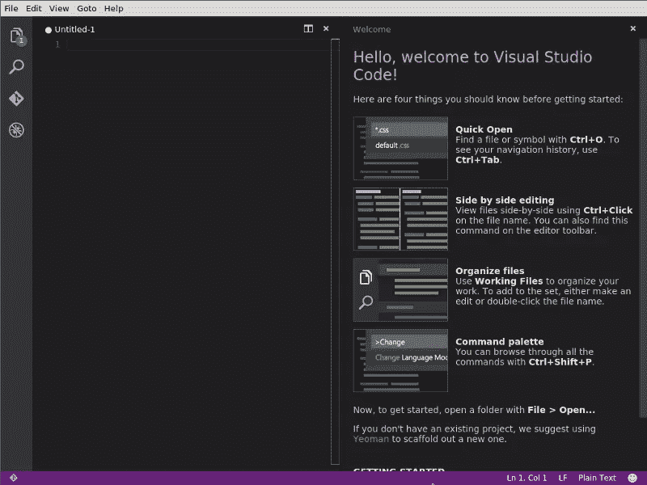

## 创建项目

在当前版本的 VSCode 中，没有创建新项目的选项。但是，它可以将现有目录视为项目。为此，您所要做的就是将目录作为命令行参数传递给`code`。例如，对于将目录`~/JustAnotherApp`视为一个项目，您可以键入:

```
cd ~/JustAnotherApp
  code .
```

如果您的项目还没有任何文件，您将看到以下内容:

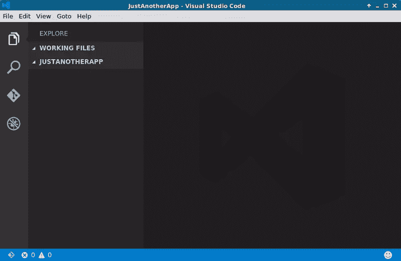

现在，您可以单击项目名称来查看允许您创建新文件和文件夹的按钮:

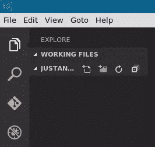

## 使用智能感知

IntelliSense 是微软使用的一个总括术语，涵盖自动代码完成和上下文感知代码建议等功能。这些对于提高生产率非常有帮助，尤其是当你使用一个新的 API 或者库的时候。在目前的 VSCode 预览版中，IntelliSense 可以在 JavaScript、CSS、HTML 和其他一些语言的所有平台上使用。在本教程中，我将向您展示如何在 Node.js 项目中使用它。

要查看智能感知的建议，你只需按下 **Control+Space** 。例如，在项目的`package.json`中，调用 IntelliSense 将列出所有可用字段:

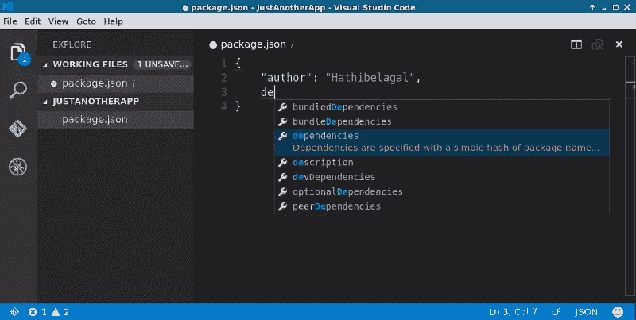

类似地，在您的 Javascript 文件中按下 **Control+Space** ，您可以看到某些公共类和对象中可用的字段和方法。

然而，这些建议并不适用于所有的类。例如，如果您尝试查看`express`实例中可用的字段和方法，您会发现默认情况下什么都没有:

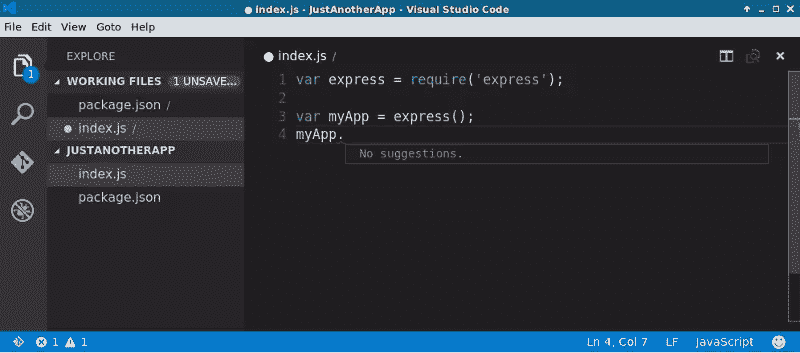

要解决这个问题，您需要相关的 TypeScript 类型定义。要获得这些定义，可以使用 npm 模块 TSD(TypeScript Definition manager for definitely typed)。

如果您还没有它，请使用以下命令从终端安装它:

```
npm install tsd@next -g
```

现在，在您的项目目录中，您可以使用`tsd`来安装您想要的类型定义。例如，要安装 Express framework 的类型定义，您必须键入以下内容:

```
tsd install express --save
```

这将在项目中名为`typings`的目录下创建一个名为`tsd.d.ts`的文件。通过将以下代码添加到您的 JavaScript 文件中，在 VSCode 中引用该文件:

```
/// <reference path="typings/tsd.d.ts" />
```

您现在可以按下 **Control+Space** 来查看属于 Express 框架的对象的可用建议:

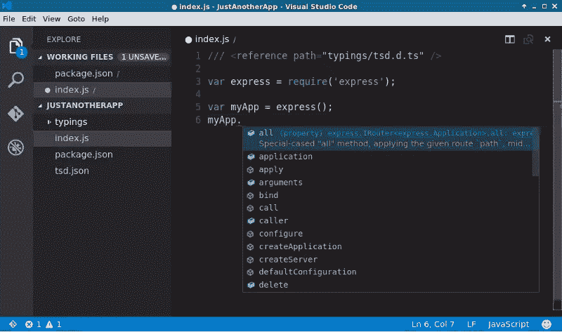

## 排除故障

在大多数轻量级代码编辑器中，调试支持要么不存在，要么仅在插件的帮助下得到支持。另一方面，VSCode 拥有一个内置的交互式调试器，可以极大地改善您的编码体验。第一次尝试在 Node.js 项目中使用调试器时，VSCode 会生成一个名为`launch.json`的文件，其中包含各种配置细节。根据您的项目，该文件可能需要一些更改。该配置中最重要的字段是`name`和`program`。默认情况下，`name`的值为`Launch app.js`，而`program`的值为`app.js`。您需要更改这些文件以匹配项目中的文件。例如，如果您的项目主文件的名称是`index.js`而不是`app.js`，那么您的`launch.json`应该包含:

```
"name" : "Launch index.js",
  "program" : "index.js"
```

尽管它在 Windows 上开箱即用，但在 Ubuntu(以及大多数其他 Linux 发行版和 Mac OS X)上，你需要安装 [Mono](http://www.mono-project.com/) 3.10.0 或更高版本，调试器才能工作。如果没有它，尝试启动调试器将会失败:

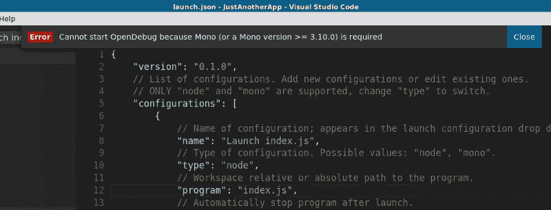

要安装最新版本的 Mono，你需要在 Ubuntu 的软件源中添加一个[新 PPA](https://launchpad.net/%7Eermshiperete/+archive/ubuntu/monodevelop) 。为此，请打开终端并键入:

```
sudo add-apt-repository ppa:ermshiperete/monodevelop
```

您现在可以使用`apt-get`安装 Mono。

```
sudo apt-get update
  sudo apt-get install monodevelop-current
```

最后，在`/usr/bin`中创建一个到`mono`可执行文件的链接:

```
sudo ln -s /opt/monodevelop/bin/mono /usr/bin/mono
```

返回 VSCode 并再次开始调试。您应该看到它在工作:

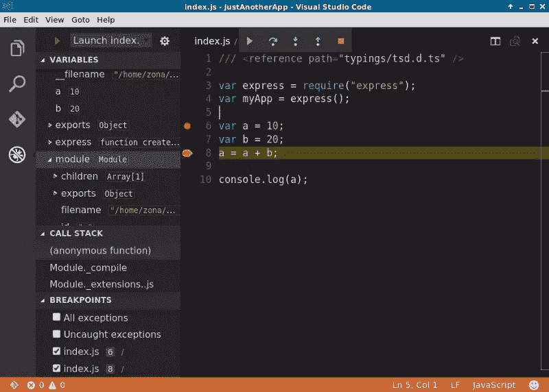

## 使用版本控制

在所有平台上，VSCode 都支持使用 Git 进行版本控制。要使用这个特性，您需要在计算机上安装 Git。在 Ubuntu 上，您可以通过再次打开终端并键入以下内容来安装 Git:

```
sudo apt-get install git
```

回到 VSCode，点击工具栏中的 Git 按钮。系统将提示您初始化新的存储库:

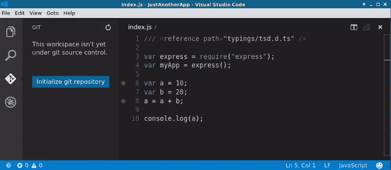

初始化后，VSCode 会显示所有需要提交或更新的文件。提交就像键入提交消息并单击复选标记一样简单:

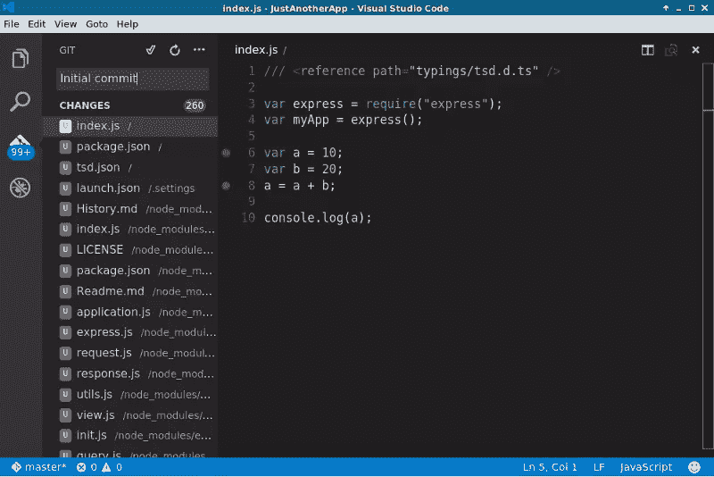

## 使用降价预览

在所有平台上，VSCode 都支持 Markdown 预览，并且无需任何额外安装即可工作。当您正在编辑 markdown 文件时，随时按下 **Control+Shift+V** 将显示文件的预览。

例如，如果您的减价文件如下所示:

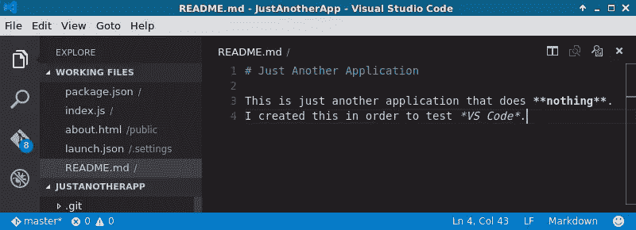

…预览将显示以下内容:

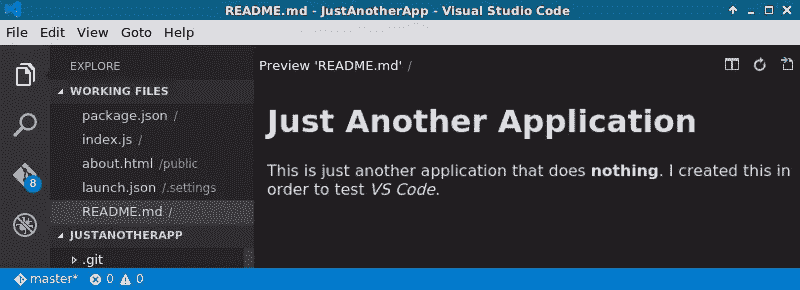

## 结论

现在你知道了如何在你的 Ubuntu 系统上安装和运行 Visual Studio 代码——这是微软的 Visual Studio 家族中第一个支持 Linux 的开发工具。虽然设置过程有点复杂，但是您应该尝试一下，以便体验它为 web 开发而优化的流畅的界面。

截至 2015 年 5 月，VSCode 仍处于预览阶段，改进和新功能可能会在接下来的几个月中出现。更新易于安装，并且同时适用于所有平台。

如果您对本指南有任何疑问或意见，请告诉我。你试过 VSCode 了吗？如果是，你怎么看？

## 分享这篇文章