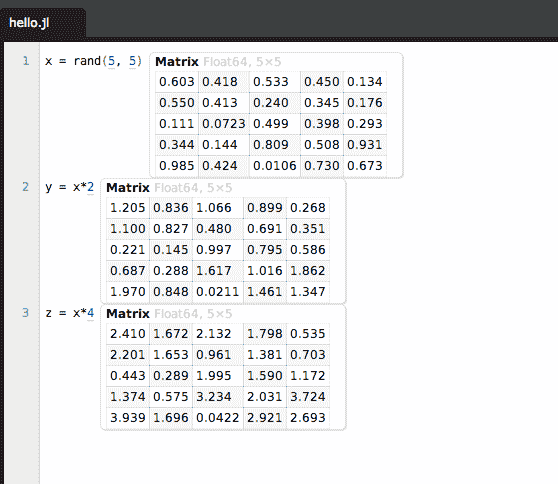
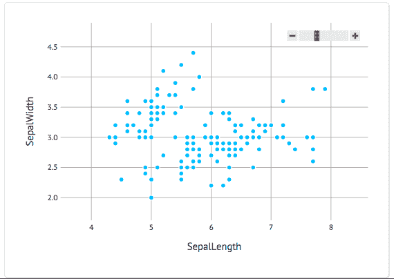
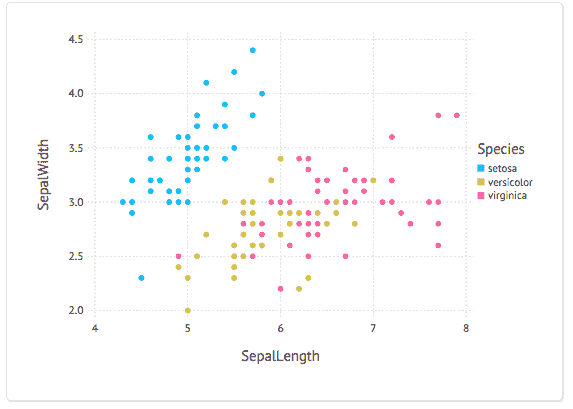
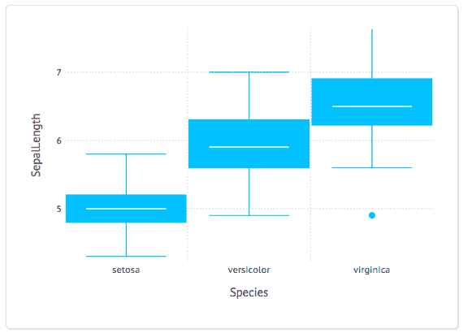

# Rubyists 的朱莉娅:处理这些数字

> 原文：<https://www.sitepoint.com/julia-rubyists-crunch-numbers/>


今年夏天，我在麻省理工学院的一个实验室工作，专注于一些与信息在网络中传输时的压缩相关的研究。我的很多工作都是在 MATLAB 中实现的。这并不是因为我有什么特别的偏好；只是碰巧很多研究(尤其是数学方面的)都是建立在 MATLAB 之上的。

MATLAB 有很多我喜欢的地方。任何与矩阵有关的东西(一个简单的例子:用一堆零创建一个矩阵只是`zeros(n, n)`)都非常容易，文档通常都很好，并且很快就能上手。该特性集非常棒，尤其是如果你正在做计算机视觉方面的事情，快速查看标准算法的结果非常有用。

MATLAB 也有很多我强烈反感的地方。总的来说，感觉好像 MATLAB 一直在试图阻止你编写干净、可读的代码。构建抽象是不必要的困难，而且可重用库的概念对许多 MATLAB 社区来说似乎是陌生的。没有直接访问线程或任何合理的、通用的并发框架。此外，我认为有一个名为[未记录的 MATLAB](http://undocumentedmatlab.com/) 的网站专门使用 MATLAB 的“隐藏”部分，这是一个非常不好的迹象。

Julia 应该取代 MATLAB，成为一种可以快速掌握并勾画出一些算法的语言，但它也像是一种由计算机科学家构建的坚实的语言。当然，如果你是一个 Rubyist 爱好者，你可能一开始就不关心 MATLAB，那么这有什么意义呢？嗯，如果你在做任何类型的数字工作，Julia 绝对值得一看:它给你一种动态的、解释型语言的感觉，性能接近编译型语言。创建数据的快速可视化也很容易。

Julia 一开始可能看起来有点奇怪，因为它缺乏面向对象的程序设计，但是，经过一点努力，它肯定可以扩展你的能力。这篇文章不会真正深入到 Julia 的语法中，因为你可以很快地从其他地方了解到。相反，我们会专注于让朱莉娅兴奋和酷的东西。我们将浏览矩阵、数据集、图表，并涵盖一些统计函数。我们不会看 Ruby 中的每一个实现，但是我们会试着关注这两种语言的哲学上的不同。

## 装置

谢天谢地，Julia 有一个很好的[下载页面](http://julialang.org/downloads/)，应该会给你指出正确的方向。我使用基于[看片台](http://lighttable.com/)的 Juno IDE，让我做这样的事情:



这是一些正在评估的 Julia 代码，在编辑器中向我显示结果。当我们查看一些绘图功能时，使用 Juno 将有助于您很快看到工作的结果。

## 矩阵

矩阵是数值计算的基础。所有种类的算法都依赖于通常定义在矩阵上的运算。一个非常常见的例子是图像模糊:模糊通常是通过“卷积”(即使用一些奇怪的操作)一个内核(即一种矩阵)和一个图像(另一个矩阵)来应用的。基本上，我们希望任何数字语言对矩阵都有非常强的支持。

Ruby 对矩阵有一些不错的支持。我们有[矩阵类](http://ruby-doc.org/stdlib-2.0/libdoc/matrix/rdoc/Matrix.html)，它为我们提供了类似`Matrix.zero(n)`的便利方法，通过`n`零矩阵来创建`n`。然而，Ruby 中的矩阵运算通常不是非常快(尤其是与编译语言相比)。Julia 拥有令人敬畏的矩阵实用方法，并获得了类似 C 的性能。让我们来看一个例子。启动朱莉娅·REPL(谢天谢地，它有这样的一个)并键入以下内容:

```
x = zeros(10, 10)
```

输出应该类似于:

```
10x10 Array{Float64,2}:
 0.0  0.0  0.0  0.0  0.0  0.0  0.0  0.0  0.0  0.0
 0.0  0.0  0.0  0.0  0.0  0.0  0.0  0.0  0.0  0.0
 0.0  0.0  0.0  0.0  0.0  0.0  0.0  0.0  0.0  0.0
 0.0  0.0  0.0  0.0  0.0  0.0  0.0  0.0  0.0  0.0
 0.0  0.0  0.0  0.0  0.0  0.0  0.0  0.0  0.0  0.0
 0.0  0.0  0.0  0.0  0.0  0.0  0.0  0.0  0.0  0.0
 0.0  0.0  0.0  0.0  0.0  0.0  0.0  0.0  0.0  0.0
 0.0  0.0  0.0  0.0  0.0  0.0  0.0  0.0  0.0  0.0
 0.0  0.0  0.0  0.0  0.0  0.0  0.0  0.0  0.0  0.0
 0.0  0.0  0.0  0.0  0.0  0.0  0.0  0.0  0.0  0.0
```

就像那样，我们有一个 10 乘 10 的零矩阵。这与调用`Matrix.zeros(10, 10)`非常相似，但是有一个非常重要的区别:输出实际上看起来像一个矩阵！这似乎是一个微不足道的区别。然而，当处理大量矩阵时，当您试图看到结果时，很好地格式化矩阵是非常宝贵的。让我们做点更有趣的事情:

```
x = rand(10, 10)
```

这应该会给我们:

```
10x10 Array{Float64,2}:
 0.614455     0.166746  0.933275   …  0.777238   0.662781   0.012962  
 0.000197243  0.975239  0.0263813     0.784601   0.251306   0.0359492 
 0.0881394    0.450103  0.895747      0.0219986  0.196202   0.259326  
 0.256392     0.28074   0.542471      0.830691   0.9528     0.905797  
 0.536424     0.661746  0.885126      0.261195   0.198792   0.03582   
 0.28776      0.275747  0.94569    …  0.0970672  0.269422   0.246199  
 0.953955     0.421148  0.0946357     0.677456   0.796799   0.828503  
 0.492165     0.481043  0.857201      0.862093   0.0634439  0.97161   
 0.276454     0.208118  0.313016      0.0972178  0.557233   0.00431404
 0.117841     0.891073  0.0320966     0.0487335  0.830744   0.426995
```

Julia 确实截断了输出，但很明显，我们看到的是介于 0 和 1 之间的 10 乘 10 的伪随机数矩阵。在 Ruby 中用一点小魔法就可以做到这一点。

标量乘法很常见，所以在 Julia 中非常简单:

```
x = rand(10, 10) * 10
```

把矩阵相乘怎么样:

```
x = rand(10, 10) * zeros(10, 10)
```

如果我们想索引矩阵的某个元素呢？让我告诉你一个事实:Julia 的数组/矩阵的索引是 1。冷静下来，开始呼吸。世界不会毁灭。是的，你的循环条件会改变，是的，如果你来自一个非 MATLAB 和非 R 背景，这通常是相当恼人的，但它很容易习惯。

此外，如果您正在编写大量对矩阵的单个元素进行操作的代码，您可能会忽略一些标准的矩阵操作，这些操作会让您以更容易的方式完成您正在做的事情(注意:我并不是将此作为 Julia 的 1 索引的借口，但这是一件需要记住的好事)。

到目前为止，一切顺利。我们还没有真正介绍过 Ruby 也不会无痛。但是，对 Julia 有一种普遍的感觉，这表明它非常重视矩阵:漂亮的打印，矩阵创建调用是顶级函数的事实，等等。然而，也有很多让朱莉娅非常独特的地方。

让我们来看看茱莉亚借鉴了 R 的一个特征:NA 型。很多时候，在进行数据分析时，我们会有一些数据值由于某种原因而无效。因此，我们有一些无效值的初始数据集，然后我们对数据集执行一些操作以产生输出。但是，在处理数据之后，我们不想考虑基于无效值的结果。我们可以用 NA 类型解决这个问题。在我们有无效数据的地方，用“NA”替换它。随后，任何涉及安娜的计算，我们都会得到安娜的回报。换句话说，对无效数据的计算导致无效数据。为了看到它的运行，我们首先需要获得“DataArrays”包。Julia 有一个很棒的软件包管理系统，正好支持这种语言。

轻松安装软件包:

```
Pkg.add("DataArrays")
```

现在，构建一个数组，这样我们就可以将一个“NA”填充到其中:

```
using DataArrays
x = @data(rand(10, 10))
x[1, 1] = NA
```

现在不要太担心`@data`做什么:它或多或少地改变了矩阵的类型，所以我们可以把“NA”值放进去。让我们来做一个计算:

```
y = x*2
```

这应该会给我们:

```
NA       0.553053   0.695716  0.284487   …  1.9758    0.761262   0.4869  
 1.3595    0.0468469  1.31732   1.83256       1.70817   1.43662    0.930509
 0.306142  0.286241   0.982634  0.434252      1.94063   1.64462    0.731219
 1.88406   1.70816    1.08887   0.234274      1.45693   1.06927    1.60651 
 0.503428  0.362866   0.335749  1.88895       0.341048  0.0441141  0.951636
 0.774465  0.789801   1.23474   0.0640433  …  1.92382   1.20227    1.0657  
 1.38033   1.46768    1.78678   1.95522       1.53592   0.211695   0.631171
 1.09145   1.32949    1.59082   1.52581       1.50151   0.062626   1.02838 
 0.386194  1.66468    1.37072   0.163497      0.522523  1.24837    0.880371
 1.16056   0.496622   0.994359  1.08291       0.866378  0.187132   1.51157
```

太好了！无效数据导致无效数据。

更有趣的是对矩阵求平方:

```
x*x
```

那会给我们:

```
10x10 DataArray{Float64,2}:
 NA   NA       NA       NA      …   NA       NA       NA       NA    
 NA  3.14293  3.53757  2.4257      3.8196   4.36326  2.44844  3.22518
 NA  2.36765  2.77693  2.60346     3.25948  2.67558  1.35156  2.13138
 NA  2.46748  3.67635  3.47746     3.8359   4.51773  2.33752  2.99455
 NA  1.90375  2.17352  1.53465     2.25778  2.68     1.34128  1.9858 
 NA  1.80034  2.47738  2.62089  …  2.9921   2.76951  1.47433  2.18699
 NA  2.9391   3.8815   3.72826     4.45572  5.03061  2.59674  3.34063
 NA  2.25157  3.12992  2.76169     3.43634  4.00735  2.01751  2.56007
 NA  1.62191  2.51771  2.71106     2.91424  2.76869  1.79907  2.02696
 NA  1.96264  2.53315  2.69743     3.19891  3.17627  1.44995  2.4413
```

哇，刚刚发生了什么？好吧，如果你记得一点你的线性代数，回忆一下“NA”值被用来计算在`x*x`矩阵中的位置的地方。

我们仅仅触及了 Julia 对矩阵所能做的表面:还有更多的事情要做。首先，来自 Ruby 的 Julia 对矩阵的重视程度是相当奇怪的。在花了一点时间在 Julia 通常应用的领域工作之后(想想大量的数字和应用数学)，原因就变得很清楚了。

## 数据

Julia 借用了 R 的另一个想法:现成的数据集。r 附带了一系列数据集，您可以立即开始使用。朱莉娅通过`RDatasets`包向我们提供了这一点。让我们抓住它:

```
Pkg.add("RDatasets")
```

也开始使用它:

```
using RDatasets
```

这是一个非常标准的数据集，叫做“iris”:

```
dataset("datasets", "iris")

150x5 DataFrame
| Row | SepalLength | SepalWidth | PetalLength | PetalWidth | Species     |
|-----|-------------|------------|-------------|------------|-------------|
| 1   | 5.1         | 3.5        | 1.4         | 0.2        | "setosa"    |
| 2   | 4.9         | 3.0        | 1.4         | 0.2        | "setosa"    |
| 3   | 4.7         | 3.2        | 1.3         | 0.2        | "setosa"    |
| 4   | 4.6         | 3.1        | 1.5         | 0.2        | "setosa"    |
| 5   | 5.0         | 3.6        | 1.4         | 0.2        | "setosa"    |
| 6   | 5.4         | 3.9        | 1.7         | 0.4        | "setosa"    |
| 7   | 4.6         | 3.4        | 1.4         | 0.3        | "setosa"    |
| 8   | 5.0         | 3.4        | 1.5         | 0.2        | "setosa"    |
| 9   | 4.4         | 2.9        | 1.4         | 0.2        | "setosa"    |
| 10  | 4.9         | 3.1        | 1.5         | 0.1        | "setosa"    |
| 11  | 5.4         | 3.7        | 1.5         | 0.2        | "setosa"    |
```

虽然拥有这些数据可能看起来有点没用(我的意思是，我们总是可以从 Ruby 的 CSV 文件中读取它)，但是在试图用代码勾勒出一些想法时，手头拥有一些样本数据是非常有用的。注意，数据存储在 Julia DataFrame 中，这是一种将各种类型的数据放入排序的“矩阵”中的方法。通过一个包，我们现在可以访问[大范围的数据集](http://vincentarelbundock.github.io/Rdatasets/datasets.html)。

## 测绘

Julia 真正擅长的一个领域是让你真正快速地感受数据。为此，绘制部分数据通常是个好主意。我还没有找到很多可靠的、可用的 Ruby 库来绘图。在很长一段时间里，Scruffy 是这个领域的领导者，但似乎发展并没有发生。我们将看看牛虻，一个非常标准的 Julia 绘图工具包。它基于来自[的想法，图形的分层语法](http://byrneslab.net/classes/biol607/readings/wickham_layered-grammar.pdf)描述了如何建立一个合理的图形创建系统。

统计图的经典“hello world”是“iris”图。“鸢尾”数据集描述了几种鸢尾花的一些特征。我们将看看如何制作它们的情节。

首先，我们需要一个绘图库:

```
Pkg.add("Gadfly")
```

让我们建立我们的第一个情节:

```
using RDatasets
using Gadfly
plot(dataset("datasets", "iris"),x="SepalLength", y="SepalWidth", Geom.point)
```

好吧，这个`plot`电话到底是什么？它将一个 DataFrame 作为它的第一个参数(由 RDatasets 提供),以及 x 和 y 变量名的可选参数(如果您看一下前面的数据集输出，它们是 DataFrame 中的列名)。最后传入“Geom.point”，它告诉牛虻我们要做一个点的剧情。结果看起来非常好:



如果你使用的是 Juno(Julia IDE)，你可以很快看到你的结果。我们有一束不同种类的花。在图表中给它们涂上不同的颜色怎么样？基本上，我们希望颜色由虹膜数据帧的其中一列决定:

```
plot(dataset("datasets", "iris"),x="SepalLength", y="SepalWidth", color="Species",Geom.point)
```

我们添加了`color="Species"`来将颜色与列相关联。看看这个:



好了，点图说够了。如果我们想检查每一个不同物种的萼片长度的分布，会怎么样呢？简单:

```
plot(dataset("datasets", "iris"), x = "Species", y = "SepalLength", Geom.boxplot)
```

输出看起来也很漂亮:



## 统计数字

当然，如果我们在绘制东西，我们可能对与数据相关的统计感兴趣。幸运的是，Julia 提供了许多很好的实用函数来从数据集中提取信息。从 Ruby 背景来看，在全局名称空间中使用这些函数似乎有点奇怪。但是，这是 Ruby 和 Julia 之间的根本区别。Ruby 是一种通用语言，专注于 web 开发，这需要大量的划分。另一方面，Julia 是一种面向科学计算的通用语言，其传统是将“最常用”的东西放在前面和中间。

让我们先称我们的数据集为合理的东西:

```
iris = dataset("datasets", "iris")
```

大概掌握数据最有用的函数之一是`describe`。在`iris`上试一试:

```
describe(iris)
```

输出(截断的)应该类似于:

```
SepalLength
Min      4.3
1st Qu.  5.1
Median   5.8
Mean     5.843333333333334
3rd Qu.  6.4
Max      7.9
NAs      0
NA%      0.0%
```

这为您提供了五个数字的摘要以及关于数据集每一列的一些其他信息。我们可以很容易地访问`iris`数据帧的特定列:

```
sepal_lengths = iris[:SepalLength]
```

我们可以很容易地获得关于该列的细节:

```
mean(sepal_length) #mean
std(sepal_length) #standard deviation
```

## 包装它

哇，真快。到目前为止，我们只看了一眼让 Julia 编写代码如此棒的东西，但即使如此，与 Ruby 的区别还是很明显的。Julia 从一开始就打算与数字、矩阵之类的东西打交道。另一方面，Ruby 希望确保如果你愿意的话，你可以做这些事情，但这并不是最优先考虑的事情。在下一篇关于 Julia 的文章中，我们将更深入地研究特性，并介绍语言中的并行计算结构。

## 分享这篇文章