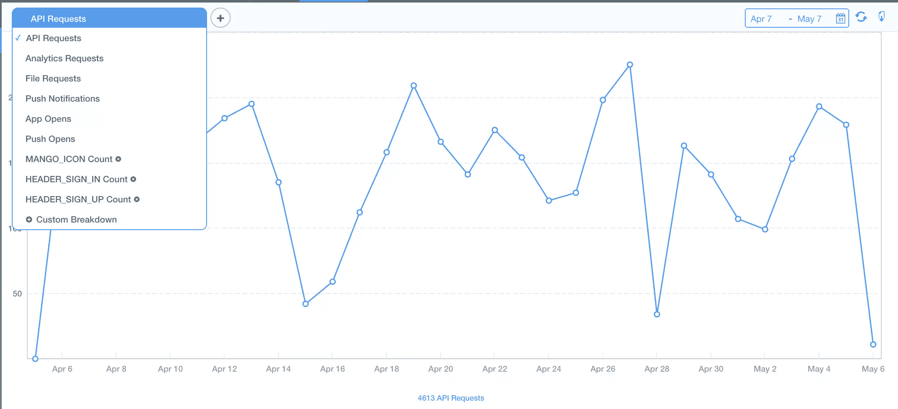
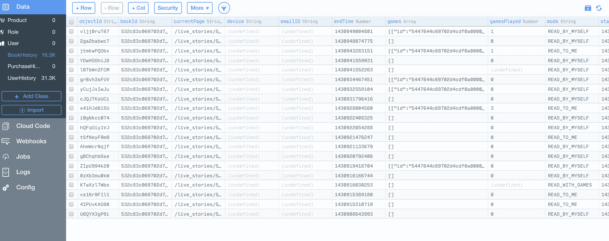

# 使用 Parse 构建自定义用户分析

> 原文：<https://www.sitepoint.com/build-custom-user-analytics-parse/>


如今，构建分析仪表板对每个企业都至关重要。虽然订阅 Google Analytics 是一个显而易见的选择，但有时我们可能需要在更精细的层次上跟踪事件，或者构建一个定制的仪表板。Cassandra 非常适合编写分析引擎，但是增加了额外的操作复杂性。这就是 Parse 的用武之地。

[解析](https://parse.com/products/analytics)是一个来自脸书的 IaaS。您可以将它用作功能齐全的数据存储，而无需在基础设施上花费任何时间。在本文中，我将解释如何利用 Parse 来构建您自己的自定义分析仪表板。请继续阅读。

## 入门指南

我们将使用我为以前的一篇文章创建的示例应用程序作为基础。你可以从[这里](https://github.com/skmvasu/redis_cache_sitepoint/archive/master.zip)下载。这个应用程序使用 mongoid 和 HAML，但这里的例子应该与活动记录和 ERB 以及工作。有了我们的方式，让我们设置基础。

首先用 Parse 创建一个免费账号，在里面设置一个 app。您将需要应用程序密钥和 Javascript 密钥，它们可以在 Settings 选项卡下找到。

创建一个新的 javascript 文件`analytics.js`:

```
// app/assets/javascripts/analytics.js
var CustomAnalytics = {
    init: function (type){
        Parse.initialize(APP_ID, JS_KEY);
    }
}
```

并将此包括在您的顶层布局中:

```
# app/views/application.html.haml
!!!
%html
    %head
        %title Build Custom analytics with Parse
        = stylesheet_link_tag        'application', media: 'all', 'data-turbolinks-track' => true
        = javascript_include_tag 'application', 'data-turbolinks-track' => true
        = javascript_include_tag 'vendor/parse', 'data-turbolinks-track' => true
        = javascript_include_tag 'analytics', 'data-turbolinks-track' => true
        = csrf_meta_tags
    %body
        = yield
    :javascript
        // Initialize the Analytics first
        CustomAnalytics.init();
```

我们已经创建了一个名为`CustomAnalytics`的名称空间，并通过一个`init`方法初始化 Parse。这比在视图内部初始化 Parse 更可取，因为如果需要，可以初始化多个分析提供者，如 Google 或 Mixpanel。

现在我们的应用程序已经准备好与解析服务器对话了。

> *注意:* Parse 有一个基于使用的订阅模型。在实施之前，你可能想看看他们的[定价计划](https://www.parse.com/plans)。

## 跟踪事件

在展示如何构建自定义分析引擎之前，我们先来看看 Parse 内置的事件跟踪库，它类似于 Google events。这可以帮助跟踪应用程序中的任意事件，以保留用户，而无需我们做太多工作。

在示例应用程序中，有两个页面:一个显示类别列表，另一个显示语言。假设我想跟踪有多少用户点击了类别:

```
# app/views/category/index.html.haml

    %h1
     Category Listing
    %ul#categories
        - @categories.each do |cat|
            %li
                %a{:href=>"/category/#{cat['id']}", :class=>'js-category-click'}
                    %h3
                        = cat["name"]
                %p
                    = cat["desc"]
```

并将它添加到布局文件中:

```
# app/views/layouts/application.html.haml
//.......
:javascript
    CustomAnalytics.init();

    $( '.js-category' ).on('click', function(e){
        e.preventDefault();
        var url = e.currentTarget.href;
        Parse.Analytics.track( 'CATEGORY_CLICK', {
            'target': 'category',
        }).then(function(){
                window.location.href = url;
        });
    });
//.............
```

这里，我们使用 Parse 内置的`track`方法将事件发送给 Parse。它有两个参数:事件名称和维度。维度是我们可以传递的自定义数据点，可以在以后用于过滤报告。这个方法返回一个承诺。一旦完成，我们可以执行一个成功的回调，在这种情况下，重定向到原始链接。

我们必须对语言页面上的事件进行同样的跟踪。但是有很多重复的代码。让我们重构这个代码流。

将此添加到您的`analytics.js`文件中:

```
// app/assets/javascripts/analytics.js
var CustomAnalytics = {
    //...
    track: function( name, dimensions, successCallback ){
        Parse.Analytics.track( name, dimensions )
                .then( successCallback );
    }
    //...

}
```

并更改您的`category.js`文件中的跟踪代码:

```
# app/views/layouts/application.html.haml
//.......
:javascript
    //.......

    $( '.js-category' ).on('click', function(e){
        e.preventDefault();
        var url = e.currentTarget.href;
        CustomAnalytics.track( 'CATEGORY_CLICK', {
            'target': 'category',
        }, function(){
                window.location.href = url;
            })
    });
    //.......
```

我们将相同的参数传递给跟踪方法。这一开始看起来可能不怎么样，但是它减少了许多样板代码，特别是当您的页面中有许多事件时。



要查看跟踪的事件，请在您的分析仪表板中进入**分析**->-**事件**。

## 作为自定义数据存储

我们可以使用 Parse 的云数据来存储我们的自定义数据。它的工作方式非常类似于 NoSQL 数据存储，并且非常灵活。

首先，从仪表板的`Data`部分创建一个名为`CategoryClicks`的新类。在你的`application.html.haml`:

```
//.........
function trackCloudData( name, id, type ){
  var CategoryClicks = Parse.Object.extend('CategoryClicks'),
      cloud_data = new CategoryClicks();
  //Custom data
  cloud_data.name = name
  cloud_data.type = type
  cloud_data.id = id

  // This syncs the data with the server
  cloud_data.save();
}

//..........

$( '.js-category' ).on('click', function(e){
        e.preventDefault();
        var $elem = $(e.currentTarget),
      url = $elem.url,
      name = $elem.data('name'),
      id = $elem.data('id');

        CustomAnalytics.track( 'CATEGORY_CLICK', {
              'target': 'category',
          }, function(){
                  window.location.href = url;
        });

  trackCloudData(name, id, type);
    });

//.........
```

让我们扩展之前创建的类。这是一个简单的[主干](http://backbonejs.org/)模型，我们可以在上面设置自定义属性。当您保存此模型时，它会将数据与服务器同步。



现在，您跟踪的所有数据都可以从 Parse dashboard 中获得。

### 存储和检索

如果我们正在构建一个实时应用程序，我们可以使用解析器的 JS API 从服务器获取数据。但是对于构建时间序列仪表板来说，这是行不通的。我们需要从 Parse 中聚集这些信息，然后根据我们的需要进行转换。

没有用于解析的官方 Ruby 客户端，但是奇妙的 gem [`parse-ruby-client`](https://github.com/adelevie/parse-ruby-client) 填充得很好。

将此宝石添加到宝石文件:

```
# Gemfile
gem 'parse-ruby-client'
```

一旦`bundle install`完成，创建一个集合模型来存储每日记录:

```
# app/models/category_analytics.rb

class CategoryAnalytics
  include Mongoid::Document
  include Mongoid::Timestamps

  field :category_id, type: BSON::ObjectId
  field :name, type: String
  field :count, type: Integer

  field :date, type: DateTime
end
```

编写一个简单的任务，该任务将遍历所有类别并获取指定日期的读取查询。由于这是通过网络调用发生的，如果我们通过 [resque](https://github.com/resque/resque) 异步处理它，可能会更好。

并新建一个 resque 任务，**类别*点击*聚合器. rb** :

```
# lib/tasks/category_click_aggregator.rb
class CategoryClickAggregator
    @queue = :category_analytics

    def self.perform()
      Parse.init(:application_id => "APP_ID", :api_key => "API_KEY")
      categories = Category.all
      yesterday = Date.yesterday
      start_date = Parse::Date.new(yesterday.to_time)
      end_date = Parse::Date.new(Date.today.to_time)
      # Convert the dates to Parse date to play nice with their API
      categories.each do |cat|

        count = Parse::Query.new("BookHistory").tap do |q|
          q.eq("category_id", cat.id)
          q.greater_eq("createdAt", start_date)
          q.less_eq("createdAt", end_date)
        end.get.count

        # See if this exists already
        category_analytics = CategoryAnalytics.find_by(:category_id => cat.id, :date => yesterday )

        if category_analytics.nil?
          category_analytics = CategoryAnalytics.new
          category_analytics.name = cat.name
          category_analytics.category_id = cat.id
          category_analytics.date = yesterday
        end
        category_analytics.count = count
        category_analytics.save
      end
    end
end
```

`Parse::Query`模块用指定的过滤器向解析服务器发送一个`POST`请求。然后，我们获得结果，汇总它们，并将它们存储在本地数据库中，以支持生成时间序列报告。

这只是一个如何从 Parse 中提取数据的简单演示。然而，在生产中，我建议运行一个单独的作业，循环遍历所有类别，并分别对作业进行排队。这样，任务可以在失败时恢复，而不是整个 pot。此外，随着数据的增长，我们可以产生多个工作人员，以并行方式完成工作。

### 限制

所有要解析的查询都是分页的，默认情况下，页数限制为 100。如果结果集中有超过 100 条记录，那么上述代码将返回不正确的结果。我们可以手动将限制增加到 1000，但随着事件的增加，这仍然会遭受相同的命运。

为了正确解决这个问题，我们必须求助于丑陋的`do..while`循环:

```
total_count = 0
offset = 0
loop do
  count = Parse::Query.new("BookHistory").tap do |q|
    q.eq("category_id", cat.id)
    q.greater_eq("createdAt", start_date)
    q.less_eq("createdAt", end_date)
    q.limit(1000)
    q.offset(offset)
  end.get.count
  total_count+= count
  offset++
  break if count < 1000
end
```

## 包扎

Parse 是一个很棒的工具，我们还没有触及它的表面。例如，我们可以使用它来认证和跟踪用户，使用 jobs 在云中运行定制作业，以及设置 web 挂钩。我希望这篇文章已经激起了你的兴趣。本文中使用的代码可从[这里](https://github.com/skmvasu/parse_sitepoint)获得。欢迎在评论中加入讨论。

## 分享这篇文章