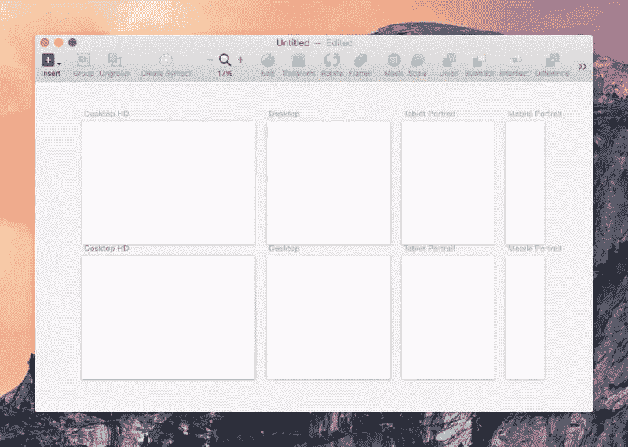
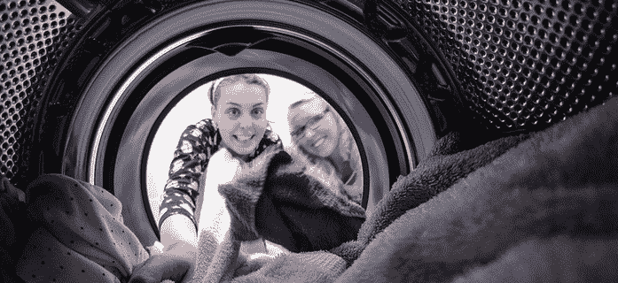
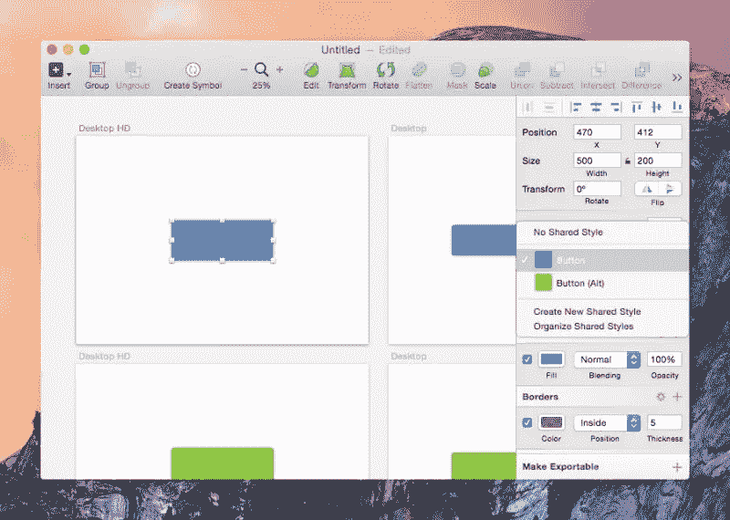

# 通过三个简单的步骤成为素描大师

> 原文：<https://www.sitepoint.com/become-sketch-guru-3-easy-steps/>

你知道什么是真正的舒适吗？

你的舒适区！

我们都有一个。我们每个人都有四五个几乎可以在睡觉时使用的应用程序。那些数百小时的肌肉记忆、快捷方式和熟悉的怪癖让这些应用程序感觉像一把舒适的旧扶手椅。他们也让切换到一个新的应用程序感觉如此……笨拙——至少在最初的几个星期。

我们都想尽可能快地跳到高效的中级水平。

所以，今天我们在这里通过给出 3 个通常只有更有经验的素描大师才会看到的技巧来快速提升你的素描应用技能。

## 技巧 1:做一个键盘快捷键忍者

Sketch 的键盘快捷键尽可能的少。大多数情况下，它会是*命令+某个东西*，有时它会是一个单字母键，如“A”代表*画板*，但有一件事是肯定的，那就是当你在 Sketch 应用程序中进行设计时，你将永远不会参与到一场手指扭曲的游戏中。

**有些快捷方式非常明显，或者与 Photoshop 的快捷方式完全相同，因此有些被省略了——这些是最有用的**。

### 单键快捷键

*   答:画板
*   t:文本
*   v:矢量
*   奥:椭圆形
*   r:矩形
*   u:圆角矩形

### 多键快捷键

*   Z +单击/拖动-选择:放大特定区域
*   Enter:启用当前选定图层的编辑模式
*   Shift + Tab:在层之间反向循环(与“Tab”相反)
*   Option +拖动层:复制层并移动它
*   选项+悬停层:显示两个层之间的距离
*   按住 Command 键并单击:选择组内的层
*   Command + R:重命名画板和层
*   Command + Shift + H:显示/隐藏层
*   Command +方向键:调整大小
*   Command + Shift + E:激活导出模式
*   Command + Option + C:拷贝图层样式
*   Command + Option + V:粘贴图层样式

我不能说哪个快捷键最重要，因为这真的取决于你的屏幕分辨率和你创作的作品类型，但是如果你有兴趣探索更多的键盘快捷键，Jean-Marc Denis 已经策划了一个完整的 [Sketch App 键盘快捷键列表](https://medium.com/@jm_denis/sketch-keyboard-shortcuts-42c06583ae83)。

## 技巧 2:仔细组织页面和画板

如果你使用 Sketch 应用程序来设计用户界面，那么你很可能会模仿同一个屏幕的多个版本来解释用户交互或演示移动优化。根据屏幕上动态内容的数量，每个屏幕上可能会有 2 到 10 个画板。

当您创建新的画板(CMD + A，如果您忘记了)时，它将直接出现在创建的最后一个画板的右侧(即使它已被移动)；所以基本上，它们排成一排，相距约 100 像素。您可能不希望画板按此顺序排列，但是像任何其他类型的选择一样，它们可以在 X 轴和 Y 轴上移动。

组织你的屏幕的一个简洁的方法是从左到右/从桌面到移动来显示它们(或者反过来，如果你的方法是移动优先！)并将每个屏幕变体放在一个新行上。你最终应该得到的是一个高度有组织的水平和垂直显示的画板。

当你需要设计一个全新的网页时，你可以在 Sketch App 中创建一个新的*页面*，这可以通过点击“+”图标在 layers 工具条中完成。您可能会发现右键单击并选择“复制页面”特别节省时间，它允许您复制所有画板大小和常见元素。than 之后，干脆把不需要的删掉。

*摘要:一个. sketch 文件应该包含一个完整的网站设计，其中每个网页被分成“页面”，在这些页面中有画板，包含每个屏幕水平显示的屏幕分辨率的变化，这些屏幕的每个动态视图垂直显示。*

## 秘诀 3:保持干燥——使用风格和符号

图片来源:m01229

不，这不是新止汗剂的广告。当我们使用术语“干”时，我们指的是“[不要重复自己](http://en.wikipedia.org/wiki/Don't_repeat_yourself)”的缩写。这种通过消除任何重复来降低系统复杂性的想法在编码中由来已久，但它在图形布局工具中同样有意义。}

没有人想被‘弄湿’或者‘把所有东西都写两遍’？

共享样式、文本样式和符号都非常相似，但用于不同的场景。共享样式适用于形状，文本样式适用于…嗯… *文本*，符号适用于图层组；它们的目的是将一组样式保存在某个名称下，以便我们可以再次使用它们。如果你熟悉 CSS，那么我知道你现在正在考虑“类”。

共享样式与宽度和高度无关，因此它的一个用例是创建一个可以作为按钮样式的矩形，并将其命名为“button”。我们可以将这种共享样式应用到一个没有样式的矩形上，将它变成一个按钮，然后我们可以自由地改变它的尺寸，而不改变所有其他按钮的大小。共享样式可以从*检查器*(在右手边)中应用和删除，完全相同的概念也适用于文本样式和符号。

符号有点不同；它们的大小是完全可扩展的，并且它们适用于*整组*层。想象一个 20 层的群像，由各种风格的形状和文字组成。

如果调整该组的大小，应用了该元件的所有其他组也会调整大小，包括其中的所有层。如果您更改该符号组中的一个图层，该符号的每个其他组中的该图层也会更改。如果将图层添加到符号中，它将出现在该符号的每个组中。如果你有一个模块化的网格。草图设计，目前每个模块都是一个相同的*占位符*，符号对于一次更新它们非常方便。

*Sketch 应用程序事实:样式和符号将在画板之间同步，甚至在页面之间同步。草图文件*！

## 结论

在你尝试之前，很难理解 Sketch App 能对你的工作流程产生怎样的影响；所以…试试吧！就像，现在！

如果你是一个标志或用户界面设计师，这三个快速提示将帮助你以闪电般的速度成为素描大师。没有人喜欢离开他们的舒适区，但是[下载一个免费试用版](http://bohemiancoding.com/sketch/)，花几个小时远离你通常的设计应用，并测试它。

## 分享这篇文章