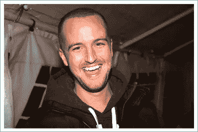
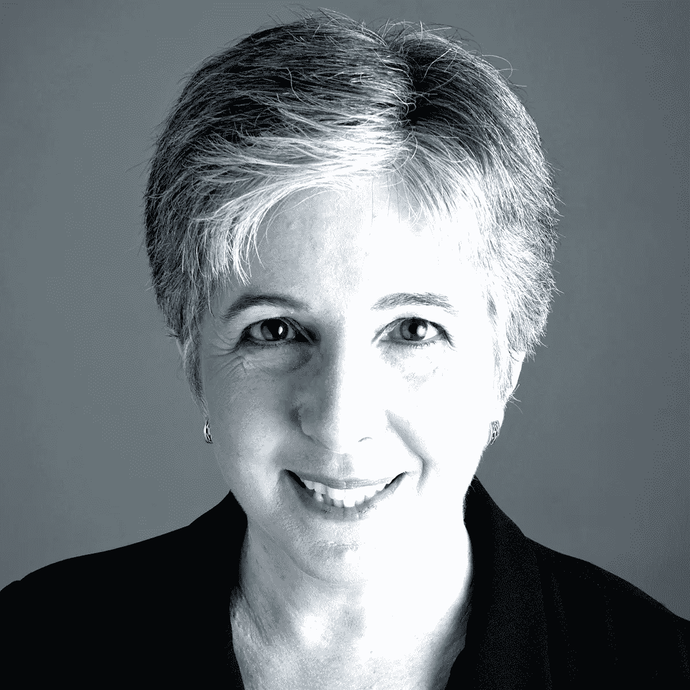

# 自由职业者的日程实际上是什么样的

> 原文：<https://www.sitepoint.com/freelancer-schedules/>

自由职业者的生活可能有点神秘。他们去哪里了？他们是做什么的？他们穿裤子了吗？

为了揭开这些笔记本电脑日常事务的神秘面纱，我们邀请了三位成功的自由职业者与我们分享他们的日程安排。他们还提供了如何安排一天以获得最大效率的建议。

## [杰西卡·格林沃特](http://www.jgreenwalt.com/)——自由平面设计师——加利福尼亚州旧金山

杰西卡被 DMZ Interactive 评为 2012 年最佳自由设计师，她曾与 LinkedIn、耶鲁大学和 Behr 等知名客户合作。她的设计公司叫做 [Pixelkeet](http://www.pixelkeet.com/) 。

周一、周二、周四和周五，杰西卡从办公室通勤到市区上班。星期三是她在家工作的日子，星期六是她的休息日。周日，她组织了一个名为 [Side Project Sunday (SPS)](http://www.huffingtonpost.com/jen-consalvo/get-involved-in-your-star_b_5901064.html) 的活动，她和她的朋友们聚在一起，处理他们在一周内无法完成的任何项目。

这是她周一、周二、周四和周五的时间表:

#### 早上 7 点到 8 点

醒来后进行晨练，包括轻度瑜伽和淋浴。然后叫醒我的鹦鹉杰洛·沃星顿二世，给他更换食物和水。

#### 上午 8 时至 9 时

检查隔夜积累的邮件、短信和语音邮件。

#### 上午 9 时至 10 时

通勤到旧金山办公室。

#### 上午 10 时至 10 时 30 分

在任务管理软件 [Asana](https://asana.com/) 中检查具体工作的电子邮件账户并查看项目状态。

#### 上午 10 时 30 分至 11 时/11 时 30 分

团队会议，讨论我们一直在做什么，我们学到了什么，以及我们下一步要做什么。

#### 上午 11 点或中午 11 点半

查看会议期间积累的电子邮件、短信和语音邮件。

#### 中午至下午 1 时

午餐。有时候和团队一起吃午饭，有时候和朋友一起吃，有时候和业务联系人一起吃。

#### 下午 1 时至 6 时

从事项目工作(实体模型、线框、代码、计划项目、审查实验结果等)。在这段时间里，不要让工作场所有任何干扰，也就是说，不要发电子邮件、打电话或访问社交媒体网站，除非这些与我当时正在做的工作直接相关。

#### 下午 6 点至晚上 10 点

花时间和朋友在一起或者参加一个活动。

#### 晚上 10 点至晚上 11 点/午夜

复习明天的日历，为明天的活动做准备。回应团队关于项目的信息。

#### 午夜

睡眠

### 杰西卡的忠告

#### 关于生产力:

我用过的对我的生活影响最大的效率技巧是使用清单。我一直用谷歌日历作为我的每日清单。在我的谷歌日历上，每个工作日我会花 8 个小时完成任务，每项任务至少 30 分钟。在我的日历上安排任务让我看到了我的一天会是什么样子，并给了我要完成的具体目标。限制自己每天 8 小时的日历时间也迫使我首先集中精力完成最重要的任务。

#### 在客户端上:

我学会的另一件事是快速识别问题客户并拒绝他们。问题客户非常浪费时间，通常不会支付足够的钱让他们值得你去麻烦，而且会分散你与其他潜在优秀客户的机会。

#### 关于事件:

我参加的活动往往以社交活动告终，因为我所在的湾区每个人都有自己的创业公司或应用。谈话最终会转到你正在做的事情上。

## [克里斯·霍华德](http://www.cooshtee.com/)——自由网页设计师、开发者和数字规划师——英国切尔滕纳姆

在为数字和营销机构工作了九年后，克里斯于 2012 年开始全职从事自由职业。他为软件公司、药店、历史保护组织和大学创作过作品。

Chris 有一个全职工作的伙伴，所以他试图将自己的时间表与伙伴的相匹配。为了做到这一点，他把一天分成大约四个两小时的时间段。偶尔，他需要在晚上和周末工作，但多年来，他通过最大限度地提高白天的工作效率来减少这种情况。

在任何给定的工作日，Chris 可能会安排四个较小的任务、两个中等任务或一个大任务。如果他正在做一个大项目，所有四个时间段可能都致力于同一项任务，但里程碑仍然通过充当迷你截止日期来激励他。在从事较大的项目时，他倾向于按周而不是按日制定计划。例如，他可能会为一个大项目分配三天时间，为较小的项目分配四个半天时间。

这是他的日程表:

#### 上午 9 点前

补上电子邮件。

#### 上午 9 时至 11 时

清晨时段。

休息 10 分钟。

#### 上午 11 时至下午 1 时

上午晚些时候。

休息 10 分钟。

#### 下午 1 时至 2 时

午餐/健身房/任何远离屏幕的地方。

#### 下午 2 时至 4 时

下午早些时候。

休息 10 分钟。

#### 下午 4 时至 6 时

傍晚时段。

#### 下午 6 点以后

赶上电子邮件。

### 克里斯的忠告

#### 关于生产力:

从生产效率的角度来看，我的最佳建议之一是在每个项目中保持一致的文件结构。不要把东西作为电子邮件附件或存在记忆棒里。找到一个有效的文件结构，并坚持下去。

#### 在电子邮件上:

我通常会通过处理一些电子邮件来开始我的一天(并摄入一些重要的咖啡因！).我通常会收到很多邮件——平均每天大约 20 到 30 封——我没有时间马上回复它们。所以在一天中，我会优先回复现有客户的邮件，这意味着我会赶上其他人(新业务、社交等。)要么在晚上，要么在第二天早上。

#### 休息时:

我每周午餐时间去健身房三次(这通常意味着延长午休时间)——锻炼当然很重要，但远离屏幕也不错。

#### 关于技术:

*我用[神童列表](https://www.wunderlist.com/)作为基本的待办事项列表，然后用[谷歌商务应用程序](https://www.google.com/work/apps/business/)来管理我的日历和文档。对于较大的项目，我使用 [Basecamp](https://basecamp.com/) 进行项目管理。我也用 [Dropbox](https://www.dropbox.com/) 来存储我所有的工作文件。这样，我可以在任何地方、任何设备上访问任何内容。* 

## [凯伦·安德森](http://writerway.com/about)——自由撰稿人&内容策略师——华盛顿州西雅图

Karen 从事写作和通信行业已有二十多年，在新闻、出版管理、网页内容设计、艺术评论、筹款、博客和社交媒体咨询方面拥有丰富的技能。在为苹果和集团健康等顶级公司工作后，她开始全职从事自由职业，目前与医疗设备、产品开发、豪华旅游和新兴技术领域的客户合作。

随着时间的推移，Karen 的自由职业时间表被她的家人、朋友和客户的时间表以及她自己的生物钟所左右。她说她现在的时间表很自然，也很容易遵循。

以下是她的日程安排:

#### 早上 7:30 到 8:30

还在床上的时候，通过 iPhone 查看 VIP 邮件文件夹。淋浴，喂猫，吃鸡蛋或格兰诺拉麦片的清淡早餐，沏一大杯约克郡金茶。

#### 上午 8:30 至 9:30

在我的桌子旁边坐下。如果我不得不往东海岸打电话，这是我在那些人出去吃午饭前抓住他们的时候。我快速浏览邮件的其余部分，标记那些看起来有趣但可以以后再处理的信息。

#### 上午 9 时 30 分至 11 时

研究和写作(通常是博客帖子或新闻稿)。

#### 上午 11 时至下午 1 时

在西海岸的人们出去吃午饭之前，给他们打电话/发邮件/发信息，处理大部分被标记的邮件。休息 15 分钟(在附近散步，或者做瑜伽伸展运动)。工作到下午 1 点。目标是完成短期项目。

#### 下午 1 时至 1 时 30 分

我避免浪费时间的午餐邀请(早点或下午晚些时候的咖啡效果更好)。午餐是一碗汤，半个三明治，或者一份沙拉。

#### 下午 1:30 至 4:30

回到办公桌后，专注于长期项目——通常是网站或 Keynote/PowerPoint 演示文稿。审查客户的背景材料。整合三到四个人的评论和反馈。有时会参加这些项目的 Skype 会议。我坚决抵制电子邮件或电话的诱惑！

#### 下午 4 时 30 分至 6 时

简短回复电子邮件和其他信息。然后去尊巴、瑜伽或散步。

#### 下午 6 时至 8 时

每周有两个晚上，我会外出参加我志愿参加的非营利组织的董事会或委员会会议。其他晚上，我和我的伙伴或朋友一起做饭。我们试着做一些菜，为第二顿晚餐或午餐提供剩菜。晚饭后，我进入我的脸书和社交媒体时间。

#### 晚上 8 点至 10 点半

每周有两三个晚上，我会一头扎进我的一个较长的客户项目中，完成一个部分，然后发送给客户或其他团队成员，这样他们可以在早上第一件事就是查看它。每周有一个晚上，我致力于我的小说写作项目——有时去写作小组，有时在我的办公室或楼上我的厚垫“写作椅”里写作

#### 晚上 10:30 到午夜

阅读新小说或观看 DVD(巴菲、戴德伍德、蒙塔尔巴诺探长、尼禄·沃尔夫、神秘博士)。

### 凯伦的忠告

#### 聚焦:

下午三个小时的专注时间非常重要——“紧急”邮件和电话总是一个问题，但是在这段时间里忽略它们的好处超过了成本。

#### 关于技术:

我使用两台电脑，一台台式电脑和一台笔记本电脑，我的大部分文件都同步到 Dropbox 或通过 iCloud，所以它们可以从任何一台机器上访问。当我带着笔记本电脑旅行时，我能够非常接近日程安排。

我的新苹果手表在帮助我避免被打扰方面做得非常出色。它跟踪我的 VIP 邮件，让我远离干扰。

*我的技术客户使用 Skype 我期待着有一天，每个人都觉得使用在线会议很舒服。* 

## 分享这篇文章