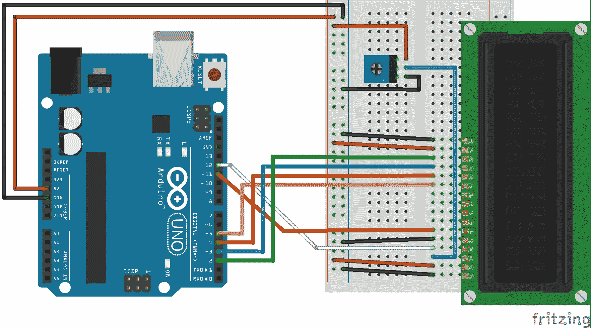
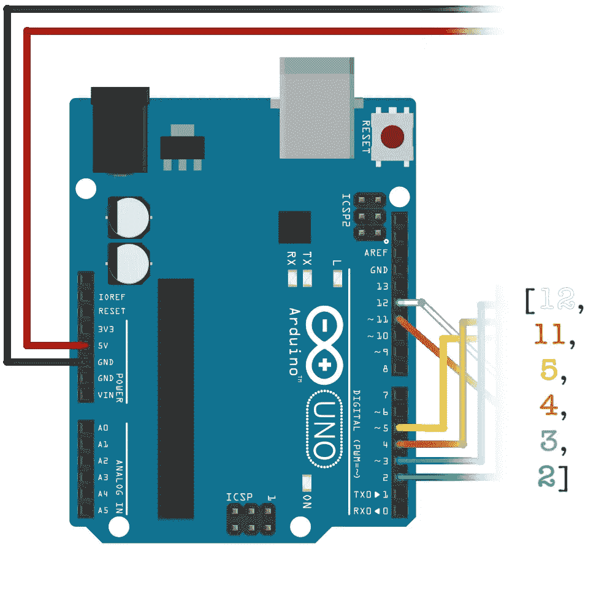
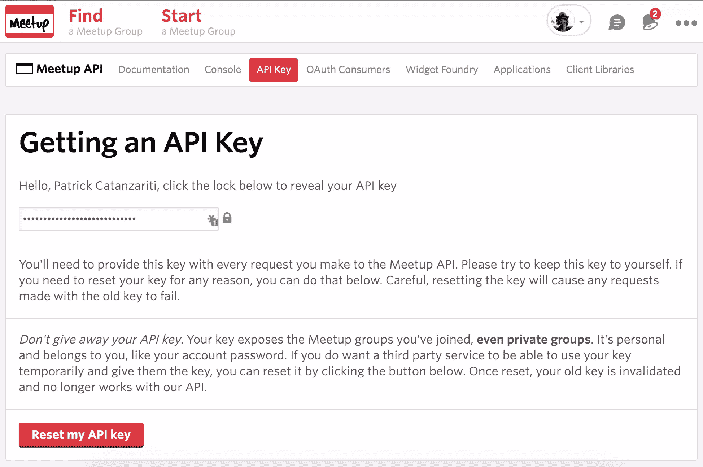
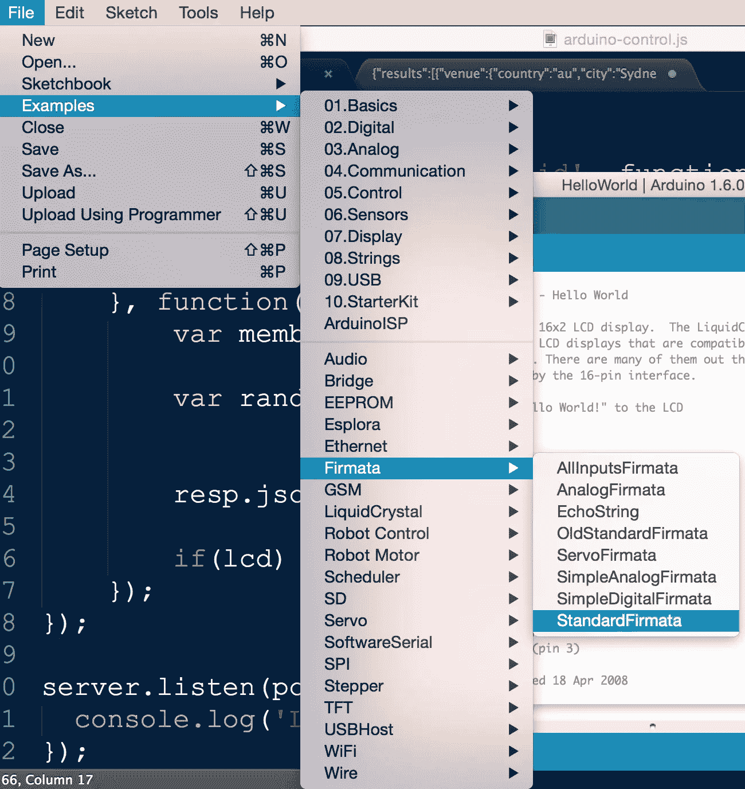
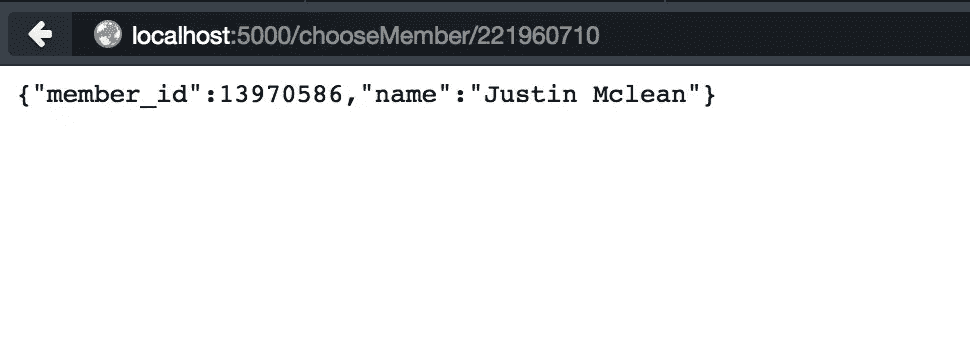
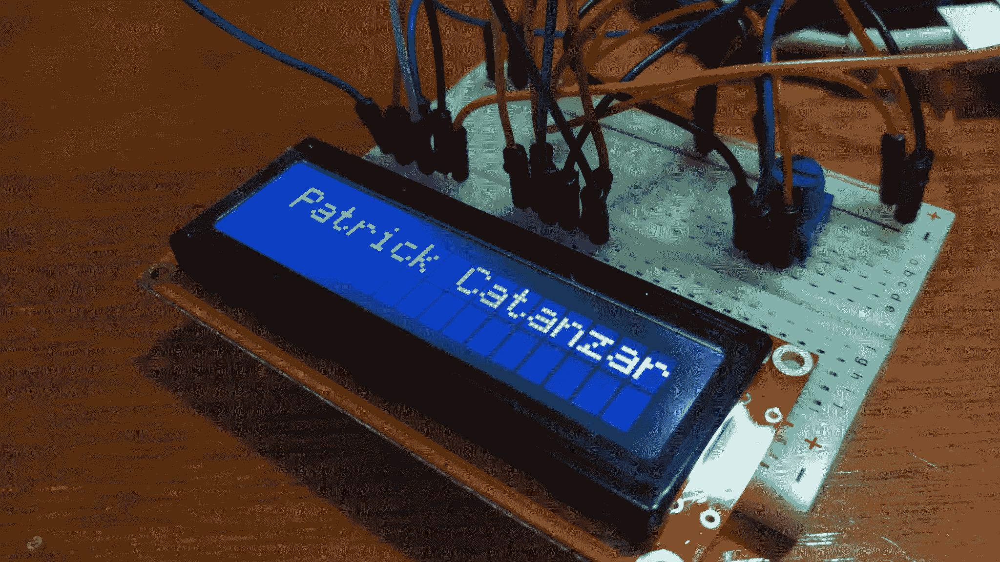
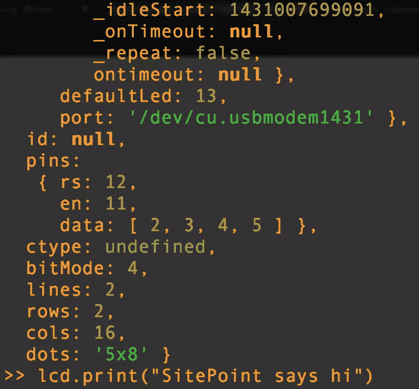
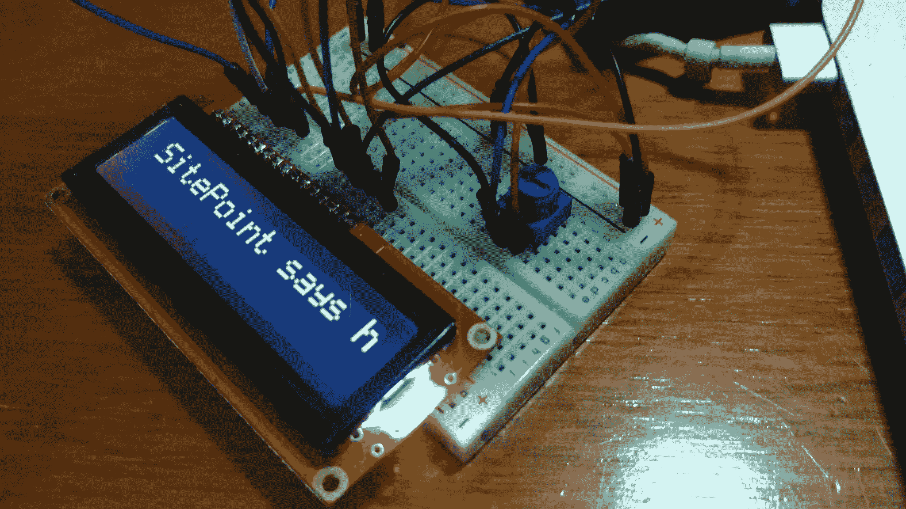

# 使用 Node.js 在 Arduino LCD 上显示 Web APIs

> 原文：<https://www.sitepoint.com/web-apis-on-arduino-lcd/>

液晶显示器。他们很有趣。这是给你的 Arduino 带来声音的最酷的方式之一，因为它通过发光的文本说话。在本文中，我们将探讨如何使用 Node.js 从 web API 引入数据，并将其显示在 Arduino 的 LCD 上。

我在悉尼每月最喜欢的聚会是 [IoT 悉尼聚会](http://www.meetup.com/Internet-of-Things-Sydney/)。这是一个很棒的聚会(你应该一起来！).在每次聚会结束时，都会为回复的人随机抽奖。我认为是时候以真正的物联网方式完成这项工作了，所以我快速组装了一个 Arduino LCD 设置，用于接收 Meetup.com 活动 RSVP 信息，然后随机选择一名幸运成员。我想这可能是一个不错的惊喜，而且比从帽子里抽名字容易多了！

它也正好符合我在 SitePoint 上撰写的当前物联网系列文章。我正在用各种设备探索许多不同的物联网可能性。上周，我看了在 Unity 游戏引擎中使用物联网数据的[，在此之前，我看了如何从](https://www.sitepoint.com/web-apis-and-iot-in-unity/) [Jawbone Up](https://www.sitepoint.com/connecting-jawbone-up-api-node-js/) 中获取数据。

我们开始吧！

## 你的 Arduino 素描

我们将在本例中使用的草图如下所示:



它是你在 Sparkfun Inventors Kit 中找到的版本的一个略微修改的版本。你可以在网上找到 LCD 草图的其他变体，它们重新安排了事物的连接方式，但工作方式是一样的。您可能只需要调整您在下面的 JavaScript 中定义的 pin。

## 我们的 JavaScript 代码

在我们的 Node.js JavaScript 文件中，我们包含了以下内容:

```
var express = require('express'),
	app = express(),
	server = require('http').Server(app),
	port = 5000,
	five = require('johnny-five'),
	request = require('request'),
	_ = require('underscore'),
	board = new five.Board(),
	lcd;

board.on('ready', function() {
	lcd = new five.LCD({
		pins: [12, 11, 5, 4, 3, 2],
		rows: 2,
		cols: 16
	});

	this.repl.inject({
		lcd: lcd
	});
});

app.get('/chooseMember/:event_id', function(req, resp) {
	request({
		url: 'https://api.meetup.com/2/rsvps?key=474cc9332345ea7d7e135f50653c&event_id='+req.params.event_id,
		json: true
	}, function(error, response, body) {
		var members = _.pluck(body.results, 'member'),
			randomMember = members[_.random(members.length - 1)];

		resp.json(randomMember);

		console.log(randomMember.name);

		lcd.clear().print(randomMember.name);
	});
});

server.listen(port, function() {
  console.log('Listening on ' + port);
});
```

## 一步一步地设置

如果您对 Node.js 非常了解，那么大部分代码对您来说已经很有意义了。我将解释每一点，只是为了确保每个人都在同一页上，并在我们需要设置的任何其他事情上提供指导。

首先，我们设置 express 服务器变量，准备在端口 5000 上运行本地主机服务器:

```
var express = require('express'),
	app = express(),
	server = require('http').Server(app),
	port = 5000,
```

然后，我们有一个相当重要的事情要包括，约翰尼五。这是 npm 库，它让我们可以通过 Node.js 访问控制 Arduino 所需的函数。

```
five = require('johnny-five'),
```

之后，我们将加入`request`模块。我们将使用它从 Node.js 服务器向 Meetup API 发出 http 请求。

```
request = require('request'),
```

为了保持简洁明了，我们将使用`underscore`来遍历数据数组。

```
_ = require('underscore'),
```

最后两个变量是`board`和`lcd`变量，我们将使用它们来存储 johnny-five 创建的 Arduino 对象。

```
board = new five.Board(),
	lcd;
```

我们首先等待我们的 Arduino 板准备好访问，当我们的板准备好时，johnny-five 发送一个“ready”事件。

```
board.on('ready', function() {
```

一旦我们的板准备好了，我们就让 johnny-five 知道我们连接的是什么类型的 LCD。我们在一个阵列中从上到下定义引脚:



我们还定义了 LCD 的行数和列数。对我来说，它是一个 2×16 的液晶显示器。所有这些看起来是这样的:

```
lcd = new five.LCD({
	pins: [12, 11, 5, 4, 3, 2],
	rows: 2,
	cols: 16
});
```

然后，我们得到了可选的(但方便包含的)代码，它允许我们在运行时从命令行访问 LCD 功能(我将在本文后面展示这一点):

```
this.repl.inject({
	lcd: lcd
});
```

然后，我们有一个也是唯一一个我们已经设置好的请求。在这个请求中，我们希望 URL 中包含一个事件 ID。比如:`http://localhost:5000/chooseMember/221960710`。当您访问活动页面时，您可以在地址栏中找到活动 ID:


我们查找该 ID 的 GET 请求如下所示:

```
app.get('/chooseMember/:event_id', function(req, resp) {
```

然后我们进入代码的复杂部分！我们对 Meetup API 的实际 HTTP 请求。我们通过`request`函数来访问它。我们在这里传入两个东西，请求的 http 选项和回调函数。

我们的 http 调用选项包含我们的`url`和一个布尔值，让请求知道我们正在等待一个 JSON 对象返回。看起来是这样的:

```
request({
	url: 'https://api.meetup.com/2/rsvps?key=089cc9874628ealkjh27dkb50653s&event_id='+req.params.event_id,
	json: true
}
```

敏锐的观察者会注意到我们使用`req.params.event_id`将 URL 字符串中的事件 ID 传递给请求 URL。然而，这里还有一串我没有解释的字符。为了访问 Meetup API，您需要一个 API 密钥。你可以在 https://secure.meetup.com/meetup_api/key/找到其中之一:



最后，我们得到了使用返回的 JSON 数据的回调函数。我让它保持简单，没有错误处理，但是如果这是一个严肃的生产级别的创建——添加一个对`error`变量的检查。

回调将在我们的`body`变量中返回的 JSON 输出如下所示:

```
{
  "venue": {
    "country": "au",
    "city": "Sydney",
    ...
  },
  "created": 1428838649000,
  "response": "yes",
  "member_photo": {
    "highres_link": "http://photos1.meetupstatic.com/photos/member/2/c/6/c/highres_161711372.jpeg",
    "photo_id": 161711372,
    ...
  },
  "guests": 0,
  "member": {
    "member_id": 098361926,
    "name": "Patrick Catanzariti"
  },
  ...
```

我们通过使用下划线中的`_.pluck()`函数过滤掉了很多内容。这将有助于我们关注 API 的重要部分——回复的成员。`_.pluck()`函数遍历`results`数组，只从每个数组中获取成员信息。

```
function(error, response, body) {
  var members = _.pluck(body.results, 'member'),
```

然后，我们使用`_.members()`下划线函数从结果数组中随机选择一个成员。

```
randomMember = members[_.random(members.length - 1)];
```

我们通过 express 服务器将数据作为对 GET 请求的 JSON 响应返回，并将姓名记录在控制台中，这样我们就可以看到谁被选中了:

```
resp.json(randomMember);

console.log(randomMember.name);
```

然后我们使用之前设置的 johnny-five 对象将成员的名字打印到我们的 LCD 上。我们首先使用`lcd.clear()`清除 LCD 上当前的任何内容，然后使用`lcd.print()`打印出名字字符。

```
lcd.clear().print(randomMember.name);
});
```

你会注意到当你运行这个程序时，一些长名字会被截掉，而不是绕到另一行。如果你想把事情放到第二行，试着把你的`randomMember.name`分成两个 16 个字符串，打印第一个字符串，然后在打印第二个字符串之前用`lcd.cursor(1, 0);`移动到第二行。在我的例子中，这是不需要的，因为我们真正需要的是能够说出谁的名字被抽出来——在这里，一些缺少的字符通常不会引起问题。

## 在您的 Arduino 上运行

我们已经准备好了 Node.js 代码。现在，连接你的 Arduino 并确保你已经上传了标准固件草图:



我们还需要确保我们已经把所有的依赖项都整理好了。我的`package.json`文件看起来是这样的:

```
{
  "name": "MeetupRSVPSelector",
  "version": "1.0.0",
  "description": "Connecting the Meetup API to our Arduino LCD",
  "main": "rsvp-selector.js",
  "author": "Patrick Catanzariti",
  "dependencies": {
    "express": "^4.12.3",
    "johnny-five": "^0.8.34",
    "request": "^2.55.0",
    "underscore": "^1.8.3"
  }
}
```

请随意将它应用到您自己的项目中，您需要的主要是那些依赖项。

然后一旦你整理好了一个`package.json`文件，打开你的控制台，进入你的代码所在的位置。运行这个奇妙的命令:

```
npm install
```

接下来是这个:

```
node rsvp-selector.js
```

运行该程序后，您现在应该能够转到[http://localhost:5000/choose member/221960710](http://localhost:5000/chooseMember/221960710)(当然，替换您自己的事件 ID)，结果会出现一个随机 rsvp:



如果您再次运行它，将会出现一个新的 rsvp。如果一切顺利，这些名字应该会出现在你的 Arduino 的 LCD 上！



## 我们提到的那个回复

我们之前在 Node.js 服务器中包含了一小段代码，上面写着`this.repl.inject`。这允许您在 Node.js 服务器运行时从终端中运行命令，以设置 LCD 屏幕上显示的内容:


如果我们输入一个`lcd.print()`,我们可以看到一些神奇的事情发生:



嗯……我们的信息几乎符合至少！



## 结论

我们成功地让随机选择的事件组成员出现在我们的 LCD 上！同样的想法可以应用于任何数量的其他 API，只需调整`request`调用和处理数据的方式。在液晶显示器上给室友留下怪异的信息，密切关注最新的 NBA 季后赛比分或任何你喜欢的东西！

根据这段代码做些有趣的事情？在评论里留言分享一下吧，我很想看看！

## 分享这篇文章