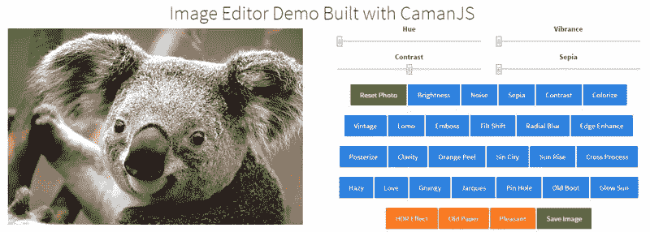

# 用 CamanJS 操作网页上的图像

> 原文：<https://www.sitepoint.com/manipulating-images-web-pages-camanjs/>

不久前，我在寻找一个可以在个人项目中使用的图像处理库。我发现的最吸引我的一个库是 [CamanJS](http://camanjs.com/) ，这是一个基于 JavaScript 的画布操作库。

但是等等……既然 CSS 支持基本的图像操作功能[开箱即用](https://www.w3.org/TR/filter-effects/)你可能想知道为什么我们要为此使用 JavaScript 库。嗯，除了浏览器支持，使用 CamanJS 还有很多优点。它提供了更多的过滤器和选项来处理图像。您可以创建自己的高级滤镜，并控制图像中的每个像素。你可以使用它内置的混合模式和分层系统。它使您能够处理跨域图像并保存处理后的图像。

现在，让我们开始探索 CamanJS 提供的特性吧！

## 包括必要的文件

要开始使用 CamanJS，只需在页面中包含这个库。我在这里提到的这个缩小版的 CDN 除了核心功能之外，还将所有的插件合并在一个文件中:

```
<script src="https://cdnjs.cloudflare.com/ajax/libs/camanjs/4.1.2/caman.full.min.js"></script>
```

从 CamanJS 的第 3 版到第 4 版，函数的语法略有变化。因此，在遵循本教程时，请确保您包含了高于 4 的版本。

## 通过 HTML 属性操作图像

CamanJS 可用于使用`data-caman`属性操作图像。下面的代码演示了如何对图像应用强度为“10”的亮度滤镜和强度为“30”的对比度:

```

```

库预打包的其他 18 个过滤器也使用类似的语法。例如:

```

```

## 通过 JavaScript 操纵图像

或者，您可以编写几行 JavaScript 来操作图像。使用 JavaScript 的结果与使用`data-caman`属性没有什么不同。

```
Caman('#your-image-id', function () {
  this.brightness(40);
  this.contrast(-10);
  this.sinCity();
  this.render();
});
```

## 实现图像编辑器的控件

不需要太多调整的过滤器可以通过点击按钮来触发。像`vintage()`、`lomo()`和`sinCity()`这样的过滤器不需要参数。其他过滤器如`contrast()`和`noise()`需要一个整数值作为参数。该值决定了过滤器的强度。

像`tiltShift()`、`posterize()`和`vignette()`这样的复杂滤波器需要多个参数。下面的代码片段演示了如何使用其中的三个过滤器。其他滤波器也可以同样编码。以下是 HTML:

```
<canvas id="canvas"></canvas>
<button id="vintagebtn">Vintage</button>
<button id="noisebtn">Noise</button>
<button id="tiltshiftbtn">Tilt Shift</button>
```

下面是单击按钮时应用过滤器的 JavaScript/jQuery:

```
var vintage = $('#vintagebtn');
var noise = $('#noisebtn');
var tiltshift = $('#tiltshiftbtn');

vintage.on('click', function(e) {
  Caman('#canvas', img, function() {
    this.vintage();
    this.render();
  });
});

noise.on('click', function(e) {
  Caman('#canvas', img, function() {
    this.noise(10);
    this.render();
  });
});

tiltshift.on('click', function(e) {
  Caman('#canvas', img, function() {
    this.tiltShift({
      angle: 90,
      focusWidth: 600
    }).render();
  });
});
```

`tiltshift()`也接受附加参数，如`startRadius`和`radiusFactor`。`vignette()`带两个参数`size`和`strength`。您可以参考 [CamanJS 文档](http://camanjs.com/docs/caman.html)来更深入地了解所有可用的过滤器。

## 实现滑块控件

亮度、对比度和色调等滤镜需要对它们的值进行相对更精细的控制，与输入范围滑块配合使用非常合适。正如您将看到的，滑块控件的实现与按钮控件略有不同。您可以使用以下 HTML 创建范围滑块:

```
<form id="silderInput">   
  <label for="hue">Hue</label>
  <input id="hue" name="hue" type="range" min="0" max="300" value="0">

  <label for="contrast">Contrast</label>
  <input id="contrast" name="contrast" type="range" min="-20" max="20" value="0">
</form>
```

这个 jQuery 块处理所有的操作:

```
$('input[type=range]').change(applyFilters);

function applyFilters() {
  var hue = parseInt($('#hue').val());
  var cntrst = parseInt($('#contrast').val());

    Caman('#canvas', 'image.jpg', function() {
      this.revert(false);
      this.hue(hue);
      this.contrast(cntrst);
      this.render();
    });
}
```

每当任何输入范围滑块改变其值时，就会调用`applyFilters()`功能。该函数将所有范围滑块的值存储在相应的变量中。然后，这些值作为参数传递给相应的过滤器，用于编辑图像。

每次我应用这些滤镜时，我都会调用`this.revert(false)`，这样画布就会恢复到原来的状态。使用`revert`确保滤镜正在处理原始图像，并且它们的效果没有混合。作为参数传递的`false`避免了还原过程中原始图像的瞬间闪烁。

另一个值得注意的细节是，我再次应用所有的过滤器，即使其中只有一个值发生了变化。这是因为当用户调整色调或亮度值时，他们不希望对比度重置。

## 在 CamanJS 中创建自定义过滤器

这个库的一个很酷的特性是你可以通过创建自己的过滤器和插件来扩展它。创建自定义过滤器有两种方法。您可以将内置过滤器与适当的值相结合，也可以从头开始创建自己的过滤器。

下面是创建您自己的过滤器的 jQuery:

```
Caman.Filter.register('oldpaper', function() {
  this.pinhole();
  this.noise(10);
  this.orangePeel();
  this.render();
});
```

要从头开始创建过滤器，你需要做一些额外的工作，因为有一些现有的错误，你可以在 GitHub repo 的[这个公开问题中读到。](https://github.com/meltingice/CamanJS/issues/133)

## 图层和混合模式

除了过滤器，CamanJS 还配备了一个先进的分层系统。这给了你更多的图像处理能力和选择。与 Photoshop 不同，CamanJS 中的图层可以嵌套。它使用混合模式将层应用到它们的父层。默认的混合模式是`normal`。CamanJS 总共有十种混合模式，包括常见的`multiply`、`exclusion`和`overlay`。

下面是使用图层和混合模式创建自定义滤镜的 jQuery:

```
Caman.Filter.register('greenTint', function() {
  this.brightness(-10);

  this.newLayer(function() {
    this.setBlendingMode("overlay");
    this.opacity(100);
    this.fillColor('#689900');
    this.filter.brightness(15);
    this.filter.contrast(10);
  });

  this.render();
});
```

滤镜可以应用于原始图层和新图层。此外，您可以为新图层设置其他几个属性，如不透明度和混合模式。我已经用纯色填充了这个图层，但是你可以通过调用`this.overlayImage('image.jpg')`用另一个图像填充它。

## 操纵跨原点图像

如果您需要操作不同域上的图像，可以使用 CamanJS 附带的 PHP 代理。要启用这个特性，您需要在您的服务器上托管这个 PHP 脚本。该脚本将图像数据从远程源代理到您的浏览器，以避开编辑限制。然后，您需要在 JavaScript 中添加以下代码行:

```
Caman.remoteProxy = Caman.IO.useProxy('php');
```

## 保存编辑过的图像

CamanJS 有一个内置的机制来保存编辑后的图像。在当前的实现中，调用`this.save(png)`将打开下载文件提示，但是你必须重命名文件并添加一个`png`或`jpg`扩展名。这是因为在调用这个函数时，浏览器被重定向到图像的 base64 编码，它们不知道文件类型。下面给出的代码片段保存了图像:

```
this.render(function () {
  this.save('png');
});
```

## 演示和完整代码

您可以在这个 CodePen 演示中查看包含所有功能的图像编辑器的演示，屏幕截图如下:

[](http://codepen.io/SitePoint/full/LVpNjp/)

作为练习，您可以尝试通过创建某种指示来改善用户体验，即过滤器当前正在图像上工作，或者修改保存按钮，使其不再需要重命名文件。

正如我们所见， [CamanJS](http://camanjs.com/) 是一个非常有用的图像处理库，它有许多过滤器和不断扩展的功能，在本教程中，我仅仅触及了它的皮毛。

## 分享这篇文章