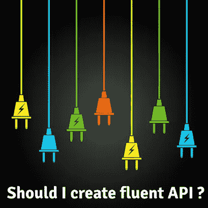

# 像老板一样的 JavaScript:理解流畅的 API

> 原文：<https://www.sitepoint.com/javascript-like-boss-understanding-fluent-apis/>

本文是微软网站开发技术系列的一部分。感谢您对使 SitePoint 成为可能的合作伙伴的支持。

在设计 [Babylon.js v2.0](https://github.com/BabylonJS/Babylon.js/?WT.mc_id=13393-DEV-sitepoint-article17) (一个用于在网络上构建 3D 的库)时，我最近发现自己希望更多的 API 能够**流畅**——也就是说，我希望社区能够更容易地阅读、理解和构建工作，同时在技术文档上花费更少的时间。在本教程中，我将介绍流畅的 APIs 要考虑什么，如何编写它们，以及跨浏览器的性能含义。



## 是什么让 API 变得流畅？

如这篇维基百科文章所述，一个流畅的 API 是一个面向对象的 API 的实现，旨在提供更多可读的代码。例如，jQuery 就是一个很好的例子，它展示了流畅的 API 允许您做什么:

```
$('<div></div>')
     .html("Fluent API are cool!")
     .addClass("header")
     .appendTo("body");
```

流畅的 API 允许您通过返回`this`对象来链接函数调用。如果你不知道这个关键字在 JavaScript 中是如何工作的，我推荐阅读[这篇伟大的文章](https://www.sitepoint.com/inner-workings-javascripts-this-keyword/)。

我们可以很容易地创建这样一个流畅的 API:

```
var MyClass = function(a) {
    this.a = a;
}

MyClass.prototype.foo = function(b) {
    // Do some complex work 
    this.a += Math.cos(b);
    return this;
}
```

如您所见，诀窍就在于返回`this`对象(在本例中是对当前实例的引用)以允许链继续。

然后我们可以连锁调用:

```
var obj = new MyClass(5);
obj.foo(1).foo(2).foo(3);
```

在尝试对 Babylon.js 做同样的事情之前，我想确保这不会产生一些性能问题。

所以我做了一个基准！

```
var count = 10000000;

var MyClass = function(a) {
    this.a = a;
}

MyClass.prototype.foo = function(b) {
    // Do some complex work 
    this.a += Math.cos(b);
    return this;
}

MyClass.prototype.foo2 = function (b) {
    // Do some complex work 
    this.a += Math.cos(b);
}

var start = new Date().getTime();
var obj = new MyClass(5);
obj.foo(1).foo(2).foo(3);
for (var index = 0; index < count; index++) {
    obj.foo(1).foo(2).foo(3);
}
var end = new Date().getTime();

var start2 = new Date().getTime();
var obj2 = new MyClass(5);
for (var index = 0; index < count; index++) {
    obj2.foo2(1);
    obj2.foo2(2);
    obj2.foo2(3);
}
var end2 = new Date().getTime();

var div = document.getElementById("results");

div.innerHTML += obj.a + ": With return this: " + (end - start) + "ms<BR>";
div.innerHTML += obj2.a + ": Without return this: " + (end2 - start2) + "ms";
```

如你所见，`foo`和`foo2`做着完全相同的事情。唯一的区别是`foo`可以被锁住，而`foo2`不能。

显然，呼叫链在以下方面有所不同:

```
obj.foo(1).foo(2).foo(3);
```

并且:

```
obj2.foo2(1);
obj2.foo2(2);
obj2.foo2(3);
```

鉴于这段代码，我在 Chrome、Firefox 和 IE 上运行了它，以确定我是否必须关注性能。


这是我得到的结果:

*   在 **Chrome** 中，普通 API 比流畅 API 慢 **6%**
*   在 **Firefox** 中，两个 API 几乎以相同的速度运行(流畅的 API 比**慢 1%**
*   在 **IE** 中，两个 API 几乎以相同的速度运行(fluent API 慢 2%)

我在函数(`Math.cos`)中添加了一个操作来模拟函数所做的某种处理。

如果我删除所有内容，只保留`return`语句，在所有浏览器上都没有区别(实际上 10，000，000 次尝试只有一两毫秒)。您可以在各种浏览器中自己测试一下。如果你手头没有这些设备，modern 上有很多免费工具。即。只是不要在真实设备上测试虚拟机的性能。

所以我的结论是:这是一个去！

流畅的 API 很棒，它们产生更可读的代码，并且您可以使用它们而不会有任何问题或性能损失！

## JavaScript 的更多实践

这可能会让你有点惊讶，但微软有许多关于开源 JavaScript 主题的免费学习，我们的任务是随着 [Project Spartan 的到来](http://blogs.msdn.com/b/ie/archive/2015/02/26/a-break-from-the-past-the-birth-of-microsoft-s-new-web-rendering-engine.aspx?WT.mc_id=13393-DEV-sitepoint-article17)创造更多。查看我自己的:

*   [web GL 3D 和 HTML5 及 Babylon.js 介绍](http://www.microsoftvirtualacademy.com/training-courses/introduction-to-webgl-3d-with-html5-and-babylon-js?WT.mc_id=13393-DEV-sitepoint-article17)
*   [用 ASP.NET 和安古拉杰构建单页应用](http://channel9.msdn.com/Events/Build/2014/3-644?WT.mc_id=12833-DEV-sitepoint-othercontent)
*   [HTML 中的前沿图形](http://channel9.msdn.com/events/Build/2014/3-558?WT.mc_id=13393-DEV-sitepoint-article17)

或者我们团队的学习系列:

*   [让你的 HTML/JavaScript 更快的实用性能技巧](http://channel9.msdn.com/Series/Practical-Performance-Tips-to-Make-Your-HTMLJavaScript-Faster/06?WT.mc_id=13393-DEV-sitepoint-article17)(从响应式设计、休闲游戏到性能优化的七部分系列)
*   现代网络平台快速启动(HTML、CSS 和 JS 的基础)
*   [使用 HTML 和 JavaScript JumpStart 开发通用 Windows 应用](http://www.microsoftvirtualacademy.com/training-courses/developing-universal-windows-apps-with-html-and-javascript-jump-start?WT.mc_id=13393-DEV-sitepoint-article17)(使用您已经创建的 JS 来构建应用)

以及一些免费工具: [Visual Studio 社区](https://www.visualstudio.com/en-us/products/visual-studio-community-vs?WT.mc_id=13393-DEV-sitepoint-article17)、 [Azure 试用版](http://azure.microsoft.com/en-us/pricing/free-trial/?WT.mc_id=13393-DEV-sitepoint-article17)，以及[针对 Mac、Linux 或 Windows 的跨浏览器测试工具](http://modern.ie/?utm_source=SitePoint&utm_medium=article17&utm_campaign=SitePoint)。

本文是微软网站开发技术系列的一部分。我们很高兴与你分享斯巴达项目的[和它的](http://blogs.msdn.com/b/ie/archive/2015/01/22/project-spartan-and-the-windows-10-january-preview-build.aspx?WT.mc_id=13393-DEV-sitepoint-article17)[新渲染引擎](http://blogs.msdn.com/b/ie/archive/2015/02/26/a-break-from-the-past-the-birth-of-microsoft-s-new-web-rendering-engine.aspx?WT.mc_id=13393-DEV-sitepoint-article17)。在 [modern 获得免费虚拟机或在您的 Mac、iOS、Android 或 Windows 设备上进行远程测试。即](http://modern.ie/?utm_source=SitePoint&utm_medium=article17&utm_campaign=SitePoint)。


## 分享这篇文章