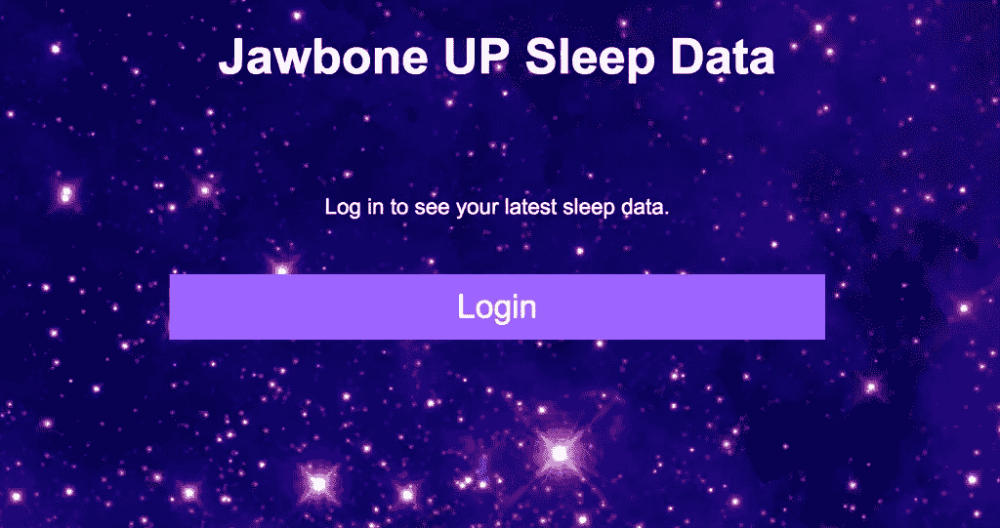
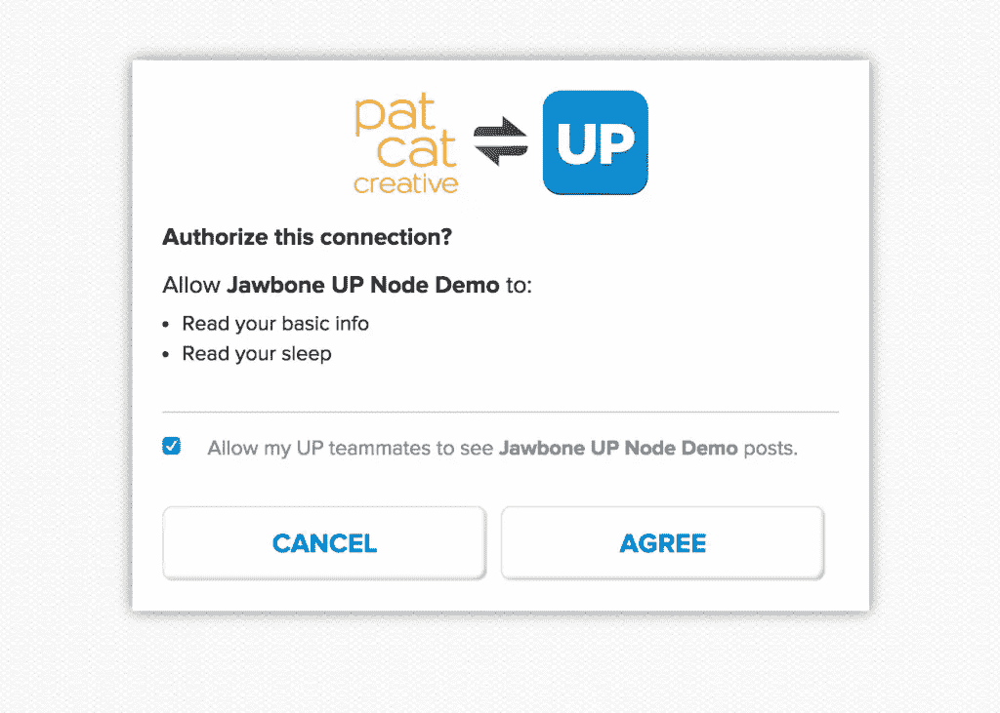
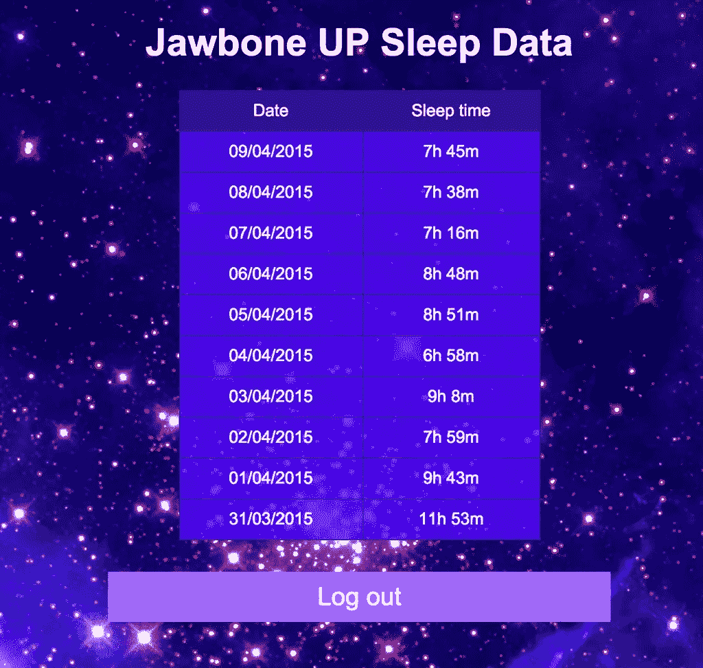

# 用 Node.js 连接到 Jawbone UP API

> 原文：<https://www.sitepoint.com/connecting-jawbone-up-api-node-js/>

作为一名开发人员，我忍不住想要访问我的 [Jawbone UP](https://jawbone.com/up) 所拥有的大量步数和睡眠习惯数据。有这么多数据！所以我开始研究如何使用 Jawbone UP API 和 Node 获取这些数据。

我找到了如何在 web 上使用 Jawbone UP API 和 Node 的例子，但它们都非常复杂，有很多移动的部分，还有一些过时的模块(像旧版本的 Express)。在这篇文章中，我想把重点放在绝对的基础上——不用担心将用户数据保存到数据库中，创建帐户或连接社交登录。我们将重点讨论让节点服务器通过 Jawbone API 进行身份验证并返回用户数据所需了解的核心内容。

这个演示的所有代码都可以在我们的 GitHub repo 上找到。

## 设置 Jawbone 应用程序

我们需要的第一件事是在我们的 Jawbone 帐户下设置一个新的 Jawbone 应用程序。这是用户将被授权访问他们的数据的应用程序。

首先登录 Jawbone 网站的开发者部分，进入[https://jawbone.com/up/developer](https://jawbone.com/up/developer)，点击左下角的“登录”链接。你不需要一个特定的 Jawbone 开发者帐号，因为他们允许你使用现有的 Jawbone 帐号登录。


登录后，进入[https://jawbone.com/up/developer/account](https://jawbone.com/up/developer/account)，或者点击左侧菜单“账户”下的“管理账户”链接。


在此页面上，您将到达您的开发者帐户页面。从这里，点击“创建应用程序”。


在加载的页面上，系统会提示您输入应用程序的详细信息:

*   **名称**——你的应用的名称，我输入“Jawbone UP Node Demo”。
*   **描述**–这是一个简短的描述，将出现在用户的 up 应用程序库中。
*   **详细描述**–这出现在应用程序图库中应用程序的详细页面上。
*   **徽标**–为您的应用程序上传一个徽标。如果你收到一个关于“选择”的错误消息(我知道这很奇怪，但是对于少数跟随并得到这个消息的人来说这是有意义的)，很可能你的 logo 图像太大了。
*   **URL**–你的应用主页
*   **授权网址**–您登录页面的网址。出于测试目的，输入`https://localhost:5000/login/jawbone`。
*   **OAuth 重定向 URIs**——用户通过身份验证后，应用程序允许重定向到的 URL。在我们的演示中，我们将输入`https://localhost:5000`。

单击创建应用程序后，您将被定向到包含应用程序列表的页面。您新创建的应用程序应该与我的类似:


记下“客户端 Id”和“应用程序秘密”——这是你连接到 Jawbone API 所需要的。

## 启动我们的节点应用程序

我将把我们所有的节点服务器代码放在一个名为`server.js`的文件中。我们首先为我们的服务器要求必要的 npm 模块。

首先，我们设置一个基本的[快递](http://expressjs.com/) app。

```
var express = require(‘express’),
    app = express(),
```

然后我们需要`ejs`(嵌入式 JavaScript)，它允许我们将 JavaScript 插入到 HTML 模板中。我们将用它在返回的 HTML 中显示 JavaScript 变量。

```
ejs = require('ejs'),
```

为了能够通过 Jawbone API 进行身份验证并重定向回我们的应用程序，Jawbone 要求我们通过 https 重定向到一个页面。为此，我们必须包含`https`。

```
https = require('https'),
```

接下来，我们包含了`fs`，它允许我们读取文件系统。我们将需要它来读取服务器证书文件以启用 https。

```
fs = require('fs'),
```

我们还需要`body-parser`来处理 JSON 请求:

```
bodyParser = require('body-parser'),
```

Jawbone UP API 使用 OAuth 2.0 协议进行身份验证。基本上，这意味着为了让用户使用他们的 Jawbone 帐户登录，并允许我们访问他们的数据，我们需要通过这个协议。幸运的是，npm 的`passport`模块包含一个名为`passport-oauth`的模块来支持这一点。我们在应用程序中设置了`passport`和 OAuth 2.0，如下所示:

```
passport = require('passport'),
JawboneStrategy = require('passport-oauth').OAuth2Strategy,
```

然后我们得到了一个自我解释的变量，它存储了我们将要运行的端口。

```
port = 5000,
```

接下来，我们将在`jawboneAuth`中存储 Passport 和 OAuth 2.0 中认证所需的所有值。此时，您将使用我们之前注册应用程序时记录的“客户 Id”和“应用程序机密”值。

```
jawboneAuth = {
  clientID: 'jUvu1_4u_mA',
  clientSecret: '8961265d16ac678948006c2944ed85dbeeaab547',
  authorizationURL: 'https://jawbone.com/auth/oauth2/auth',
  tokenURL: 'https://jawbone.com/auth/oauth2/token',
  callbackURL: 'https://localhost:5000/sleepdata'
},
```

以下是这些价值观的含义和/或来源的概述:

*   **clientID**–这是为您的 Jawbone 应用程序列出的“客户端 ID”。
*   **client Secret**–这是它下面的“App Secret”值。
*   **授权 URL**–这是用户将被重定向到的 UP OAuth 2.0 身份验证页面的位置。
*   **token URL**–这是 Jawbone UP API 中的 URL，为了请求访问令牌，我们必须对其进行 HTTPS 调用。我们需要在对 Jawbone UP API 的调用中包含这个令牌，以证明我们被授权进行这些数据请求。在 Jawbone UP API 中，这个令牌持续一年，因此您可以将它存储在数据库中，并让用户连接到他们的 Jawbone 帐户一年，然后需要重新认证他们。在本教程中，我们不会讨论存储用户之类的东西，但是如果你想进一步深入，最好记住这一点。
*   **callback URL**–Jawbone 将引导用户返回到我们网站上的 URL，一旦他们成功地允许我们访问他们的数据。对我们来说，这是一个显示睡眠数据的页面。

我们要定义的最后一个变量是我们的`sslOptions`,它包含了我们需要提供给服务器的所有细节，以允许我们使用 HTTPS 运行这个服务器。在本文后面解释我们如何设置 HTTPS 时，我将详细讨论这些问题。

然后，我们包括几行定义一些基本节点应用程序功能的代码，这些功能是节点开发人员所熟悉的:

```
app.use(bodyParser.json());
app.use(express.static(__dirname + '/public'));
app.set('view engine', 'ejs');
app.set('views', __dirname + '/views');
```

*   **body parser**–允许我们解析 JSON 对象。
*   **静态文件夹**–定义我们的静态文件(比如图像)在服务器上的位置(在我们的例子中，是`/public`文件夹)。
*   **EJS**–将`ejs`模块指定为我们的模板引擎。
*   **视图文件夹**–定义我们的`ejs`视图文件在服务器上的位置(在我们的例子中，是`/views`文件夹)。

为了在 Express 中初始化 Passport，我们运行以下行:

```
app.use(passport.initialize());
```

需要注意的是，如果我们想要拥有持久的登录会话，那么在 Passport 中还需要设置更多的东西。在这种情况下，我们需要建立会话。然而，对于本教程，我们将只关注从 Jawbone UP API 获取数据的初始阶段，而不会担心登录会话。

## 设置我们的 GET 请求

为了将用户引导到 Jawbone UP API 的登录屏幕，我们需要在服务器上分配一个 URL，该 URL 将重定向到 Jawbone 登录屏幕。下面的代码为此分配了 URL`/login/jawbone`。在对这个 URL 的 GET 请求中，我们调用`passport.authorize()`来打开我们的 Jawbone UP 授权页面:

```
app.get('/login/jawbone', 
  passport.authorize('jawbone', {
    scope: ['basic_read','sleep_read'],
    failureRedirect: '/'
  })
);
```

正如您在上面看到的，我们已经获得了一系列我们正在请求的特定权限— `['basic_read','sleep_read']`。在我们的例子中，我们需要基本的用户数据和睡眠数据。如果您想请求访问步数、就餐情况等等，您可以向该数组添加额外的权限请求。你可以在 [Jawbone UP 开发者认证文档页面](https://jawbone.com/up/developer/authentication)看到一个列表，上面列出了可用的内容以及他们提供的访问权限。

还要注意的是，如果在 Jawbone UP 认证界面中认证失败，它会将我们重定向回主页。在`passport`模块中设置`successRedirect`也是可能的，但是我发现在 Jawbone UP API 中，这是不需要的，因为我们将在下面的代码中的`JawboneStrategy`中定义我们的回调 URL。

然后，我们设置显示睡眠数据的 GET 请求。这是我们在访问用户数据时将告诉 API 将我们重定向到的位置。在本例中，它是`/sleepdata`:

```
app.get('/sleepdata',
  passport.authorize('jawbone', {
    scope: ['basic_read','sleep_read'],
    failureRedirect: '/'
  }), function(req, res) {
    res.render('userdata', req.account);
  }
);
```

这里我们有相同的`passport.authorize()`函数，只是为了检查用户在到达这个页面时是否已经登录。如果是这样，我们运行`res.render('userdata', req.account);`，它将 Jawbone UP API 返回的数据传递给`userdata.ejs`模板(我们将很快设置它)。如果他们没有登录，他们将被引导回 Jawbone UP 认证屏幕。

然后，我们设置一个 URL 来允许用户在`/logout`注销，一旦注销，它会将用户重定向回主页:

```
app.get('/logout', function(req, res) {
  req.logout();
  res.redirect('/');
});
```

最后，对于我们的路由，我们设置它在有人试图访问主页时加载我们的`index.ejs`模板:

```
app.get('/', function(req, res) {
  res.render('index');
});
```

## 使用 Passport 连接到 Jawbone UP API

最大的代码块也是最重要的——建立一个 Passport“策略”,告诉 Passport 如何使用`'jawbone'`处理授权请求。看起来是这样的:

```
passport.use('jawbone', new JawboneStrategy({
  clientID: jawboneAuth.clientID,
  clientSecret: jawboneAuth.clientSecret,
  authorizationURL: jawboneAuth.authorizationURL,
  tokenURL: jawboneAuth.tokenURL,
  callbackURL: jawboneAuth.callbackURL
}, function(token, refreshToken, profile, done) {
  var options = {
        access_token: token,
        client_id: jawboneAuth.clientID,
        client_secret: jawboneAuth.clientSecret
      },
      up = require('jawbone-up')(options);

  up.sleeps.get({}, function(err, body) {
    if (err) {
      console.log('Error receiving Jawbone UP data');
    } else {
      var jawboneData = JSON.parse(body).data;

      for (var i = 0; i < jawboneData.items.length; i++) {
        var date = jawboneData.items[i].date.toString(),
            year = date.slice(0,4),
            month = date.slice(4,6),
            day = date.slice(6,8);

        jawboneData.items[i].date = day + '/' + month + '/' + year;
        jawboneData.items[i].title = jawboneData.items[i].title.replace('for ', '');
      }

      return done(null, jawboneData, console.log('Jawbone UP data ready to be displayed.'));
    }
  });
}));
```

让我们来看看所有这些代码在做什么。

首先，我们从我们在文件开始时定义的`jawboneAuth`对象设置我们的`clientID`、`clientSecret`、`authorizationURL`、`tokenURL`和`callbackURL`。这是使用`new JawboneStrategy()`完成的。

接下来我们有回调函数来处理这些数据。我们在这个回调函数中使用了`token`和`done`值。`token`是 Jawbone UP API 访问令牌，我们需要将它包含在对 API 的任何调用中，以证明我们通过了身份验证。`done`是回调函数，将我们的数据返回给 app。

我们将访问令牌以及前面定义的客户机 ID 和秘密传入 options 对象中的`jawbone-up`模块:

```
var options = {
      access_token: token,
      client_id: jawboneAuth.clientID,
      client_secret: jawboneAuth.clientSecret
    },
    up = require('jawbone-up')(options);
```

`jawbone-up`模块是节点模块，它让我们能够访问 Jawbone UP API 端点。这些是我们对 API 进行的调用，以返回用户数据(例如`GET https://jawbone.com/nudge/api/v.1.1/users/@me/sleeps`)，然而`jawbone-up`模块允许我们在函数`up.moves.get()`和`up.sleeps.get()`中访问这些数据。在我们的例子中，我们将使用`up.sleeps.get()`来获取睡眠数据。

在`up.sleeps.get()`中，我们有两个变量，`err`和`body`。如果从 API 接收数据时出现错误，它将在`err`变量中返回，所以我们在回调开始时测试它。

否则，我们已经在`body`变量的 JSON 字符串中返回了数据。`body`变量将包含一个 JSON 值字符串，如下所示:

```
{
  "meta": {
    "user_xid": "Hllksn238c-KJBu2esff_Q",
    "message": "OK",
    "code": 200,
    "time": 1428562859
  },
  "data": {
    "items": [
      {
        "time_updated": 1428534140,
        "xid": "8060gi-3V-kLT-niK4ZxB2NLqnct9_2B",
        "title": "for 7h 45m",
        "time_created": 1428504300,
        "time_completed": 1428533100,
        "details": {
          "body": 0,
          "sound": 15000,
          "tz": "Australia/Sydney",
          "awakenings": 0,
          "light": 12900,
          "mind": 0,
          "asleep_time": 1428505800,
          "awake": 1500,
          "rem": 0,
          "duration": 28800,
          "smart_alarm_fire": 0,
          "quality": 84,
          "awake_time": 1428533100,
          "sunrise": 1428524040,
          "sunset": 1428565320
        },
        "date": 20150409,
        "shared": true,
        "sub_type": 0
      },
      {
        "time_updated": 1428447559,
        "xid": "8060gi-3V-nmNeDAWAAXjwzpZx2RQOgg",
        "title": "for 7h 38m",
        "time_created": 1428418945,
        "time_completed": 1428447488,
        "details": {
          "body": 0,
          "sound": 13985,
          "tz": "Australia/Sydney",
          "awakenings": 1,
          "light": 13501,
          "mind": 0,
          "asleep_time": 1428419639,
          "awake": 1057,
          "rem": 0,
          "duration": 28543,
          "smart_alarm_fire": 0,
          "quality": 78,
          "awake_time": 1428447300,
          "sunrise": 1428437580,
          "sunset": 1428478980
        },
        "date": 20150408,
        "shared": true,
        "sub_type": 0
      }
    ],
    "links": {
      "next": "/nudge/api/v.1.1/users/Hllksn238c-KJBu2esff_Q/sleeps?page_token=1427987112334&limit=10"
    },
    "size": 10
  }
}
```

我们想要的一切都在`data`之内。我们使用`JSON.parse(body)`将上面的值解析成一个 JavaScript 对象，并将`data`键中的值赋给一个名为`jawboneData`的变量:

```
var jawboneData = JSON.parse(body).data;
```

然后，我们有一个 for 循环，它遍历`data`内数组中的每一项，并在将日期和睡眠时间返回到模板进行显示之前对它们进行格式化。

```
var date = jawboneData.items[i].date.toString(),
    year = date.slice(0,4),
    month = date.slice(4,6),
    day = date.slice(6,8);

jawboneData.items[i].date = day + '/' + month + '/' + year;
```

在这里，我们读入日期，将其转换为字符串，然后自己截取日、月和年。它以值`20150408`的形式返回，所以我们截取前四位作为年份，后两位作为月份，最后两位作为日期。然后我们将它排列成`DD/MM/YYYY`，如果您喜欢用美国日期格式，您可以切换月份和日期:

```
jawboneData.items[i].date = month + '/' + day + '/' + year;
```

Jawbone API 返回一个格式相对较好的睡眠持续时间值作为`title`，看起来像这样:`"for 9h 43m"`。我们可以使用它，但是要像这样去掉`"for "`部分:

```
jawboneData.items[i].title = jawboneData.items[i].title.replace('for ', '');
```

然后，我们将数据返回给 Passport 的回调函数，该函数将呈现我们的`userdata.ejs`。为此，我们将变量`jawboneData`返回给`done`函数。还有一个`console.log`，这样我们就可以在日志中看到 Jawbone UP 数据何时被发送显示:

```
return done(null, jawboneData, console.log('Jawbone UP data ready to be displayed.'));
```

## 使用 HTTPS

正如我前面提到的，为了使用 Jawbone UP API，我们需要用 HTTPS 运行我们的服务器，因为 Jawbone 的服务要求双方都运行 HTTPS。如果`callbackURL`没有设置为`https`，当你尝试登录时，你将收到“无效重定向”错误。

为了让我们的例子正常工作，我们将使用自签名证书。如果你是在一个实时网站上这样做，你需要从一个有效的证书颁发机构获得适当的证书。

在`server.js`中，我们定义了两个 SSL 选项:

```
sslOptions = {
  key: fs.readFileSync('./server.key'),
  cert: fs.readFileSync('./server.crt')
};
```

这些是我们服务器上两个身份验证相关文件的位置:

*   **密钥**–这是我们服务器的私钥
*   **证书**–这是我们的自签名证书

### 为我们的服务器生成一个私钥

要生成私钥，我们需要使用 [OpenSSL 工具包](https://www.openssl.org)。Mac OSX 和 Linux 用户应该已经预装了这个。对于 Windows 用户，你可以安装 [Cygwin](http://www.cygwin.com/) ，在“选择包”屏幕搜索“openssl”并选择出现的包。

我们可以通过打开终端，导航到服务器的文件夹并运行以下命令来生成私钥:

```
openssl genrsa -out server.key 2048
```

这将生成一个名为`server.key`的私有服务器密钥供使用。

### 生成证书签名请求(CSR)

然后，我们需要生成 CSR。这通常会被发送给证书颁发机构，但在我们的情况下，我们将自己签名，用于测试目的。

要使用我们在上面创建的私钥生成 CSR，请运行以下命令:

```
openssl req -new -key server.key -out server.csr
```

您将会收到一份需要回答的问题列表，回答这些问题后，您将会收到一份名为`server.csr`的 CSR 文件。

### 使用我们的服务器私钥生成签名证书

最后，为了生成一个没有证书颁发机构的自签名证书，我们运行以下命令来生成一个有效期为一年的证书:

```
openssl x509 -req -in server.csr -out server.crt -signkey server.key -days 365
```

该命令应该已经生成了一个`server.crt`文件——这是您的证书。

### 删除我们的证书请求

对于那些喜欢保持整洁并且自己签署证书的人，我们可以删除`server.csr`,因为我们的证书现在已经签署了。

### 我们准备好去 HTTPS 了

有了我们的私钥和证书，并在我们的节点文件中定义，我们的服务器就可以作为 HTTPS 运行了。以下代码使用 HTTPS 和我们的选项启动服务器:

```
var secureServer = https.createServer(sslOptions, app).listen(port, function(){
  console.log('UP server listening on ' + port);
});
```

## 我们的 EJS 档案

我们这个应用程序的 HTML 都在`.ejs`文件中，这样我们可以在需要时在其中包含 JavaScript 变量。这些文件都在`/views`内。`index.ejs`非常简单，只包含一个标题、说明和一个登录按钮，该按钮将转到`/login/jawbone`:

```
<body>
  <h1>Jawbone UP Sleep Data</h1>
  <p>Log in to see your latest sleep data.</p>
  <a href="/login/jawbone" class="btn">Login</a>
</body>
```

是行动的地方。我们可以关注的重点是我们的表:

```
<table class="sleep-table">
  <thead>
    <tr>
      <th>Date</th>
      <th>Sleep time</th>
    </tr>
  </thead>
  <tbody>
  <% for (var i=0; i<items.length; i++) { %>
    <tr>
      <td><%= items[i].date %></td>
      <td><%= items[i].title %></td>
    </tr>
  <% } %>
  </tbody>
</table>
```

对于那些不熟悉 EJS 的人，我们在`<%`和`%>`标签中嵌入了 JavaScript。

我们将`items`传递给`userdata`模板，我们使用类似于`<% for (var i=0; i<items.length; i++) { %>`的 for 循环迭代该模板。

然后使用`<%= items[i].date %>`和`<%= items[i].title %>`将每个日期和标题插入到我们的 HTML 中。

## 我们的应用程序正在运行

要让应用程序运行，请在您的终端上运行:

```
node server.js
```

运行后，转到`http://localhost:5000`，您将看到我们的初始页面:



如果我们点击登录按钮，我们将被带到`http://localhost:5000/login/jawbone`，这将引导我们到 Jawbone UP 认证页面。该页面将提示我们 Jawbone 登录的详细信息。一旦你输入了这些信息，或者你已经登录了 Jawbone 网站，你将被引导到一个请求访问你的用户数据的认证页面。点击“同意”:



当我们点击“同意”时，我们将返回到`http://localhost:5000/sleepdata`页面，并返回一个睡眠数据表:



如果我们点击“注销”按钮，它会将我们注销并重定向回主页。

## 结论

这就完成了我们对连接到 Jawbone UP API 并将数据返回到节点服务器的基础知识的概述。

接下来的步骤可能包括建立一个数据库来存储数据以备将来使用，为您的应用程序创建用户帐户，扩展您从 UP API 获取的数据量，改变它的显示方式(也许添加一些漂亮的图表！)等等。将这些数据与任何数量的其他 API 结合起来，一些真正简洁的应用程序的潜力是巨大的！

## 其他有用的资源

*   [节点-颚骨-上升模块的文件](https://github.com/ryanseys/node-jawbone-up)
*   [Jawbone 开发者文档](https://jawbone.com/up/developer/)
*   [护照文件](http://passportjs.org/guide/)
*   [使用用户帐户和 MongoDB 的 UP 和 Node 演示](https://github.com/maxutter/up-api-auth-demo)

## 分享这篇文章