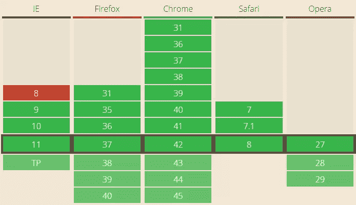
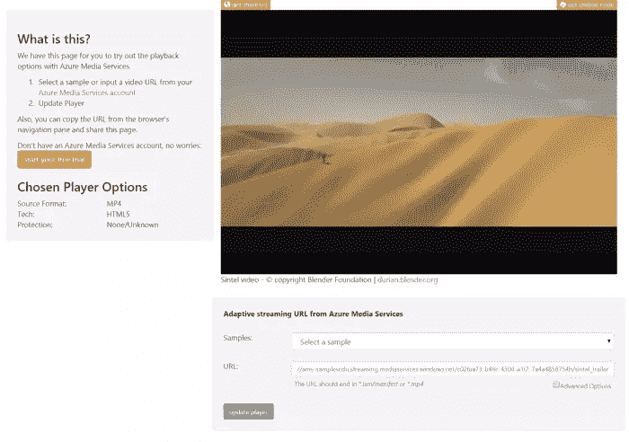
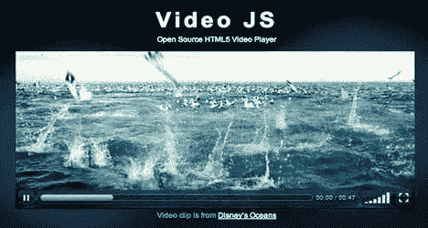

# HTML5 视频入门

> 原文：<https://www.sitepoint.com/getting-started-html5-video/>

本文是微软网站开发技术系列的一部分。感谢您对使 SitePoint 成为可能的合作伙伴的支持。


有没有想过创建自己的类似 Twitch.tv 的应用程序来直播你的工作？你自己的类似 YouTube 的程序来回放你之前录制的视频怎么样？过去你可能会使用 Flash、Java 或 Silverlight 来处理富媒体，但随着 Chrome 42 宣布不再支持这些插件，现在是使用 HTML5 的最佳时机。

在我加入微软之前，我是康卡斯特产品开发团队的高级工程师，在那里我为许多平台开发视频播放器，包括 web、Xbox One、Xbox 360 和 SmartGlass。这是一次尖端视频技术的杰出教育，我很高兴我能把我的经验带到这个职位上，并把我在那里学到的东西教给其他人。

这是关于使用 Azure 媒体服务创建和消费 HTML5 视频的系列文章的第一篇。在本教程中，我将解释如何使用这个云媒体解决方案进行设置，并开始尝试交付直播或点播视频。

## 视频格式入门

有多种格式可供选择，所以让我们来看看您今天可以使用的一些格式。首先，我们应该了解自适应流是如何工作的，考虑到未来的许多技术都依赖于此。

[https://www.youtube.com/embed/AeJzoqtuf-o](https://www.youtube.com/embed/AeJzoqtuf-o)

自适应流将视频分割成小块。“自适应”部分是视频以多种比特率和分辨率编码，产生多种大小的块。从那里，播放器可以在不同的比特率/分辨率之间进行选择，并随着网络条件的变化自动适应更大或更小的块。

[Scott Hanselman](http://www.hanselman.com/blog/InstallingAndSettingUpAndEncodingForIIS7SmoothStreamingAndSilverlight.aspx?WT.mc_id=13391-DEV-sitepoint-article15) 描述的很好(嗯，至少流畅的流媒体)。

> 你必须看到它才能明白，但它的简单性其实很聪明。当一些人把一个 200 兆的视频文件编码成平滑的流，结果目录是 500 兆时，他们会抓狂。他们可能会说，它更大！我没有那种带宽！事实上，通过网络发送的数据比磁盘上的要少。这个想法是，平滑流创建比特率的“步骤”。它在磁盘上以多种比特率编码和存储你的文件。


### 渐进式 MP4

[Adobe.com 概况](http://www.adobe.com/devnet/video/articles/mp4_movie_atom.html?WT.mc_id=13391-DEV-sitepoint-article15)

这会在观众的电脑上下载和缓存视频。在开始播放之前，需要一小段时间来缓冲和缓存媒体文件的开头。一旦视频被缓存，随后的观看不需要任何缓冲。使用标准 HTTP 协议，逐步下载的文件通常通过内容交付网络(CDN)交付。因此，你的视频播放器创建了一个与 CDN(Azure)服务器的直接 HTTP 连接来检索内容。

使用这种东西的坏处是浪费带宽。一旦有足够的数据，播放器将开始播放视频，但它将继续下载，直到收到整个文件，不管用户看了多少。观众一分钟后离开会怎样？浪费带宽。

此外，与下面列出的格式不同，这不允许视频质量在下载过程中改变。

### HLS

[streamingmedia.com 概况](http://www.streamingmedia.com/Articles/Editorial/What-Is-.../What-is-HLS-(HTTP-Live-Strea?WT.mc_id=13391-DEV-sitepoint-article15)

HTTP Live Streaming (HLS)属于苹果公司，其工作原理是基于自适应流的思想，通常在 10 秒钟内完成。此外，它还适用于视频点播内容。它支持直播和点播视频。

[https://www.youtube.com/embed/wVsntdILdxU](https://www.youtube.com/embed/wVsntdILdxU)

### 平滑流式传输

[RBGnetworks.com 概况](http://www.rgbnetworks.com/blog/?p=2680?WT.mc_id=13391-DEV-sitepoint-article15)

这是 2008 年 10 月作为 Silverlight 的一部分宣布的，是 Internet 信息服务(IIS)媒体服务的一个特性，它是一个集成的基于 HTTP 的媒体交付平台。

平滑流式传输具有[自适应流式传输](http://www.rgbnetworks.com/blog/?p=2484?WT.mc_id=13391-DEV-sitepoint-article15)的所有典型特征。这是通过 HTTP 传送的，被分割成小块，通常多种比特率被编码，以便播放器可以查看您的网络条件来选择最佳的视频比特率，以提供最佳的观看体验。

[https://www.youtube.com/embed/orKUmNoO0z8](https://www.youtube.com/embed/orKUmNoO0z8)

基于网络的基础设施成本低、防火墙兼容性和比特率转换只是自适应流媒体的一些额外好处。

### MPEG 破折号

[Streamingmedia.com 概述。](http://www.streamingmedia.com/Articles/Editorial/What-Is-.../What-is-MPEG-DASH-79041.aspx?WT.mc_id=13391-DEV-sitepoint-article15)

DASH 的最大区别在于，它是一个国际标准，现在由一个标准机构——运动图像专家组(MPEG)——控制，而不是由微软(平滑流媒体)或苹果(HLS)控制。几家公司参与了 MPEG DASH 的创建和标准化工作，包括微软、苹果、网飞、高通、爱立信、三星等等。

我们认为 MPEG-DASH 将最终取代我们在过去几年中引入和实现的所有平滑流式传输功能。随着时间的推移，我们将推出 DASH 支持，使其功能等同于 Smooth，并引入一些更酷的功能，这些功能只有在 DASH 这样的行业标准中才能使用。

## HTML5 视频支持

视频标签(`<video>`)出现在 HTML5 中已经好几年了，所有现代浏览器都支持它。[人人视频测试页](http://camendesign.com/code/video_for_everybody/test.html?WT.mc_id=13391-DEV-sitepoint-article15)用清晰的术语说明了它的用法。



caniuse.com 上<video>标签[的浏览器支持表](http://caniuse.com/#feat=video)</video>

将它添加到您的页面有多简单:

```
<video width="320" height="240" controls>
  <source src="movie.mp4" type="video/mp4">
  Fallback content: Your browser does not support the video tag.
</video>
```

事实上，你可能每天都在使用它。网飞过去依赖 Silverlight 作为他们的视频播放器，但现在它可以在 HTML5 视频上运行。YouTube 以前在 Flash 上运行，但现在它的大部分内容都是通过 HTML5 提供的。你知道你在 Xbox One 上看到的那些视频播放器(YouTube、Xbox Video、网飞等。)?是的，这些都是 HTML5。

跨浏览器测试 HTML5 视频变得更加容易，尤其是在各种版本的 Internet Explorer 和新项目 Spartan T1 上。为此，你可以[获得免费的虚拟机](http://modern.ie/?utm_source=SitePoint&utm_medium=article15&utm_campaign=SitePoint)或者在你的 Mac、iOS、Android 或 Windows 设备上进行远程测试。


## 关于玩家的一个注记

有很多可以选择。在本教程中，我使用了 Azure Media Services Player ,因为这是一个很好的开始，来感受一下媒体流是如何工作的。它包括许多样本视频，一个简单的下拉菜单，您可以在其中选择各种格式，并查看每种格式背后的技术和保护级别。

它支持各种现成的格式，包括:

*   平滑流式传输
*   MPEG 破折号
*   HLS
*   渐进式 MP4



最重要的是，你甚至不需要创建自己的播放器或页面来测试你的任何视频内容。只需将 URL 更改为您的内容，然后就可以开始了。

也可以看看开源的 [video.js](http://www.videojs.com/?WT.mc_id=13391-DEV-sitepoint-article15) 框架。它类似于微软播放器(如下)，但也提供了一组选项，使其易于风格。他们也有一个[优秀的皮肤设计师](http://designer.videojs.com/?WT.mc_id=13391-DEV-sitepoint-article15)。如果你不太熟悉高级 CSS，我会避开它。



## 构建您自己的视频播放器

有几个播放器框架我们可以使用，但为了简单起见，让我们使用微软提供的 HTML5 播放器。你可以在这里找到相关文档。这里还有一个[的工作样本。](http://smf.cloudapp.net/html5/html/javascript.html?WT.mc_id=13391-DEV-sitepoint-article15)

以下是它的一些额外津贴:

> HTML5 播放器框架为浏览器提供了一致的视频体验。这是通过检测对客户端上可用的不同视频播放器技术(例如 HTML5 视频标签、Silverlight 等)的支持来实现的。)然后提供相同的 JavaScript API 和相同的控件集，而不管使用的是什么技术。它将遍历后备视频播放器技术列表，直到找到支持的技术。

我会在下一篇文章中提供更多的信息。

## 下一步是什么？浏览器嵌入。App Wrap。

在我的下一篇文章中，我们将讲述在浏览器中创建你自己的视频播放器的过程。更好的是，我们可以“包装”HTML5 站点和播放器，并使用 Cordova 等工具为移动设备和 Windows 创建混合应用程序。

接下来，我们将设置一个 Azure 帐户，并创建我们的第一个媒体服务内容，我们可以在我们新创建的视频播放器上播放这些内容。如果你想马上开始，你可以注册一个[免费 Azure 试用版](http://azure.microsoft.com/en-us/pricing/free-trial/?WT.mc_id=13391-DEV-sitepoint-article15)和 [Visual Studio 社区](https://www.visualstudio.com/en-us/products/visual-studio-community-vs?WT.mc_id=13391-DEV-sitepoint-article15)(现在也是一个免费的 IDE)或者[联系我](mailto:dvoyles@microsoft.com)了解如何获得一个 [BizSpark 帐户](http://www.davevoyles.com/bizspark-free-software-cloud-services-o/?WT.mc_id=13391-DEV-sitepoint-article15)和每月免费 Azure 点数的信息。

## 了解有关 Azure 媒体服务的更多信息

这里有一些很好的资源，可以让你更深入地了解媒体、Azure 以及如何快速设置:

*   [蔚蓝媒体服务 101——蔚蓝星期五(第九频道)](http://channel9.msdn.com/Shows/Azure-Friday/Azure-Media-Services-101-Get-your-video-online-now-?WT.mc_id=13391-DEV-sitepoint-article15)
*   【Azure 媒体服务入门(视频)
*   [使用 Azure 媒体服务进行动态打包](http://channel9.msdn.com/Series/Windows-Azure-Media-Services-Tutorials/Introduction-to-dynamic-packaging?wt.mc_id=player?WT.mc_id=13391-DEV-sitepoint-article15)

或者我们团队关于 HTML、CSS 和 JS 的更广泛的学习系列:

*   [让你的 HTML/JavaScript 更快的实用性能技巧](http://channel9.msdn.com/Series/Practical-Performance-Tips-to-Make-Your-HTMLJavaScript-Faster/06?WT.mc_id=13391-DEV-sitepoint-article15)(从响应式设计到休闲游戏再到性能优化的 7 部分系列)
*   现代网络平台快速启动(HTML、CSS 和 JS 的基础)
*   [使用 HTML 和 JavaScript JumpStart 开发通用 Windows 应用](http://www.microsoftvirtualacademy.com/training-courses/developing-universal-windows-apps-with-html-and-javascript-jump-start?WT.mc_id=13391-DEV-sitepoint-article15)(使用您已经创建的 JS 来构建应用)

本文是微软网站开发技术系列的一部分。我们很高兴与你分享斯巴达项目的[和它的](http://blogs.msdn.com/b/ie/archive/2015/01/22/project-spartan-and-the-windows-10-january-preview-build.aspx?WT.mc_id=13391-DEV-sitepoint-article15)[新渲染引擎](http://blogs.msdn.com/b/ie/archive/2015/02/26/a-break-from-the-past-the-birth-of-microsoft-s-new-web-rendering-engine.aspx?WT.mc_id=13391-DEV-sitepoint-article15)。在 [modern 获得免费虚拟机或在您的 Mac、iOS、Android 或 Windows 设备上进行远程测试。即](http://modern.ie/?utm_source=SitePoint&utm_medium=article15&utm_campaign=SitePoint)。