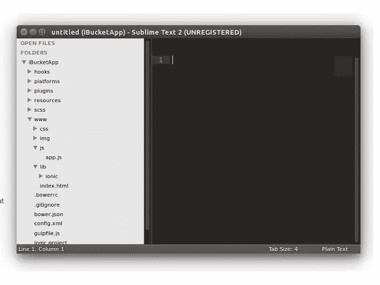
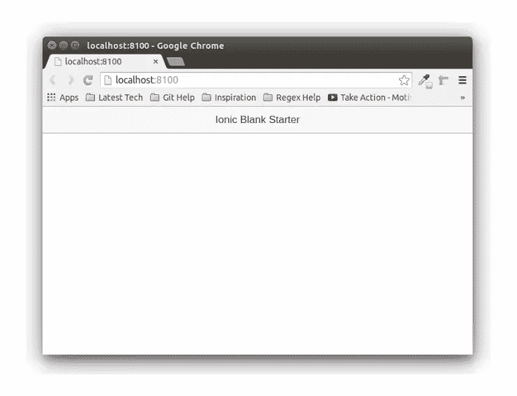
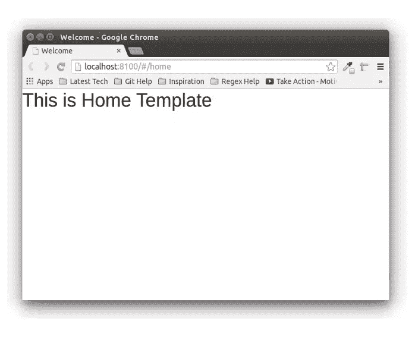
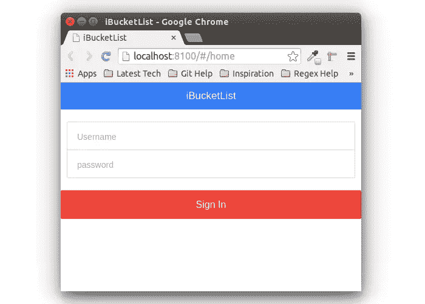
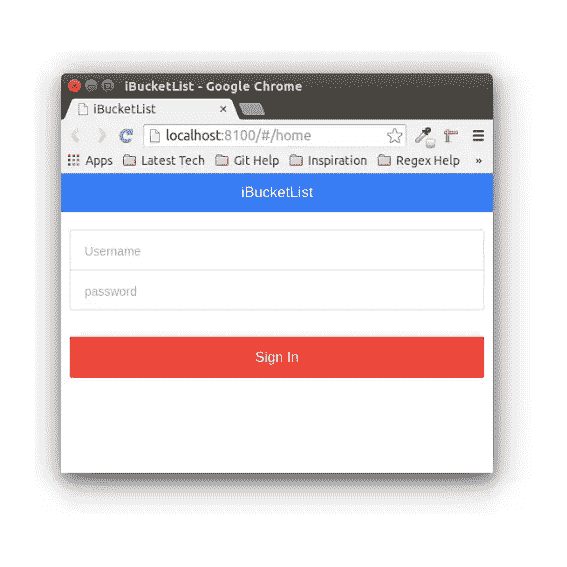
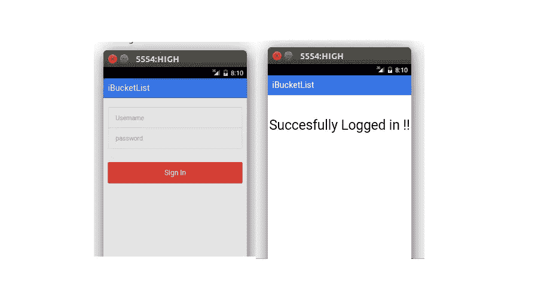

# 用 Ionic 框架和 Firebase 创建一个清单

> 原文：<https://www.sitepoint.com/creating-bucket-list-ionic-framework-firebase/>

‘遗愿清单’(列出死前要经历的事情的清单)一直是人们维护的热门清单。

在本教程的第一部分，我们将使用 IONIC 框架创建一个简单的列表应用程序的基础。这将创建一个主页，使用户能够注册遗愿清单应用程序并登录。我们将使用 [Firebase](https://www.firebase.com/) 作为我们的清单应用程序的后端。

IONIC 是一个 HTML5 移动应用开发框架，帮助开发者构建具有本地外观的应用。它主要致力于使用 HTML5、CSS 和 JavaScript 等 web 技术创建一个有吸引力的 UI。它需要 AngularJS 来驱动它的许多功能，如手势和动画。

第二部分将展示如何在遗愿清单应用程序中创建一个愿望清单平台。

本教程的源代码可以在 GitHub 上找到。

## 入门指南

开始安装 [Node.js](https://nodejs.org/) 如果你还没有的话，也安装节点包管理器 *npm* 。

使用 npm 安装 IONIC。

```
npm install -g cordova ionic
```

我们将为 Android 平台创建应用程序。因此，请确保安装了所需的平台依赖项。

安装完成后，创建一个 IONIC 项目。

```
ionic start iBucketApp blank
```

上面的命令创建了一个空白的 IONIC 项目。导航到项目目录 *iBucketApp* ，添加所需的平台，构建并仿真。

```
cd iBucketApp
ionic platform add android
ionic build android
ionic emulate android
```

如果一切顺利，您应该能够看到空白应用程序在 android 模拟器中运行。


## 项目结构

如果你查看项目结构，你可以看到在项目目录 *iBucketApp* 中，有一个名为 *www* 的文件夹，这是我们将要工作的文件夹。



在 *www/js* 里面有一个叫做 *app.js* 的文件，它是我们 app 的根文件。我们将在 *app.js* 中定义我们的应用程序路线。在*index.html*中，我们将定义`ion-nav-view`，在那里我们将呈现不同的模板。

在模拟器上编辑和运行应用程序是一项耗时的任务。因此，我们将使用浏览器来测试我们的应用程序，当它准备好了，我们将在 android 模拟器上尝试它。为了让它与浏览器一起工作，我们需要使用`npm`安装所需的 *package.json* 依赖项。在 iBucketApp 目录中，运行以下命令来安装依赖项。

```
npm install
```

IONIC 提供命令行工具，使应用程序开发和测试更容易。一旦该命令为`ionic serve`。一旦安装了依赖项，运行`ionic serve`，你应该能够在网络浏览器中查看应用程序。



## 创建主屏幕

让我们首先为 iBucketList 应用程序创建一个主页。在 *www* 目录下创建一个名为*模板*的文件夹。创建一个名为 home.html*的文件*。

我们将根据 url 请求切换我们的视图。所以我们将使用离子指令 API [ion-nav-view](http://ionicframework.com/docs/api/directive/ionNavView/) 。

删除 index.html`body`标签内的所有代码。将`ion-nav-view`指令添加到【index.html】的*正文中。*

```
<body ng-app="starter">
  <ion-nav-view></ion-nav-view>
</body>
```

根据请求的 url，我们将在 index.html*的*中渲染不同的视图。 [ion-view](http://ionicframework.com/docs/api/directive/ionView/) 指令是另一个 ion 指令 API，它是`ion-nav-view`的子指令。它是一个保存视图内容的容器。打开 *templates/home.html* 并添加一个带有 header 标签的 ion-view。

```
<ion-view>
     <h1>This is Home Template</h1>
</ion-view>
```

模板和容器都准备好了。现在我们需要定义路线和它们各自的视图。我们将利用 [angular-ui 路由器](https://github.com/angular-ui/ui-router)。打开 *js/app.js* ，定义`home`状态。

```
.config(function($stateProvider, $urlRouterProvider) {
    $stateProvider
        .state('home', {
            url: '/home',
            templateUrl: 'templates/home.html',
            controller: 'HomeCtrl'
        })

    $urlRouterProvider.otherwise('/home');
});
```

在上面的代码中，我们已经为 url `/home`定义了模板和控制器。我们还将默认 url 设置为`/home`。

创建一个名为 *js/controller.js* 的文件，并在其中定义`HomeCtrl`。

```
angular.module('starter.controllers', [])

.controller('HomeCtrl', ['$scope', function($scope) {

}]);
```

将 *js/controller.js* 文件包含在【index.html】的*中*。

```
<script src="js/controller.js"></script>
```

将`starter.controllers`注入 *app.js* 中的 starter app。

```
angular.module('starter', ['ionic','starter.controllers'])
```

保存上述更改，您应该能够在浏览器中看到这些更改。



接下来，让我们修改 home.html 的*模板。我们将从给我们的应用程序添加一个标题开始。添加一个标题需要我们将`ion-nav-bar`添加到 index.html*页面的*中。将这段代码添加到`ion-nav-view`标签的上方。*

```
<ion-nav-bar class="bar-positive">
</ion-nav-bar>
```

通过的`ion-view`的标题将显示在`ion-nav-bar`的标题中。在*home.html*中给`ion-view`添加标题属性。

让我们添加一些元素供用户登录。我们首先将 home.html 的离子含量与*的离子含量[相加。在`ion-content`中，我们将创建输入框和按钮。以下是*home.html*中的结果代码(替换当前内容):](http://ionicframework.com/docs/api/directive/ionContent/)*

```
<ion-view title="iBucketList">
    <ion-content>
        <div class="list list-inset">
            <label class="item item-input">
                <input type="text" placeholder="Username">
            </label>
            <label class="item item-input">
                <input type="password" placeholder="password">
            </label>
        </div>
        <div>
            <button class="button button-block button-assertive">
                Sign In
            </button>
        </div>

    </ion-content>
</ion-view>
```

保存更改，您应该能够在主页上查看登录表单。



登录按钮被拉伸。让我们添加一些填充到它的容器。

在 css/style.css 中，添加:

```
.padding {
    padding: 10px;
}
```

将`padding`样式应用于按钮父 div。

```
<div class="padding">
    <button class="button button-block button-assertive">
        Sign In
    </button>
</div>
```

保存更改，您应该能够在表单中查看新的登录。



## 实现登录功能

我们将使用 Firebase 作为我们的遗愿清单应用程序的后端。如果您还没有帐户，请在 [Firebase](https://www.firebase.com/) 上注册。一旦注册，你应该有自己的 Firebase 网址。例如，以下是我的 firebase URL:

*https://burning-fire-1723.firebaseio.com*

为了使用 [Firebase](https://www.firebase.com/) ，我们需要在 index.html 的*中包含以下脚本引用。*

```
<script src="https://cdn.firebase.com/js/client/2.0.4/firebase.js"></script>
<script src="https://cdn.firebase.com/libs/angularfire/0.9.0/angularfire.min.js"></script>
```

一旦添加了引用，将`Firebase`模块注入到应用程序中。修改 *controller.js* 注入 Firebase 模块:

```
angular.module('starter.controllers', ['firebase'])
```

将`$firebaseAuth`注入`HomeCtrl`中。

```
.controller('HomeCtrl',['$scope','$firebaseAuth', function($scope,$firebaseAuth)
```

接下来在*home.html*页面中，将`ng-model`指令添加到用户名和密码输入元素中。

```
<label class="item item-input">
    <input type="text" placeholder="Username" ng-model="login.username">
</label>
<label class="item item-input">
    <input type="password" placeholder="password" ng-model="login.password">
</label>
```

将 [ngClick](https://docs.angularjs.org/api/ng/directive/ngClick) 指令添加到登录按钮。

```
<button ng-click="signin()"  class="button button-block button-assertive">
                Sign In
</button>
```

在`HomeCtrl`中，定义一个名为`signin`的函数，当用户点击登录按钮时，该函数将被调用。

```
$scope.login={};

$scope.signin = function() {
    var username = $scope.login.username;
    var password = $scope.login.password;

    console.log(username, password);
}
```

保存更改，并在输入用户名和密码后尝试登录。如果一切顺利，您应该能够在浏览器控制台中看到用户名和密码。

接下来，我们将尝试对 Firebase 中的用户进行身份验证。为了做到这一点，首先我们将使用 Firebase URL 创建一个`Firebase`对象。将以下内容添加到我们刚刚创建的函数中，就在“$scope.login={}”之后。

```
var firebaseObj = new Firebase("https://burning-fire-1723.firebaseio.com");
```

使用`firebaseObj`，我们将创建一个`loginObj`。

```
var loginObj = $firebaseAuth(firebaseObj);
```

现在，当用户点击登录按钮时，我们将使用 [$authWithPassword](https://www.firebase.com/docs/web/libraries/angular/api.html#angularfire-users-and-authentication-authwithpasswordcredentials-options) API 来验证 Firebase。

```
loginObj.$authWithPassword({
        email: username,
        password: password
    })
    .then(function(user) {
        //Success callback
        console.log('Authentication successful');

    }, function(error) {
        //Failure callback
        console.log('Authentication failure');
    });
```

下面是修改后的`HomeCtrl`代码:

```
.controller('HomeCtrl', ['$scope', '$firebaseAuth', function($scope, $firebaseAuth) {

    $scope.login = {};
    var firebaseObj = new Firebase("https://burning-fire-1723.firebaseio.com");
    var loginObj = $firebaseAuth(firebaseObj);

    $scope.signin = function() {
        var username = $scope.login.username;
        var password = $scope.login.password;

        loginObj.$authWithPassword({
                email: username,
                password: password
            })
            .then(function(user) {
                //Success callback
                console.log('Authentication successful');

            }, function(error) {
                //Failure callback
                console.log('Authentication failure');
            });

    }
}]);
```

保存以上更改，并尝试使用用户名、*sam@sam.com*和密码*山姆*登录。身份验证成功后，您应该会在浏览器控制台中看到一条成功消息。

让我们创建一个用户主页，以便在成功通过身份验证后重定向用户。在 templates 文件夹中添加一个名为`userHome.html`的页面。以下是`userHome.html`的代码:

```
<ion-view title="iBucketList">
     <ion-content>
     <div class="userHomeMsg">
        <span>
            <h2>Succesfully Logged in !!</h2>
        </span>
      </div>
    </ion-content>
</ion-view>
```

在 *app.js* 中为*userHome.html*页面添加一个名为`userHome`的新状态。

```
.state('userHome', {
    url:'/userHome',
    templateUrl:'templates/userHome.html',
    controller:'UserHomeCtrl'
  })
```

在 *controller.js* 文件中创建控制器`UserHomeCtrl`。

```
.controller('UserHomeCtrl', ['$scope', function($scope){

}])
```

现在，身份验证成功后，我们会将用户重定向到用户主页。将`$state`注入`HomeCtrl`。

```
.controller('HomeCtrl',['$scope','$firebaseAuth','$state', function($scope,$firebaseAuth,$state)
```

在成功回调`$authWithPassword` API 调用时，重定向到`userHome`状态，用以下内容替换当前的登录函数:

```
loginObj.$authWithPassword({
        email: username,
        password: password
    })
    .then(function(user) {
        //Success callback
        console.log('Authentication successful');
        $state.go('userHome');

    }, function(error) {
        //Failure callback
        console.log('Authentication failure');
    });
```

保存更改并尝试使用用户名`sam@sam.com`和密码`sam`登录。身份验证成功后，您将被重定向到用户主页。



## 包扎

在本教程中，我们学习了如何开始使用 IONIC framework 和 Firebase 创建一个简单的清单应用程序，开发登录和注册表单以及用户主页。

在本教程的下一部分，我们将实现遗愿清单应用程序的注册功能。请在下面的评论中告诉我你的想法、建议或任何更正。