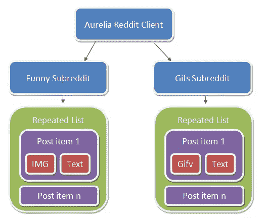

# 以 Aurelia.io 的方式扩展 HTML

> 原文：<https://www.sitepoint.com/extending-html-aurelia-io-way/>

教老狗 HTML 新把戏是当今现代 JavaScript 框架的一个主要焦点。无论是通过遵循潜在的标准，如 [WebComponents](https://www.sitepoint.com/introduction-to-web-components-and-polymer-tutorial/) ，创建[自定义指令](https://www.sitepoint.com/practical-guide-angularjs-directives/)还是通过[扩展现有的类](https://www.sitepoint.com/component-based-web-apps-react/)，你选择的框架很有可能提供了一种扩展 HTML 标记本身的方法。在布拉德·巴罗写的前一篇文章中，你被介绍给一个新玩家:[奥雷利亚](http://aurelia.io)。本文将基于 Brad 的文章和代码，向您展示如何按照 Aurelia 的约定创建自定义元素和自定义属性。

这篇文章的完整代码可以在[我们的 GitHub repo](https://github.com/sitepoint-editors/aurelia-reddit-client) 上找到，你可以在这里看到[我们将要构建的演示(请给应用程序一些初始化时间)。](http://zewa666.github.io/aurelia-reddit-client/)

## 为什么需要更多的标记？

在直接开始行动之前，让我们首先了解创建新组件的潜在用例。为此，我们将从概念上看一下下图所示的介绍性示例。我们有两个页面，分别用一个`ViewModel` (VM)和一个`View`表示，展示搞笑图片和 gif 视频。其中每一个都有一个重复的列表，它本身呈现包含图像和文本块的帖子。



*Aurelia Reddit 客户端概念图*

通过查看视图，我们可以看到数据采集和渲染在一个虚拟机/视图对中紧密耦合。

```
<template>
  <ul class="list-group">
    <li class="list-group-item" repeat.for="p of posts">
      
      <a href="http://reddit.com${p.data.permalink}">
        ${p.data.title}
      </a>
    </li>
  </ul>
</template>
```

对于一个简单的例子来说，这可能不是问题，但是随着系统的增长和越来越多的需求的收集，这可能会变成一个主要的缺点。

## 使用自定义属性增强现有元素

假设我们收到一个请求，要求为每个有趣的页面帖子提供一个 popover。为了做到这一点，我们可以很容易地将 Bootstrap 的特性直接连接到标记中，方法是在我们的`FunnyVM`中放置必要的`data-`属性，然后进行初始化。但是如果我们突然也需要在另一页上这样做呢？通过声明一个自定义属性来提供这个特性可以使我们的生活变得更加容易。这些在下列情况下特别有用:

*   包装现有插件
*   样式或类等常见绑定的快捷方式
*   在没有直接代码访问的情况下改变现有的 HTML 元素/自定义元素

现在让我们动手看看如何构建我们的第一个定制属性。

## 创建 popover

让我们先看看我们想要达到的目标。新属性`popover`应该接受 popover 的`placement`、`title`和`content`的参数。位置固定在右边，所以一个简单的字符串作为值就足够了。对于另外两个属性，我们将使用 Aurelia 的数据绑定来映射迭代的值。为了加载文件，我们使用了 Aurelia 的`require`功能。`from`属性包含要导入的资源的相对路径。

```
<require from="./popover"></require>    
...

```

为了实现这一点，我们首先在名为`popover.js`的`src`文件夹中创建一个新的 JavaScript 文件。像所有其他 Aurelia 构造一样，自定义属性是一个简单的导出 ES6 类，而不是传递给预定义 API 的函数集合(像许多遗留框架一样)。

```
import {customAttribute, bindable, inject} from 'aurelia-framework';
import $ from 'bootstrap';
import bootstrap from 'bootstrap';
...
```

与其他框架相比，Aurelia 通过`metadata`描述来声明结构。但是 Aurelia 没有使用静态函数或复杂的 API，而是利用最先进的 ES7 装饰器来实现这一点。我们将从包`aurelia-framework`中导入必要的装饰器。至于控件本身，我们将使用 Twitter Bootstrap 提供的 [Popover JavaScript 控件](http://getbootstrap.com/javascript/#popovers)。所以我们导入 jQuery 句柄`$`和`bootstrap`来初始化 Bootstraps 的 JavaScript 代码。

下一步是应用前面提到的元数据，以便 Aurelia 知道它在加载文件时得到了什么。通过附加`customAttribute`装饰器，我们用给定的值命名我们的组件。另一方面,`bindable`装饰器声明了一个我们的视图可以绑定的属性。我们简单地为每个可用的属性重复这个装饰器。

```
@inject(Element)
@customAttribute('popover')
@bindable('title')
@bindable('content')
@bindable('placement')
export class Popover {
...
```

第一个`inject`装饰器负责将实际的 DOM 元素作为参数提供给我们的构造函数方法，然后存储起来供以后使用。

```
constructor(element) {
  this.element = element;
}
```

现在我们有了所有必要的信息，我们可以通过声明一个名为`bind`的方法来选择进入[行为生命周期](http://aurelia.io/docs.html#behaviors)。这确保了我们在适当的时间初始化组件，类似于 jQuery 的就绪方法。

```
bind() {
  // initialize the popover
  $(this.element).popover({ 
    title: this.title,
    placement: this.placement,
    content: this.content,
    trigger: 'hover' });
}
```

最后但同样重要的是，我们添加了更改后的处理程序。请注意，在我们的示例中并没有真正执行这些操作，因为绑定源不会随时间而改变。

```
titleChanged(newValue){
  $(this.element).data('bs.popover').options.title = newValue;
}

contentChanged(newValue){
  $(this.element).data('bs.popover').options.content = newValue;
}

placementChanged(newValue){
  $(this.element).data('bs.popover').options.placement = newValue;
}
```

在 GitHub 上查看完整文件

既然我们已经看到了如何通过向现有元素提供属性来添加新特性，那么让我们继续，开始编写我们自己的定制元素。

## 使用自定义元素创建新标签

为了创建全新的元素，Aurelia 利用了与定制属性非常相似的方法。例如，我们将重新构建 gif 页面的帖子，用一个名为`reddit-gif`的自定义元素来表示，并提供打开和关闭实际视频的可能性。我们的视图的结果标记应该是这样的:

```
<require from="./reddit-gif"></require>
...
<ul class="list-group">
    <li class="list-group-item" repeat.for="p of posts">
      <reddit-gif data.bind="p.data"></reddit-gif>
    </li>
</ul>
```

如您所见，我们使用了新的标签，并通过数据绑定向`data`属性提供了必要的信息。

下一步是创建实际的元素。我们通过在文件夹`src`中创建元素的视图`reddit-gif.html`和它的虚拟机`reddit-gif.js`来实现。接下来看到的视图利用了之前来自`gifs.html`的标记，并添加了一个按钮来切换用于嵌入实际视频的 iframe。同样，Aurelia 的视图包含在一个模板标签中:

```
<template>
  <button click.delegate="toggleGif()">Toggle Gif</button> <br />
  
  <a href="http://reddit.com${data.permalink}">
    ${data.title}
  </a> <br />
  <iframe class="reddit-gif" show.bind="gifActive" src.bind="gifSrc"></iframe>
</template>
```

看看 VM 部分，我们确实遵循与创建定制属性时类似的过程。但是这一次我们利用了一个不同的装饰器，它将告诉 Aurelia 我们将创建一个只有一个名为`data`的属性的`customElement`。

```
import {customElement, bindable} from 'aurelia-framework';

@customElement('reddit-gif')
@bindable('data')
export class RedditGif {
...
```

接下来我们定义一个`gifActive`成员来跟踪 iframe 是否应该显示。我们最初还将`gifSrc`成员设置为空，以便在 iframe 不可见时不预加载任何内容。

```
constructor() {
  this.gifActive = false;
}

bind() {
  this.gifSrc = '';
}
```

最后但同样重要的是，我们添加了 toggle 按钮使用的`toggleGif`函数，该函数翻转每个调用的可见性和来源。

```
toggleGif() {
  if(this.gifActive) {
    this.gifSrc = '';
  } else {
    this.gifSrc = this.data.url + '#embed';
  }

  this.gifActive = !this.gifActive;
}
```

你可以在这里查看[完整的 HTML 文件](https://github.com/sitepoint-editors/aurelia-reddit-client/blob/master/src/reddit-gif.html)和[的 JS 文件](https://github.com/sitepoint-editors/aurelia-reddit-client/blob/master/src/reddit-gif.js)

## 使用约定减少代码量

Aurelia 致力于让开发者体验尽可能愉快。让我们面对现实:我们中的许多人不喜欢大量打字。因此，为了节省您一些宝贵的击键时间和改进维护，Aurelia 使用了一组简单的约定。例如，`bindable`装饰器的完整版本实际上可能是这样的，我们通过提供属性名来解决这个问题。所有其他选项将被自动推断。

```
@bindable({
  name:'myProperty', //name of the property on the class
  attribute:'my-property', //name of the attribute in HTML
  changeHandler:'myPropertyChanged', //name of the method to invoke when the property changes
  defaultBindingMode: ONE_WAY, //default binding mode used with the .bind command
  defaultValue: undefined //default value of the property, if not bound or set in HTML
})
```

另一件要考虑的事情是如何缩短多个属性的使用时间。因此，除了逐个定义它们，我们还可以告诉我们的自定义属性来期望动态属性。为此，我们用`dynamicOptions`装饰器来装饰我们的类。现在，我们仍然可以重用相同的视图标记，但不必手动定义所有的属性声明，顾名思义，这在动态上下文中非常有用。这意味着我们可以编写一个名为`dynamicPropertyChanged`的通用 changed-handler，每当任何绑定属性发生变化时都会调用它。

```
import {customAttribute, dynamicOptions, inject} from 'aurelia-framework';
import $ from 'bootstrap';
import bootstrap from 'bootstrap';

@inject(Element)
@customAttribute('popover')
@dynamicOptions
export class Popover {
  constructor(element) {
    // store it for later use
    this.element = element;
  }

  bind() {
    $(this.element).popover({ 
      title: this.title, 
      placement: this.placement, 
      content: this.content, 
      trigger: 'hover' 
    });
  }

  dynamicPropertyChanged(name, newValue, oldValue) {
    $(this.element).data('bs.popover').options[name] = newValue;
  }
}
```

但是自定义元素呢？我们已经隐含地使用了一些约定，甚至没有意识到。系统自动将视图和虚拟机对放在一起，只是因为它们具有相同的名称。如果你需要使用不同的视图，你可以使用装饰器`@useView(relativePath)`。或者通过声明`@noView`根本不使用视图。我们甚至可以疯狂地添加装饰者`useShadowDOM`，让我们的视图呈现在阴影世界中。如果你对那个术语不熟悉，请看看[这篇文章](http://www.html5rocks.com/en/tutorials/webcomponents/shadowdom/)

## 结论

我们，Aurelia 团队，希望给你一个如何通过利用定制元素和属性来扩展 HTML 本身的快速概述。通过这些例子，我们希望您已经能够看到我们对开发人员体验的关注，为您提供了一个灵活且易于使用的框架，它不会妨碍您，也不会让您使用奇怪的 API。如果您有任何问题，我们想邀请您加入我们的[数字频道](https://gitter.im/aurelia)。我们也希望听到您在编写第一个定制元素和属性时的体验。


## 分享这篇文章