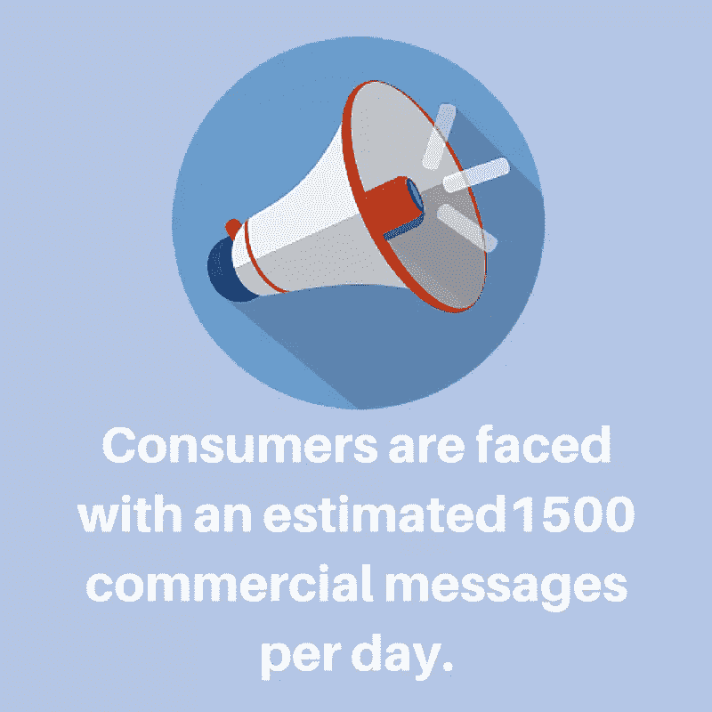
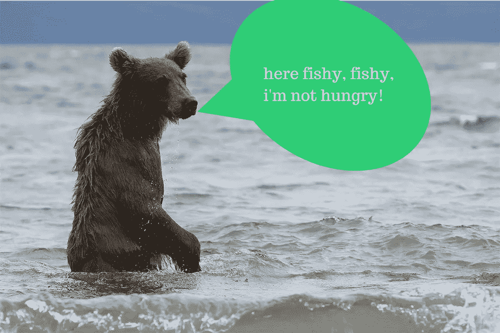

# 通过炫耀你的缺点来获得消费者的信任和忠诚

> 原文：<https://www.sitepoint.com/consumer-trust-loyalty/>

那是 1959 年，道尔·戴恩·伯恩巴克(DDB 饰)遇到了一个问题。

大众汽车公司雇佣了纽约市的广告公司为大众甲壳虫汽车公司创造一个新的营销活动，但是大众甲壳虫汽车并不是一个容易销售的产品。一方面，大众起源于纳粹德国，甲壳虫由阿道夫·希特勒承包。

但是它不光彩的历史并不是甲壳虫唯一的责任。五十年代后期是经济繁荣和家庭增长的时期，小型紧凑的甲壳虫与那个时代更大、更华丽的汽车格格不入。面对这样的困境，DDB 尝试了一个大胆的新策略。他们发起了“小规模思考”运动。

《广告时代》将其列为 20 世纪最佳广告活动的 Think Small 公开承认甲壳虫在市场上的不协调性，并将这款汽车的缺点(小而丑)描述为优点(简单、极简)。这场运动奏效了。甲壳虫销量暴涨，一种新的广告策略诞生了。

从小处着眼已经有超过 45 年的历史了，这个策略，现在被称为“双面呼吁”，没有消失的迹象。营销人员仍然依赖它，消费者仍然对它作出反应。

但是为什么呢？在一个市场从未如此混乱、消费者玩世不恭从未如此猖獗的时代，为什么这些活动仍能引起人们的共鸣？

科罗拉多大学博尔德分校利兹商学院的市场营销教授玛格丽特·坎贝尔将这个心理魔方分解为四个不同的原因。

## 注意力

“人们估计，消费者每天要面对大约 1500 条商业信息，”坎贝尔说。“任何消费者都在过滤掉其中的大部分……当你的信息以你认为相反的东西开头时，你往往不会去注意它。”

想想吧。在广告时段，你会被一个又一个强化现状的广告击中。买寿险，每个人都需要！看这部情景喜剧，它会让你开怀大笑！下载这个应用程序，做它应该做的事情！

你淹没了它。这不是什么新鲜事。但是接着达美乐比萨的广告出现了，你听到的第一句话是:“这是不可接受的。”你抬头看电视，看到首席执行官拿着一张照片，照片上是一个奇形怪状的披萨借口，你会想，“太对了，这是不可接受的！”

突然，你开始注意了。

## 可靠性

我们对某些品牌都有自己的看法。你可能会觉得康卡斯特贪婪，或者苹果自命不凡，或者鸽子产品是真鸽子做的。但是如果一个消息来源承认你的信念，“他们看起来比他们完全忽略一些事情更可信，”坎贝尔说。“这往往会让消息来源看起来更可信。”

例如，别克最近的一次活动背后的营销团队认识到，大多数人认为别克是老年人的车。他们没有假装这种信仰不存在，而是将这一理念置于活动的核心。新的别克广告暗示，因为他们的汽车现在是如此的现代、时尚和有型，没有人认识他们。

这些广告也向消费者传达了别克并非置身事外。他们插上电源，了解自己平淡无奇的形象，并且足够聪明去验证消费者的信念。

## 诚挚

一个营销人员试图让消费者相信他们的诚意，就像一只灰熊试图让一条鲑鱼相信他不饿。营销是关于销售的，当被卖给别人时，人们天生就持怀疑态度。然而，一个精心制作的双面吸引力可以在培养消费者信任方面大有作为。是的，这仍然是一种策略，意图仍然是向你出售一些东西，但无论战略如何计算，公司仍然必须承认他们的错误。

坎贝尔说:“真诚对人们起作用，它让他们更认真地对待沟通。”“当达美乐出来说，‘好吧，我们听到了，你说我们的口味不是很好’，那么哇，这突然是一种比他们出来说‘我们有最好吃、最热、最快的披萨’更真诚的沟通。"

## 说服知识

“如果你想想今天的世界，消费者知道很多营销知识，”坎贝尔说。“他们并不天真，只是被营销人员戳中了要害。他们了解营销人员，他们有关于营销人员和营销的理论。”

坎贝尔描述的是所谓的“说服知识”，它指的是消费者用来应对被推销的机制。有说服知识的人对这个游戏很在行。以前，当一个电影角色从一个有明确标签的可乐罐中喝水时，他们可能不会三思，而现在，他们会将其注册为植入广告，并将其过滤掉。

一个有效的双面呼吁并不总是引发相同的警报。坎贝尔说，因为沟通者在他们的方法上更加深思熟虑，消费者在他们的判断上更加深思熟虑会感到安全。双面诉求挑战消费者的说服知识，并要求他们重新评估之前对品牌和总体营销的看法。

## 风险

尽管有其优势，但双方的呼吁并不总是奏效。某些消费者不会接受这个信息，不管它有多认真或多自嘲。其他人可能只是觉得广告无聊，或者与他们的兴趣无关。但双面上诉的最大风险是，承认品牌的负面影响，公司将招致更多的负面影响。

坎贝尔说:“不要提出你的观众没有想到的负面内容。”

别克通过传达微妙的信息降低了这种风险。广告中没有明确提到别克被认为是老年人的车，但这种耻辱却隐含其中。已经熟悉这种污名的观众会马上理解这一信息，但任何不熟悉这种污名的人都不会受到影响。

另一方面，达美乐公司站出来承认他们的失败。这使他们处于极其脆弱的地位。

“消费者可能会说，‘哇，他们承认味道不好，所以他们肯定真的很难喝！"

## 结论

通过承认自己的缺陷和失败，饱受批评的公司可以重新赢得消费者的信任和忠诚。强大的双面吸引力可以抓住消费者的注意力，建立信誉和诚意，并抵消说服知识。但是，双面呼吁也有招致更多负面影响的风险。

## 分享这篇文章