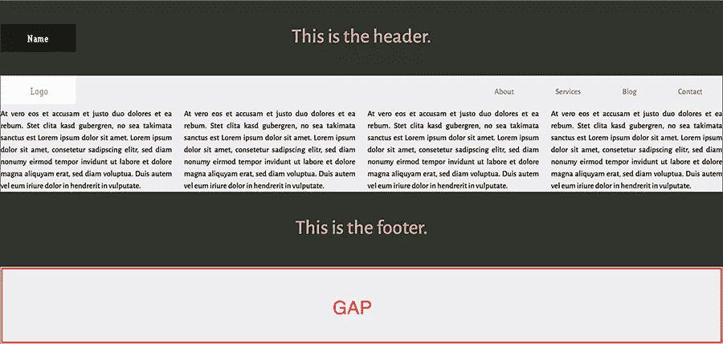

# 对 Web 开发有用的 Compass 特性

> 原文：<https://www.sitepoint.com/useful-compass-features-web-development/>

讨论到[指南针](http://compass-style.org/)的时候，人们的看法不一。他们中的一些人强调了从他们的工作流程中排除 Compass 的原因(例如[雨果](https://www.sitepoint.com/dont-use-compass-anymore/))，而另一些人则强调了使用其功能的好处。

在本文中，我将介绍可以用来构建健壮样式表的八个 Compass 特性。为了更好地解释它们，我创建了一个指南针项目。它的资产可以在[这个 github 库](https://github.com/geomarts/compass-demo)中找到。

现在是时候开始了！

## [粘性页脚](http://compass-style.org/reference/compass/layout/sticky_footer/)

我遇到的一个常见的网页设计问题如下:



正如你所看到的，在`footer`和页面底部之间有一个很大的间隙。当然，这是因为页面中没有足够的内容来填充视窗。然而，谢天谢地，Compass 帮助我们解决了这个问题。

在深入研究解决方案之前，让我们先来看看页面的 HTML 结构:

```
<header>
    <!-- content -->
</header>
<nav>
    <!-- content -->
</nav>
<main id="root">
    <section>
        <!-- content -->
    </section>
    <div id="root_footer"></div>
</main>
<footer id="footer">
    <!-- content -->
</footer>
```

为了创建粘性页脚，Compass 需要三个元素。我们页面的主包装器(在这个例子中是`main`元素)，这个元素底部的一个空的`div`，以及`footer`。最后一步是在我们的 Sass 代码中包含`sticky-footer` mixin。此外，我们必须将`footer`的期望高度作为参数传递。例如:

```
@include sticky-footer(150px);
```

或者，我们可以使用自定义选择器来定位所需的元素。在这种情况下，我们还必须将这些选择器作为参数传递:

```
@include sticky-footer(150px, "myroot", "myroot_folder", "myfooter");
```

## [链接颜色](http://compass-style.org/reference/compass/typography/links/link_colors/)

我们经常希望根据链接的状态对它们应用不同的样式。例如，在这里您可以看到我们链接的样式:

```
nav ul a {
    color: black;
}

nav ul a:hover {
    color: tomato;
}

nav ul a:active {
    color: lightblue;
}

nav ul a:visited {
    color: gray;
}

nav ul a:focus {
    color: green;
}
```

多亏了 Compass，我们可以使用下面的 mixin 生成上面的代码:

```
@include link-colors(black, tomato, lightblue, gray, green);
```

所有参数都是可选的，除了第一个参数，它指定了默认的链接颜色。因此，如果我们只针对特定的状态，那么前面的 mixin 可以修改如下:

```
@include link-colors(black, $active: lightblue);
```

## [垂直节奏](http://compass-style.org/reference/compass/typography/vertical_rhythm/)

垂直节奏有助于保持布局的一致性，这反过来会对可读性产生积极的影响。

我们来看看 Compass 是如何方便设置垂直节奏的过程的。

首先，我们必须指定页面的基本属性`font-size`和`line-height`。默认情况下，Compass 通过定义以下变量来完成这项工作:

```
$base-font-size: 16px;
$base-line-height: 24px;
```

然后，为了建立节奏，我们在代码中放置了`establish-baseline` mixin:

```
@include establish-baseline;
```

以下是输出结果:

```
html {
    font-size: 100%;
    line-height: 1.5em;
}
```

将这个 mixin 包含在项目中之后，演示页面看起来会像这样:


为了保持节奏，我们必须计算与默认字体大小不同的元素的`line-height`。这可以通过`adjust-font-size-to` mixin 实现。

例如，想象一下，我们希望段落有更大的字体。为此，我们可以编写如下内容:

```
p {
 @include adjust-font-size-to(18px);
}
```

这将输出:

```
p {
    font-size: 1.125em;
    line-height: 1.33333em;
}
```

最后，Compass 提供了不同的 mixins 来在元素之间添加空格。对于小屏幕，我们的段落接收以下混音:

```
p {
 @include leader;
 @include trailer;
}
```

结果是:

```
p {
    margin-top: 1.5em;
    margin-bottom: 1.5em;
}
```

## [文本替换](http://compass-style.org/reference/compass/typography/text/replacement/)

用图像/图标替换文本是一种众所周知的网页设计技术。例如，当我们想要显示一个徽标时，可以使用这种方法。

让我们看一个例子。

下面的屏幕截图显示了演示页面的`nav`元素:


下面是相应的 HTML:

```
<nav>
    <h3 id="logo">Logo</h3>
    <ul>
        <!-- content -->
    </ul>
</nav>
```

目标是显示一个图像而不是`h3`元素。为了用 Compass 实现这一点，我们可以使用`replace-text-with-dimensions` mixin:

```
h3 {
 @include replace-text-with-dimensions('logo.gif');
}
```

CSS:

```
h3 {
    text-indent: -119988px;
    background-image: url('img/logo.gif?1425726050');
    background-repeat: no-repeat;
    background-position: 50% 50%;
    width: 150px;
    height: 56px;
}
```

以下是该 mixin 的可能参数:

| 参数 | 描述 | 缺省值 | 可选择的 |
| --- | --- | --- | --- |
| img | 图像的相对路径或 url 文本。 | – | 不 |
| x | 背景图像的 x 位置。 | 50% | 是 |
| y | 背景图像的 y 位置。 | 50% | 是 |
| 在一条直线上的 | 将图像转换为数据 URI？ | 错误的 | 是 |

现在让我们通过将`inline`变量设置为`true`来修改我们的示例。如果我们查看编译后的 CSS，我们会注意到类似这样的内容(为了简洁起见，将其截断):

```
h3 {
 background-image: url('data:image/gif;base64,R0lGODdhlgA4AOMAAP...');
}
```

这样，我们将图像嵌入到 CSS 中，避免了一个额外的 HTTP 请求。然而，我们必须通过考虑一些因素来决定这个选项是否适合我们，比如图像的数量和大小。

还要注意 Compass 附加到图像上的时间戳参数。这很重要，因为它确保了我们总是有更新的图像。

## [网址助手](http://compass-style.org/reference/compass/helpers/urls/#image-url)

下面的截图显示了我们想要插入到`header`元素中的图像:


要在 CSS 中做到这一点，我们可以编写以下规则:

```
header {
    background-image: url('img/name.gif');
}
```

但是，如果我们有很多不同的图像，由于某种原因我们修改了它们的路径，会发生什么呢？不幸的是，这需要很多额外的工作。除了图像，这个问题也可能发生在网页字体和样式表上。

再次感谢 Compass，我们不应该关心那些案例。通过将`relative`环境变量设置为`true`，Compass 可以读取图像、字体和样式表的路径。因此，我们可以应用如下样式:

```
header {
 background-image: image-url('name.gif');
}
```

结果与我们预期的相似:

```
header {
    background-image: url('img/name.gif?1425753571');
}
```

请记住，这个变量在开发过程中很有用。对于生产，我们必须使用 Compass 提供的其他变量(例如`http_images_path`)。

此外，还可以选择使用`inline-image` mixin，以与上一节中讨论的相同方式，将图像转换为 base64 编码图像:

```
header {
 background-image: image-url(inline-image('name.gif'));
}
```

## [选择器助手](http://compass-style.org/reference/compass/helpers/selectors/#headings)

Compass 为我们的标题样式提供了一个助手功能。为了利用它，我们必须使用插值语法。这里有一个例子:

```
#{headings(2,3)} {
 text-align: center;
 font-weight: 500;
}
```

生成的 CSS:

```
h2, h3 {
    text-align: center;
    font-weight: 500;
}
```

当然，上面的例子非常简单，因此没有必要使用这个函数。然而，假设我们对指定所有可用标题的样式感兴趣，我们可以修改它的语法如下:

```
#{headings()} {...}
```

或者:

```
#{headings(all)} {...}
```

相关的 CSS:

```
h1, h2, h3, h4, h5, h6 {...}
```

注意，`headings`或`headers`关键字都可以用作函数名。

## [颜色助手](http://compass-style.org/reference/compass/helpers/colors/)

Compass 还为我们提供了各种颜色函数，用于创建有趣的调色板。有趣的是，它们中的大多数可以接收正值或负值:

例如，让我们结合`adjust-lightness`和`background`混合来为我们的`header`产生一个线性渐变:

代码如下:

```
$gradient-color: #7E8AA2;

header,
footer {
 @include background (linear-gradient($gradient-color, adjust-lightness($gradient-color, 50%), adjust-lightness($gradient-color, -10%)));
}
```

结果是:


## [颜色对比](http://compass-style.org/reference/compass/utilities/color/contrast/)

Compass 提供了`contrasted` mixin 来创建元素的前景色和背景色之间的对比。该混音的可能参数如下所示:

| 参数 | 描述 | 缺省值 |
| --- | --- | --- |
| 背景颜色 | 元素的背景色。 | – |
| 黑暗 | 元素的深色对比文本颜色。 | 黑色 |
| 光 | 元素的浅色对比文本颜色。 | 白色 |

让我们在项目中试试这个便利的特性:

```
header,
footer {
 @include contrasted(#33332D);
}
```

编译后的 CSS:

```
header,
footer {
    background-color: #33332D;
    color: #fff;
}
```

这里是`header`的样子:


但是，如果我们传递一个更浅的颜色呢？例如:

```
header,
footer {
 @include contrasted(#ccc);
}
```

在这种情况下，可以看到元素的文本颜色变成了黑色:


此外，我们可以覆盖默认的文本颜色:

```
header,
footer {
 @include contrasted(#33332D, shade(#FFD34E, 10%), shade(#BD4932, 10%));
}
```

最终结果:


## 结论

在本文中，我向您展示了八个有用的 Compass 特性。当然，指南针的力量不仅限于这里介绍的那些。例如，你可能想看看[精灵生成器](https://www.sitepoint.com/css-sprites-sass-compass/)和[数学函数](http://compass-style.org/reference/compass/helpers/math/)。希望你喜欢这篇文章，如果你是一个 Compass 用户，你可以在你的下一个设计中利用它们！

总之，如果您想在项目中包含 Compass 的许多特性，Compass 是一个非常好的选择。否则，关注一个更简单、更轻量级的库可能是值得的，比如 [Bourbon](http://bourbon.io/) 或类似 [autoprefixer](https://github.com/postcss/autoprefixer) 的库，以简单地处理供应商前缀。

## 分享这篇文章