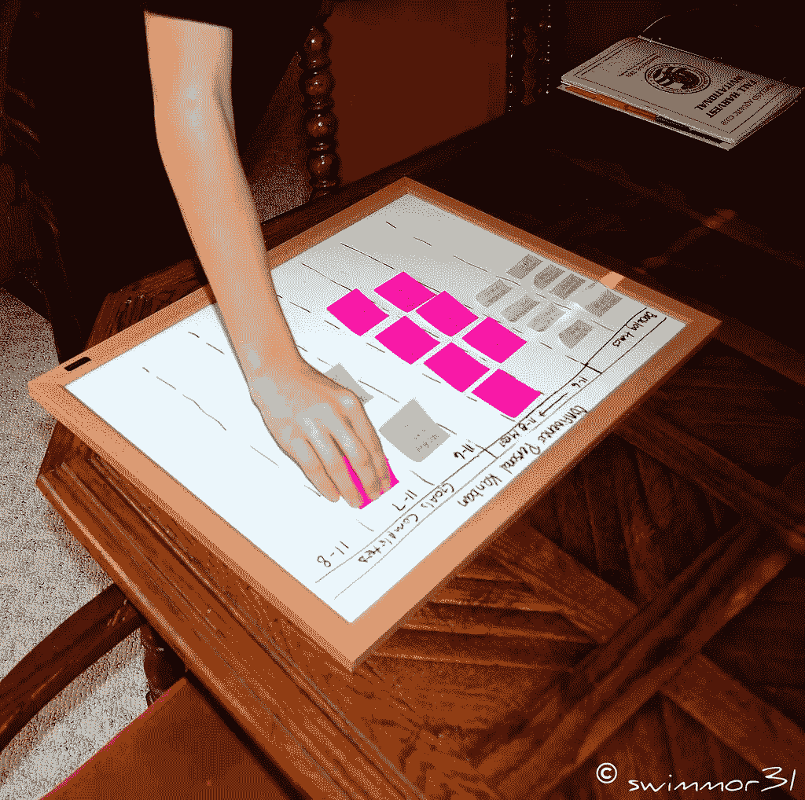

# 我们的敏捷团队应该使用 Scrum 还是看板？

> 原文：<https://www.sitepoint.com/agile-team/>

一旦一个团队决定赌上一把，认为敏捷方法至少会比现状的受控混乱更好，敏捷的术语就开始有了新的意义。突然之间，一个简单的经理告诉人们做什么，一个团队试图按时完成所有工作，变成了新标签、流程、角色和工具的雷区。这对经理和团队成员都是一种威胁。

如果你想重温一下敏捷，你可能想看一看[敏捷宣言](http://www.agilemanifesto.org/)，其中敏捷的基本原则是由编纂这个概念的人提出的。关于本文中讨论的两种方法的更多细节，你可以访问 [Scrum 方法论](http://scrummethodology.com/)和[日常看板](http://www.everydaykanban.com/)，这两个网站提供了 Scrum 和看板的很好概述。您还可以查看在 SitePoint 上发表的关于工作流管理敏捷方法的其他文章。

## 选择流程

首先出现的决定之一是哪种风格的敏捷最适合团队。

除了许多公司最终采用的定制风格之外，还有许多流行的方法已经正式化。

人们可能会有一种强烈的冲动，倾向于选择一种与迄今为止没有真正起作用的方法差异最小的方法。

对于一些公司来说，“变得敏捷”意味着在不真正改变工作完成方式的情况下散布一些新的头衔和术语，并称之为敏捷。首先给你的团队一个遵循合法的敏捷工作流程的机会是值得的，同时要注意什么有效，对谁有效。

敏捷工作流最流行的两种方法是 Scrum 和看板。因为它们都是敏捷的，所以在实现它们的过程和工具之间有很多相似之处。但是 Scrum 和看板提供了一组不同的优势，针对不同的应用进行了优化。

## 迭代或切片

虽然 Scrum 和看板都是构建敏捷过程的合法且完整的方法，而且选择其中任何一种都有优点(和缺点)，但是在尝试定制它们之前，从这两种方法的纯形式开始是值得的。

这两种方法都经过了多年的发展和成熟，无论您在自己的办公室丛林中有多深，您的项目需求都不太可能超出它们的设计处理范围。

对于希望定期发布产品新版本，同时适应不断变化的市场的团队来说，Scrum 是一个很好的选择。

Scrum 结合了一套清晰的角色、仪式和工件，可以立即采用和使用。

Scrum 足够灵活，可以处理小至五人的团队，也可以跨越数千人的组织。

它支持开发人员的自主性、管理人员的透明性以及整个组织的责任性。

通过让团队承诺一个约定的合同进行一个有时间限制的冲刺，然后根据事情的进展进行迭代，Scrum 允许团队不断适应，而不妨碍团队每个成员的自我指导。

以服务模式运作的团队通常更喜欢看板而不是 Scrum。

虽然 Scrum 被优化为定期向客户交付产品的迭代，但看板支持持续的独立改进和优化。

看板的一个关键优势是它关注于控制团队在任何时间点的工作量。

虽然 Scrum 和看板都受益于可以独立完成和交付的明确定义的故事，但 Scrum 让团队决定同时进行多少工作，而看板专注于限制团队进行中的项目数量。

这种差别看起来很微妙，尤其是当并排看看板和 Scrum 板的时候。

一个关键的区别因素是，Scrum 根据团队的速度来衡量可持续的生产力水平，并控制一个团队在冲刺阶段将承诺多少敏捷点。

看板控制可持续工作的进展，并限制团队同时致力于工作的故事数量。

## 透明度

Scrum 和看板都采用了每日站立会议的做法，在会议期间，团队成员报告自上次站立会议以来他们做了什么，在下一次站立会议之前他们计划做什么，以及他们是否有任何阻碍他们充分发挥能力的障碍。在这两种方法中，开发人员是唯一应该在单口相声中汇报的人，而产品负责人和经理则关注并利用单口相声结束后的时间跟进具体问题。

Scrum 给团队一个完整的 sprint 来决定如何在反思之前自我管理工作，而看板则在每次新故事开始时仔细监控团队的工作流程。

这对经理、产品负责人和开发人员的合作方式有着重要的影响。

有了看板，团队可以动态地调整进展中的工作水平，以避免空闲或过度工作的开发人员，这是可以被管理层跟踪的事情。

在 Scrum 中，团队根据他们提交给 sprint 的故事数量来自我调整正在进行的工作，目标是让每个故事都符合他们同意的完成定义。

## 节奏

Scrum 的节奏由团队根据所做工作的类型来决定，通常分为两到四周的冲刺阶段。

每一次冲刺，团队都会经历一系列的仪式来展示他们所提供的价值，从那些做得好的地方和那些可以做得更好的地方学习。然后，他们承诺为下一次冲刺开发一套新的故事。

因为 Scrum 是基于时间的迭代模式，仪式被融入到过程中。

看板迭代更加灵活。

在看板中，可以通过日期、里程碑或工作开始前团队同意的其他度量标准来决定何时暂停工作流以进行反思和达成一致。

看板团队的风险是，过程的不规则性可能会鼓励他们跳过或很少关注帮助敏捷过程迭代和改进所必需的反思。

## 让敏捷工作起来

对于你的团队来说，考虑到你要完成的目标，仔细考虑哪种方法最有意义是很重要的。

如果你正在开发产品，你可能会发现 Scrum 是一个更好的选择。如果你提供服务，你可能会发现看板更适合你。

不同的团队在不同的环境下需要不同的方法。

幸运的是，敏捷的核心是期望你的团队能够从工作中学习，这样当你以敏捷的方式适应时，你就可以决定什么要保持，什么要改变。

一旦一个团队以敏捷的方式有效地工作了足够长的时间，知道了自己的节奏，合法的敏捷过程就有可能适应各种各样的实现。

但是，利用敏捷的多功能性所必需的自我意识不应该被认为是从一种方法或另一种方法中挑选敏捷的方面，并试图从一开始就创造一些新东西的许可证。

我建议你在决定它是否适合你之前，以最纯粹的形式尝试你喜欢的敏捷风格几个周期。

如果你认真地去做，在下一次回顾中，总会有机会反思和重新考虑你的方法。

### 你的团队使用哪种方法进行软件开发或项目管理？请在下面的评论中告诉我们你认为哪种方法更好。

## 分享这篇文章