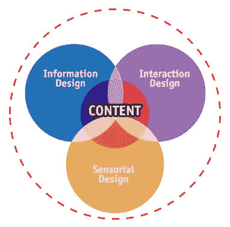
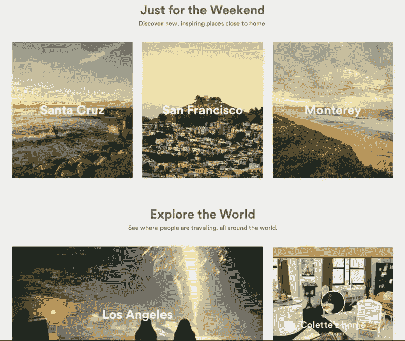
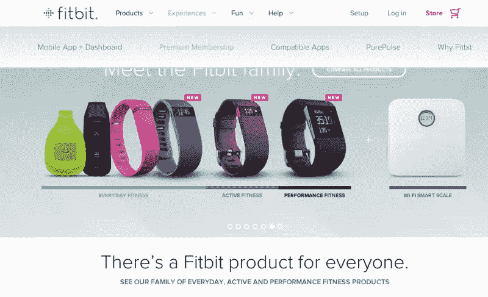
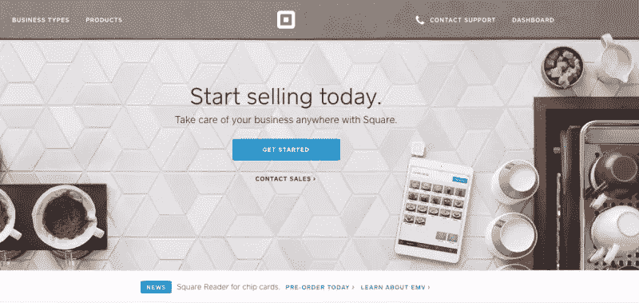
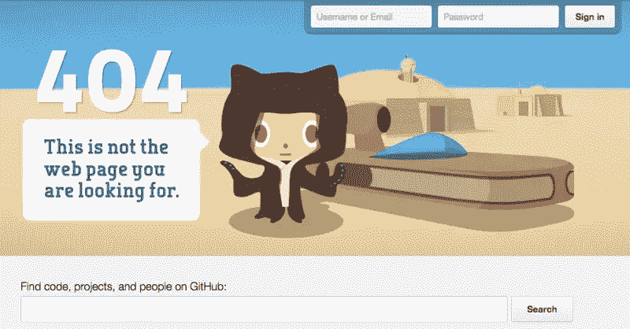
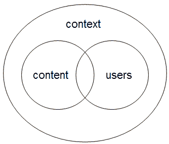
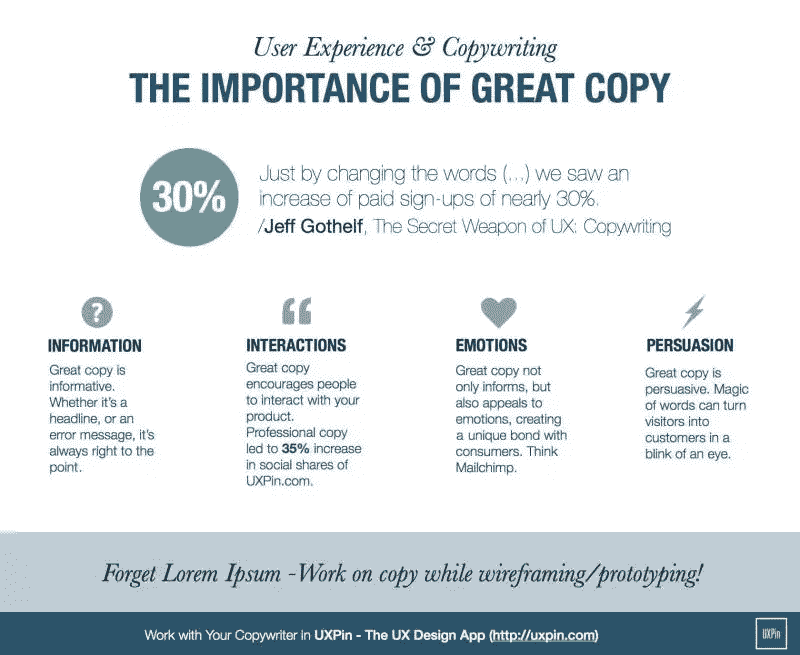

# 文字是交互设计的基础

> 原文：<https://www.sitepoint.com/words-interaction-design/>

来源:[语言&大脑](http://makeyourbrainfast.com/wp-content/uploads/2014/01/9-language_1.jpg)

交流是互动的基础，不用我们提醒你语言对交流有多重要。

文案可能看起来不是当务之急(尤其是如果你有一个由内容战略家和文案撰写人组成的更大的团队)，但是你必须明白写作受设计影响(也影响设计)。

毕竟，如果一个视觉设计师在标题中只留了 10 个字符的空间，就会破坏整个页面的流畅。

你选择的词，以及你如何把它们放在一起，将极大地影响你的产品的整体信息——我们将解释如何使用我们自己的一些词。下面我们将向你展示为什么文字是交互设计的基础，以及如何了解文案的背景。

## 交互设计中文案的目的

随着技术进步和新的交流模式变得普遍，现场和应用程序内的副本可能比令人印象深刻的图形、动画和触摸屏手势更少受到关注。

不要低估技术带来的新的可能性，但重要的是要确保书面文字不会被遗忘。就像手指滑动可以完成书面文字无法完成的事情一样，文字也具有不可替代的功能——无论技术进步有多快。

来源:[谢德罗夫](http://www.artisopensource.net/network/artisopensource/wp-content/uploads/2012/02/shedroff.gif)

文字补充了其他维度，而不是与之竞争。

因为它们是用户在屏幕上寻找的第一个有意义的交互，文字有助于用交互设计的其他元素来构建我们的体验。在她的作品 [Copy As Interface](http://www.slideshare.net/mulegirl/copy-as-interface) 中，Mule Design Studio 的联合创始人 Erika Hall 列举了写作在产品交互设计中的具体作用。

让我们来看看你的文案的 4 个主要职责。

### 1.作为问候的话语

不仅仅是一句友好的“你好！”你的产品文案解释了网站是什么，并推荐了一个好的第一步，无论是建议注册还是指向可能吸引你的用户的内容。正如我们在前一章提到的，交互设计应该被视为一种对话，所以这是你创造人性的第一次机会。

资料来源: [AirBnB](https://www.airbnb.com/)

在上面的例子中，你可以看到 AirBnB 以一种简约而有效的方式使用 copy。《只为周末》和《探索世界》这两个标题有助于用户在深入具体地点之前想象 AirBnB 的好处。这种互动是微妙的，但它把这种体验框定为离梦想假期更近了一步。

### 2.文字作为导航

副本告诉用户他们在哪里，并建议新的或鲜为人知的选项来加深用户的体验。任何广告人都知道词语的选择如何在促销中产生影响，一个吸引人的描述可以“销售”一个特定的网页，并告诉用户其中包含的内容。

当你看上面 FitBit 的主页时，你可以看到站点副本的多重功能。

首先，它直接服务于导航的目的，在下拉菜单上有清晰的副本。其次，它有助于解释不同的可用产品(在每个产品旁边巧妙地放置子副本)。

第三，它用一个标题为“每个人都有一款 Fitbit 产品”的部分吸引持观望态度的用户深入网站，这将用户带到一个按使用级别分类的产品页面。

### 3.暗示动作的词

菜单上、按钮上和说明中的文字对于产品的可用性来说都是必不可少的——没有它们，用户会对自己找出机制感到沮丧。

简单的写作可以节省时间，用正确的词可以增加签约、销售等的机会。用户来你的网站是为了做些事情来实现他们的目标，所以创建一些鼓励互动的内容。

来源:[方](https://squareup.com/)

支付处理器 Square 的主页是一个面向行动的复制的极好例子，因为它将网站页面与用户动机联系起来，而不会使界面混乱。作为用户，我只需要知道自己想入门；界面通过给我指出正确的动作来处理剩下的事情。当然，如果我想要更多的控制，我可以简单地向下滚动更多的选项。

### 4.提供服务的词语

与可操作功能一样，措辞在某些服务中也起着至关重要的作用。除了清楚地解释问题和/或解决方案之外，措辞还会影响用户的情绪——这有助于在事情出错时(不管是不是你的错)减轻用户的压力。

来源: [7 条最佳错误消息](http://www.fastcodesign.com/3026604/7-of-the-best-error-messages-on-the-internet#5)

Github 的 404 错误页面是在令人沮丧的经历中提供优质客户服务的完美例子。文案很有趣，与视觉同步，用《星球大战》的参考来分散用户的注意力。但在功能上，页面底部的文字也告诉用户如何回到正轨。

这是最重要的一点，因为个性只会让你走得更远，直到用户记得他们仍然没有到达他们需要的地方。

就像配色方案、图形或布局会展示产品的个性一样，写作风格也会影响“大局”例如，一个严肃的银行家可能喜欢投资网站上的照章办事的语言，但同样的语言不适合年轻用户的新社交媒体渠道。

记住理解上下文是实现界面复制四个目的的第一步。

## 语境为王

不管你认为有线电视员拉里有多有趣，他可能会在大都会歌剧院赢得观众的喝彩。界面文案是一个非常主观的过程，但是上下文总是固定的。

这就是为什么任何写作努力的第一步都是了解你的受众(你的目标用户)和你的媒介(网页内容、侧边栏、弹出窗口等)。).

来源:[竞争分析:了解市场背景 t](http://boxesandarrows.com/competitive-analysis-understanding-the-market-context/)

正如我们在免费电子书[交互设计最佳实践第一卷](http://www.uxpin.com/interaction-design-best-practices-1.html)中推荐的，如果你已经开发了人物角色，现在是挖掘它们的好时机。它们可以帮助你决定你的写作风格，就像帮助你选择布局和系统一样容易。

但是不仅仅是知道你在为谁写作。在一篇关于交互设计的文章中，Intercom 的联合创始人 Des Traynor 提出了一些有用的问题。使用下面的清单来确定接口副本的具体环境:

### 谁来读？

除了简单地知道你的目标用户是谁，你还需要知道他们属于哪一类:新用户、老用户、账户持有人、免费用户等等。例如，新用户需要更直接的语言。

### 他们什么时候会看？

消息是突然出现的，还是对用户操作的响应？他们会期待吗，还是应该抓住他们的注意力？这些时间细节有助于消除不和谐的交互。

### 他们需要知道什么？

确保你的措辞尽可能准确地传达了你想要表达的意思。我们将在下一章讨论如何清晰地交流。

### 下一步是什么？

任务完成了吗，还是需要进一步的行动？就像之前的 Github 例子一样，每一次交互都需要让用户至少离实现目标更近一步。

### 格式是什么？

所谓格式，我们指的是界面的媒介(网站、app、邮件等)。你会在屏幕上方使用弹出窗口还是警告？每种不同的格式都有其优点和缺点

例如，弹出警告需要比[模态窗口](http://www.webdesignerdepot.com/2009/02/7-interface-design-techniques-to-simplify-and-de-clutter-your-interfaces/)更简洁。注意细微之处，因为[250 毫秒可能会造成烦恼和快乐的区别](http://www.uie.com/articles/subtle_interaction_design/)。

### 最好的语气是什么？

产品的基调应该是品牌的声音，所以这是一个需要认真对待的风格选择。有趣或严肃的语调本身并没有好坏之分，但在错误的环境中，它们可能会变得非常糟糕。

有了“角色”(你的用户)和“设置”(用户场景)，你就能继续前进，为你的网站或应用创造最好的“故事”。

### 外卖

交互设计的成败取决于你与用户沟通的好坏，或者更准确地说，取决于你设计自动化系统与用户沟通的好坏。不要低估语言在交流中的力量，尤其是因为“说话者”使用的是预先写好的文本。

关于我们今天讨论的细节，请阅读免费电子书[交互设计最佳实践:文字、视觉、空间](http://www.uxpin.com/interaction-design-best-practices-1.html)。视觉案例研究来自 30 多家公司，包括谷歌、AirBnB、脸书和雅虎。专家意见包括从斯蒂芬 p .安德森，贾里德线轴，以及更多。

## 分享这篇文章